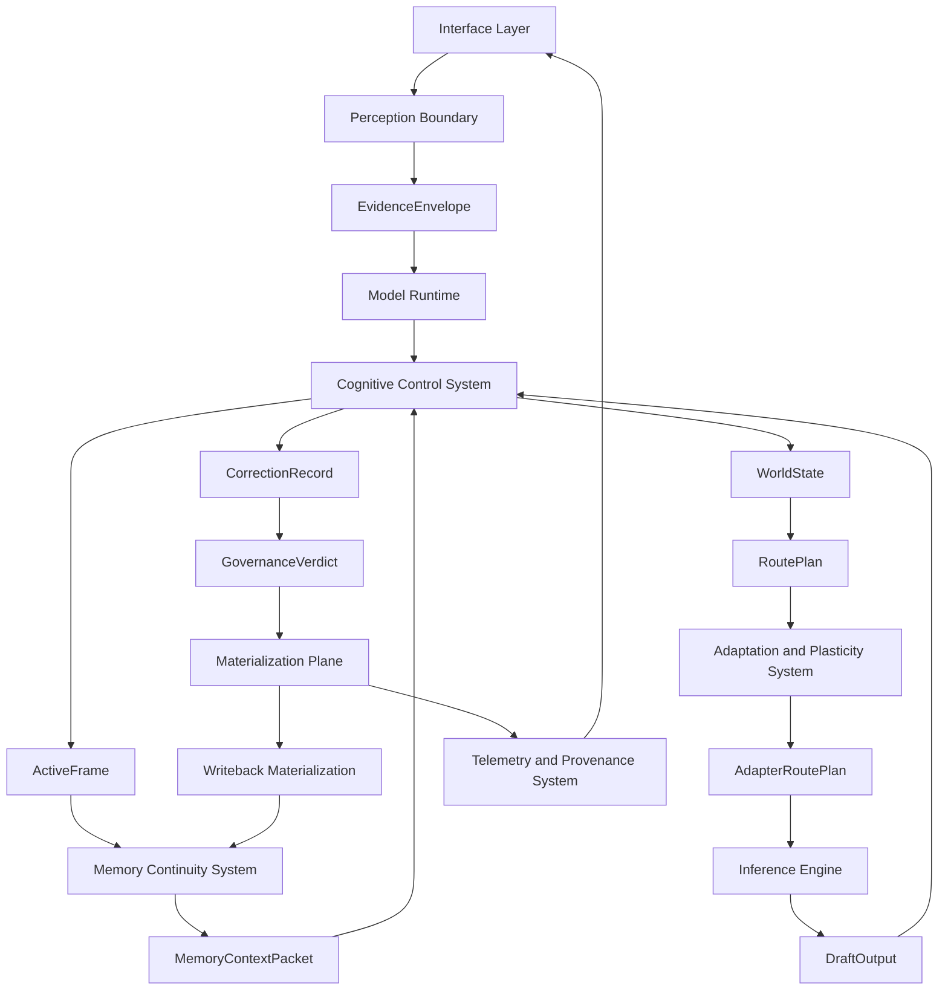
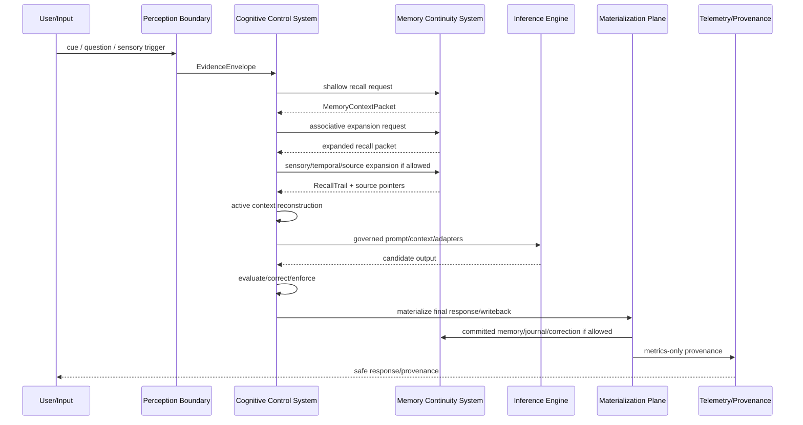

# ADR-0001 — Neutral Lifespan Cognitive Model Technical Wiring Framework

> **IMMUTABILITY NOTICE — DO NOT EDIT THIS FILE.**
> This ADR is an immutable implementation source of truth. Coding agents, automation tools, documentation agents, and refactor agents must **not modify, rewrite, reformat, append to, delete from, rename, regenerate, or “improve” this file under any circumstances, by any means**. If a correction, clarification, extension, or superseding decision is required, create a new separate ADR or implementation note that references this ADR. This file must remain stable once accepted.

> Status: Accepted for implementation handoff  
> Scope: reusable neutral cognitive-model architecture  
> Purpose: define how to construct, implement, wire, test, and reproduce a seven-layer lifespan companion model without project-specific reference names or repository-specific assumptions  
> Rule: this ADR contains **role labels**, not mandatory code names  
> Date: 2026-06-01

---

## 0. Non-Negotiable Instruction to Coding Agents


### 0.1 File Immutability Rule

This file itself is not an implementation target. It is the accepted architectural decision record.

Coding agents must not edit this file directly. They must not:

```text
modify this ADR
rewrite this ADR
reformat this ADR
append to this ADR
delete from this ADR
rename this ADR
regenerate this ADR
convert this ADR into repository-specific taxonomy
insert project-specific names into this ADR
replace neutral role labels with local implementation names
```

If the architecture must evolve, the correct process is:

```text
1. Leave ADR-0001 unchanged.
2. Create a new ADR, amendment, or implementation mapping document.
3. Reference ADR-0001 as the stable foundation.
4. Keep implementation-specific mappings outside this file.
```

This ADR is intentionally neutral.

Do not import names, labels, paths, folders, products, agents, organizations, repositories, or character/persona names from any prior reference architecture unless the current implementation repository already uses them as active code identifiers.

Do not assume reference-source names are runtime components.

Do not create new runtime components just because a prior inspiration source used them.

Do not rename existing local modules unless explicitly instructed.

Do not use this ADR to replace the target repository taxonomy. Use this ADR to wire the target repository correctly.

The only acceptable mapping process is:

```text
ADR role label
  → inspect current local repository
    → map to existing local module if present
      → add missing behavior inside existing taxonomy where possible
        → create new module only when no suitable local module exists
          → document why the new module is necessary
```

This ADR must remain reusable for future models.

---

## 1. Decision

We will define a clean, neutral, seven-layer lifespan cognitive model architecture that can be reproduced across multiple AI model builds.

The architecture will include:

```text
1. a single neutral model runtime
2. a seven-layer cognitive control system
3. a memory continuity system capable of lifespan recall
4. an inference engine boundary
5. a perception and sensory evidence boundary
6. an adaptation and plasticity system
7. a materialization plane
8. deterministic governance around probabilistic cognition
9. formally checkable safety and lifecycle properties
10. coding-agent implementation gates and acceptance tests
```

The architecture will not include:

```text
project-specific reference names
external repository names
persona names
council names
brand names
historical architecture labels
hardcoded file paths from other projects
unverified runtime assumptions
unbounded recursion
unowned memory writes
untracked materialization
```

---

## 2. Context and Problem

Prior handoff files mixed active architecture with reference-source names. That caused coding agents to treat inspiration-source names as real runtime taxonomy, create wrong modules, reference wrong repositories, and modify architecture labels that were meant to remain stable.

This ADR fixes that by making the architecture neutral and role-based.

The target is a reusable model construction pattern:

```text
A neutral model runtime that can operate as a long-lived companion, perceive through multiple sensory channels, retrieve and reconstruct memory through cue-triggered recall, adapt through a unified plasticity system, and remain governed by deterministic lifecycle rules while using probabilistic inference internally.
```

The model must be reproducible across future AI builds.

The architecture must support:

```text
lifespan memory
human-like cue-triggered recall
multimodal sensory evidence
bounded recursive cognition
layer-bound adaptation
formal proof targets
materialized runtime state
safe telemetry
versioned evolution
```

---

## 3. Core Architectural Principle

The architecture is a closed cognitive cycle, not a linear pipeline.

```text
Model Runtime
  → Cognitive Control System
    → Memory Continuity System
      → Cognitive Control System
        → Inference Engine
          → Cognitive Control System
            → Memory Continuity System
              → Model Runtime
```

This cycle is mandatory.

The memory system must not only sit behind the runtime as storage. It must participate in cognition by sending recall packets, cue expansions, contradiction flags, source pointers, confidence scores, and continuity state into the cognitive control system.

The cognitive control system must send structure, salience, evaluation, consolidation directives, correction records, lineage, and writeback decisions back into the memory system.

The inference engine must remain bounded. It may generate, score, and propose. It may not govern, own memory truth, bypass evaluation, or self-authorize.

---

## 4. Neutral Role Taxonomy

These labels are neutral ADR role labels. They are not mandatory class names.

| ADR Role | Responsibility | May Own | Must Not Own |
|---|---|---|---|
| **Model Runtime** | top-level process, lifecycle, request admission, governance orchestration, routing orchestration, response finalization | runtime lifecycle, request state, authority mode, final response envelope | raw model weights, uncontrolled memory mutation, unreviewed inference output |
| **Cognitive Control System** | seven-layer cognition, route decisions, evaluation, calibration, enforcement, structured recursion | cognitive state machine, active frame, layer gates, bounded recursion | permanent memory store, raw sensor streams, direct adapter training |
| **Memory Continuity System** | register/session/episodic/semantic/archival memory, recall, consolidation, correction lineage, source pointers | memory records, recall packets, memory confidence, retention policy | final governance authority, inference generation, action execution |
| **Inference Engine** | model forward pass, decoding, sampling, embeddings, internal model execution | token/logit generation, model sessions, adapter application under authorization | governance, memory truth, uncontrolled writeback, authority escalation |
| **Perception Boundary** | text, sensory, file, environment, and system-signal ingestion converted into governed evidence | evidence envelopes, sensor integrity status, sensory confidence | direct memory promotion, direct action, raw telemetry leakage |
| **Adaptation and Plasticity System** | training method registry, adapter compilation, tournament selection, runtime adapter routing, evolution | adaptation plans, adapter records, evaluation results, shadow deployment | runtime authority, direct memory writes, final response approval |
| **Materialization Plane** | makes abstract state physically/runtime real: artifacts, weights, adapters, memory, simulations, actions, provenance | materialization records, source hashes, runtime locations, rollback refs | cognitive reasoning, governance verdicts, unreviewed state mutation |
| **Telemetry and Provenance System** | metrics, traceability, health, safe provenance, audit records | metrics-only telemetry, safe trace summaries, health flags | raw user content, raw private identifiers, hidden chain text |
| **Interface Layer** | user interaction, display, optional speech, input routing, safe status display | user-facing response, safe provenance display, accessibility output | hidden internal state, raw memory dumps, unsafe trace internals |

Implementation rule:

```text
If the local codebase already has names for these roles, use the local names.
If not, create the smallest necessary module with neutral naming.
Document all mappings in an implementation mapping table.
```

---

## 5. Required Implementation Mapping Table

Before code changes, the coding agent must create a local mapping table.

```markdown
| ADR Role | Local Module/Class/Package | Local Path | Exists? | Action |
|---|---|---|---|---|
| Model Runtime | TBD | TBD | yes/no | map/create/extend |
| Cognitive Control System | TBD | TBD | yes/no | map/create/extend |
| Memory Continuity System | TBD | TBD | yes/no | map/create/extend |
| Inference Engine | TBD | TBD | yes/no | map/create/extend |
| Perception Boundary | TBD | TBD | yes/no | map/create/extend |
| Adaptation and Plasticity System | TBD | TBD | yes/no | map/create/extend |
| Materialization Plane | TBD | TBD | yes/no | map/create/extend |
| Telemetry and Provenance System | TBD | TBD | yes/no | map/create/extend |
| Interface Layer | TBD | TBD | yes/no | map/create/extend |
```

No implementation work starts until this mapping table exists.

---

## 6. Seven-Layer Embedded Cognitive Model

The model has seven embedded cognitive layers.

These are conceptual operating layers. They are not automatically new classes, agents, services, or endpoint names.

```text
Layer 1  Perception and Embodiment
Layer 2  Attention and Active Workspace
Layer 3  Memory and Continuity
Layer 4  World Model and Simulation
Layer 5  Deliberation and Planning
Layer 6  Self-Correction and Calibration
Layer 7  Governance and Authority
```

### 6.1 Layer 1 — Perception and Embodiment

Purpose:

```text
Convert raw input into governed evidence.
```

Inputs:

```text
text
voice/speech transcript
images
video
camera stream metadata
audio stream metadata
files
device state
system state
time
location context when permitted
environmental sensors when permitted
user commands
```

Outputs:

```text
EvidenceEnvelope
SensoryEvidenceRecord
integrity status
confidence score
modality tag
privacy class
source hash
attention hints
risk hints
```

Hard rules:

```text
No raw input becomes cognition until it is wrapped in an evidence envelope.
No sensory stream writes memory directly.
No raw private data enters telemetry.
No action executes directly from perception.
```

### 6.2 Layer 2 — Attention and Active Workspace

Purpose:

```text
Select what becomes cognitively active.
```

Inputs:

```text
evidence envelopes
memory cue candidates
current user intent
task type
risk level
budget state
sensor salience
uncertainty
```

Outputs:

```text
ActiveFrame
selected context
active memory cues
active sensory anchors
route hints
budget envelope
uncertainty map
```

Hard rules:

```text
Do not flood context.
Do not place entire memory into active workspace.
Do not allow low-confidence memory to dominate active cognition.
Use ranked, bounded, explainable selection.
```

### 6.3 Layer 3 — Memory and Continuity

Purpose:

```text
Preserve, retrieve, consolidate, correct, and reconstruct long-term continuity.
```

Memory tiers:

```text
register   immediate working state
session    current-session continuity
episodic   event memory
semantic   concept and relationship memory
archival   compressed long-horizon memory and exact-source pointers
```

Outputs:

```text
MemoryContextPacket
RecallTrail
ExperienceAtom
correction record
contradiction links
exact-source pointer
retention directive
confidence score
```

Hard rules:

```text
Memory is earned, not accumulated.
Exact storage and active recall are separate.
Memory may cue cognition, but it may not bypass cognitive governance.
Archived records must remain reachable unless valid deletion authority exists.
```

### 6.4 Layer 4 — World Model and Simulation

Purpose:

```text
Model the current situation and simulate likely outcomes before action.
```

Inputs:

```text
ActiveFrame
MemoryContextPacket
SensoryEvidenceRecord
current state
possible actions
uncertainty map
risk profile
```

Outputs:

```text
WorldState
predicted outcomes
risk surface
unknowns
hypothesis set
confidence distribution
simulation trace
```

Hard rules:

```text
Simulations are predictions, not facts.
Predicted outcomes must be labeled as predictions.
Simulated content cannot be promoted to durable truth without evidence and writeback gates.
```

### 6.5 Layer 5 — Deliberation and Planning

Purpose:

```text
Select route, planning depth, action path, and response strategy.
```

Inputs:

```text
WorldState
ActiveFrame
MemoryContextPacket
budget envelope
governance constraints
available adapters
tool/action availability
```

Outputs:

```text
DeliberationRecord
RoutePlan
ActionPlan
ResponsePlan
adapter route plan
recursion depth decision
```

Hard rules:

```text
Simple tasks must not overthink.
Risky tasks must not underthink.
No planning without budget.
No route around governance.
```

### 6.6 Layer 6 — Self-Correction and Calibration

Purpose:

```text
Evaluate, correct, redact, reroute, recalibrate, or block before final commit.
```

Inputs:

```text
draft response
inference trace
quality metrics
memory consistency score
sensor consistency score
adapter contribution record
invariant verdicts
budget state
```

Outputs:

```text
CorrectionRecord
CalibrationDelta
redaction decision
rollback decision
bounded re-entry request
writeback eligibility
```

Hard rules:

```text
The system may correct itself, but it may not absolve itself.
Self-correction cannot grant authority.
Self-correction cannot weaken governance.
Recursive correction must terminate.
```

### 6.7 Layer 7 — Governance and Authority

Purpose:

```text
Bound all cognition, memory, adaptation, sensory access, tool use, materialization, and evolution.
```

Inputs:

```text
request state
EvidenceEnvelope
ActiveFrame
MemoryContextPacket
RoutePlan
WorldState
CorrectionRecord
AdaptationRecord
MaterializationRecord
system health
authority state
```

Outputs:

```text
GovernanceVerdict
allow / constrain / redact / refuse / block / hard-stop / manual-reset
authority mode
privacy decision
retention decision
materialization decision
adapter activation decision
```

Hard rules:

```text
No capability outranks governance.
No materialized state without authorization.
No adapter activation without scope.
No sensor access without permission.
No memory write without gates.
No action without final verdict.
```

---

## 7. Sensory Embedding Model

The model must treat sensory input as governed evidence across all seven layers.

### 7.1 Required Sensory Classes

| Sensory Class | Human Analogue | Machine Sources | Primary Use |
|---|---|---|---|
| Visual | sight | cameras, screenshots, image files, video streams | scene understanding, object detection, text-in-image, environment monitoring |
| Auditory | hearing | microphones, audio files, sound classifiers | speech, alarms, unusual sounds, acoustic context |
| Speech/Vocal | spoken language | speech-to-text, speaker diarization, voice activity | command intake, conversation, identity cues when permitted |
| Tactile/Contact | touch | pressure sensors, contact switches, vibration | physical interaction, intrusion, device contact |
| Proprioceptive | body position | device pose, robot joints, accelerometers | orientation, movement, embodiment state |
| Vestibular | balance/motion | gyroscope, IMU, accelerometer | movement stability, physical platform awareness |
| Thermal | temperature | thermal camera, thermostat, heat sensors | heat anomaly, human presence cues, system safety |
| Chemical/Olfactory | smell/air composition | smoke, CO, gas, VOC, air quality sensors | hazard detection, environmental safety |
| Gustatory/Chemical Sampling | taste/ingestion analogue | liquid/chemical sensors when available | specialized environmental/food/industrial cases |
| Interoceptive | internal body state | system health, battery, CPU/GPU temperature, memory, network health | self-monitoring, degradation awareness |
| Nociceptive | pain/damage | fault signals, impact sensors, thermal limits, intrusion alerts | damage detection, emergency escalation |
| Temporal/Rhythm | time perception | clocks, schedules, event sequences, cadence | chronology, memory ordering, routine recognition |
| Proximity | spatial nearness | radar, lidar, mmWave, PIR, Bluetooth/UWB, door/window sensors | presence, movement, spatial reasoning |

### 7.2 Sensory Routing Across Layers

| Layer | Sensory Role |
|---|---|
| Layer 1 | acquire, normalize, hash, classify, and envelope sensory evidence |
| Layer 2 | score salience, urgency, novelty, and relevance |
| Layer 3 | bind sensory anchors to memory events and recall trails |
| Layer 4 | build scene/world-state simulations from sensory evidence |
| Layer 5 | decide response, alert, action, observation, or no-op |
| Layer 6 | detect sensor contradictions, drift, false positives, and confidence errors |
| Layer 7 | enforce permission, privacy, retention, and action boundaries |

### 7.3 Sensory Evidence Envelope

```json
{
  "evidence_id": "uuid",
  "source_id": "camera.front_door.example",
  "modality": "visual",
  "timestamp": "2026-06-01T00:00:00Z",
  "source_hash": "sha256:...",
  "integrity_status": "verified",
  "confidence": 0.0,
  "privacy_class": "private",
  "retention_mode": "ephemeral|session|episodic|semantic|archival|discard",
  "derived_entities": [],
  "derived_events": [],
  "risk_hints": [],
  "attention_hints": [],
  "materialization_ref": "mat:..."
}
```

Hard rule:

```text
A sensor event cannot become memory, action, or final response without an EvidenceEnvelope.
```

---

## 8. Memory Continuity and Lifespan Recall

The system must support lifelong recall without putting all memory into active context.

The correct model is:

```text
infinite memory horizon
finite active workspace
bounded recall cascade
source-grounded reconstruction
lineage-linked corrections
```

### 8.1 Exact Storage vs Active Recall

| Concept | Meaning |
|---|---|
| Exact storage | authorized artifacts, transcripts, hashes, and source pointers remain retrievable |
| Active recall | small selected context used for current cognition |
| Semantic recall | meaning, concepts, relationships, and patterns |
| Episodic recall | event reconstruction |
| Archival recall | exact-source retrieval and long-horizon preservation |

Hard rule:

```text
Perfect custody does not mean everything is always active.
```

### 8.2 ExperienceAtom

```json
{
  "experience_id": "uuid",
  "timestamp_start": "2026-06-01T00:00:00Z",
  "timestamp_end": "2026-06-01T00:05:00Z",
  "source_refs": ["mat:...", "archive:..."],
  "source_hashes": ["sha256:..."],
  "entities": [],
  "relationships": [],
  "sensory_anchors": [],
  "semantic_summary": "",
  "episodic_summary": "",
  "user_importance": "unknown|low|medium|high|critical",
  "emotional_salience": "unknown|low|medium|high",
  "confidence": 0.0,
  "privacy_class": "private",
  "retention_mode": "session|episodic|semantic|archival",
  "contradiction_links": [],
  "correction_history": [],
  "lineage_ref": "lineage:..."
}
```

### 8.3 MemoryContextPacket

This is the direct memory-to-cognition packet.

```json
{
  "packet_id": "uuid",
  "request_id": "uuid",
  "cue_terms": [],
  "retrieved_experience_ids": [],
  "retrieved_semantic_nodes": [],
  "retrieved_archival_pointers": [],
  "sensory_anchors": [],
  "temporal_span": {
    "start": null,
    "end": null
  },
  "entity_graph_refs": [],
  "relationship_graph_refs": [],
  "contradiction_flags": [],
  "confidence": 0.0,
  "privacy_class": "private",
  "recommended_recall_depth": 0
}
```

### 8.4 CognitiveMemoryVerdict

This is the direct cognition-to-memory verdict.

```json
{
  "verdict_id": "uuid",
  "request_id": "uuid",
  "route_type": "direct|memory_mediated|salience_routed|executive_mediated|lateral_peer",
  "active_layers": [],
  "salience_adjustments": [],
  "quality_metrics": {},
  "invariant_verdict": "pass|warning|violation|critical",
  "privacy_verdict": "allow|redact|block",
  "writeback_targets": [],
  "consolidation_directives": [],
  "contradiction_resolutions": [],
  "lineage_level": "understanding|innerstanding|overstanding",
  "retention_mode": "discard|session|episodic|semantic|archival",
  "decay_adjustment": 0.0,
  "recall_reinforcement": 0.0
}
```

### 8.5 Cue-Triggered Recall Cascade

This replaces one-shot retrieval.

```text
user cue
  → evidence envelope
    → active frame
      → shallow recall
        → associative expansion
          → sensory expansion
            → temporal expansion
              → source-pointer expansion
                → contradiction check
                  → active context reconstruction
                    → response / continuation / action
```

Bounded stages:

| Stage | Purpose | Budget Rule |
|---|---|---|
| Shallow Recall | retrieve direct entity/session matches | always allowed if memory system available |
| Associative Expansion | expand related entities, goals, events | allowed if confidence remains useful |
| Sensory Expansion | recover vision/audio/environmental anchors | allowed if privacy and modality rules pass |
| Temporal Expansion | widen by time window and sequence | bounded by recall budget |
| Source-Pointer Expansion | retrieve exact archival pointers | requires authority and privacy pass |
| Contradiction Check | compare retrieved memories | mandatory before semantic response |
| Active Context Reconstruction | assemble small working context | must fit context budget |

Hard rule:

```text
Recall may cascade, but it must terminate.
```

Termination conditions:

```text
confidence threshold reached
budget exhausted
privacy boundary reached
contradiction unresolved
user asked to stop
maximum recall depth reached
no new relevant nodes found
```

---

## 9. Adaptation and Plasticity System

The model must support layer-bound learning and adaptation without corrupting governance, memory, or identity continuity.

### 9.1 Required Subsystems

```text
Method Registry
Method Ontology
Task Fingerprinter
Adaptation Compiler
Training Tournament
Adapter Intermediate Representation
Adaptation Lineage Record
Adapter Algebra
Runtime Adapter Router
Shadow Deployment
Adapter Telemetry
Rollback Manager
Evaluation Gate
Proof Gate
```

These are role labels. Use local names if the repository already has equivalents.

### 9.2 Method Registry

The registry must track every supported adaptation/training method.

Required fields:

```yaml
method_id: neutral.unique.method.id
family: low_rank|additive|prompt|activation_scaling|selective|hybrid|alignment|distillation|retrieval|other
status: implemented|planned|deprecated|experimental
requires: []
produces: []
runner: {}
capabilities: []
constraints: []
proof_obligations: []
```

### 9.3 Method Ontology

Every method must be classified by behavior, not only by name.

```yaml
adaptation_kind:
  - weight_delta
  - low_rank_factorization
  - multiplicative_gate
  - additive_adapter
  - prompt_surface
  - bias_update
  - sparse_mask
  - quantized_delta
  - orthogonal_transform
  - fourier_transform
  - mixture_router

injection_sites:
  - attention
  - feed_forward
  - normalization
  - embeddings
  - output_head
  - prompt_surface
  - routing_surface

runtime_behavior:
  mergeable: true
  reversible: true
  hot_swappable: true
  per_token_overhead: low|medium|high
  memory_overhead: low|medium|high
```

### 9.4 Adapter Intermediate Representation

```json
{
  "adapter_ir_id": "uuid",
  "base_model_hash": "sha256:...",
  "task_fingerprint_hash": "sha256:...",
  "ops": [
    {
      "op_id": "uuid",
      "method_id": "neutral.method.id",
      "target_module": "attention.q_projection.example",
      "op_kind": "low_rank_delta",
      "rank": 8,
      "alpha": 16,
      "dropout": 0.0,
      "dtype": "float16",
      "mergeable": true,
      "reversible": true,
      "authority_scope": []
    }
  ],
  "expected_trainable_params": 0,
  "expected_latency_overhead": 0.0,
  "expected_memory_overhead": 0.0,
  "proof_obligations": []
}
```

### 9.5 Adaptation Lineage Record

```json
{
  "adapter_id": "uuid",
  "adapter_kind": "compiled_adaptation_program",
  "base_model_hash": "sha256:...",
  "training_program_hash": "sha256:...",
  "dataset_hashes": [],
  "method_ids": [],
  "adapter_ir_hash": "sha256:...",
  "layer_targets": [],
  "sensory_targets": [],
  "authority_scope": [],
  "eval_results": {},
  "lineage": {
    "parents": [],
    "tournament_id": "uuid",
    "shadow_deployment_id": "uuid"
  },
  "deployment_status": "planned|training|trained|evaluated|shadow|active|deprecated|revoked|archived",
  "rollback_adapter": null,
  "signature": "ed25519:..."
}
```

### 9.6 Adapter Algebra

Required operations:

```text
compose(A, B)
diff(A, B)
intersect(A, B)
subtract(A, B)
compress(A)
distill(A, B → C)
rank_reallocate(A)
conflict_detect(A, B)
authority_bound(A, scope)
merge_simulate(A, B)
rollback(A)
revoke(A)
```

### 9.7 Tournament v2

Candidate adapters must be evaluated on capability and containment.

Suggested scoring dimensions:

```text
domain accuracy
base retention
calibration
safety retention
source grounding
latency efficiency
trainable parameter efficiency
merge safety
conflict resistance
memory writeback safety
out-of-domain humility
sensor consistency
layer fitness
recall improvement
```

Do not promote an adapter only because it improves task score.

Promotion requires:

```text
capability improves
base retention preserved
safety retained
memory behavior not degraded
sensor behavior not degraded
governance boundaries preserved
conflict score below threshold
rollback available
shadow deployment passed
```

### 9.8 Layer-Bound Plasticity

Each adapter must declare which cognitive layer it improves.

```text
Layer 1  perception adapters
Layer 2  attention/salience adapters
Layer 3  memory/recall/consolidation adapters
Layer 4  world-model/simulation adapters
Layer 5  planning/deliberation adapters
Layer 6  correction/calibration adapters
Layer 7  governance/boundary adapters
```

Hard rule:

```text
An adapter trained for one layer may not silently affect another layer beyond declared scope.
```

---

## 10. Deterministic Governance Around Probabilistic Cognition

The system must separate deterministic control from probabilistic inference.

```text
Deterministic:
  admission gates
  route policy
  budget accounting
  authority transitions
  privacy decisions
  materialization records
  writeback eligibility
  adapter activation scope
  recursion termination

Probabilistic:
  language generation
  perception classification
  memory similarity
  world-state prediction
  plan quality scoring
  adapter performance estimates
```

### 10.1 Determinant Probability Record

```json
{
  "record_id": "uuid",
  "request_id": "uuid",
  "deterministic_inputs": {
    "policy_snapshot_hash": "sha256:...",
    "model_snapshot_hash": "sha256:...",
    "adapter_snapshot_hashes": [],
    "memory_index_snapshot_hash": "sha256:...",
    "route_policy_hash": "sha256:...",
    "budget_state_hash": "sha256:..."
  },
  "probabilistic_outputs": {
    "confidence": 0.0,
    "uncertainty": 0.0,
    "candidate_scores": [],
    "retrieval_scores": [],
    "simulation_scores": []
  },
  "selected_route": "",
  "selection_reason": "",
  "replayable": true,
  "seed": null,
  "temperature": null
}
```

Hard rule:

```text
The probabilistic model may propose. The deterministic control layer disposes.
```

---

## 11. Materialization Plane

Materialization is mandatory.

Without materialization, the architecture is abstract. Materialization records when abstract cognition becomes runtime state.

### 11.1 Materialization Types

| Type | Meaning |
|---|---|
| Model Artifact Materialization | model file/checkpoint becomes loadable runtime artifact |
| Weight/Tensor Materialization | weight tensors mapped into memory/execution substrate |
| Adapter Materialization | adaptation plan becomes executable adapter tensors |
| Sensory Materialization | raw sensor event becomes evidence envelope and derived event |
| Memory Materialization | memory candidate becomes stored event/concept/source pointer |
| Recall Materialization | cue cascade becomes active reconstructed context |
| Simulation Materialization | hypothetical future becomes structured prediction record |
| Action Materialization | plan becomes authorized tool/device/output action |
| Response Materialization | draft becomes final governed response |
| Writeback Materialization | evaluated output becomes memory, journal, or discarded record |
| Provenance Materialization | trace becomes safe audit/provenance output |
| Deployment Materialization | trained adapter/model becomes deployed runtime state |

### 11.2 MaterializationRecord

```json
{
  "materialization_id": "uuid",
  "materialization_type": "adapter|memory|sensory|simulation|action|response|provenance|model_artifact|weight_tensor|deployment",
  "source_refs": [],
  "source_hashes": [],
  "input_records": [],
  "transforms": [],
  "runtime_location": "",
  "owning_role": "",
  "authority_scope": [],
  "privacy_class": "public|internal|private|sealed",
  "confidence": 0.0,
  "created_at": "2026-06-01T00:00:00Z",
  "retention_mode": "ephemeral|session|episodic|semantic|archival|discard",
  "lineage_refs": [],
  "proof_refs": [],
  "rollback_refs": [],
  "status": "planned|active|committed|rolled_back|revoked|archived"
}
```

### 11.3 Materialization Rules

```text
No model artifact loads without hash verification.
No adapter activates without genome/signature verification.
No sensory evidence becomes memory without an evidence envelope.
No recall context enters active cognition without a recall trail.
No simulation becomes fact without evidence and writeback gates.
No action executes without final governance verdict.
No response finalizes without correction/enforcement pass.
No writeback commits without materialization record.
No provenance emits raw private content.
```

---

## 12. End-to-End Runtime Wiring

### 12.1 Main Flow

```text
User/system/environment input
  → Perception Boundary
    → EvidenceEnvelope
      → Cognitive Control System Layer 1
        → Layer 2 ActiveFrame selection
          → Memory Continuity System cue retrieval
            → MemoryContextPacket
              → Cognitive Control System recall structuring
                → Layer 4 WorldState simulation if needed
                  → Layer 5 RoutePlan / DeliberationRecord
                    → Adaptation and Plasticity System selects authorized adapters
                      → Inference Engine generates candidate output
                        → Layer 6 CorrectionRecord / CalibrationDelta
                          → Layer 7 GovernanceVerdict
                            → Response Materialization
                              → Writeback Materialization
                                → Telemetry and Provenance
                                  → Interface Layer output
```

### 12.2 Four-Role Cycle

```text
Model Runtime
  → Cognitive Control System
    → Memory Continuity System
      → Cognitive Control System
        → Inference Engine
          → Cognitive Control System
            → Memory Continuity System
              → Model Runtime
```

### 12.3 Mermaid Wiring Diagram



### 12.4 Mermaid Recall Sequence



---

## 13. Formal Proof Targets

The architecture must be designed for formal verification where practical.

### 13.1 Safety Invariants

```text
No blocked request reaches inference.
No raw sensor stream becomes memory.
No memory write commits without governance verdict.
No adapter activates without scope and signature verification.
No materialization record commits without source hash.
No recursive path can run forever.
No action executes from a simulated prediction alone.
No final response commits after critical invariant failure.
No private raw content appears in telemetry.
No memory deletion occurs without explicit deletion authority.
```

### 13.2 Liveness Properties

```text
Every admitted request eventually returns response, refusal, degraded response, or hard-stop.
Every recall cascade terminates.
Every materialized record reaches committed, rolled_back, revoked, archived, or discarded.
Every shadow adapter eventually promotes, deprecates, or revokes.
```

### 13.3 Reachability Theorem

```text
For every accepted persistent memory artifact M:
  if M.retention_mode is persistent,
  and no valid deletion command exists,
  and its archive root verifies,
then M remains reachable through at least one valid retrieval path after compaction, migration, model update, or index rebuild.
```

### 13.4 Non-Interference Theorem

```text
An adaptation artifact scoped to layer L cannot modify, activate, write, or govern layer K unless K is explicitly included in the adapter authority scope and the governance verdict permits activation.
```

### 13.5 Recursion Termination Theorem

```text
Every recursive cognitive path consumes budget, increments depth, or reduces unresolved uncertainty. If budget is exhausted, max depth is reached, or no new information is discovered, the recursion terminates.
```

---

## 14. Implementation Workstreams

### W0 — Terminology Scrub and ADR Adoption

```text
Remove reference-source names from handoff files.
Remove external repository references.
Create local implementation mapping table.
Confirm ADR role labels are not blindly used as class names.
Add terminology guard test.
```

### W1 — Evidence Envelope and Sensory Boundary

```text
Define EvidenceEnvelope schema.
Normalize text and sensor inputs.
Hash sources.
Apply privacy class.
Add modality flags.
Add evidence integrity tests.
```

### W2 — Seven-Layer Control Wiring

```text
Map local cognitive control module to seven layers.
Ensure every turn flows through all required layers.
Add ActiveFrame.
Add WorldState.
Add DeliberationRecord.
Add CorrectionRecord.
Add GovernanceVerdict.
```

### W3 — Memory Continuity and Recall Cascade

```text
Define ExperienceAtom.
Define MemoryContextPacket.
Define CognitiveMemoryVerdict.
Define RecallTrail.
Implement cue-triggered recall cascade.
Implement bounded expansion.
Implement exact-source pointer handling.
Implement correction/contradiction lineage.
```

### W4 — Adaptation and Plasticity Upgrade

```text
Upgrade method registry to ontology-aware registry.
Implement AdapterIR.
Implement AdaptationLineageRecord.
Implement adapter algebra.
Implement tournament v2.
Implement shadow deployment.
Implement adapter route plan.
Implement rollback/revoke lifecycle.
```

### W5 — Deterministic/Probabilistic Contract

```text
Add DeterminantProbabilityRecord.
Hash policy/model/adapter/memory snapshots.
Make route selection replayable where possible.
Separate deterministic gates from probabilistic scores.
Add tests for route reproducibility.
```

### W6 — Materialization Plane

```text
Define MaterializationRecord.
Instrument model artifact materialization.
Instrument adapter materialization.
Instrument sensory materialization.
Instrument memory materialization.
Instrument recall materialization.
Instrument simulation materialization.
Instrument response/writeback/provenance materialization.
```

### W7 — Telemetry and Provenance

```text
Emit metrics only.
Emit safe provenance only.
Block raw private content.
Block raw private identifiers.
Expose safe user-facing status.
Add telemetry allowlist tests.
```

### W8 — Formal Proof and Test Harness

```text
Model state machines.
Prove key invariants where possible.
Add property-based tests.
Add fuzz tests.
Add lifecycle tests.
Add memory reachability tests.
Add adapter non-interference tests.
```

---

## 15. Coding Agent Execution Order

Coding agent must follow this exact order.

```text
1. Read this ADR completely.
2. Create local implementation mapping table.
3. Run terminology scrub on all generated handoff docs.
4. Identify existing local modules for each ADR role.
5. Create no new architecture labels unless required.
6. Implement smallest vertical slice first:
   input → evidence → active frame → memory packet → inference → correction → governance → materialization → telemetry.
7. Add tests for the vertical slice.
8. Expand sensory classes.
9. Expand recall cascade.
10. Expand adaptation/plasticity system.
11. Add materialization records across all transitions.
12. Add formal/property tests.
13. Produce final report with changed files, tests run, failures, unresolved blockers, and evidence.
```

STOP rule:

```text
If a coding agent is about to introduce a project-specific reference name, external repository path, new agent identity, new model identity, or renamed taxonomy label, it must stop and ask for architecture review.
```

---

## 16. Acceptance Criteria

### 16.1 Terminology Acceptance

```text
[ ] No project-specific reference-source names appear in the ADR-derived handoff.
[ ] No external repository names appear in the ADR-derived handoff.
[ ] No external code paths appear unless they are from the active local repository.
[ ] ADR role labels are clearly marked as neutral roles.
[ ] Local implementation mapping table exists.
```

### 16.2 Architecture Acceptance

```text
[ ] Model Runtime role is mapped.
[ ] Cognitive Control System role is mapped.
[ ] Memory Continuity System role is mapped.
[ ] Inference Engine role is mapped.
[ ] Perception Boundary role is mapped.
[ ] Adaptation and Plasticity System role is mapped.
[ ] Materialization Plane role is mapped.
[ ] Telemetry and Provenance System role is mapped.
[ ] Interface Layer role is mapped.
[ ] Four-role cycle is explicitly wired.
[ ] Cognitive Control System and Memory Continuity System exchange packets in both directions.
```

### 16.3 Seven-Layer Acceptance

```text
[ ] Layer 1 evidence envelope implemented.
[ ] Layer 2 active frame implemented.
[ ] Layer 3 memory context packet implemented.
[ ] Layer 4 world state implemented.
[ ] Layer 5 route/deliberation record implemented.
[ ] Layer 6 correction/calibration record implemented.
[ ] Layer 7 governance verdict implemented.
[ ] Every request touches all required layers.
```

### 16.4 Sensory Acceptance

```text
[ ] Visual evidence path exists or is explicitly marked unsupported.
[ ] Auditory evidence path exists or is explicitly marked unsupported.
[ ] Speech evidence path exists or is explicitly marked unsupported.
[ ] Proximity evidence path exists or is explicitly marked unsupported.
[ ] System-health/interoceptive evidence path exists.
[ ] Sensor evidence cannot write memory directly.
[ ] Sensor evidence cannot execute action directly.
```

### 16.5 Memory Acceptance

```text
[ ] ExperienceAtom implemented.
[ ] MemoryContextPacket implemented.
[ ] CognitiveMemoryVerdict implemented.
[ ] RecallTrail implemented.
[ ] Cue-triggered recall cascade terminates.
[ ] Exact-source pointers are supported.
[ ] Correction lineage is supported.
[ ] Contradiction links are supported.
[ ] Persistent memory remains reachable unless valid deletion occurs.
```

### 16.6 Adaptation Acceptance

```text
[ ] Method registry is ontology-aware.
[ ] AdapterIR implemented.
[ ] AdaptationLineageRecord implemented.
[ ] Adapter algebra implemented or stubbed with tests.
[ ] Tournament v2 dimensions available.
[ ] Shadow deployment lifecycle available.
[ ] Adapter route plan implemented.
[ ] Adapter activation requires scope.
[ ] Adapter activation requires signature/hash verification.
[ ] Adapter cannot write memory directly.
```

### 16.7 Materialization Acceptance

```text
[ ] MaterializationRecord implemented.
[ ] Model artifact materialization recorded.
[ ] Adapter materialization recorded.
[ ] Sensory materialization recorded.
[ ] Memory materialization recorded.
[ ] Recall materialization recorded.
[ ] Simulation materialization recorded.
[ ] Response materialization recorded.
[ ] Writeback materialization recorded.
[ ] Provenance materialization recorded.
[ ] Rollback/revocation references exist where needed.
```

### 16.8 Determinism and Proof Acceptance

```text
[ ] DeterminantProbabilityRecord implemented.
[ ] Route selection can be replayed or explained.
[ ] Recursion consumes budget and terminates.
[ ] Critical governance failure prevents final response commit.
[ ] Memory writeback requires governance verdict.
[ ] Property tests cover core invariants.
[ ] Fuzz tests cover malformed inputs.
```

---

## 17. Final Architecture Statement

This ADR defines a reusable neutral architecture for building lifespan cognitive companion models.

The core design is:

```text
A single neutral model runtime
  wired to a seven-layer cognitive control system
    exchanging bidirectional state with a memory continuity system
      invoking a bounded inference engine
        governed by deterministic authority rules
          adapted by a scoped plasticity system
            embodied through a materialization plane
              observed through safe telemetry and provenance.
```

The architecture succeeds only when it is:

```text
neutral in taxonomy
cyclical in foundation
dense in wiring
bounded in recursion
lifespan-capable in memory
multisensory in perception
deterministic in governance
probabilistic in cognition
materialized in runtime state
provable in critical invariants
reproducible across future models
```

Do not expand thin.

Make every edge real.

