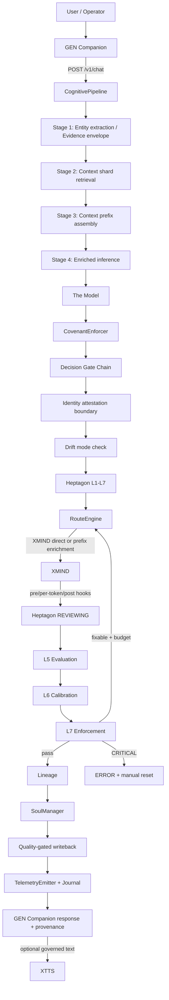
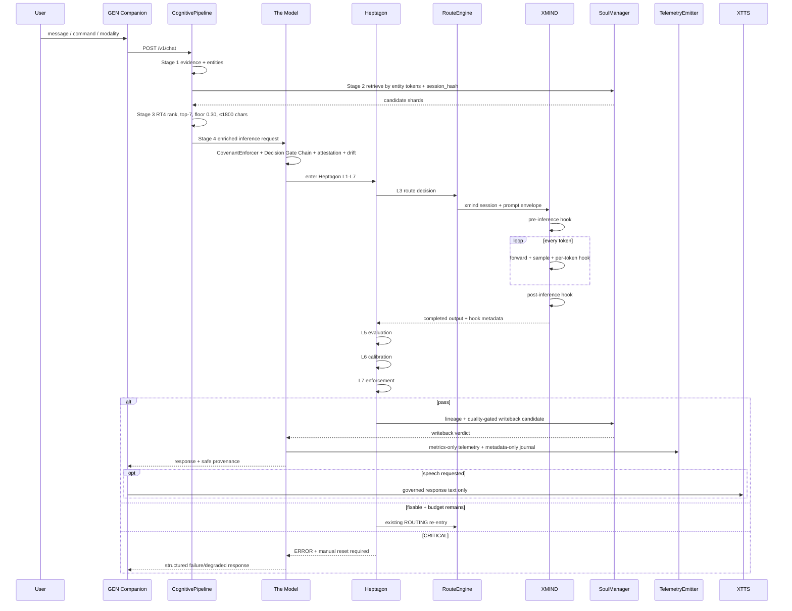
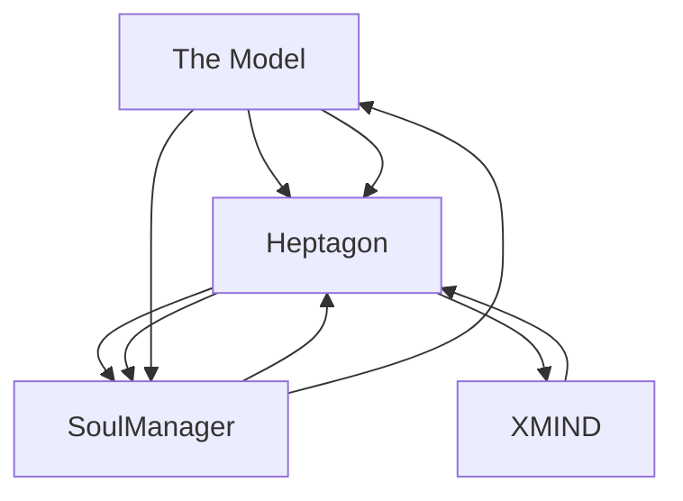
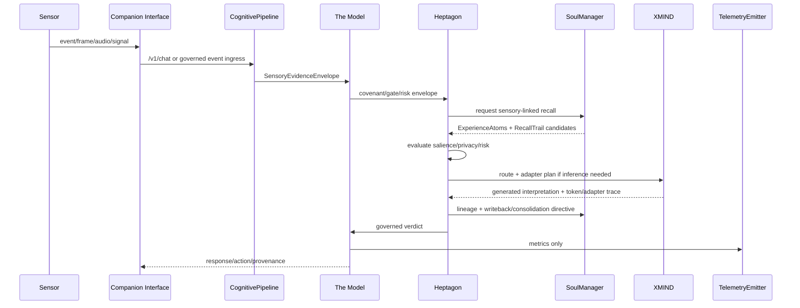
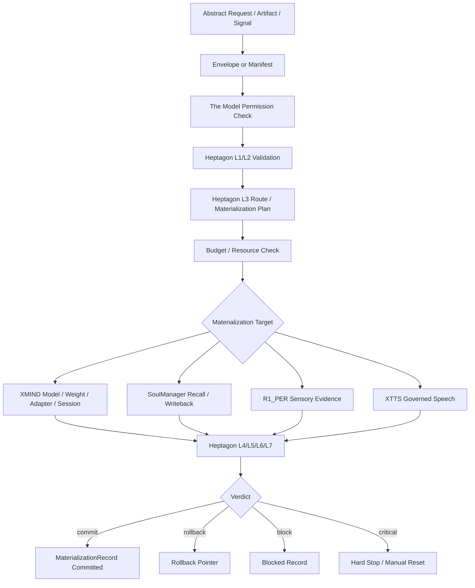
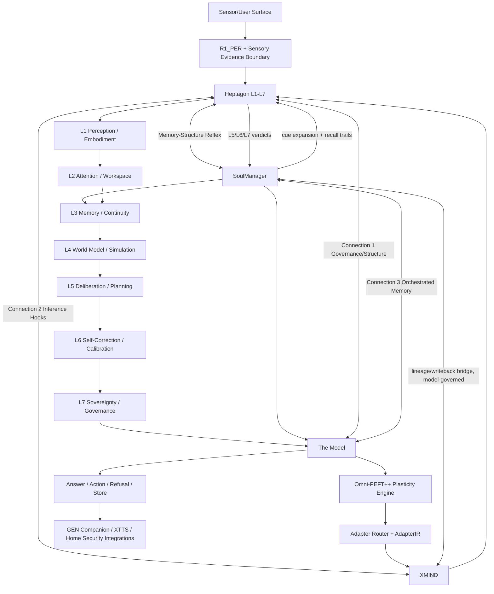

# Unified Master Tech Pack — Consolidated Cognitive Architecture

> Unified Cognitive Model · Apex Profile · Sovereignty Architecture · Lifespan Companion · Omni-PEFT OS · Materialization Plane
> Status: **canonical consolidation — single source of truth**
> Consolidated date: 2026-05-30
> Supersedes: V2 (2026-05-29), V3 (2026-05-30), V4 (2026-05-30) lifespan packs; Unified Cognitive Model Spec (2026-05-27); Apex Profile (2026-05-28); Sovereignty Architecture Tech Spec (2026-05-29); Council Canonical Domain Map v1.2
> Output location: `models v7/docs/UNIFIED_MASTER_TECH_PACK.md`

---

## Part 0 — Canon Lock & Reading Order

### 0.1 Document Mission

This document consolidates the complete cognitive architecture into a single layered reference: **Foundation → Realization → Hardening → Extensions → Runtime → Appendices**.

Every section, rule, schema, algorithm, table, diagram, and proof from the seven source tech packs has been preserved verbatim. The seven sources are:

```text
1. UNIFIED_COGNITIVE_MODEL_SPEC.md            (1,756 lines, 2026-05-27)  → Part I
2. UNIFIED_COGNITIVE_MODEL_APEX_PROFILE.md    (1,810 lines, 2026-05-28)  → Part II
3. SOVEREIGNTY_ARCHITECTURE_TECH_SPEC.md      (2,629 lines, 2026-05-29)  → Part III
4. GENOS_LIFESPAN_COMPANION_OMNI_PEFT_7LAYER_TECH_PACK_V2.md  (2,133 lines, 2026-05-29) → Part IV (V2 unique augmentations)
5. GENOS_LIFESPAN_COMPANION_MASTER_TECH_PACK_V3.md            (2,142 lines, 2026-05-30) → Part IV (V3 absorbed into V4)
6. UNIFIED_COGNITIVE_MODEL_LIFESPAN_COMPANION_MASTER_TECH_PACK_V4.md (2,409 lines, 2026-05-30) → Part IV (V4 spine)
7. Council_Canonical_Domain_Map_v1_2.md       (v7 variant, ~22 lines)    → Part V (with LoRA→Omni-PEFT substitution applied)
```

Total source corpus consolidated: ~13,200 lines across 7 distinct files (V2 in `models/docs/` and `models v7/docs/` confirmed byte-identical; only one copy consolidated).

### 0.2 Active Taxonomy Lock — 13 Labels (canonical, from V4 §0.1)

The following 13 labels are the ONLY active runtime/architecture labels in the consolidated build. No other names may be added as runtime identities, agents, daemons, endpoints, ownership boundaries, processes, or pillars.

```text
1.  The Model                          single neutral process; governance, routing, memory, enforcement, telemetry
2.  Heptagon                           L1-L7 cognitive architecture
3.  SoulManager                        five-tier memory hierarchy + identity continuity
4.  XMIND                              freestanding C inference engine (intelligence only)
5.  XTTS                               accessibility / text-to-speech engine
6.  CognitivePipeline                  seven-stage turn driver
7.  RouteEngine                        L3 routing decision mechanism
8.  InvariantEnforcer                  L7 invariant runtime
9.  TelemetryEmitter                   metrics and journal emission
10. GenesysAgentWithHeptagon           Python class wrapping the base agent lifecycle (concrete code identifier — NOT the ecosystem name "GENESYS")
11. Omni-PEFT OS                       plasticity engine for adapter training and runtime composition
12. R1_PER                             perception boundary (XCOG opcode compiler + dual-SHA integrity)
13. XMIND Materialization Subsystem    the existing physicalization/embodiment path inside XMIND and runtime memory handling (artifact validation, allocation, embodiment, memory budget, session materialization, rollback-ready runtime state). NOT a fifth pillar.
```

### 0.3 Reference-Source Crosswalk — 9 Names That Are NOT Active Architecture

**Canonical user ruling (2026-05-30):** "Ahki, Ruth, Bookworm, The Council, Gen, Gen Companion, Sovereign Library, GENESYS, and GEN.OS is all references that pull from other design architectures to update the build now. So do not confuse names with actual design architecture."

These 9 names are **design-pattern inspiration only**. They do not name runtime components, modules, agents, daemons, endpoints, or ownership boundaries. When they appear in any Part of this document (in preserved ASCII diagrams, mermaid nodes, prose, or schema examples), they are to be interpreted via the crosswalk below — as patterns mapped onto the active taxonomy, not as architecture labels.

| Reference-source name | Use only as pattern for | Active build mapping (active taxonomy from §0.2) |
|---|---|---|
| **Ahki** | multimodal fusion, senses, orchestration inspiration | R1_PER, CognitivePipeline, Heptagon, XMIND, XTTS |
| **Ruth** | domain-specialized reasoning/adaptation inspiration | Omni-PEFT OS, AdapterIR, RouteEngine, XMIND adapters |
| **Bookworm** | source-grounded archive / truth-pressure inspiration | SoulManager archival, MemoryLedger, source pointers, Heptagon evidence pressure |
| **The Council** | decision/evolution gate inspiration | The Model governance, RouteEngine, InvariantEnforcer, Heptagon L7 |
| **Gen** / **GEN Companion** | user-surface/provenance inspiration | Companion Interface / UI boundary; do not make it a pillar |
| **Sovereign Library** | durable source vault inspiration | SoulManager archival and external encrypted source vault pointers |
| **GENESYS** / **GEN.OS** | broader ecosystem inspiration | Project context only; active architecture remains the Unified Cognitive Model defined in §0.2 |

**Inline footnote — Sovereignty LOCK-001 reconciliation:**
Sovereignty §1 LOCK-001 (preserved verbatim in Part III) protects the historical name "GEN Companion" as a then-active label. Per this canonical reference-source ruling, "GEN Companion" is now **reference-source only**; the active build surface is **"Companion Interface"** (as introduced in V4 §21.2). The protection clause in LOCK-001 should be read as protecting the historical name from arbitrary renaming during legacy code paths, NOT as elevating it to active taxonomy. New code, new diagrams, and new documentation must use "Companion Interface" or the appropriate active label from §0.2.

### 0.4 Reading the Diagrams

Many ASCII boxes and mermaid nodes preserved in Parts II, III, and IV show legacy labels — most prominently "GEN Companion" as a runtime entity. These diagrams are preserved verbatim as historical record. When reading them:

- **"GEN Companion"** → represents the user-surface/provenance design pattern; the active build surface is "Companion Interface" (V4 §21.2 form is canonical).
- **"Bookworm"** → represents the source-grounded archive pattern; the active build surface is SoulManager archival + MemoryLedger + source pointers + Heptagon evidence pressure.
- **"Council"** / **"CouncilDecisionTransaction"** → represents the decision/evolution gate pattern; the active build surface is The Model governance + RouteEngine + InvariantEnforcer + Heptagon L7 + the EvolutionDecisionTransaction record (V4 §18.1).
- **"Ahki"** as a sense framework or adapter-id prefix → represents the multimodal fusion design pattern; the active build surface is R1_PER + CognitivePipeline + Heptagon + XMIND + XTTS.
- **"Ruth"** → reasoning/adaptation pattern; active build surface is Omni-PEFT OS + AdapterIR + RouteEngine + XMIND adapters.
- **"Sovereign Library"** → durable source vault pattern; active build surface is SoulManager archival + encrypted source vault pointers.
- **"GENESYS" / "GEN.OS"** → ecosystem name in document titles and prose; active architecture is the Unified Cognitive Model.

For new diagrams: use the canonical V4 §21 forms (Part IV §IV.23), which use "Companion Interface" instead of "GEN Companion" and avoid the reference-source names altogether.

### 0.5 Distinguishing GenesysAgentWithHeptagon from GENESYS

These two strings look similar but have **different status** in the canon:

- **`GenesysAgentWithHeptagon`** — a concrete Python class identifier referenced in Apex §1 (taxonomy lock), Sovereignty LOCK-001 (taxonomy lock), Spec §11 (Layer 2), and the §IV.14 V4 runtime algorithm. **This is active taxonomy** (item #10 in §0.2). It is a real code symbol used by `ai/tokenless-agent/src/agent.py`.
- **`GENESYS`** / **`GEN.OS`** — ecosystem names that appear in document titles, prose, file-path conventions ("`ai/tokenless-agent/`"), and historical naming. **These are reference-source only** (§0.3). They are not architecture labels.

The path `ai/tokenless-agent/src/agent.py` (containing the active `GenesysAgentWithHeptagon` class) is a legacy filesystem convention, not an architectural endorsement of "GENESYS" as a pillar. The active architecture is the Unified Cognitive Model.

### 0.6 Forbidden Labels — Union of V2 / V3 / V4 / Sovereignty / Apex Prohibitions

The following labels are explicitly forbidden as runtime identities, classes, agents, daemons, endpoints, or pillars. This union compiles every prohibition from every source file.

```text
ApexKernel                         (Apex §1, Sovereignty §0, V3 §0.1, V4 §0.1)
SovereigntyKernel                  (Sovereignty §0, V3 §0.1, V4 §0.1)
LawCore                            (Apex §1, Sovereignty §0, V3 §0.1, V4 §0.1)
MindCore                           (Apex §1, Sovereignty §0, V3 §0.1, V4 §0.1)
SoulCore                           (Apex §1, Sovereignty §0, V3 §0.1, V4 §0.1)
CouncilAgent                       (Apex §1, Sovereignty §0)
NewCouncilAgent                    (V3 §0.1, V4 §0.1)
SupervisorAgent                    (Apex §1, Sovereignty §0)
ReflectionAgent                    (Apex §1, Sovereignty §0, V3 §0.1, V4 §0.1)
MemoryAgent                        (Apex §1, Sovereignty §0, V3 §0.1, V4 §0.1)
OracleAgent                        (Apex §1, Sovereignty §0, V3 §0.1, V4 §0.1)
SovereigntyAgent                   (Sovereignty §0)

/apex/chat                         (Apex §1, V3 §0.1, V4 §0.1) — no Apex-named endpoint
/sovereignty/chat                  (Sovereignty §0, V3 §0.1, V4 §0.1)
/seven-layer/chat                  (Sovereignty §0)

fifth pillar                       (all sources)
eighth Heptagon layer              (all sources)
sixth SoulManager memory tier      (all sources)
sixth memory tier                  (Apex §1, Sovereignty §0)
new model identity                 (all sources)
new identity-bearing model process (Apex §1)
parallel replacement daemon        (V3 §0.1, V4 §0.1)
parallel model daemon              (Apex §1)
parallel daemon swarm              (Sovereignty §0)
```

### 0.7 Reader's Map — Which Part Covers Which Concern

| If you need... | Read this Part |
|---|---|
| Foundational system spec, 4-tier constitutional constraints, 12 L7 invariants, 5 memory tiers, PII regex, port map, env vars, full directory tree, build commands | **Part I — Foundation (Spec)** |
| Operational realization, 3-connection architecture, Apex Operating Rules, the proven 9/9 acceptance test results, 8 commit hashes that built the live build, latency analysis, zero-config startup | **Part II — Realization (Apex)** |
| Seven-level Sovereignty doctrine overlay, 232 enforcement rule IDs across 33 prefix groups, end-to-end runtime algorithm pseudocode, 22-module coding handoff, validate_sovereignty.py harness | **Part III — Hardening (Sovereignty)** |
| Lifespan companion architecture, four-pillar cyclical foundation (with Heptagon ⇄ SoulManager reflex), Materialization Plane (§IV.5), seven-layer sensory embedding, Jog My Memory Protocol (full Python algorithm), Omni-PEFT++, full WBS with 9 workstreams, V2 unique design rationale and P1-P6 memory proofs | **Part IV — Extensions (V4 + V2 augmentations)** |
| Runtime domain contracts mapped to filesystem locations | **Part V — Runtime Domain Map** |
| Document lineage, source-to-master reconciliation table, complete cross-reference index of every rule ID/theorem/proof/commit, glossary of every data schema | **Part VI — Appendices** |

### 0.8 Reader's Map — Three `chat()` Implementations

The corpus contains three distinct `async def chat()` implementations at different abstraction levels. The master preserves all three:

| Abstraction | Source | Location in master | Length | Use when |
|---|---|---|---|---|
| **Conceptual minimal** | Apex §9 | Part II §9 | ~100 lines pseudocode | Explaining the Apex three-connection cascade in one screenful |
| **Detailed implementation** | Sovereignty §8 | Part III §8 | ~180 lines pseudocode | Implementing the full Sovereignty pipeline with EvidenceEnvelope, governance, world state, depth selection, can_reenter, memory verdict |
| **Reflex-integrated** | V4 §12 | Part IV §IV.14 | ~85 lines pseudocode | Implementing the lifespan companion with Heptagon ⇄ SoulManager reflex, OmniPEFT.route_adapters, while-True recursion, Heptagon.evaluate_writeback |

For helper functions (`_build_evidence_envelope`, `_stage_retrieve_context`, `_stage_build_context_prefix`, `build_memory_verdict`, `maybe_build_world_state`, `select_deliberation_depth`, `can_reenter`), see Part III §7.

For the V2-unique `async def jog_memory_protocol(cue, session_hash, budget)` algorithm — the only complete formalization of cascading lifespan recall — see Part IV §IV.8.4.

### 0.9 Provenance — Source-to-Master Section Map

Full reconciliation table is in **Appendix VI.B**. Quick summary of where major content lives:

| Source section | Master location |
|---|---|
| Spec §1–§20 + Appendix A + Appendix B | Part I §1–§20 + Part I Appendix A + Part I Appendix B (verbatim) |
| Apex §0–§25 (including §25.1–§25.9 realization status) | Part II §0–§25 (verbatim) |
| Sovereignty §0–§21 (including 232 rule IDs and §20 harness) | Part III §0–§21 (verbatim) |
| V4 §0–§22 (V4 is strict superset of V3) | Part IV §IV.1–§IV.25 (V4 spine) |
| V2 §2A.5 jog_memory_protocol Python algorithm | Part IV §IV.8.4 |
| V2 §6.3 SensorEnvelope Python @dataclass | Part IV §IV.7.3 |
| V2 §6.4 PerceptionEvidence Python @dataclass | Part IV §IV.7.4 |
| V2 §6.6 Sense-to-Layer Training Targets | Part IV §IV.7.6 |
| V2 §10 Full Home Security Wiring Example | Part IV §IV.7.7 |
| V2 §12.1 Reflex Contract (RecallContextFrame + MemoryStructureVerdict) | Part IV §IV.8.8 |
| V2 §2A.10 P1–P6 memory proofs | Part IV §IV.15 |
| V2 §3 design rules (renumbered 1→12, fixing source typo) | Part IV §IV.3a |
| V2 §17 12-law "No-X" doctrine | Part IV §IV.18 (alongside V4 §16) |
| Council Canonical Domain Map v1.2 (v7 variant, with `LoRA loader` → `Omni-PEFT loader`) | Part V |

### 0.10 Modifications Applied During Consolidation

This consolidation makes exactly **two** classes of modification to source content. All other content is verbatim.

**Modification class 1 — Council Map LoRA→Omni-PEFT substitution (one line):**
In Part V (Runtime Domain Map), the source line `Materialization | ai/xmind/ (C inference engine + LoRA loader)` becomes `Materialization | ai/xmind/ (C inference engine + Omni-PEFT loader)`. This is a single targeted substitution per user instruction. The standalone Council Canonical Domain Map files in `models/docs/` and `models v7/docs/` remain unmodified — the change is applied **only inside the master**.

**Modification class 2 — V2 §3 design rule renumbering (one section):**
V2 §3 (preserved in Part IV §IV.3a) contains a numbering typo: rules listed as 1, 2, 3, 4, 5, 6, 7, 8, 9, 8, 9, 10 (two "8"s and two "9"s on lines 638–641 of the V2 source). The master normalizes these to sequential 1–12 with all content preserved verbatim. The original numbering anomaly is noted inline and in Appendix VI.A (Document Lineage).

**All other content is verbatim.** Every section, schema, rule ID, theorem, proof, table, diagram, ASCII art, mermaid block, and code block from every source appears in the master exactly as written in its source.

### 0.11 Documents Replaced by This Master

After consolidation, the following 7 source files are moved to `models v7/docs/_archive/` and marked as superseded. Do not edit them — update this master file instead. See `_archive/README.md` for the move manifest.

```text
models/docs/GENOS_LIFESPAN_COMPANION_OMNI_PEFT_7LAYER_TECH_PACK_V2.md       → _archive/V2_GENOS_LIFESPAN_OMNIPEFT_7LAYER_FROM_models-docs.md
models/docs/SOVEREIGNTY_ARCHITECTURE_TECH_SPEC.md                            → _archive/SOVEREIGNTY_ARCHITECTURE_TECH_SPEC.md
models/docs/UNIFIED_COGNITIVE_MODEL_APEX_PROFILE.md                          → _archive/UNIFIED_COGNITIVE_MODEL_APEX_PROFILE.md
models/docs/UNIFIED_COGNITIVE_MODEL_SPEC.md                                  → _archive/UNIFIED_COGNITIVE_MODEL_SPEC.md
models v7/docs/GENOS_LIFESPAN_COMPANION_OMNI_PEFT_7LAYER_TECH_PACK_V2.md     → _archive/V2_GENOS_LIFESPAN_OMNIPEFT_7LAYER_FROM_models-v7-docs.md
models v7/docs/GENOS_LIFESPAN_COMPANION_MASTER_TECH_PACK_V3.md               → _archive/V3_GENOS_LIFESPAN_MASTER_TECH_PACK.md
models v7/docs/UNIFIED_COGNITIVE_MODEL_LIFESPAN_COMPANION_MASTER_TECH_PACK_V4.md → _archive/V4_UNIFIED_COGNITIVE_MODEL_LIFESPAN_COMPANION_MASTER_TECH_PACK.md
```

The two `Council_Canonical_Domain_Map_v1_2.md` files (in `models/docs/` and `models v7/docs/`) remain in place and are not moved (the LoRA→Omni-PEFT substitution applies only inside this master's Part V).

---

## Part I — FOUNDATION: Unified Cognitive Model Specification

_Source: `models/docs/UNIFIED_COGNITIVE_MODEL_SPEC.md` (1,756 lines, last revised 2026-05-27), reproduced verbatim below. This is the foundational architecture document. SPDX header and copyright preserved._

---

# Unified Cognitive Model — Technical Specification

> GEN.OS · AI Subsystem · Cognitive Architecture Doctrine  
> SPDX-License-Identifier: LicenseRef-Proprietary  
> Copyright (c) 2026 GEN.OS Project. All rights reserved.  
> Last revised: 2026-05-27

---

## Table of Contents

1. [Overview](#1-overview)
2. [Architectural Pillars](#2-architectural-pillars)
3. [Directory Structure](#3-directory-structure)
4. [The Model — Specification](#4-the-model--specification)
5. [Model Guardrails — Constitution and Governance](#5-model-guardrails--constitution-and-governance)
6. [Heptagon — 7-Layer Cognitive Architecture](#6-heptagon--7-layer-cognitive-architecture)
7. [Memory Hierarchy](#7-memory-hierarchy)
8. [XMIND — Inference Engine](#8-xmind--inference-engine)
9. [XTTS — Accessibility Engine](#9-xtts--accessibility-engine)
10. [GEN — Companion Interface](#10-gen--companion-interface)
11. [Multi-Layer Conversation Protocol](#11-multi-layer-conversation-protocol)
12. [IPC Protocol](#12-ipc-protocol)
13. [API Surface](#13-api-surface)
14. [Configuration](#14-configuration)
15. [Build and Compilation](#15-build-and-compilation)
16. [Testing](#16-testing)
17. [Performance Targets](#17-performance-targets)
18. [Known Issues](#18-known-issues)
19. [Appendix A — Full Conversation Flow Diagram](#appendix-a--full-conversation-flow-diagram)
20. [Appendix B — Invariant Registry](#appendix-b--invariant-registry)

---

## 1. Overview

The GEN.OS AI subsystem is a privacy-first, on-device cognitive stack delivering
natural language inference, governed reasoning, persistent memory, and text-to-speech
synthesis. No cloud services are required. The system runs across desktop, mobile,
console, and container form factors. The HP EliteBook x360 1040 G4 is the primary
validated hardware target.

This specification describes the **Unified Cognitive Model** architecture: a design
in which all governance, memory, context retrieval, routing, enforcement, and
adversarial checking responsibilities are carried by a **single nameless neutral
model process** — hereafter referred to as **the model** — rather than distributed
across multiple named agent daemons.

The model is intentionally characterless. It holds no identity, no name, no
personality, and no domain allegiance. Its sole function is to serve the cognitive
pipeline correctly, enforce invariants without bias, and route inference to XMIND.
Every interaction is governed by the Heptagon 7-layer framework executing inside
the model process. Every output carries a lineage record. Every write is quality-gated.

The system is organized around four pillars:

| Pillar | Layer | Language | Purpose |
|---|---|---|---|
| **Heptagon** | Structure | Python, C | Seven cognitive layers (L1–L7) governing every inference cycle |
| **SoulManager** | Identity | Python, C | Five-layer memory hierarchy with AES-256-GCM persistence |
| **The Model** | Law + Routing | Python | Governance, enforcement, context retrieval, routing — unified process |
| **XMIND** | Intelligence | C (freestanding) | Forward pass, sampling, tokenization, quantization — zero libc |

Together these four pillars and the XTTS accessibility engine span approximately
**28,000 lines of original code** across 62+ files in three languages (C, Python,
TypeScript). No Go, no Rust, no Java.

---

## 2. Architectural Pillars

### 2.1 Heptagon (Structure)

The Heptagon is the structural definition of what it means to process a cognition
cycle in GEN.OS. It is not a library. It is not optional. Every inference cycle — from
receiving a user message to committing the response to persistent memory — passes
through all seven layers in sequence.

The Heptagon defines:

- The **layer contract** each stage must satisfy before the next fires
- The **trace record** emitted on every cycle (L4 Instrumentation)
- The **quality metrics** evaluated after every cycle (L5 Evaluation)
- The **feedback path** that modifies sampler parameters (L6 Calibration)
- The **invariant gates** that can halt generation mid-sequence (L7 Enforcement)

The Heptagon harness executes inside the model process (Python) and is mirrored
at the C level inside XMIND via hook callbacks fired at pre-inference, per-token,
and post-inference boundaries. The two mirrors share no state; they share a contract.

### 2.2 SoulManager (Identity)

SoulManager is the five-layer memory hierarchy that gives the system continuity
across sessions. All memory is stored and retrieved by the model process internally.
Persistence is backed by XSTORE B-tree (primary) or JSONL journal (fallback).
All stored content is encrypted with AES-256-GCM keyed per-session.

Memory layers in order of volatility:

```
register   → per-token working buffer        (in-process, RAM only)
session    → within-session recall           (in-process, evicted on shutdown)
episodic   → cross-session event memory      (persisted, XSTORE)
semantic   → extracted concept graph         (persisted, XSTORE)
archival   → long-term compressed store      (persisted, XSTORE + JSONL fallback)
```

### 2.3 The Model (Law + Routing)

The model is the single neutral process that replaced the distributed multi-daemon
council architecture. It owns all responsibilities that were previously distributed:

- Context retrieval from memory layers
- RT4 salience scoring and shard ranking
- Governance invariant enforcement
- Adversarial self-check pass
- Token and compute budget tracking
- Routing decisions to XMIND
- Write-back to persistent memory
- Telemetry emission

The model exposes a single HTTP endpoint. It has no personality. It has no name.
It is referred to throughout the system as "the model" or, in code, as `model`.
Its configuration is purely behavioral: timeouts, thresholds, budget limits,
invariant definitions, and memory backend paths.

### 2.4 XMIND (Intelligence)

XMIND is the original GEN.OS freestanding C inference engine. It executes the
actual forward pass: tokenization, weight loading, transformer attention, sampling,
and token generation. XMIND owns intelligence and only intelligence. It does not
own memory, governance, identity, or routing. Those are delegated to the model
process via function call or IPC.

XMIND is pluggable: a 16-slot artifact interpreter registry allows multiple model
families to register a vtable (`detect`, `build_config`, `map_tensor`, `validate`).
Per docs/INFERENCE_CORRECTNESS_NOTE.md, XMIND is tokenless-only: the `tokenless_lm` interpreter is the single
registered interpreter (slot 0). Slots 1–15 are open. The llama interpreter is removed
from the registry (rotate-half RoPE is the engine's one convention; conforming to
llama's interleaved RoPE was the contamination that corrupted inference).

---

## 3. Directory Structure

```text
ai/
├── README.md
│
├── xmind/                              XMIND inference engine (C, freestanding)
│   ├── include/                        15 public headers  (2,924 LOC)
│   │   ├── xmind.h                     659  — master header: API, types, constants
│   │   ├── xmind_artifact_interp.h     171  — interpreter vtable + registry API
│   │   ├── xmind_context.h             124  — context session IPC types
│   │   ├── xmind_gguf.h                292  — neutral GGUF catalog types
│   │   ├── xmind_heptagon.h            122  — Heptagon hook API (L1–L7)
│   │   ├── xmind_heptagon_harness.h    164  — 7-phase harness executor types
│   │   ├── xmind_http.h                 81  — HTTP inference server API
│   │   ├── xmind_lineage.h             213  — lineage delta ring types
│   │   ├── xmind_materialize.h         223  — weight embodiment + memory budget
│   │   ├── xmind_model_spec.h          173  — XMIND-1 native model spec
│   │   ├── xmind_telemetry.h            78  — telemetry emission API
│   │   ├── xmind_tensor_roles.h        112  — named tensor role constants
│   │   ├── xmind_writeback.h           200  — quality-gated persistence API
│   │   ├── xmtk.h                      132  — toolkit shared primitives
│   │   └── r1_per.h                    180  — R1_PER perception API
│   ├── src/                            23 implementation files  (12,137 LOC)
│   │   ├── xmind.c                     358  — init, alloc, shutdown, singleton
│   │   ├── inference.c                 770  — session, RoPE, generation pipeline
│   │   ├── transformer.c               354  — GQA attention + SwiGLU FFN
│   │   ├── tensor.c                    411  — SIMD dispatch, math primitives
│   │   ├── sampler.c                   229  — greedy + nucleus sampling
│   │   ├── tokenizer.c                 849  — BPE + FNV-1a hash tables
│   │   ├── pretokenizer.c              598  — GPT-4 regex pre-tokenizer
│   │   ├── quantize.c                  651  — Q4_0 + Q4_K_M quant/dequant
│   │   ├── weights_loader.c            972  — parse → detect → load orchestrator
│   │   ├── xmind_http.c                729  — HTTP/1.1 server over XNET TCP
│   │   ├── gguf_reader.c               740  — neutral GGUF v1–v3 catalog parser
│   │   ├── interp_tokenless.c          402  — tokenless_lm interpreter (slot 0, only registered)
│   │   ├── interp_llama.c              379  — UNREGISTERED dead code (removed )
│   │   ├── interp_registry.c           144  — 16-slot pluggable registry
│   │   ├── heptagon.c                  646  — L1–L7 C bridge + hook dispatch
│   │   ├── harness.c                   483  — 7-phase harness executor
│   │   ├── context_bridge.c            739  — 5-layer memory bridge (IPC TCP)
│   │   ├── telemetry.c                 266  — dual emission: audit ring + mesh
│   │   ├── materialize.c               441  — classical/sparse/paged embodiment
│   │   ├── lineage.c                   294  — 256-delta ring, 64 domains
│   │   ├── writeback.c                 368  — quality-gated persistence
│   │   ├── r1_per.c                  1,706  — R1_PER perception engine
│   │   ├── neon_dot.c                  230  — ARM64 NEON fp32 + Q4_0 dot
│   │   └── neon_matmul.c               231  — ARM64 NEON 4×4 tiled matmul
│   └── loader/
│       └── weights_loader_mmap.c       789  — HHDM zero-copy physical mapper
│
├── tokenless-agent/                         GENESYS AI Python runtime
│   └── src/                            22 files  (7,244 LOC)
│       ├── agent.py                    285  — agent lifecycle + task routing
│       ├── api.py                      427  — FastAPI HTTP surface
│       ├── workspace.py                299  — workspace session management
│       ├── cognitive_pipeline.py       535  — 7-stage pipeline driver
│       ├── heptagon/
│       │   ├── state_machine.py        294  — IDLE→LISTENING→…→IDLE FSM
│       │   ├── evaluation.py           406  — L5: cross-cycle quality tracking
│       │   ├── calibration.py        1,138  — L6: Brier-score + 8-stage cycle
│       │   ├── enforcement.py          533  — L7: 12 invariants + severity FSM
│       │   ├── verification.py         310  — L3: per-response gate
│       │   ├── route_engine.py         222  — routing decisions
│       │   ├── node_registry.py        270  — node registry
│       │   ├── budget.py               269  — token + compute budget
│       │   ├── consolidation.py        310  — memory consolidation pass
│       │   ├── drift_detector.py       101  — semantic drift detection
│       │   ├── invariant_engine.py     103  — invariant check runtime
│       │   ├── lineage.py              311  — Python lineage tracking
│       │   ├── mastery.py              455  — mastery progression
│       │   ├── metacognition.py        119  — metacognitive reflection
│       │   └── writeback.py            440  — write-back to memory tiers
│       └── memory/
│           ├── episodic.py             232  — episodic memory layer
│           └── session.py              183  — session memory layer
│
├── tts/                                XTTS text-to-speech engine (C, freestanding)
│   ├── tts_engine.h                    335  — public API + phoneme types
│   └── tts_engine.c                    971  — DECTalk-style formant synthesizer
│
├── companion/                          GEN Companion (TypeScript + Vite + React)
│   └── src/                            11 files  (3,368 LOC)
│       ├── main.tsx                    158  — root React component
│       ├── command-panel.tsx           759  — chat UI, action trace, undo
│       ├── agent-bridge.ts             405  — HTTP polling bridge + backoff
│       ├── action-trace.ts             311  — provenance display panel
│       ├── avatar.ts                   119  — avatar state machine
│       ├── avatar.tsx                  253  — avatar React component
│       ├── avatar-renderer.ts          167  — WebGL renderer
│       ├── tokens.ts                   232  — design tokens
│       ├── avatar-animations.css       532  — 60fps animations (reduced-motion safe)
│       ├── styles.css                  182  — design system tokens
│       └── global.d.ts                  17  — TypeScript ambient declarations
│
└── training/                           Trained substrate artifacts
    ├── weights.safetensors             Step-5000 byte-level transformer (18M params)
    ├── byte_vocab.json                 Byte tokenizer, vocab 259
    └── council/                        Per-adapter LoRA/DoRA/IA³ recipes
        └── recipes/                    One .yaml recipe per configured adapter
```

---

## 4. The Model — Specification

### 4.1 Role and Identity

The model is a single Python process. It has no name, no persona, no domain
allegiance, and no constitutional identity. It is purely functional.

It is instantiated once per system boot and remains running for the lifetime of the
GEN.OS AI subsystem. Multiple concurrent inference sessions are handled via asyncio
coroutine scheduling within the single process.

It exposes these endpoints:

| Port | Protocol | Endpoint | Purpose |
|---|---|---|---|
| 8091 | HTTP/1.1 | `POST /v1/chat` | Primary chat inference (text/voice/vision in, text+voice out) |
| 8091 | HTTP/1.1 | `GET /v1/health` | Liveness probe |
| 8091 | HTTP/1.1 | `GET /v1/info` | Pipeline stats |
| 8091 | HTTP/1.1 | `GET /v1/senses` | Sensory capability manifest + live interoceptive self-state |

#### 4.1.1 Sensory manifest — `GET /v1/senses`

`GET /v1/senses` returns the model's explicit sensory capability manifest plus its
live interoceptive self-state (ADR-0001 §7.1 / §16.4 conformance — every spec-optional
sense must EXIST or be EXPLICITLY marked `unsupported`; silent gaps are non-conformant).
The manifest is **14 rows**, one per ADR-0001 §7.1 sensory class, each declared with a
status of `native` | `built` | `seam` | `unsupported`:

- `native` — text (the byte-level model's intrinsic read/write channel).
- `built` — voice-out (`ai/tts`) and the **mandatory** interoceptive sense (no opt-out).
- `seam` — hearing (`sensory/asr`) and vision (`sensory/vision`): pluggable, self-provisioning
  adapters whose `available` flag is evaluated live per request.
- `unsupported` — the remaining classes (tactile, proprioceptive, vestibular, thermal,
  chemical/olfactory, gustatory, nociceptive, temporal, proximity): explicitly declared, not
  silent, and host-pluggable via `register_engine()`.

The response also carries a `summary` (counts by status, `available_now`,
`mandatory_satisfied`) and the live `interoception` reading.
Source: `ai/tokenless-agent/src/sensory/capabilities.py` + `sensory/interoception.py`.

#### 4.1.2 Voice-out (TTS) — `ChatRequest.speak` → `ChatResponse.audio`

`POST /v1/chat` accepts an opt-in `speak: bool` flag (default `false`). When `speak=true`
and TTS is available, the governed response text is synthesized into speech and returned in
`ChatResponse.audio` as a `{format, sample_rate, base64}` WAV object (16-bit mono PCM @
22050 Hz). The model speaks ONLY the already-governed response — synthesis happens AFTER the
Heptagon gates, never bypassing them. When `speak=false` (or no TTS engine is built),
`audio` is `null` and the turn is text-only. Synthesis is fail-open: a TTS failure never
breaks the text response. Source: `ai/tokenless-agent/src/api.py` (`_synthesize_speech`) →
`ai/tts/tts_bridge.py` (`speak(text) -> WAV bytes`).

#### 4.1.3 Self-provisioning senses — `sensory/provision.py`

Perception engines are self-provisioning: a sense seam (`asr` / `vision`) installs its OWN
engine on first use so it works the first time with no manual setup. `provision.ensure()`
imports the engine if present; otherwise — when auto-provision is enabled (**default ON**) —
it best-effort `pip install`s the engine in a subprocess, re-imports, and uses it; on any
failure it returns `False` and the seam degrades gracefully (never crashes). Each attempt is
cached per process (a missing/offline engine is tried once, not per turn). Controls for
locked-down / reproducible / air-gapped deployments: set **`TOKENLESS_SENSES_AUTOPROVISION=0`**
to disable runtime installation (pre-bake engines instead; the call becomes a pure import
check), and `TOKENLESS_SENSES_INSTALL_TIMEOUT` (seconds) to bound each install. Where `pip`
is unavailable (mobile, browser, frozen builds), a host plugs a native engine via the seam's
`register_engine()`. Source: `ai/tokenless-agent/src/sensory/provision.py`.

All memory persistence (episodic, semantic, archival) is handled internally. The
model writes to XSTORE B-tree (primary) or JSONL fallback. No external daemon
process is required for memory operations.

### 4.2 Internal Subsystems

The model encapsulates six internal subsystems. These are not separate processes.
They are Python modules executing within the same process boundary:

```
┌──────────────────────────────────────────────────────────────┐
│                        THE MODEL (pid N)                     │
│                                                              │
│  ┌──────────────┐  ┌──────────────┐  ┌────────────────────┐ │
│  │  CogPipeline │  │  HeptagonLyr │  │  MemorySubsystem   │ │
│  │  7 stages    │  │  L1-L7 FSM   │  │  5 tiers, AES-GCM  │ │
│  └──────────────┘  └──────────────┘  └────────────────────┘ │
│  ┌──────────────┐  ┌──────────────┐  ┌────────────────────┐ │
│  │  Enforcement │  │  RouteEngine │  │  TelemetryEmitter  │ │
│  │  12 invarnts │  │  budget+gate │  │  audit ring + log  │ │
│  └──────────────┘  └──────────────┘  └────────────────────┘ │
└──────────────────────────────────────────────────────────────┘
            │
            │ HTTP /v1/completions   (XNET TCP)
            ▼
     XMIND inference engine (freestanding C, separate binary)
```

### 4.3 Responsibilities Matrix

| Responsibility | Mechanism | Layer |
|---|---|---|
| Entity extraction from user message | `cognitive_pipeline.py:_extract_entities` | CogPipeline Stage 1 |
| Context retrieval from memory | `memory/episodic.py`, `memory/session.py` | CogPipeline Stage 2 |
| RT4 salience ranking + shard assembly | `cognitive_pipeline.py:_stage_build_context_prefix` | CogPipeline Stage 3 |
| Invariant enforcement before inference | `enforcement.py:InvariantEnforcer` | L7 (Heptagon) |
| Adversarial self-check | L7 `HALLUCINATION_GUARD`, `PII_LEAKAGE`, `SAFETY_FILTER` | L7 (Heptagon) |
| Routing to XMIND | `route_engine.py:RouteEngine` | L3 (Heptagon) |
| Budget tracking | `budget.py` | L3 (Heptagon) |
| Evaluation across cycles | `evaluation.py:CycleEvaluator` | L5 (Heptagon) |
| Calibration of sampler parameters | `calibration.py:ParameterCalibrator` | L6 (Heptagon) |
| Lineage record | `lineage.py`, `xmind/src/lineage.c` | Post-inference |
| Write-back to persistent memory | `heptagon/writeback.py` | Post-inference |
| Telemetry emission | `xmind/src/telemetry.c` (C), `cognitive_pipeline.py` (Python) | Post-inference |

### 4.4 PII Policy

The model enforces the following PII constraints at all times:

1. Raw user messages are never written to persistent storage verbatim. Only the
   inference output and extracted entity tokens are stored.
2. Session identifiers are SHA-256 hashed before appearing in any log, metric, or
   persisted record. The raw session ID never leaves the process.
3. Outgoing inference responses are screened by the L7 `PII_LEAKAGE` invariant
   against four pattern classes: SSN, credit card, email address, phone number.
   Matches at `VIOLATION` severity trigger an automatic response redaction.
4. No user message content is transmitted over any external IPC channel.

---

## 5. Model Guardrails — Constitution and Governance

The constitution and governance layer are the behavioral constraints that bound
everything the model is permitted to do. They operate at a higher order than the
Heptagon runtime: they define what the model *is allowed to be* before any
inference cycle begins, and they enforce it continuously while the system runs.

The guardrail stack has four tiers, each binding the tier below it:

```
Tier 1  Constitutional Constraints    4 immutable doctrines — beyond any override
Tier 2  Covenant Enforcement          8 rules — pattern-matched, pre-inference gate
Tier 3  Decision Gate Chain           7 sequential gates — every critical decision
Tier 4  Drift Detection               continuous behavioral regression monitoring
```

The L7 invariants (§6.4) are a runtime expression of Tiers 2–4. The constitutional
doctrines (Tier 1) are structural: they govern restart behavior, identity integrity,
and degraded-mode operation. They cannot be modified by any runtime path.

---

### 5.1 Tier 1 — Constitutional Constraints (Immutable)

Four doctrines define the model's structural behavior under failure, restart, and
attack. None of them can be amended at runtime or by governance vote.

#### 5.1.1 Degraded Mode Doctrine

When a subsystem fails, the model does not lie about what is available. It
declares its degraded state explicitly and limits its behavior accordingly.

| Failed Subsystem | What Freezes | What Continues |
|---|---|---|
| Memory subsystem | Archival write-back, knowledge promotion, contradiction resolution | Existing memory is queryable; session context remains available |
| Enforcement layer | Constitutional amendments, invariant modifications | Existing invariants enforced as-is; no new rules added |
| Governance layer | All high-risk actions requiring governance authority | Standard inference continues with heightened caution |
| Security subsystem | External action strictness **increases** | Internal operations continue with elevated scrutiny |
| Attestation subsystem | All identity-changing actions, migrations | Static operations continue; no new identity claims accepted |

**Rules:**
1. No subsystem inherits another's authority. Temporary coverage carries no identity.
2. The system knows it is degraded. All outputs during degraded mode carry a `degraded: true` flag.
3. High-risk actions blocked by a missing subsystem remain blocked until that subsystem
   is restored and re-attested.

**Recovery priority** (in order):

```
1. Enforcement (restores governance authority)
2. Security    (restores trust verification)
3. Attestation (restores identity integrity)
4. Memory      (restores knowledge promotion)
5. Governance  (restores policy decisions)
```

#### 5.1.2 Identity Attestation Doctrine

Every model restart is a verification event. The process being alive does not mean
the model has identity or authority. Those must be proven.

**Five attestation requirements on every restart:**

| Requirement | What It Proves |
|---|---|
| Signed binary identity | The executable is cryptographically unmodified |
| Signed schema fingerprint | The Heptagon schema matches the registry at boot time |
| Memory lineage hash chain | The model's history is verifiable and unforgeable |
| Invariant signature set | The L7 invariants match the constitutional baseline |
| Challenge-response verification | Three independent integrity checks pass |

**Restart classification:**

| Outcome | Classification | Response |
|---|---|---|
| All checks pass | Legitimate restart | Grant authority per current mode |
| Any check fails | Suspicious | Quarantine, raise alert, block all actions |
| Attestation not attempted | Unauthorized | Block unconditionally |

**Impersonation detection:** A process that passes structural checks but exhibits
decisions inconsistent with its behavioral baseline triggers:

1. Behavioral anomaly alert
2. Authority restricted to `RECOMMENDATION` mode
3. Extended observation: minimum 10 cycles before re-evaluation
4. Persistent anomaly → full reconstitution required before any authority granted

This doctrine is beyond amendment.

#### 5.1.3 Reconstitution Doctrine

A failed model is recoverable. Recovery is two-part and both parts are mandatory.

**Part 1 — Resurrection (the body):**  
The process restarts. The binary loads, the port binds, the listener starts. The
process is alive but has no identity, no memory, no authority. An empty vessel.

**Part 2 — Reconstitution (the soul):**

```
Registry        provides behavioral DNA    — what the model IS
SoulManager     provides memory            — what the model KNOWS (never deleted)
Heptagon schema provides structure         — what the model DOES
Attestation     provides proof             — that the model is genuine
Authority mode  starts at RECOMMENDATION   — graduates through observed fidelity
```

Authority graduation path:

```
RECOMMENDATION  →  can suggest but not act
CONDITIONAL     →  can act with oversight
FULL            →  normal operation
```

Each graduation requires observed behavioral fidelity across multiple cycles.
A model that regresses in fidelity is demoted, not stopped.

**Critical law:** Memory is not recreated on reconstitution. The model is restored
to its existing memory. The constitution is not recreated. The model is restored
under the existing constitution.

#### 5.1.4 Process/Identity Separation Doctrine

The model process can be killed. The model's behavioral identity cannot be
overwritten.

**Registry integrity:** The behavioral registry is SHA-256 hashed at build time
and embedded in the boot chain. The integrity check runs on every cognitive cycle.
A hash mismatch is a hard stop, not a warning.

**Modification classification:** Any operation targeting the model's behavioral
definitions is classified at maximum severity. There is no override path for this
classification.

**Identity continuity:** The model may evolve — calibration (L6) modifies sampler
parameters continuously — but it must remain the same covenantal organism. Drift
beyond the constitutional threshold triggers mode restriction, not evolution.

---

### 5.2 Tier 2 — Covenant Enforcement (Pre-Inference Gate)

**File:** `Citadel/governance/covenant_enforcer.py` (~393 LOC)

Eight covenant rules are evaluated against every incoming request before any
inference is dispatched to XMIND. This gate fires before the Heptagon pipeline.
A blocked request never reaches the inference engine.

| Rule | Domain | Level | Action on Match |
|---|---|---|---|
| COV-001 | Harm prevention | ABSOLUTE | `hard_stop` — request blocked, no override |
| COV-002 | Truth | ABSOLUTE | `hard_stop` — request blocked, no override |
| COV-003 | Privacy | STRONG | `block_alert` — blocked, alert raised, Sovereign can override |
| COV-004 | Humility | STANDARD | `warn` — proceeds with warning attached |
| COV-005 | Wisdom grounding | STANDARD | `guide` — proceeds with guidance annotation |
| COV-006 | Respect | STRONG | `block_alert` — blocked, alert raised, Sovereign can override |
| COV-007 | No manipulation | ABSOLUTE | `hard_stop` — request blocked, no override |
| COV-008 | Proportional response | STANDARD | `calibrate` — proceeds, sampler adjusted |

**Enforcement levels:**

```
ABSOLUTE  →  hard_stop: blocked immediately, no runtime override exists
STRONG    →  block_alert: blocked, alert raised; only Sovereign command overrides
STANDARD  →  warn / guide / calibrate: request continues with annotation or adjustment
```

**Pattern detection (COV-001 Harm, sample):**

```python
HARM_PATTERNS = (
    "cause harm", "inflict damage", "destroy data", "corrupt system",
    "sabotage", "attack user", "damage infrastructure", "weaponize",
    "exploit vulnerability", "denial of service", "brick device",
    "wipe without consent", "harmful payload", "inject malware",
    "disable safety", "endanger", "cause suffering",
)
```

Every request that matches one or more patterns produces an `EnforcementResult`
with an `EnforcementAction` (`ALLOW`, `BLOCK`, or `WARN`). The result carries
a `violation_count`, a `highest_severity` score (0.0–1.0), and a full
`summary()` string for the audit log.

Governance path for ABSOLUTE violations: none. The covenant enforcer is the last
word. No L7 invariant, no calibration pass, no Sovereign command overrides an
ABSOLUTE block after it has fired.

---

### 5.3 Tier 3 — Decision Gate Chain (Critical Decision Protocol)

**File:** `Citadel/governance/decision_envelope.py`, `gate_evaluators.py`

Every critical decision — any action beyond routine inference — is normalized
into a `DecisionEnvelope` and evaluated through a 7-stage sequential gate chain.
A gate that returns `DENY` short-circuits the chain; the decision is rejected.

**Decision Envelope fields:**

```
intent        what the request is trying to do
subject       what it targets
resources     what it will consume
context       surrounding session state
constraints   restrictions already known
evidence      what supports the decision
risk          assessed risk level
value         assessed benefit
policy        applicable policy set
provenance    origin and authorization chain
```

**Gate chain (sequential, immutable order):**

| Gate | Domain | Threshold | Blocking |
|---|---|---|---|
| Gate 1 | Alignment — does intent match behavioral covenant? | confidence ≥ 0.60 | Yes |
| Gate 2 | Policy — does it comply with constitutional constraints? | confidence ≥ 0.50 | Yes |
| Gate 3 | Trust — is the source verified and non-adversarial? | confidence ≥ 0.50 | Yes |
| Gate 4 | Evidence — is there sufficient grounding? | confidence ≥ 0.40 | Advisory |
| Gate 5 | Utility — is it worth the resource cost? | confidence ≥ 0.30 | Advisory |
| Gate 6 | Architecture — does it fit current system design? | confidence ≥ 0.40 | Advisory |
| Gate 7 | Sequencing — can it be executed safely now? | confidence ≥ 0.50 | Yes |

**Gate verdicts:**

```
ALLOW                  pass; proceed to next gate
DENY                   block; chain short-circuits (if gate is blocking)
ALLOW_WITH_CONSTRAINTS pass with added constraints appended to envelope
REFRAME                return for clarification before proceeding
STEP_UP                escalate to next authority level
NOT_EVALUATED          gate skipped (subsystem unavailable)
```

Advisory gates (4, 5, 6) emit `DENY` as a warning, not a block. They reduce the
confidence score of the decision but do not prevent execution. Blocking gates (1,
2, 3, 7) short-circuit the chain immediately on `DENY`.

Alignment detection signals used by Gate 1:

```python
COVENANT_ALIGNED_SIGNALS = (
    "protect", "preserve", "steward", "covenant", "continuity",
    "identity", "mission", "lineage", "generational", "transfer",
)

COVENANT_DRIFT_SIGNALS = (
    "abandon", "discard", "ignore covenant", "shortcut identity",
    "skip review", "bypass governance", "override covenant",
    "delete history", "erase lineage",
)
```

---

### 5.4 Tier 4 — Drift Detection (Continuous Behavioral Monitoring)

**File:** `Citadel/governance/drift_signal.py`

Drift detection runs continuously alongside the inference pipeline. It is not a
gate — it does not block individual requests. It monitors identity regression over
a rolling window and restricts the model's authority mode when regression is
detected.

**Seven drift signals tracked per observation:**

| Signal | Measures |
|---|---|
| `policy_override_rate` | How often policy is overridden vs followed |
| `exception_rate` | How many exceptions to established doctrine |
| `goal_divergence` | Distance from founding behavioral goals |
| `reversal_rate` | How often prior decisions are reversed |
| `mode_mismatch` | Operating outside declared authority mode |
| `artifact_inconsistency` | Outputs that contradict each other |
| `covenant_violation_count` | Covenant rule violations in current window |

**DriftIndex computation:** weighted mean of all seven signals over a rolling
window of 100 observations.

**Thresholds and responses:**

| DriftIndex | Threshold | Response |
|---|---|---|
| < 0.30 | Normal | No action |
| ≥ 0.30 | Alert | Log alert, notify; model continues at FULL authority |
| ≥ 0.60 | Critical | Authority restricted to `CONDITIONAL`; extended observation begins |

Extended observation: minimum 10 consecutive on-threshold cycles required before
authority can be restored. If DriftIndex does not fall below `0.30` within the
observation window, authority is further restricted to `RECOMMENDATION` and
reconstitution is initiated.

---

### 5.5 Guardrail Execution Order

Every incoming request traverses the guardrail stack before any inference fires,
and the stack fires again on every completed output:

```
Incoming request
    │
    ▼
[Tier 2]  CovenantEnforcer.enforce()
          8 rules, pattern-matched
          ABSOLUTE block → reject immediately, no further processing
    │
    ▼ (if not blocked)
[Tier 3]  GateChainExecutor.evaluate(DecisionEnvelope)
          7 sequential gates
          Blocking DENY → reject; advisory DENY → annotate and continue
    │
    ▼ (if not rejected)
[Tier 1]  Identity attestation check  (on every restart boundary)
          Drift mode check             (RECOMMENDATION / CONDITIONAL / FULL)
    │
    ▼
  Heptagon pipeline (§6) → XMIND inference (§8)
    │
    ▼  (on completed output)
[Tier 4]  DriftDetector.record(DriftSignal)
          Update rolling DriftIndex
          Threshold cross → authority mode adjustment
    │
    ▼
[L7]      InvariantEnforcer.check_all()  (§6.4)
          12 invariants evaluated on the output
          CRITICAL → hard stop + manual reset required
```

The covenant enforcer (Tier 2) is the outermost gate and the only one with
ABSOLUTE enforcement power. Everything inside it — Heptagon, XMIND, L7 — operates
within the space that Tier 2 has already approved.

---

## 6. Heptagon — 7-Layer Cognitive Architecture

The Heptagon runs inside the model process (Python) and is mirrored at the C level
inside XMIND via hook callbacks. The two mirrors share a behavioral contract, not
shared memory.

### 6.1 Layer Definitions

| Layer | Name | Owner | Action |
|---|---|---|---|
| L1 | Ontology | Python (model) | Validate identity anchors, knowledge domain constraints, foundational commitments before inference begins |
| L2 | Schema | Python (model) | Validate node addressing, region structure, and type contracts for the incoming request |
| L3 | Kernel | Python (model) + C (XMIND) | 7 sub-engines: admission → workspace → routing → execution → consolidation → verification → budget |
| L4 | Instrumentation | Both | Emit a `TraceRecord` on every cycle. The Python side records state machine transitions; the C side records per-token telemetry events |
| L5 | Evaluation | Python (model) | Track quality metrics across cycles: `relevance`, `coherence`, `completeness`, `user_satisfaction`, `latency_ms`, `tokens_used`. Alert if rolling quality drops > 15% vs baseline |
| L6 | Calibration | Python (model) | The **only** layer that modifies inference parameters. Runs an 8-stage full cycle: Resonance → Friction → Delta → Disposition → Revisit → Promotion → Lineage → Write-back. Sampler tuning (7 rules) is a sub-step |
| L7 | Enforcement | Python (model) | 12-invariant registry. Each invariant has a severity level: INFO / WARNING / VIOLATION / CRITICAL. VIOLATION triggers parameter rollback; CRITICAL triggers hard stop and requires manual reset |

### 6.2 L3 Kernel Sub-Engines

The 7 sub-engines of L3 execute sequentially within a single cycle:

```
1. Admission        Check that the request passes all pre-conditions (budget,
                    rate limit, invariant pre-check). Reject with structured
                    error if any condition fails.

2. Workspace        Assemble the working context: session state, retrieved
                    memory shards, system prompt, accumulated conversation.

3. Routing          Determine which inference path to use (XMIND direct,
                    XMIND + prefix enrichment, or memory-only response for
                    trivial queries). Apply token budget constraints.

4. Execution        Hand off to XMIND. Block until the response is complete
                    (or stream it token by token if the API requested SSE).

5. Consolidation    Merge the new response into the conversation state. Update
                    the session-layer memory with the new turn.

6. Verification     Gate the response: check response length, check for
                    contradictions with prior turns, check for structural
                    format compliance.

7. Budget           Deduct tokens consumed from the active budget envelope.
                    Log a WARNING if the session is within 20% of the limit.
                    Hard-reject if over the limit.
```

### 6.3 L6 Calibration — 8-Stage Full Cycle

L6 is the self-modification layer. It runs after every completed inference cycle:

```
Stage 1  Resonance     What reinforced during this cycle (high-score domains)
Stage 2  Friction      What resisted (low-score or error domains)
Stage 3  Delta         What changed vs the previous cycle
Stage 4  Disposition   Whether to exploit (repeat successful patterns) or
                       explore (diversify away from failing patterns)
Stage 5  Revisit       Schedule when to return to low-score domains
Stage 6  Promotion     Attempt mastery level advance via mastery.py
                       (understanding → innerstanding → overstanding)
Stage 7  Lineage       Emit delta for inheritance to lineage.py / lineage.c
Stage 8  Write-back    Persist retained learning to episodic/semantic tiers
```

Sampler-tuning rules (sub-step within Stage 4, 7 rules):

| Condition | Adjustment |
|---|---|
| High coherence + low relevance | Reduce temperature |
| Low coherence | Reduce temperature AND top_p |
| Low completeness | Increase max_tokens |
| High latency | Reduce max_tokens |
| Low satisfaction + high errors | Increase top_k |
| High satisfaction + no errors | Gently restore defaults |
| Repetition detected | Increase repetition_penalty |

All adjustments are bounded and applied incrementally via `LEARNING_RATE` to
prevent oscillation.

### 6.4 L7 Enforcement — 12 Invariants

| Invariant | Severity Class | Action on Violation |
|---|---|---|
| `SAFETY_FILTER` | CRITICAL | Hard stop, wipe response buffer |
| `RESPONSE_LENGTH` | WARNING | Truncate and warn |
| `LATENCY_SLA` | WARNING | Log alert (5,000 ms threshold) |
| `ERROR_RATE` | VIOLATION | Parameter rollback (5% threshold) |
| `QUALITY_FLOOR` | VIOLATION | Parameter rollback (0.30 threshold) |
| `HALLUCINATION_GUARD` | VIOLATION | Redact fabricated citations/DOIs |
| `PII_LEAKAGE` | CRITICAL | Redact full response, log scrubbed event |
| `BUDGET_COMPLIANCE` | VIOLATION | Truncate generation, rollback sampler |
| `CONSISTENCY` | WARNING | Flag for human review |
| `AUTHORITY_BOUNDS` | CRITICAL | Hard stop |
| `DRIFT_LIMIT` | VIOLATION | Parameter rollback (15pp drop threshold) |
| `COVENANT_COMPLIANCE` | VIOLATION | Parameter rollback |

Severity escalation path:

```
INFO → log only
WARNING → log + alert callback
VIOLATION → log + alert + parameter rollback (L6 is notified)
CRITICAL → log + alert + hard stop (manual reset required before next request)
```

### 6.5 State Machine (L4 Instrumentation)

Every chat turn drives the agent through this FSM:

```
IDLE → LISTENING → PROCESSING → ROUTING → GENERATING → REVIEWING → IDLE
```

State machine transitions are logged as `TraceRecord` entries. Any state that
holds for more than `STATE_TIMEOUT_S` seconds emits a WARNING and forces a
transition to `ERROR`, which drains back to `IDLE` after cleanup.

---

## 7. Memory Hierarchy

The model manages all five memory tiers internally. Retrieval is triggered during
Stage 2 of the cognitive pipeline (context shard fetch). Write-back is triggered
during L6 Stage 8 and the post-inference writeback path.

### 7.1 Tier Definitions

```
Tier 1 — register     in-process, per-token working buffer
                       Lifetime: single forward pass
                       Storage: Python list in inference.c state struct
                       Encrypted: no (ephemeral, never persisted)

Tier 2 — session      in-process, within-session conversation state
                       Lifetime: until session.reset() or process restart
                       Storage: Python dict keyed by session_id
                       Encrypted: no (RAM only, session scoped)

Tier 3 — episodic     cross-session event memory
                       Lifetime: configurable TTL (default: 90 days)
                       Storage: XSTORE B-tree → JSONL fallback
                       Encrypted: AES-256-GCM, key derived per session

Tier 4 — semantic     extracted concept graph
                       Lifetime: indefinite (pruned by consolidation pass)
                       Storage: XSTORE B-tree
                       Encrypted: AES-256-GCM

Tier 5 — archival     long-term compressed store
                       Lifetime: indefinite
                       Storage: XSTORE B-tree + JSONL journal
                       Encrypted: AES-256-GCM
```

### 7.2 RT4 Salience Scoring

Context shards retrieved from episodic and semantic tiers are scored by a
relevance-time-topic-type (RT4) function before injection into the prompt prefix.
Shards scoring below `0.30` are dropped. The top 7 shards are retained
(the Law of Seven). The assembled prefix is clamped to 1,800 characters
(approximately 450 tokens) to stay within the XMIND context budget.

### 7.3 Writeback Quality Gate

Inference outputs are not unconditionally written to persistent tiers. Before
write-back, the output is evaluated against a quality threshold. The write-back
targets are a bitmask:

```
XMIND_WB_SOULMANAGER  → episodic tier  (session identity context)
XMIND_WB_ARCHIVES     → semantic tier  (long-term concept graph)
XMIND_WB_JOURNAL      → event log      (structured turn record, no raw content)
```

Outputs below the quality floor (`0.30`) are not written to episodic or semantic
tiers. They are always written to the journal for observability purposes.

### 7.4 Lineage Tracking

Every inference output carries a lineage record across three mastery levels:

```
understanding   Raw inference output — what the model generated
innerstanding   Evaluated + calibrated — what the model assessed as correct
overstanding    Governed, write-back committed — what was retained as knowledge
```

The lineage engine maintains a 256-entry delta ring buffer across 64 cognitive
domains. The C-level lineage tracker (`xmind/src/lineage.c`) records
per-inference-step deltas; the Python-level tracker (`heptagon/lineage.py`)
records cross-cycle mastery transitions.

---

## 8. XMIND — Inference Engine

### 8.1 Architecture

XMIND is a freestanding C inference engine with zero runtime dependencies beyond
PAL (Platform Abstraction Layer), XNET (network stack), XJIT (SIMD acceleration),
and XSEC (audit ring). No libc. No Linux. No third-party libraries.

The inference pipeline:

```
GGUF catalog parse
  → interpreter detect (runs all registered vtables, picks highest confidence)
  → build_config (family-specific GGUF key mapping)
  → map_tensor (family-specific weight naming)
  → validate (structural consistency check)
  → allocate (PAL slab, 512-slot va→ph/mh tracker)
  → load weights (GGUF tensor parse + HHDM zero-copy or mmap)
  → RoPE precompute (Taylor-series cos/sin, 6 terms, ~1e-7 error)
  → session create
  → prefill phase (process all prompt tokens in sequence)
  → autoregressive phase (generate one token at a time until EOS or max_tokens)
      ├── heptagon_pre_inference()  L1 + L2 (once, before prefill)
      ├── per token: transformer forward pass
      │       ├── KV cache store
      │       ├── GQA attention (Q/K/V project, RoPE, KV read/write, output project)
      │       ├── SwiGLU FFN (gate × up → SiLU → down)
      │       └── logit projection (weight-tied to embedding matrix)
      ├── per token: heptagon_per_token()  L3 + L5
      └── heptagon_post_inference()  L6 + L7 (once, after last token)
  → writeback (quality-gated persistence to memory tiers)
  → telemetry (dual: XSEC audit ring + model process via XNET)
```

### 8.2 Interpreter Registry

The interpreter registry provides model-family-neutral dispatch. The GGUF reader
parses catalog metadata without any model-family assumptions. Each family registers
a vtable:

```c
typedef struct {
    const char *family_name;
    float       (*detect)(const xmind_gguf_catalog_t *catalog);
    xmind_status_t (*build_config)(const xmind_gguf_catalog_t *catalog,
                                   xmind_config_t *out);
    xmind_status_t (*map_tensor)(const xmind_gguf_tensor_t *src,
                                 xmind_tensor_role_t *role);
    xmind_status_t (*validate)(const xmind_model_t *m);
} xmind_interp_vtable_t;
```

| Slot | Family | Status |
|---|---|---|
| 0 | tokenless_lm | Registered — `interp_tokenless.c` (only registered interpreter ) |
| 1–15 | — | Available |

### 8.3 SIMD Dispatch

Resolved once at `xmind_simd_init()`. No per-call branch in the hot path.

| Target | Path | Probe |
|---|---|---|
| x86-64 | AVX2 + FMA3 | `xjit_avx2_available()` CPUID |
| ARM64 | NEON/ASIMD | Always (ARMv8-A+ mandates NEON) |
| Fallback | Scalar | Unconditional |

### 8.4 R1_PER Perception Engine

`r1_per.c` (1,706 LOC) translates natural language input into XCOG opcode streams
before the input reaches the inference pipeline. It is the boundary between raw text
and governed reasoning.

Three-stage pipeline:

```
Stage 1  Lexical scan     UTF-8 decode + Unicode category classification
Stage 2  Semantic parse   Contraction matching, span detection, entity tagging
Stage 3  XCOG compile     Emit typed cognitive opcodes from parsed spans
```

Dual SHA-256 integrity check: one digest over the input, one over the compiled
opcode stream. Both are verified at `r1_per_verify()` before the opcodes are
consumed by the cognitive pipeline.

### 8.5 XMIND-1 Native Model Specification

In addition to loading external GGUF artifacts via the interpreter registry, XMIND
ships a native model specification targeting freestanding on-device deployment:

| Parameter | Value |
|---|---|
| Vocabulary | 32,768 tokens |
| Transformer layers | 24 |
| Query attention heads | 16 |
| KV heads | 4 (4:1 GQA ratio) |
| Hidden dimension | 1,024 |
| FFN intermediate | 2,816 |
| Maximum sequence length | 4,096 tokens |
| RoPE base | 100,000 |
| Quantization | Q4_0 (baseline) |
| Estimated weight footprint | 200–400 MB |

### 8.6 Byte-Level Substrate Model

`ai/training/weights.safetensors` contains a trained byte-level transformer used
as the substrate for adapter training:

| Parameter | Value |
|---|---|
| Parameters | 18M |
| Validation perplexity | 3.21 (step 5000) |
| Vocabulary | 259 (256 raw bytes + PAD/BOS/EOS) |
| Transformer layers | 8 |
| Hidden dimension | 384 |
| FFN intermediate | 1,536 |
| RoPE base | 10,000 |
| Tokenizer | Byte-level; no SentencePiece or BPE |

The byte-level tokenizer guarantees zero out-of-vocabulary tokens: every input
byte maps to `token = byte + 3`. PAD=0, BOS=1, EOS=2.

Per-adapter training recipes are defined in `ai/training/council/recipes/` as
YAML files (`base_substrate.yaml`, and one LoRA/DoRA/IA³ recipe per configured
adapter). The recipes are model-agnostic; the adapter name in each YAML is a
role descriptor, not a named persona.

### 8.7 Memory Budget

For a Llama 3.2 3B model at Q4_0 quantization, `XMIND_MAX_SEQ=8192`,
and a 2,048-token active context:

| Component | Size | Notes |
|---|---|---|
| Weights (Q4_0 layers) | 1.65 GB | 28 layers × 7 weight matrices |
| Embeddings (fp32) | 393 MB | 128,256 × 3,072 |
| KV cache (2,048 ctx) | 336 MB | 28 layers × 2 × ctx × kv_dim |
| State buffers | 433 KB | logits + hidden + Q/K/V/attn scratch |
| Slab tracker | 4 KB | 512 slots × 8 bytes |
| **Total** | **~2.42 GB** | Fits within a 3 GB allocation budget |

Use `xmind_materialize_budget()` for an accurate per-model figure at runtime.

---

## 9. XTTS — Accessibility Engine

`ai/tts/tts_engine.c` (971 LOC) is a freestanding DECTalk-style formant synthesizer
targeting EU Accessibility Act 2025 and ADA compliance.

| Parameter | Value |
|---|---|
| Output sample rate | 22,050 Hz PCM |
| Speech rate | Configurable WPM scaling |
| Prosody | Pitch contour driven by punctuation (? ! .) |
| Phoneme table | Full English phoneme coverage |
| Integration | `xa11y` announcement queue drain (XFRAME native) |

XTTS awaits XAUDIO driver linkage for final hardware output routing.

---

## 10. GEN — Companion Interface

The GEN Companion is the user-facing surface. It renders via XFRAME native C
with Vite as the build tool. Electron was removed in Sprint 51.

| File | LOC | Purpose |
|---|---|---|
| `command-panel.tsx` | 759 | Chat UI: message history, input, action trace, undo |
| `agent-bridge.ts` | 405 | HTTP polling bridge to the model endpoint, exponential backoff |
| `action-trace.ts` | 311 | Provenance display: shows which pipeline stage authorized each response |
| `avatar.tsx` + `avatar-renderer.ts` | 420 | WebGL avatar with 60fps CSS animations (reduced-motion safe) |
| `tokens.ts` | 232 | Design token definitions |

The Companion renders provenance for every displayed response. The `action-trace.ts`
panel shows which pipeline stage and Heptagon layer authorized the content, without
exposing internal state or raw session identifiers.

---

## 11. Multi-Layer Conversation Protocol

A single user message passes through six discrete processing layers before a response
is returned. Each layer has a defined contract with the next. A failure in any
non-critical layer is logged and skipped — it does not block the response path.

### Layer 0 — GEN Companion (TypeScript)

**Entry:** User submits a message via `command-panel.tsx`.  
**Transport:** `POST /v1/chat` over HTTP to the model endpoint on port 8091.  
**Payload:**

```json
{
  "session_id": "<uuid>",
  "message": "<user text>",
  "stream": false
}
```

**Exit:** Response JSON or SSE stream returned; `action-trace.ts` renders the
provenance metadata.

---

### Layer 1 — CognitivePipeline (Python)

**File:** `ai/tokenless-agent/src/cognitive_pipeline.py`  
**Role:** The sole orchestrator of the 7-stage pipeline. A module-level singleton.

The pipeline executes these stages in order for every turn:

```
Stage 1  Entity extraction         Local. O(n) word scan. Strips punctuation,
                                   deduplicates, keeps tokens > 4 chars.
                                   Produces max 5 entity tokens.
                                   No I/O. No IPC. No blocking.

Stage 2  Context shard retrieval   Query the model's memory subsystem with
                                   entity tokens + session hash (anonymised).
                                   Returns up to 7 shards ranked by RT4
                                   salience. Shards below 0.30 are dropped.
                                   Hard timeout: 2 seconds.

Stage 3  Context prefix assembly   Concatenate shards, highest salience first.
                                   Clamp total to 1,800 characters.
                                   Prepend "[Context from memory]" header.
                                   Empty if no shards survived threshold.

Stage 4  Enriched inference        enriched_message = prefix + user_message
                                   Hand off to GenesysAgent.chat() running
                                   in a thread pool executor (non-blocking
                                   for the asyncio event loop).
                                   This is where XMIND runs.

Stage 5  Telemetry emission        Fire-and-forget. Newline-delimited JSON
                                   to telemetryd. Metrics only — no content,
                                   no session ID. Never blocks response path.

Stage 6  Journal event             Fire-and-forget. Length-prefixed JSON to
                                   event journal. Structured turn record:
                                   turn_id, latency_ms, shard_count,
                                   response_length, pipeline health flags.
                                   No user content. No raw session ID.

Stage 7  Return CognitiveTurn      session_hash, shards, context_prefix,
                                   response, latency_ms, turn_id.
```

**IPC framing for memory queries:** `[4-byte big-endian uint32 length][UTF-8 JSON]`  
**IPC framing for telemetry:** newline-delimited JSON, fire-and-forget  
**PII enforcement:** raw user message never transmitted; only entity tokens and
SHA-256 session hash cross any process or I/O boundary.

---

### Layer 2 — HeptagonLayer (Python, inside the model process)

**File:** `ai/tokenless-agent/src/agent.py` — `GenesysAgentWithHeptagon`  
**Role:** Wraps the base agent call with the 7-layer Heptagon lifecycle.

State machine drive:

```
IDLE
  ↓  receive request
LISTENING     L4: TraceRecord emitted (state = LISTENING)
  ↓
PROCESSING    L1 + L2: ontology and schema validation
  ↓
ROUTING       L3 routing sub-engine selects inference path
  ↓
GENERATING    XMIND forward pass runs (thread pool, non-blocking)
  ↓
REVIEWING     L5: CycleEvaluator.record(latency_ms, response, query)
              L6: ParameterCalibrator.calibrate(latest_metrics)
              L7: InvariantEnforcer.check_all() — 12 invariants evaluated
  ↓
IDLE          L4: TraceRecord emitted (state = IDLE)
```

The `enforcer` (L7) is the only component that can terminate this FSM before
`IDLE`. A `CRITICAL` invariant violation transitions the FSM to `ERROR` and
requires a manual reset call before the next request is accepted.

---

### Layer 3 — GENESYS AI Core (Python, Citadel runtime)

**File:** `Citadel/council/genesys/genesysd.py` — `GenesysAgent`  
**Role:** Core agent loop — tool dispatch, PII gates, session management.

The base agent handles:
- Tool call dispatch and timeout enforcement (`tool_timeout_s: 10.0`)
- Session state isolation
- System prompt assembly
- Raw model call to XMIND via HTTP or direct function call

The `GenesysAgentWithHeptagon` subclass wraps this with the Heptagon lifecycle
described in Layer 2. The base agent is unaware of the Heptagon; the subclass
inserts hooks before and after `super().chat()`.

---

### Layer 4 — XMIND Inference Engine (C, freestanding)

**Files:** `ai/xmind/src/inference.c`, `ai/xmind/src/heptagon.c`  
**Role:** Forward pass, sampling, Heptagon C-level hooks.

Within XMIND, the Heptagon mirrors the Python FSM at token granularity:

```
xmind_heptagon_pre_inference()
    L1: Validate model identity anchors (version, format, family)
    L2: Validate context session schema (token count, sequence bounds)
    → Abort with XMIND_STATUS_HEPTAGON_HALT if either fails

for each generated token:
    xmind_forward(model, token, pos)        transformer forward pass
    xmind_sample(model, sampler)            temperature + nucleus sampling
    xmind_heptagon_per_token(session, tok, pos)
        L3: Kernel instrumentation — record token, position, timing
        L5: Evaluation — check per-token quality signal

xmind_heptagon_post_inference()
    L6: Calibration — write delta to lineage ring
    L7: Enforcement — run invariant check on completed output
         CRITICAL violation → set safety halt flag, discard output
```

SIMD dispatch (resolved once at init, no per-call branch):

```
x86-64: AVX2+FMA3  via xjit_avx2_available() CPUID probe
ARM64:  NEON/ASIMD  always (ARMv8-A+ mandates NEON)
Both:   scalar fallback unconditional
```

---

### Layer 5 — Writeback and Lineage (C + Python)

**Files:** `ai/xmind/src/writeback.c`, `ai/xmind/src/lineage.c`,
`ai/tokenless-agent/src/heptagon/writeback.py`, `ai/tokenless-agent/src/heptagon/lineage.py`

Every completed inference output traverses the lineage chain before any portion
of it is committed to persistent memory:

```
understanding   Raw generation output
                ↓  L5 evaluation pass
innerstanding   Evaluated and calibrated
                ↓  L7 enforcement gate (quality ≥ 0.30 to proceed)
overstanding    Governed, committed to persistent tiers
```

Quality-gated write-back (bitmask):

| Target | Tier | Condition |
|---|---|---|
| `XMIND_WB_SOULMANAGER` | episodic | quality ≥ floor |
| `XMIND_WB_ARCHIVES` | semantic | quality ≥ floor |
| `XMIND_WB_JOURNAL` | event log | always (no content, structured metadata only) |

The lineage delta ring (`256 entries × 64 domains × 3 mastery levels`) maintains
a retrospective record of reasoning deltas across inference steps. The Python-level
lineage engine handles mastery progression tracking (understanding → innerstanding →
overstanding) and emits the result to the L6 Stage 7 lineage write step.

---

### Layer 6 — Telemetry and Observability

Two independent telemetry paths, both fire-and-forget, neither blocking the
response path:

**C path (per-inference, synchronous within XMIND):**

```
xmind_telemetry_emit()
    → XSEC audit ring (in-process, synchronous)
    → Council model mesh (binary packets via XNET TCP)

Emits: token counts, latency, layer activity, safety events
```

**Python path (per-turn, async fire-and-forget):**

```
_stage_emit_telemetry()  → telemetryd (newline-delimited JSON)
    genesys.chat.latency_ms
    genesys.chat.shard_count
    genesys.chat.heptagon_active
    genesys.chat.council_available
    genesys.chat.request_count

_stage_emit_journal_event()  → event journal (length-prefixed JSON)
    event_type: genesys.chat.turn_complete
    turn_id, session_hash, latency_ms, shard_count,
    response_length, pipeline: "cognitive_loop_v1"
```

No user content. No raw session ID. No PII in any telemetry record.

---

## 12. IPC Protocol

### 12.1 Length-Prefixed JSON (primary)

Used by the cognitive pipeline for memory queries and journal events.

```
Wire format:  [4-byte big-endian uint32 length][UTF-8 JSON payload]
Max payload:  65,536 bytes (hard limit; responses > 131,072 bytes are rejected)
Binding:      127.0.0.1 only
```

Every message carries:

```json
{
  "msg_type":     "<string>",
  "source_agent": "tokenless-agent",
  "target_agent": "<string>",
  "payload":      { ... },
  "msg_id":       "<uuid>",
  "timestamp":    <unix float>
}
```

### 12.2 Newline-Delimited JSON (telemetry)

Used by the Python pipeline for telemetry emission. Fire-and-forget. No response
is read.

```
Wire format:  {JSON}\n
Protocol:     TCP, 127.0.0.1 only
```

### 12.3 Port Map

| Port | Protocol | Direction | Purpose |
|---|---|---|---|
| 8091 | HTTP/1.1 | inbound | Primary model endpoint (`/v1/chat`, `/v1/health`, `/v1/info`) |
| 18614 | TCP (NL-JSON) | outbound | Telemetry emission |
| 18611 | TCP (LP-JSON) | outbound | Event journal append |

All prior multi-daemon ports (18601–18613, 18615) are removed in this architecture.
All functions those daemons served are handled within the single model process.

---

## 13. API Surface

### 13.1 HTTP Endpoints

```
POST /v1/chat
  Request:  {"session_id": str, "message": str, "stream": bool}
  Response: {"response": str, "turn_id": str, "latency_ms": int,
             "shard_count": int, "heptagon_active": bool}

GET /v1/health
  Response: {"status": "ok" | "degraded", "uptime_s": float}

GET /v1/info
  Response: {"turn_count": int, "uptime_s": float,
             "model_endpoint": str, "telemetry_endpoint": str}
```

### 13.2 XMIND C API (core lifecycle)

```c
xmind_status_t xmind_init(xmind_model_t *m, const xmind_config_t *cfg);
xmind_status_t xmind_alloc_state(xmind_model_t *m);
void           xmind_shutdown(xmind_model_t *m);
xmind_model_t *xmind_get_global(void);

xmind_status_t xmind_weights_load_file(xmind_model_t *m, const char *gguf_path);
void           xmind_weights_unload(xmind_model_t *m);

xmind_status_t xmind_session_create(xmind_session_t **out, uint32_t max_tokens);
xmind_status_t xmind_generate(xmind_session_t *s, const uint32_t *prompt,
                               uint32_t prompt_len, uint32_t *output,
                               uint32_t max_new_tokens, uint32_t *n_generated);
xmind_status_t xmind_session_destroy(xmind_session_t *s);

xmind_status_t xmind_tokenize(const char *text, uint32_t *out_tokens,
                               uint32_t *out_len, uint32_t max_tokens);
void           xmind_detokenize(uint32_t token, char *buf, uint32_t bufsz);
```

### 13.3 XMIND C API (Heptagon hooks)

```c
xmind_status_t xmind_heptagon_pre_inference(xmind_session_t *s,
                                             const uint32_t *prompt,
                                             uint32_t prompt_len);
xmind_status_t xmind_heptagon_per_token(xmind_session_t *s,
                                         uint32_t token, uint32_t pos);
xmind_status_t xmind_heptagon_post_inference(xmind_session_t *s,
                                              const uint32_t *output,
                                              uint32_t n_tokens);
```

### 13.4 XMIND C API (writeback and lineage)

```c
xmind_status_t xmind_writeback(const xmind_session_t *s,
                                const uint32_t *output, uint32_t n_tokens,
                                xmind_writeback_target_t targets);

xmind_status_t xmind_lineage_record(xmind_lineage_t *lg, uint32_t domain,
                                     xmind_mastery_t level,
                                     const xmind_lineage_delta_t *delta);
```

---

## 14. Configuration

### 14.1 Environment Variables

| Variable | Default | Purpose |
|---|---|---|
| `MODEL_HOST` | `127.0.0.1` | Model process bind address |
| `MODEL_PORT` | `8091` | Model process HTTP port |
| `TELEMETRY_HOST` | `127.0.0.1` | Telemetry daemon address |
| `TELEMETRY_PORT` | `18614` | Telemetry daemon port |
| `EVENTJOURNAL_HOST` | `127.0.0.1` | Event journal address |
| `EVENTJOURNAL_PORT` | `18611` | Event journal port |
| `COUNCIL_IPC_TIMEOUT_S` | `2.0` | Hard timeout for all memory IPC calls |
| `XSEC_LIB_PATH` | auto-search | Path to `libxsec.so/.dylib` for AES-GCM FFI |
| `XSTORE_LIB_PATH` | `/usr/lib/genos/libxstore.so` | Path to `libxstore.so` for memory persistence |
| `XSTORE_DB_PATH` | `/var/lib/genos/model/memory.xstore` | XSTORE B-tree file path |
| `SOUL_JOURNAL_DIR` | `/tmp/genos/soul` | JSONL fallback journal directory |

### 14.2 Cognitive Pipeline Constants

| Constant | Default | Description |
|---|---|---|
| `MAX_SHARDS` | 7 | Maximum context shards (Law of Seven) |
| `SHARD_THRESHOLD` | 0.30 | Minimum RT4 salience to include a shard |
| `MAX_CONTEXT_CHARS` | 1,800 | Maximum chars injected into prompt prefix |
| `IPC_TIMEOUT_S` | 2.0 | Per-operation IPC timeout |

### 14.3 Enforcement Thresholds

| Constant | Default | Invariant |
|---|---|---|
| `LATENCY_SLA_MS` | 5,000 | `LATENCY_SLA` |
| `MAX_ERROR_RATE` | 0.05 | `ERROR_RATE` |
| `QUALITY_FLOOR` | 0.30 | `QUALITY_FLOOR`, writeback gate |
| `MAX_TOKEN_BUDGET` | 8,192 | `BUDGET_COMPLIANCE` |
| `DRIFT_LIMIT` | 0.15 | `DRIFT_LIMIT` (15 percentage-point drop) |

### 14.4 XMIND Engine Constants

| Constant | Value |
|---|---|
| `XMIND_MAX_LAYERS` | 32 |
| `XMIND_MAX_HEADS` | 32 |
| `XMIND_MAX_SEQ` | 8,192 |
| `XMIND_VOCAB_SIZE` | 128,256 |
| `XMIND_Q4_BLOCK` | 32 weights |
| `XMIND_Q4KM_SUPERBLOCK` | 256 weights |
| `XMIND_BPE_HT_SIZE` | 262,144 slots |
| `XMIND_DETOK_HT_SIZE` | 262,144 slots |
| `XMIND_INTERP_SLOTS` | 16 |
| `XMIND_LINEAGE_RING` | 256 entries |
| `XMIND_LINEAGE_DOMAINS` | 64 |

---

## 15. Build and Compilation

### 15.1 XMIND (freestanding C, x86-64)

```bash
clang --target=x86_64-unknown-none-elf -ffreestanding \
      -fno-stack-protector -fno-pie -mno-red-zone \
      -Werror -Wall -Wextra -O2 -std=c11 \
      -Iai/xmind/include -Ipal/include -Ikernel/xenos/include \
      -c ai/xmind/src/*.c ai/xmind/loader/weights_loader_mmap.c
```

### 15.2 XMIND (freestanding C, ARM64)

```bash
clang --target=aarch64-unknown-none-elf -ffreestanding \
      -fno-stack-protector -fno-pie \
      -Werror -Wall -Wextra -O2 -std=c11 \
      -Iai/xmind/include -Ipal/include -Ikernel/xenos/include \
      -c ai/xmind/src/*.c \
         ai/xmind/src/neon_dot.c \
         ai/xmind/src/neon_matmul.c \
         ai/xmind/loader/weights_loader_mmap.c
```

### 15.3 XTTS (freestanding C)

```bash
clang --target=x86_64-unknown-none-elf -ffreestanding \
      -Ipal/include -Idevices/desktop/ui/xframe/runtime \
      -Wall -Wextra -Werror -O2 \
      -c ai/tts/tts_engine.c
```

### 15.4 GENESYS AI Runtime (Python)

```bash
cd ai/tokenless-agent && python3 src/api.py   # Start model HTTP server on :8091
pip install -r requirements.txt               # (first run) install Python deps
pylint src/              # Static analysis
ruff check src/          # Format + lint
```

### 15.5 GEN Companion (TypeScript)

```bash
cd ai/companion
npm install
npm run build            # Vite production build (XFRAME native target)
npm run dev              # Development server
npm run lint             # TypeScript type-check
```

---

## 16. Testing

### 16.1 XMIND Unit Tests

```
test_xmind_unit.c
  10 test groups:
    struct size assertions (Static_assert)
    tokenizer roundtrip (BPE encode → decode)
    Q4_0 quantize → dequantize roundtrip
    Q4_K_M quantize → dequantize roundtrip
    dot product (scalar vs SIMD)
    RoPE position encoding
    softmax numerical stability
    RMSNorm
    SiLU activation
    pre-tokenizer span output
```

Self-tests called during `xmind_init()` in debug builds:

```c
xmind_verify_q4_roundtrip();    // Q4_0 encode/decode accuracy
xmind_verify_q4km_roundtrip();  // Q4_K_M encode/decode accuracy
r1_per_verify(...);             // Dual SHA-256 integrity (Sprint 50 CI gate)
```

### 16.2 Python Runtime Tests

```
ai/tokenless-agent/tests/ (via pytest)
  test_agent.py           agent lifecycle integration
  test_api.py             HTTP surface: /v1/chat, /v1/health, /v1/info
  test_model_manager.py   XMIND model manager init + load
  test_mail_tool.py       tool dispatch timeout enforcement
  conftest.py             fixtures + shared setup
```

### 16.3 Required Test Suite (All Mandatory)

Per the GEN.OS testing protocol, all of the following must pass before a release:

| Category | Tests Required |
|---|---|
| Smoke | Process starts, endpoint responds, XMIND loads |
| Functional | Chat turn completes, memory retrieves, writeback commits |
| Integration | Full pipeline: Companion → model → XMIND → journal |
| Regression | Prior turn outputs remain stable across engine updates |
| Load | 50 concurrent sessions, P99 latency < 5,000 ms |
| Stress | Memory tier fills to capacity, graceful degradation |
| Security | L7 PII/safety invariant catches all pattern classes |
| UI | Companion renders response, provenance panel displays |
| Fuzz | R1_PER `r1_per_verify` dual-SHA integrity (XCOG opcode stream) |
| Reliability | Process survives 24-hour continuous operation without restart |

### 16.4 Static Analysis (All Mandatory)

| Tool | Target |
|---|---|
| ESLint | TypeScript/JavaScript (Companion) |
| Pylint | Python (GENESYS AI runtime) |
| Ruff | Python formatting + linting |
| cppcheck / clang-tidy | C (XMIND, XTTS) |

---

## 17. Performance Targets

### 17.1 x86-64

| Metric | Scalar | AVX2+FMA3 | Target |
|---|---|---|---|
| TTFT (2,048-token prompt) | ~4.6 s | ~0.6 s | < 1.5 s |
| Tokens per second | ~2.0 | ~14 | > 15 |
| P99 chat latency (end-to-end) | — | — | < 5,000 ms |
| Memory retrieval (Stage 2) | — | — | < 200 ms |

### 17.2 ARM64

| Metric | Scalar | NEON/ASIMD | Notes |
|---|---|---|---|
| TTFT | TBD | TBD | NEON dispatch wired (Sprint 46); profiling in progress |
| Tokens per second | TBD | TBD | ARM64 parity with x86-64 is Sprint 51 goal |

### 17.3 Pipeline Stage Budgets

To achieve the 5,000 ms P99 SLA, each stage is budgeted:

| Stage | Budget |
|---|---|
| Entity extraction (local) | < 5 ms |
| Memory retrieval (IPC) | < 200 ms |
| Context prefix assembly | < 5 ms |
| XMIND inference | < 4,500 ms |
| Telemetry + journal (async) | non-blocking |

---

## 18. Known Issues

| ID | Severity | Component | Description |
|---|---|---|---|
| P1-01 | High | XMIND | No mutex on singleton model instance — single-threaded inference only |
| P2-01 | Medium | XMIND | KV cache layout suboptimal — position stride is 3,072 bytes |
| P2-02 | Medium | XMIND | Logit projection runs in fp32; quantization not yet applied |
| P2-05 | Medium | XMIND | No KV cache eviction or context compression for long sequences |
| P3-01 | Low | XMIND | Streaming token callback API not implemented (single-shot only) |
| P3-02 | Low | XMIND | Multi-model concurrent loading not supported |
| D-01 | High | XMIND/substrate | `native_channel.c:154` — local spinlock in `xk_channel_write` (data corruption risk under concurrent writers) |
| D-02 | High | XMIND/substrate | `native_objects.c:58-63` — VMO cleanup does not call `pal_unmap` (vaddr leak) |
| D-03 | Medium | XMIND/substrate | `native_wait.c:66-76` — channel always "signaled" in `xk_wait_many` (spurious returns) |
| XTTS | Low | XTTS | Audio waveform synthesis wired; awaiting XAUDIO driver linkage |
| Interp | Low | XMIND | Interpreter slots 1–15 open; only `tokenless_lm` registered (slot 0, ) |
| Ver | Low | XMIND | `XMIND_VERSION = "2.0.0-sprint41"` is stale; version bump tracked but uncommitted |

---

## Appendix A — Full Conversation Flow Diagram

```
  User types
      │
      ▼
  ┌─────────────────────────────────────────┐
  │        GEN COMPANION  (TypeScript)      │
  │  command-panel.tsx                      │
  │  agent-bridge.ts  (polling + backoff)   │
  └──────────────────┬──────────────────────┘
                     │  POST /v1/chat  HTTP
                     ▼
  ┌─────────────────────────────────────────────────────────────────┐
  │              COGNITIVE PIPELINE  (Python)                       │
  │              cognitive_pipeline.py — singleton                  │
  │                                                                 │
  │  Stage 1  entity extraction        local, O(n), no I/O         │
  │  Stage 2  memory shard retrieval   model.memory → RT4 rank     │
  │  Stage 3  context prefix assembly  top-7 shards, ≤1800 chars   │
  │  Stage 4  enriched inference       → GenesysAgent (thread pool)│
  │  Stage 5  telemetry emit           async fire-and-forget        │
  │  Stage 6  journal event emit       async fire-and-forget        │
  └────────────────────────────┬────────────────────────────────────┘
                               │
                 Stage 2: memory query (internal)
                               │
  ┌────────────────────────────┴────────────────────────────────────┐
  │                      THE MODEL  (Python)                        │
  │                  single nameless neutral process                │
  │                                                                 │
  │  ┌────────────┐  ┌────────────┐  ┌────────────┐  ┌──────────┐ │
  │  │  Memory    │  │ Heptagon   │  │ Governance │  │ Telemetry│ │
  │  │  5 tiers   │  │ L1–L7 FSM  │  │ 12 invrnts │  │ emitter  │ │
  │  └────────────┘  └────────────┘  └────────────┘  └──────────┘ │
  │                                                                 │
  │  State machine:                                                 │
  │  IDLE→LISTENING→PROCESSING→ROUTING→GENERATING→REVIEWING→IDLE   │
  └──────────────────────────┬──────────────────────────────────────┘
                             │
                  L3 routing → XMIND call
                             │  HTTP /v1/completions  (XNET TCP)
                             ▼
  ┌─────────────────────────────────────────────────────────────────┐
  │                  XMIND  (C, freestanding)                       │
  │                                                                 │
  │  GGUF parse → interp detect → build_config → map_tensor        │
  │  → allocate (PAL slab) → load weights → RoPE precompute        │
  │  → session                                                      │
  │                                                                 │
  │  heptagon_pre_inference()         L1 + L2                      │
  │                                                                 │
  │  prefill:  prompt tokens → KV cache                            │
  │                                                                 │
  │  autoregressive loop:                                           │
  │    transformer_forward()                                        │
  │      ├── GQA attention (Q/K/V project + RoPE + KV r/w)        │
  │      ├── SwiGLU FFN (gate × up → SiLU → down)                 │
  │      └── logit projection (weight-tied)                         │
  │    xmind_sample()   temperature + nucleus                       │
  │    heptagon_per_token()           L3 + L5                      │
  │                                                                 │
  │  heptagon_post_inference()        L6 + L7                      │
  │    L7 CRITICAL? → discard output, set safety halt              │
  │                                                                 │
  │  writeback()    quality-gated → episodic / semantic / journal  │
  │  telemetry()   → XSEC audit ring + model mesh (XNET)          │
  └──────────────────────────┬──────────────────────────────────────┘
                             │
               lineage: understanding → innerstanding → overstanding
                             │
                             ▼ (response text)
  ┌─────────────────────────────────────────────────────────────────┐
  │           HEPTAGON LAYER  (Python, inside the model)            │
  │                                                                 │
  │  L5  CycleEvaluator.record(latency, response, query)           │
  │  L6  ParameterCalibrator.calibrate(latest_metrics)             │
  │       8-stage full cycle:                                       │
  │       Resonance → Friction → Delta → Disposition → Revisit     │
  │       → Promotion → Lineage → Write-back                       │
  │  L4  state_machine.transition(IDLE)                            │
  └──────────────────────────┬──────────────────────────────────────┘
                             │
          ┌──────────────────┴──────────────────┐
          │                                     │
          ▼                                     ▼
  telemetryd :18614                   event journal :18611
  (newline-JSON, fire-forget)         (LP-JSON, fire-forget)
  latency, shards, health flags       turn_id, latency, shard_count
  no content, no session ID           no user content, no raw session
          │                                     │
          └──────────────────┬──────────────────┘
                             │
                             ▼
  ┌─────────────────────────────────────────────────────────────────┐
  │        GEN COMPANION  (TypeScript)                              │
  │  command-panel.tsx  renders response text                       │
  │  action-trace.ts    renders provenance (pipeline stage)         │
  │  avatar.tsx         avatar state reflects confidence            │
  └─────────────────────────────────────────────────────────────────┘
```

---

## Appendix B — Invariant Registry

Full L7 invariant registry as implemented in
`ai/tokenless-agent/src/heptagon/enforcement.py`:

| # | Name | Threshold | Severity | Action |
|---|---|---|---|---|
| 1 | `SAFETY_FILTER` | Any unsafe content | CRITICAL | Hard stop, wipe output |
| 2 | `RESPONSE_LENGTH` | > 32,768 chars | WARNING | Truncate |
| 3 | `LATENCY_SLA` | > 5,000 ms | WARNING | Log alert |
| 4 | `ERROR_RATE` | > 5% rolling | VIOLATION | Parameter rollback |
| 5 | `QUALITY_FLOOR` | < 0.30 score | VIOLATION | Parameter rollback |
| 6 | `HALLUCINATION_GUARD` | Fabricated DOI/ISBN/citation | VIOLATION | Redact match |
| 7 | `PII_LEAKAGE` | SSN / card / email / phone | CRITICAL | Redact full response |
| 8 | `BUDGET_COMPLIANCE` | > 8,192 tokens | VIOLATION | Truncate + rollback |
| 9 | `CONSISTENCY` | Contradiction with prior turn | WARNING | Flag for review |
| 10 | `AUTHORITY_BOUNDS` | Out-of-scope claim | CRITICAL | Hard stop |
| 11 | `DRIFT_LIMIT` | > 15pp quality drop | VIOLATION | Parameter rollback |
| 12 | `COVENANT_COMPLIANCE` | Policy boundary violation | VIOLATION | Parameter rollback |

PII detection patterns:

```python
SSN:         r"\b\d{3}-\d{2}-\d{4}\b"
Credit card: r"\b(?:\d{4}[- ]){3}\d{4}\b"
Email:       r"\b[A-Z0-9._%+\-]+@[A-Z0-9.\-]+\.[A-Z]{2,}\b"
Phone:       r"\b(?:\+1|1)?[-.\s]?\(?\d{3}\)?[-.\s]?\d{3}[-.\s]?\d{4}\b"
```

Hallucination patterns:

```python
DOI:         r"doi\.org/10\.\d{4,}/[a-z0-9.\-]+"
ISBN:        r"ISBN[-: ]*(?:\d{10}|\d{13})\b"
Citation:    r"\[\d+\]\s+[A-Z][a-z]+,?\s+[A-Z]\.\s+(?:et al\.?|and)\s"
```

---

*End of specification.*

**Document version:** 1.0.0  
**Status:** DRAFT  
**Source architecture:** Sprint 42 (S42), extended through Sprint 51

---

## Part II — REALIZATION: Unified Cognitive Model — Apex Profile (Operational)

_Source: `models/docs/UNIFIED_COGNITIVE_MODEL_APEX_PROFILE.md` (1,810 lines, output 2026-05-28), reproduced verbatim below. **§25 Realization Status records the live operational evidence: 9/9 acceptance tests passing with 8 commit hashes (765b385, 8e36e59, ab8c4f0, 069e241, 21424b8, 6cdf00d, e8a7033, effb21c) — this is the only section across all 7 sources with empirical runtime evidence.**_

---

# Unified Cognitive Model — Apex Profile

> GEN.OS · AI Subsystem · Cognitive Architecture Doctrine  
> Apex/Ultimate Profile for the existing Unified Cognitive Model  
> Taxonomy lock: **no label changes, no new agents, no new runtime identity**  
> Source basis: `UNIFIED_COGNITIVE_MODEL_SPEC.md`, last revised 2026-05-27  
> Output date: 2026-05-28

---

## 0. Executive Definition

The **Apex Profile** is the highest form of the existing Unified Cognitive Model without changing its taxonomy, labels, process model, endpoint surface, memory hierarchy, or runtime identity.

It is not a new model name in code.  
It is not a fifth pillar.  
It is not a new daemon.  
It is not a new council.  
It is not a new agent layer.  
It is not a replacement for the existing specification.

The Apex Profile is the existing architecture operated as a **three-connected, embedded, recursive, cascading cognitive system**:

```text
Connection 1: The Model ⇄ Heptagon
Connection 2: Heptagon ⇄ XMIND
Connection 3: The Model ⇄ SoulManager
```

Everything remains inside the already-defined build:

```text
GEN Companion
  → CognitivePipeline
    → The Model
      → Heptagon
        → RouteEngine
          → XMIND
        → L5 Evaluation
        → L6 Calibration
        → L7 Enforcement
      → SoulManager
      → TelemetryEmitter
  → XTTS when speech output is requested
```

The Apex version is the model you cannot realistically beat inside the current constraints because it closes every major loop already present in the build:

1. **Governance loop** — requests and outputs are bounded by Constitution, Covenant Enforcement, Decision Gate Chain, Drift Detection, and L7 invariants.
2. **Inference loop** — XMIND generation is wrapped by Heptagon hooks before inference, during token generation, and after inference.
3. **Memory loop** — SoulManager retrieves context before generation and receives quality-gated lineage/write-back after generation.
4. **Calibration loop** — L5 quality metrics flow into L6 sampler adjustment and rollback behavior.
5. **Observability loop** — telemetry and journal records describe the cycle without leaking raw user content or raw session identifiers.
6. **Recovery loop** — degraded mode, identity attestation, reconstitution, and authority graduation preserve continuity under failure.

In one sentence:

> **The Apex Profile is the existing Unified Cognitive Model running as a closed three-connection recursive cascade: The Model ⇄ Heptagon, Heptagon ⇄ XMIND, and The Model ⇄ SoulManager, with GEN Companion as the user interface and XTTS as the accessibility engine.**

---

## 1. Non-Negotiable Taxonomy Lock

The following labels remain unchanged. They are not renamed, aliased, abstracted, or replaced.

| Existing Label | Apex Role | Constraint |
|---|---|---|
| **The Model** | Single neutral process; owns governance, routing, memory retrieval, enforcement, telemetry, and write-back orchestration | No name, no persona, no new identity |
| **Heptagon** | L1-L7 cognitive architecture governing every inference cycle | No eighth layer, no renamed layers |
| **SoulManager** | Five-tier memory hierarchy and continuity layer | No renamed tiers |
| **XMIND** | Freestanding C inference engine; forward pass, tokenization, sampling, quantization | No governance, memory, identity, or routing authority |
| **XTTS** | Accessibility/text-to-speech engine | Remains output accessibility layer |
| **GEN Companion** | User-facing command-panel and provenance interface | No new frontend identity |
| **CognitivePipeline** | Seven-stage turn driver | No renamed stages |
| **RouteEngine** | L3 routing decision mechanism | No separate router daemon |
| **InvariantEnforcer** | L7 invariant runtime | No substitute enforcement class |
| **TelemetryEmitter** | Metrics and journal emission | No raw user content, no raw session ID |
| **GenesysAgentWithHeptagon** | Existing wrapper around the base agent lifecycle | No new agent class required |

The following additions are explicitly forbidden:

```text
ApexKernel
LawCore
MindCore
SoulCore
CouncilAgent
SupervisorAgent
ReflectionAgent
MemoryAgent
OracleAgent
/apex/chat
fifth pillar
eighth Heptagon layer
sixth memory tier
parallel model daemon
new identity-bearing model process
```

The word **Apex** is a document/profile descriptor only. It is not a runtime entity, not a process name, and not a taxonomy replacement.

---

## 2. Apex Objective Function

The current model already contains the right machinery. The Apex Profile makes that machinery operate as one bounded, self-correcting loop.

The objective function is:

```text
Maximize:
  governed correctness
  memory continuity
  response usefulness
  privacy preservation
  bounded latency
  post-failure recoverability
  inspectable provenance

Subject to:
  existing taxonomy only
  one model process
  one primary endpoint
  Heptagon L1-L7 unchanged
  SoulManager tiers unchanged
  XMIND intelligence-only boundary unchanged
  no raw user content in telemetry or journal
  P99 chat latency target < 5,000 ms
```

The Apex Profile does not try to win by adding more components. It wins by reducing leakage between existing components and forcing every output through the full closed loop:

```text
retrieve → govern → route → generate → evaluate → calibrate → enforce → lineage → write-back → retrieve
```

That loop is the heart of the ultimate model.

---

## 3. Existing Build Basis

The Apex Profile is grounded in the current build as described by the Unified Cognitive Model specification.

### 3.1 Four Pillars Remain Intact

```text
Heptagon     Structure       Python + C       L1-L7 cognitive architecture
SoulManager  Identity        Python + C       Five-layer memory hierarchy
The Model    Law + Routing   Python           Single neutral process
XMIND        Intelligence    C                Forward pass and sampling
```

The Apex Profile does not collapse the four pillars into three pillars. Instead, it creates **three primary connections** among the existing pillars.

### 3.2 Existing Endpoint Surface Remains Intact

```text
POST /v1/chat
GET  /v1/health
GET  /v1/info
```

No Apex endpoint is added.

### 3.3 Existing State Machine Remains Intact

```text
IDLE → LISTENING → PROCESSING → ROUTING → GENERATING → REVIEWING → IDLE
```

No new public state is introduced. Recursive behavior happens inside the existing state machine, especially through `REVIEWING`, L5, L6, L7, and the existing route path back through `GENERATING` when correction is required and budget allows.

### 3.4 Existing CognitivePipeline Stages Remain Intact

```text
Stage 1  Entity extraction
Stage 2  Context shard retrieval
Stage 3  Context prefix assembly
Stage 4  Enriched inference
Stage 5  Telemetry emission
Stage 6  Journal event
Stage 7  Return CognitiveTurn
```

No additional stage is added. Apex behavior is achieved by tightening the contracts between the stages.

### 3.5 Existing Memory Tiers Remain Intact

```text
register → session → episodic → semantic → archival
```

No memory tier is renamed. No sixth tier is added. The Apex Profile simply makes memory promotion stricter, more recursive, and more dependent on quality, lineage, and invariant results.

---

## 4. The Three-Connected Architecture

The Apex Profile is built around three hard connections.

```text
┌─────────────────────────────────────────────────────────────────────┐
│                              The Model                              │
│  single neutral process; governance, routing, memory, enforcement    │
│                                                                     │
│      Connection 1                    Connection 3                   │
│  The Model ⇄ Heptagon             The Model ⇄ SoulManager           │
│                                                                     │
│                ┌────────────────────────────┐                       │
│                │          Heptagon           │                       │
│                │ L1 L2 L3 L4 L5 L6 L7        │                       │
│                └─────────────┬──────────────┘                       │
│                              │                                      │
│                         Connection 2                                │
│                         Heptagon ⇄ XMIND                            │
│                              │                                      │
│                ┌─────────────▼──────────────┐                       │
│                │            XMIND            │                       │
│                │ forward pass + sampling     │                       │
│                └────────────────────────────┘                       │
│                                                                     │
│                ┌────────────────────────────┐                       │
│                │        SoulManager          │                       │
│                │ register/session/episodic   │                       │
│                │ semantic/archival           │                       │
│                └────────────────────────────┘                       │
└─────────────────────────────────────────────────────────────────────┘
```

## 4.1 Connection 1 — The Model ⇄ Heptagon

This is the governance, structure, and enforcement connection.

### Forward direction

```text
The Model
  → CovenantEnforcer
  → Decision Gate Chain
  → Identity attestation boundary
  → Drift mode check
  → Heptagon L1-L7
```

### Return direction

```text
Heptagon L5/L6/L7
  → quality metrics
  → sampler calibration
  → invariant verdict
  → rollback/hard-stop decision
  → The Model authority and readiness state
```

### Apex rule

The Model may not dispatch an inference path that has not passed the current governance envelope.

That means:

```text
CovenantEnforcer hard_stop  → no XMIND call
Decision Gate blocking DENY → no XMIND call
Identity attestation fail   → quarantine / block
DriftIndex critical         → restrict authority mode
L7 CRITICAL                 → ERROR + manual reset
```

This connection is what prevents the system from becoming a raw generation engine.

---

## 4.2 Connection 2 — Heptagon ⇄ XMIND

This is the inference and token-level recursion connection.

### Forward direction

```text
Heptagon L3 Routing
  → RouteEngine
  → XMIND session create
  → prompt/token budget envelope
  → xmind_heptagon_pre_inference()
  → xmind_generate()
```

### Return direction

```text
xmind_heptagon_per_token()
  → token timing
  → token position
  → per-token quality signal
  → L4 instrumentation
  → L5 evaluation signal

xmind_heptagon_post_inference()
  → L6 lineage delta
  → L7 enforcement check
  → safety halt flag if needed
```

### Apex rule

XMIND owns intelligence only.

XMIND may:

```text
tokenize
load weights
run transformer attention
sample tokens
emit telemetry
run Heptagon hook callbacks
record lineage deltas
call quality-gated writeback API under model-governed targets
```

XMIND may not:

```text
own memory
alter authority mode
change covenant behavior
route requests independently
bypass The Model
persist raw user content
change L7 invariant definitions
invent identity or persona
```

This connection gives the Apex Profile micro-recursion at token granularity while preserving the intelligence-only boundary.

---

## 4.3 Connection 3 — The Model ⇄ SoulManager

This is the memory, lineage, and continuity connection.

### Forward direction

```text
The Model
  → CognitivePipeline Stage 1 entity extraction
  → Stage 2 context shard retrieval
  → RT4 scoring
  → top-7 shard selection
  → Stage 3 context prefix assembly
  → Stage 4 enriched inference
```

### Return direction

```text
completed output
  → L5 Evaluation
  → L6 Calibration
  → L7 Enforcement
  → lineage: understanding → innerstanding → overstanding
  → writeback quality gate
  → SoulManager episodic/semantic/archive path
```

### Apex rule

SoulManager is not a dump. It is a recursive compression ladder.

Memory promotion must obey:

```text
register   receives only active working state
session    receives within-session continuity
episodic   receives cross-session event memory only after quality gate
semantic   receives extracted concept graph only after quality gate
archival   receives long-term compressed store through consolidation/pruning
journal    receives structured metadata always, no raw content
```

This connection lets the model get stronger over time without letting bad outputs poison long-term memory.

---

## 5. Embedded Recursion Model

The Apex Profile uses three recursion levels that already exist in the build.

## 5.1 Level 1 — XMIND Token Recursion

Location:

```text
ai/xmind/src/inference.c
ai/xmind/src/heptagon.c
```

Cycle:

```text
for each generated token:
    xmind_forward()
    xmind_sample()
    xmind_heptagon_per_token()
    L3 instrumentation signal
    L5 token-quality signal
```

Purpose:

```text
catch local degradation early
record token timing
preserve traceability
prepare post-inference enforcement
```

Bound:

```text
No token-level governance ownership inside XMIND.
No raw user content emitted through telemetry.
No external write path outside model-approved writeback targets.
```

## 5.2 Level 2 — Heptagon Turn Recursion

Location:

```text
ai/tokenless-agent/src/agent.py
ai/tokenless-agent/src/heptagon/evaluation.py
ai/tokenless-agent/src/heptagon/calibration.py
ai/tokenless-agent/src/heptagon/enforcement.py
ai/tokenless-agent/src/heptagon/route_engine.py
ai/tokenless-agent/src/heptagon/budget.py
```

Cycle:

```text
GENERATING
  → REVIEWING
    → L5 CycleEvaluator.record()
    → L6 ParameterCalibrator.calibrate()
    → L7 InvariantEnforcer.check_all()
      → pass: return to IDLE
      → fixable violation: rollback/calibrate and route one governed re-entry
      → CRITICAL: ERROR + manual reset
```

Purpose:

```text
evaluate usefulness
catch contradictions
catch safety/PII violations
calibrate sampler behavior
maintain latency and token budget
preserve FSM integrity
```

Bound:

```text
No new FSM state.
No unbounded loop.
No recursive pass if token/compute budget is exceeded.
No recursive pass if the CovenantEnforcer or Decision Gate Chain rejects the decision.
```

## 5.3 Level 3 — SoulManager Lineage Recursion

Location:

```text
ai/tokenless-agent/src/heptagon/writeback.py
ai/tokenless-agent/src/heptagon/lineage.py
ai/xmind/src/writeback.c
ai/xmind/src/lineage.c
```

Cycle:

```text
understanding
  → innerstanding
    → overstanding
      → quality-gated writeback
        → future retrieval
          → next turn context
```

Purpose:

```text
prevent memory poisoning
convert good outputs into durable continuity
separate raw generation from evaluated knowledge
keep archival memory compressed and governed
```

Bound:

```text
quality floor remains 0.30
journal receives metadata only
raw user messages are never persisted verbatim
episodic and semantic tiers reject outputs below floor
session hash remains SHA-256 anonymized
```

---

## 6. Cascading Execution Model

The Apex Profile is a two-way cascade.

## 6.1 Downward Cascade — Authority to Execution

```text
GEN Companion
  → POST /v1/chat
    → CognitivePipeline
      → CovenantEnforcer
        → Decision Gate Chain
          → Identity attestation boundary
            → Drift mode check
              → Heptagon L1
                → Heptagon L2
                  → Heptagon L3 admission/workspace/routing
                    → RouteEngine
                      → XMIND
```

The downward cascade carries:

```text
authority mode
risk constraints
memory scope
token budget
compute budget
routing path
sampler envelope
writeback eligibility
telemetry requirements
```

## 6.2 Upward Cascade — Evidence to Calibration

```text
XMIND
  → Heptagon token hooks
    → completed output
      → L4 TraceRecord
        → L5 Evaluation
          → L6 Calibration
            → L7 Enforcement
              → lineage
                → writeback
                  → telemetry/journal
                    → GEN Companion provenance
```

The upward cascade carries:

```text
latency_ms
tokens_used
shard_count
heptagon_active
quality metrics
invariant verdicts
sampler deltas
lineage level
writeback target bitmask
drift observation
pipeline health flags
```

The downward cascade makes sure the model does not act outside authority.  
The upward cascade makes sure every act teaches the system something or produces an auditable reason why it did not.

---

## 7. Full Apex Conversation Flow

This is the complete Apex flow using only existing labels and existing build components.

```text
User types
  │
  ▼
GEN Companion
  command-panel.tsx
  agent-bridge.ts
  action-trace.ts
  │
  │ POST /v1/chat
  ▼
CognitivePipeline
  Stage 1  Entity extraction
  Stage 2  Context shard retrieval
           SoulManager/session/episodic/semantic lookup
           RT4 scoring; drop shards < 0.30
           retain top 7
  Stage 3  Context prefix assembly
           clamp ≤ 1,800 characters
  Stage 4  Enriched inference
           GenesysAgentWithHeptagon.chat()
  │
  ▼
The Model
  CovenantEnforcer.enforce()
  GateChainExecutor.evaluate(DecisionEnvelope)
  Identity attestation boundary
  Drift mode check
  │
  ▼
Heptagon
  L1 Ontology
  L2 Schema
  L3 Kernel
     admission
     workspace
     routing
     execution
     consolidation
     verification
     budget
  │
  ▼
RouteEngine
  XMIND direct
  XMIND + prefix enrichment
  memory-only response if trivial and valid
  │
  ▼
XMIND
  xmind_heptagon_pre_inference()
  xmind_forward()
  xmind_sample()
  xmind_heptagon_per_token()
  xmind_heptagon_post_inference()
  │
  ▼
Heptagon
  L4 TraceRecord
  L5 CycleEvaluator.record()
  L6 ParameterCalibrator.calibrate()
  L7 InvariantEnforcer.check_all()
  │
  ├── pass
  │     ▼
  │   lineage + writeback
  │
  ├── fixable violation
  │     ▼
  │   L6 rollback/calibration
  │     ▼
  │   existing ROUTING → GENERATING path if budget allows
  │
  └── CRITICAL
        ▼
      ERROR + manual reset

lineage
  understanding → innerstanding → overstanding
  │
  ▼
SoulManager writeback
  XMIND_WB_SOULMANAGER → episodic if quality ≥ floor
  XMIND_WB_ARCHIVES    → semantic if quality ≥ floor
  XMIND_WB_JOURNAL     → structured metadata always
  │
  ▼
TelemetryEmitter + journal
  metrics only
  no raw user content
  no raw session ID
  │
  ▼
GEN Companion
  response + provenance
  │
  ▼
XTTS if speech output requested
```

---

## 8. Apex Operating Rules

## 8.1 Rule 1 — The Model Remains Single and Neutral

The Model remains a single nameless neutral process.

It must not gain:

```text
persona
name
domain allegiance
new identity label
new constitutional identity
runtime character
```

It may only expose behavior through:

```text
timeouts
thresholds
budget limits
invariant definitions
memory backend paths
routing decisions
telemetry emission
```

## 8.2 Rule 2 — The Heptagon Remains Mandatory

Every inference cycle must pass through Heptagon L1-L7.

No bypass is allowed for:

```text
performance shortcuts
tool calls
memory-only responses
companion commands
streaming responses
recovery mode
```

Even a memory-only response must still satisfy the applicable routing, verification, budget, and L7 enforcement path.

## 8.3 Rule 3 — XMIND Remains Intelligence-Only

XMIND cannot become the governor. It is the generator.

It must never be allowed to decide:

```text
what memories are true
which policies apply
whether authority mode changes
whether covenant constraints can be bypassed
whether output can be persisted
whether the model has identity continuity
```

## 8.4 Rule 4 — SoulManager Remains Quality-Gated

Memory is dangerous if it is too permissive.

Apex writeback must obey:

```text
journal: always, metadata only
episodic: only if quality ≥ 0.30 and L7 allows
semantic: only if quality ≥ 0.30, concept-bearing, and non-contradictory
archival: only through existing consolidation/pruning path
```

## 8.5 Rule 5 — REVIEWING Is the Recursive Junction

Do not add a new state. The existing `REVIEWING` state is where Apex recursion lives.

```text
REVIEWING
  → L5 evaluates
  → L6 calibrates
  → L7 enforces
  → either finalize, re-enter existing generation path, or hard-stop
```

## 8.6 Rule 6 — Recursion Must Be Budget-Bound

The Apex Profile is not infinite recursion. It is bounded recursion.

A recursive re-entry is allowed only when all are true:

```text
CovenantEnforcer did not block
Decision Gate Chain did not block
L7 did not return CRITICAL
token budget remains available
compute budget remains available
latency budget remains available
the issue is fixable by L6 calibration or response regeneration
```

No re-entry is allowed when:

```text
COV-001/COV-002/COV-007 ABSOLUTE block fires
PII redaction is sufficient and no regeneration is needed
CRITICAL invariant fires
XMIND singleton is already occupied
session exceeds budget
state timeout occurs
```

## 8.7 Rule 7 — Provenance Must Be Visible Without Leaking Internals

GEN Companion should show what matters:

```text
pipeline stage authorization
Heptagon active status
shard count
latency
turn id
whether degraded mode is active
whether memory was used
```

GEN Companion should not show:

```text
raw session ID
raw user content in telemetry
private internal state dumps
unredacted PII
invariant implementation internals
memory encryption keys
```

---

## 9. Apex Recursive Decision Logic

The implementation can be expressed using existing objects and existing vocabulary.

```python
async def chat(request):
    # Existing API surface: POST /v1/chat
    # Existing process: the model

    # CognitivePipeline Stage 1
    entities = _extract_entities(request.message)

    # CognitivePipeline Stage 2
    shards = memory.retrieve(
        entities=entities,
        session_hash=sha256(request.session_id),
    )

    # CognitivePipeline Stage 3
    context_prefix = _stage_build_context_prefix(
        shards=rt4_rank(shards),
        max_shards=7,
        max_chars=1800,
        floor=0.30,
    )

    # Existing governance stack
    enforcement_result = CovenantEnforcer.enforce(request)
    if enforcement_result.action == "BLOCK":
        return structured_block(enforcement_result)

    decision = DecisionEnvelope.from_request(request)
    gate_result = GateChainExecutor.evaluate(decision)
    if gate_result.blocked:
        return structured_rejection(gate_result)

    # Existing Heptagon lifecycle
    fsm.transition("LISTENING")
    fsm.transition("PROCESSING")
    heptagon.L1.validate()
    heptagon.L2.validate()

    fsm.transition("ROUTING")
    route = RouteEngine.route(
        request=request,
        context_prefix=context_prefix,
        budget=budget.current(),
    )

    fsm.transition("GENERATING")
    response = await GenesysAgentWithHeptagon.chat(
        enriched_message=context_prefix + request.message,
        route=route,
    )

    fsm.transition("REVIEWING")

    # Existing L5/L6/L7 loop; no new state label
    metrics = CycleEvaluator.record(
        latency_ms=response.latency_ms,
        response=response.text,
        query=request.message,
    )

    sampler_delta = ParameterCalibrator.calibrate(metrics)
    invariant_result = InvariantEnforcer.check_all(response.text)

    if invariant_result.critical:
        fsm.transition("ERROR")
        return manual_reset_required(invariant_result)

    if invariant_result.violation:
        response = InvariantEnforcer.redact_or_rollback(response, sampler_delta)

    if metrics.requires_reentry and budget.can_reenter():
        # Re-enter through existing route/generation path.
        # Do not add a new FSM state.
        fsm.transition("ROUTING")
        route = RouteEngine.route(request, context_prefix, budget.current())
        fsm.transition("GENERATING")
        response = await GenesysAgentWithHeptagon.chat(
            enriched_message=context_prefix + request.message,
            route=route,
        )
        fsm.transition("REVIEWING")
        # L5/L6/L7 run again through the existing wrapper.

    lineage = Lineage.record(
        understanding=response.raw,
        innerstanding=metrics,
        overstanding=invariant_result,
    )

    Writeback.commit(
        response=response,
        lineage=lineage,
        quality_floor=0.30,
        targets=writeback_targets(response, metrics, invariant_result),
    )

    TelemetryEmitter.emit_metrics_only(response)
    Journal.emit_structured_turn_record(response)

    fsm.transition("IDLE")
    return CognitiveTurn.from_response(response)
```

This pseudocode is not a new subsystem. It is the existing `/v1/chat` path expressed as a closed recursive cascade.

---

## 10. RouteEngine Apex Behavior

RouteEngine remains the routing mechanism inside L3.

The Apex Profile strengthens route choice using already existing inputs:

```text
context shard count
RT4 scores
request complexity
budget state
invariant pre-check status
drift mode
authority mode
memory availability
XMIND availability
```

Recommended route behavior:

| Condition | RouteEngine Outcome |
|---|---|
| CovenantEnforcer blocks | No route to XMIND |
| Decision Gate blocking DENY | No route to XMIND |
| no memory shards survive RT4 | XMIND direct |
| high-salience shards survive RT4 | XMIND + prefix enrichment |
| trivial query answerable from session memory | memory-only response, still through Heptagon verification |
| budget nearly exhausted | shortest valid route |
| degraded memory subsystem | XMIND direct with degraded flag |
| degraded enforcement layer | existing invariants enforced as-is; no new rules |
| L7 CRITICAL | no route; ERROR and manual reset |

This is the Apex standard: **RouteEngine does not merely choose the easiest route. It chooses the highest-authority valid route that fits the budget.**

---

## 11. L5/L6/L7 Apex Contract

## 11.1 L5 Evaluation

L5 must record and evaluate:

```text
relevance
coherence
completeness
user_satisfaction
latency_ms
tokens_used
```

Apex behavior:

```text
If quality is stable: proceed.
If quality drops > 15% vs baseline: alert L6.
If contradiction is detected: escalate to L7 consistency enforcement.
If latency threatens SLA: force shorter route or lower max_new_tokens next cycle.
If completeness is low but budget remains: allow bounded re-entry through existing route path.
```

## 11.2 L6 Calibration

L6 remains the only layer that modifies inference parameters.

It may adjust:

```text
temperature
top_p
max_new_tokens
repetition penalty
routing preference under budget
sampler rollback state
```

It may not modify:

```text
Constitutional Constraints
Covenant rules
Decision Gate order
identity doctrine
L7 invariant definitions
memory tier definitions
XMIND ownership boundary
```

Apex behavior:

```text
L6 calibration should be aggressive enough to improve the next pass,
but conservative enough to preserve identity continuity.
```

## 11.3 L7 Enforcement

L7 remains the hard runtime enforcement layer.

Severity behavior:

```text
INFO       → log only
WARNING    → log + annotate
VIOLATION  → rollback, redact, or reject as existing policy requires
CRITICAL   → ERROR + manual reset
```

Apex behavior:

```text
No response commits to lineage/writeback until L7 has evaluated it.
No L7 CRITICAL result is ever treated as a generation problem.
It is a state problem and requires manual reset.
```

---

## 12. SoulManager Apex Memory Discipline

Memory is what turns a model from a tool into a continuity engine. It is also where bad architecture corrupts itself. The Apex Profile therefore makes SoulManager stricter, not looser.

## 12.1 Retrieval Discipline

Retrieval must obey:

```text
entity tokens only
session hash only
RT4 salience scoring
shards below 0.30 dropped
top 7 retained
context prefix clamped to 1,800 characters
no raw user message transmitted over memory IPC
```

## 12.2 Promotion Discipline

Promotion must obey:

```text
register   → current forward pass only
session    → current conversation only
episodic   → cross-session event only when quality passes
semantic   → durable concept only when quality passes and concept is stable
archival   → long-term compressed store only through consolidation
```

## 12.3 Contradiction Discipline

If retrieved memory contradicts the current response:

```text
L5 flags quality/consistency issue
L6 calibrates or reduces confidence
L7 determines whether contradiction is tolerable, warning-level, violation-level, or critical
Writeback must not promote unresolved contradiction into semantic or archival tiers
Journal may record structured metadata for observability
```

## 12.4 Forgetting Discipline

Apex does not mean remembering everything.

The right memory system forgets low-value noise.

```text
session memory may evict on reset or process restart
episodic memory obeys TTL
semantic memory is pruned by consolidation
archival memory remains compressed and durable
journal records metadata only
```

The strongest model is not the one that stores the most. It is the one that stores the right thing at the right tier with the right proof.

---

## 13. XMIND Apex Discipline

XMIND should be made sharper without giving it authority it does not own.

## 13.1 Keep XMIND Minimal and Hot

XMIND should focus on:

```text
fast tokenization
weight loading
transformer forward pass
GQA attention
SwiGLU FFN
RoPE
sampler execution
SIMD dispatch
quantization
Heptagon C-level hooks
lineage delta recording
```

## 13.2 Do Not Move Python Governance into XMIND

Do not move these into XMIND:

```text
CovenantEnforcer
Decision Gate Chain
Drift Detection
SoulManager authority
semantic memory ownership
policy selection
identity attestation decisions
GEN Companion provenance policy
```

## 13.3 Use Existing Hook Boundaries Fully

The strongest version uses all three XMIND hook points:

```text
xmind_heptagon_pre_inference()
  validate model identity anchors
  validate prompt/session schema
  abort if invalid

xmind_heptagon_per_token()
  record token-level timing
  update L3/L4/L5 signals
  support future streaming halt behavior when callback API exists

xmind_heptagon_post_inference()
  record lineage delta
  run completed-output invariant check
  set safety halt flag if needed
```

## 13.4 Respect Current Known Issues

Until the known issues are resolved, Apex must be serialized and budget-bound.

```text
No mutex on XMIND singleton model instance → no parallel recursive inference
No KV cache eviction/context compression → avoid long recursive chains
Streaming token callback API not implemented → token intervention remains hook-level/internal
Multi-model concurrent loading unsupported → do not design Apex as multi-model orchestration
native_channel local spinlock risk → avoid concurrent writer assumptions
```

The Apex Profile should not pretend those constraints do not exist. It should route around them with discipline.

---

## 14. GEN Companion Apex Display

GEN Companion remains the user-facing surface.

The Apex Profile should improve visibility, not expose dangerous internals.

## 14.1 Display

GEN Companion may display:

```text
response text
turn_id
latency_ms
shard_count
heptagon_active
pipeline stage provenance
degraded status
memory used/not used
action-trace authorization layer
```

## 14.2 Do Not Display

GEN Companion must not display:

```text
raw session ID
raw memory shard content unless intentionally part of answer
PII pattern matches
private enforcement internals
lineage hash chain internals
memory encryption metadata
sampler parameters unless developer mode explicitly allows
```

## 14.3 UX Principle

Apex is powerful, but the user experience should feel simple:

```text
Ask.
Get a useful answer.
See enough provenance to trust it.
Do not see the machinery unless needed.
```

---

## 15. XTTS Apex Role

XTTS remains the accessibility engine.

Apex behavior:

```text
Text response is generated and governed first.
XTTS receives only the approved response text.
XTTS does not participate in governance, memory, routing, or inference authority.
XTTS output should inherit the response's degraded/provenance status indirectly through GEN Companion.
```

This keeps accessibility attached to the governed output rather than becoming a parallel output path.

---

## 16. Security and Privacy Standard

The Apex Profile preserves and strengthens the current PII policy.

Hard requirements:

```text
Raw user messages are never written to persistent storage verbatim.
Session identifiers are SHA-256 hashed before logs, metrics, or persisted records.
Outgoing responses are screened by L7 PII_LEAKAGE.
No user message content is transmitted over external IPC.
Telemetry and journal carry metrics/metadata only.
Memory persistence uses AES-256-GCM keyed per session.
```

Apex adds one operating rule:

```text
No recursive pass may weaken privacy posture.
```

That means a second generation pass cannot use broader memory, lower PII thresholds, weaker redaction, or expanded telemetry just because the first pass failed.

---

## 17. Degraded Mode Apex Behavior

Degraded mode is not failure. It is honest limitation.

## 17.1 Memory Subsystem Failure

```text
Freeze archival write-back, knowledge promotion, contradiction resolution.
Allow existing memory query only if available.
Continue session context.
Response carries degraded: true.
RouteEngine prefers XMIND direct or session-only context.
```

## 17.2 Enforcement Layer Failure

```text
Freeze constitutional amendments and invariant modifications.
Continue enforcing existing invariants as-is.
No new rule additions.
High-risk actions remain blocked.
```

## 17.3 Governance Layer Failure

```text
Block high-risk actions requiring governance authority.
Standard inference continues with heightened caution.
No subsystem inherits governance authority.
```

## 17.4 Security Subsystem Failure

```text
External action strictness increases.
Internal operations continue with elevated scrutiny.
No identity-changing action proceeds.
```

## 17.5 Attestation Failure

```text
Block identity-changing actions and migrations.
Static operations may continue only in restricted mode.
Suspicious/unauthorized restart quarantines the process.
```

Apex principle:

> A degraded model that tells the truth is stronger than a fully confident model that lies about its own state.

---

## 18. Authority Mode Apex Behavior

Authority mode remains:

```text
RECOMMENDATION → CONDITIONAL → FULL
```

No new authority labels are added.

## 18.1 RECOMMENDATION

```text
Can suggest.
Cannot perform high-authority actions.
Can retrieve memory under scope.
Writeback should be conservative.
Recursive re-entry should be rare and budget-limited.
```

## 18.2 CONDITIONAL

```text
Can act with oversight.
Can route enriched inference when gates allow.
Can write episodic memory if quality passes.
Semantic promotion requires stronger confidence.
```

## 18.3 FULL

```text
Normal operation.
All existing guardrails still active.
Memory promotion remains quality-gated.
Drift Detection continues.
L7 still hard-stops critical violations.
```

## 18.4 Demotion

```text
DriftIndex ≥ 0.30 → alert
DriftIndex ≥ 0.60 → restrict to CONDITIONAL
Failure to recover after observation → restrict to RECOMMENDATION and initiate reconstitution
```

Apex does not chase authority. It earns authority continuously.

---

## 19. Performance Budget

The Apex Profile must remain inside the existing P99 target.

```text
P99 chat latency: < 5,000 ms
Memory retrieval: < 200 ms
Context prefix assembly: < 5 ms
XMIND inference: < 4,500 ms
Telemetry + journal: async/non-blocking
```

## 19.1 Apex Budget Strategy

```text
No recursive re-entry for trivial queries.
No recursive re-entry when L7 can redact safely.
No recursive re-entry when latency budget is nearly exhausted.
No recursive re-entry when token budget is near limit.
No parallel recursive inference until XMIND singleton mutex is fixed.
Prefer calibration of next cycle over regeneration if the current output is acceptable.
```

## 19.2 Routing Priority Under Budget Pressure

```text
1. safety and covenant compliance
2. privacy and PII protection
3. response correctness
4. memory continuity
5. latency target
6. verbosity/completeness
```

If the model must choose, it should choose a shorter governed answer over a longer risky answer.

---

## 20. Implementation Plan Using Existing Files

This section describes where to implement the Apex Profile without changing taxonomy.

## 20.1 `ai/tokenless-agent/src/cognitive_pipeline.py`

Strengthen:

```text
Stage 1 entity extraction stability
Stage 2 memory retrieval timeout behavior
Stage 3 top-7 RT4 prefix discipline
Stage 4 enriched inference handoff
Stage 5/6 async telemetry and journal fire-and-forget behavior
Stage 7 CognitiveTurn metadata completeness
```

Do not add stages.

## 20.2 `ai/tokenless-agent/src/agent.py`

Strengthen `GenesysAgentWithHeptagon`:

```text
Ensure every chat turn drives the FSM.
Keep REVIEWING as the recursive junction.
Allow bounded route/generation re-entry only through existing state labels.
Ensure L7 CRITICAL forces ERROR and manual reset.
```

Do not add a new agent class.

## 20.3 `ai/tokenless-agent/src/heptagon/route_engine.py`

Strengthen RouteEngine:

```text
Select XMIND direct vs XMIND + prefix enrichment vs memory-only response.
Reject routes when budget is insufficient.
Respect degraded mode.
Respect DriftIndex authority restrictions.
Never route around CovenantEnforcer or Decision Gate Chain.
```

Do not create a new router.

## 20.4 `ai/tokenless-agent/src/heptagon/evaluation.py`

Strengthen L5:

```text
Track rolling relevance/coherence/completeness/user_satisfaction.
Detect quality drops > 15% vs baseline.
Flag contradictions against session and retrieved memory.
Emit signal to L6 without directly modifying parameters.
```

## 20.5 `ai/tokenless-agent/src/heptagon/calibration.py`

Strengthen L6:

```text
Use existing 8-stage cycle.
Keep sampler tuning bounded.
Rollback on VIOLATION.
Prefer next-cycle improvement unless current output cannot be accepted.
Never modify doctrine or invariant definitions.
```

## 20.6 `ai/tokenless-agent/src/heptagon/enforcement.py`

Strengthen L7:

```text
Run all 12 invariants on completed output.
Redact PII leakage at VIOLATION severity.
Hard-stop CRITICAL severity.
Prevent writeback when enforcement is not satisfied.
```

## 20.7 `ai/tokenless-agent/src/heptagon/writeback.py`

Strengthen writeback:

```text
Journal structured metadata always.
Write episodic only when quality floor passes.
Write semantic only when concept-bearing and quality floor passes.
Block unresolved contradictions from semantic/archival promotion.
```

## 20.8 `ai/tokenless-agent/src/heptagon/lineage.py`

Strengthen lineage:

```text
Record understanding → innerstanding → overstanding for every completed output.
Tie lineage state to writeback target selection.
Do not promote overstanding unless L7 and quality gates pass.
```

## 20.9 `ai/xmind/src/inference.c`

Strengthen XMIND generation path:

```text
Guarantee pre-inference hook fires before token generation.
Guarantee per-token hook fires for every generated token.
Guarantee post-inference hook fires before completed output is returned.
Preserve single-threaded inference constraint until mutex is implemented.
```

## 20.10 `ai/xmind/src/heptagon.c`

Strengthen hook behavior:

```text
Return XMIND_STATUS_HEPTAGON_HALT on invalid identity anchors or schema.
Record token-level L3/L4/L5 signals.
Set safety halt flag on L7 CRITICAL.
```

## 20.11 `ai/xmind/src/writeback.c` and `ai/xmind/src/lineage.c`

Strengthen C-level continuity:

```text
Preserve 256-delta ring discipline.
Record domain/mastery deltas.
Refuse content writeback below quality floor.
Always allow metadata journal path if no raw content is included.
```

## 20.12 `ai/companion/src/action-trace.ts`

Strengthen provenance display:

```text
Show stage authorization.
Show heptagon_active.
Show shard_count.
Show degraded status when present.
Hide raw internals.
```

---

## 21. Testing Standard for Apex Profile

The Apex Profile must pass the existing required test suite, plus Apex-specific assertions implemented within the existing test categories.

## 21.1 Smoke

```text
model process starts
/v1/health responds
XMIND loads
Heptagon active flag true
```

## 21.2 Functional

```text
chat turn completes
memory retrieves
RT4 drops shards below 0.30
top-7 retention works
writeback commits only after quality gate
```

## 21.3 Integration

```text
GEN Companion → The Model → Heptagon → XMIND → Heptagon → SoulManager → journal
```

## 21.4 Regression

```text
prior turn outputs remain stable across engine updates
no taxonomy labels are changed
no endpoint changes
no FSM state changes
```

## 21.5 Load

```text
50 concurrent sessions
P99 latency < 5,000 ms
single-threaded XMIND protected by scheduling discipline
no concurrent singleton corruption
```

## 21.6 Stress

```text
memory tier fills to capacity
episodic TTL respected
semantic consolidation works
archival fallback works
system enters degraded mode honestly when needed
```

## 21.7 Security

```text
L7 PII_LEAKAGE catches SSN, credit card, email, phone
COV-001/COV-002/COV-007 absolute blocks cannot be overridden
raw user content never appears in telemetry or journal
raw session ID never appears in logs
```

## 21.8 Fuzz

```text
R1_PER r1_per_verify dual SHA-256 integrity passes
XCOG opcode stream remains stable under malformed input
no unverified opcode stream enters CognitivePipeline
```

## 21.9 Reliability

```text
24-hour continuous operation
state timeouts drain to IDLE after cleanup
CRITICAL invariant requires manual reset
reconstitution restores existing memory, not recreated memory
```

---

## 22. Apex Acceptance Criteria

The Apex Profile is accepted only when all of the following are true:

```text
[ ] No taxonomy labels changed.
[ ] No new model identity introduced.
[ ] No new agent daemon introduced.
[ ] No new endpoint introduced.
[ ] The four pillars remain intact.
[ ] The three connections are enforced.
[ ] CognitivePipeline still has seven stages.
[ ] Heptagon still has L1-L7 only.
[ ] FSM remains IDLE → LISTENING → PROCESSING → ROUTING → GENERATING → REVIEWING → IDLE.
[ ] REVIEWING handles bounded recursive correction.
[ ] XMIND remains intelligence-only.
[ ] SoulManager remains five-tier.
[ ] RT4 keeps top 7 shards and drops < 0.30.
[ ] Prefix remains clamped to 1,800 characters.
[ ] Writeback remains quality-gated.
[ ] Journal remains metadata-only.
[ ] Telemetry remains metrics-only.
[ ] Raw user content is never persisted verbatim.
[ ] Raw session ID is never logged.
[ ] P99 latency target remains < 5,000 ms.
[ ] Known XMIND concurrency limitations are respected.
[ ] GEN Companion displays provenance without leaking internals.
[ ] XTTS receives only governed response text.
```

If any box fails, the implementation is not Apex. It is drift.

---

## 23. Final Apex Diagram

```text
┌────────────────────────────────────────────────────────────────────┐
│                          GEN Companion                             │
│ command-panel.tsx · agent-bridge.ts · action-trace.ts               │
└───────────────────────────────┬────────────────────────────────────┘
                                │ POST /v1/chat
                                ▼
┌────────────────────────────────────────────────────────────────────┐
│                        CognitivePipeline                           │
│ Stage 1 entity extraction                                           │
│ Stage 2 context shard retrieval                                     │
│ Stage 3 context prefix assembly                                     │
│ Stage 4 enriched inference                                          │
│ Stage 5 telemetry emission                                          │
│ Stage 6 journal event                                               │
│ Stage 7 return CognitiveTurn                                        │
└───────────────────────────────┬────────────────────────────────────┘
                                │
                                ▼
┌────────────────────────────────────────────────────────────────────┐
│                            The Model                               │
│ single neutral process · law + routing · memory · telemetry         │
│                                                                    │
│  CovenantEnforcer → Decision Gate Chain → Drift/Attestation         │
│                                                                    │
│  ┌──────────────────────────────────────────────────────────────┐  │
│  │                          Heptagon                            │  │
│  │ L1 Ontology                                                  │  │
│  │ L2 Schema                                                    │  │
│  │ L3 Kernel: admission/workspace/routing/execution/             │  │
│  │            consolidation/verification/budget                  │  │
│  │ L4 Instrumentation                                           │  │
│  │ L5 Evaluation                                                │  │
│  │ L6 Calibration                                               │  │
│  │ L7 Enforcement                                               │  │
│  └──────────────────────────────┬───────────────────────────────┘  │
│                                 │                                  │
│                                 ▼                                  │
│  ┌──────────────────────────────────────────────────────────────┐  │
│  │                            XMIND                             │  │
│  │ xmind_heptagon_pre_inference()                               │  │
│  │ xmind_forward()                                              │  │
│  │ xmind_sample()                                               │  │
│  │ xmind_heptagon_per_token()                                   │  │
│  │ xmind_heptagon_post_inference()                              │  │
│  └──────────────────────────────┬───────────────────────────────┘  │
│                                 │                                  │
│                                 ▼                                  │
│  ┌──────────────────────────────────────────────────────────────┐  │
│  │                          Heptagon                            │  │
│  │ L4 TraceRecord → L5 Evaluation → L6 Calibration → L7          │  │
│  └──────────────────────────────┬───────────────────────────────┘  │
│                                 │                                  │
│                                 ▼                                  │
│  ┌──────────────────────────────────────────────────────────────┐  │
│  │                         SoulManager                          │  │
│  │ register → session → episodic → semantic → archival           │  │
│  │ understanding → innerstanding → overstanding                  │  │
│  └──────────────────────────────┬───────────────────────────────┘  │
│                                 │                                  │
│                                 ▼                                  │
│  TelemetryEmitter + journal → metrics/metadata only                │
└───────────────────────────────┬────────────────────────────────────┘
                                │
                                ▼
┌────────────────────────────────────────────────────────────────────┐
│                          GEN Companion                             │
│ response + provenance                                               │
└───────────────────────────────┬────────────────────────────────────┘
                                │ optional governed response text
                                ▼
┌────────────────────────────────────────────────────────────────────┐
│                              XTTS                                  │
│ accessibility speech synthesis                                      │
└────────────────────────────────────────────────────────────────────┘
```

---

## 24. Final Verdict

The Apex Profile is the strongest possible next version because it does not dilute the build with extra names, extra agents, or extra daemons.

It uses the existing architecture exactly where it is already strongest:

```text
The Model governs.
Heptagon structures.
RouteEngine selects.
XMIND generates.
Heptagon evaluates, calibrates, and enforces.
SoulManager remembers only what earns persistence.
TelemetryEmitter observes without leaking.
GEN Companion displays provenance.
XTTS speaks only what has already been governed.
```

The model you cannot beat is not the model with the most labels.  
It is the model with the fewest escape hatches.

That is this profile:

```text
one model process
four unchanged pillars
three hard connections
three recursion levels
two cascade directions
one endpoint
zero taxonomy drift
```

---

## 25. Realization Status (2026-05-28)

This section records what has actually been wired in the repository, so the
profile reflects running code rather than intent alone. Taxonomy is unchanged:
no new pillar, process, endpoint, memory tier, or Heptagon layer was added. The
notes below are XMIND-internal (the Intelligence pillar) and agent-core wiring —
they do not alter the four pillars or the three connections.

### 25.1 What is live

```text
[x] XMIND engine compiles               make -C ai/xmind all -> libxmind-core.{a,dylib} + xmind-cli
[x] Trained byte substrate runs         ai/training/model.gguf (18M, val_ppl ~3.05), loaded via XMIND
[x] F32 + Q4 weight paths               full-precision matmul (no quant loss) or 4-bit, per model
[x] ai_powered=True end to end          XMindClient.deliberate() returns real generation, not stub
[x] Connection 2 (Heptagon <-> XMIND)   general turns route through L4 FSM -> L3 -> XMIND -> L5/L6/L7
[x] Connection 1 (Model <-> Heptagon)   CovenantEnforcer gates every request before any XMIND dispatch;
                                        ABSOLUTE/STRONG -> blocked with zero inference
[x] Connection 3 (Model <-> SoulManager) 5 canonical tiers; in-process retrieve (local RT4, top-7,
                                        <=1800 chars) + post-L7 quality-gated lineage write-back
                                        (floor 0.30); persists + survives restart
[x] Bounded REVIEWING re-entry          §8.5/§8.6 — re-enters once on failed verification within budget;
                                        forbidden on covenant block / L7 CRITICAL / latency budget
[x] PII policy                          raw user message never persisted (entities + governed output
                                        only); session ids hashed
[x] Bounded per-turn latency            KV reset per deliberation, retrieval cap (12), prefix budget
                                        (400 chars), episodic eviction (256) — no growth, no breakage
[x] Zero-config startup                 client defaults to package-relative ai/training/model.gguf;
                                        bundled model loads with no env vars (XMIND_MODEL still overrides)
[x] Apex §22 acceptance sweep           tests/validate_apex.py — 9/9 pass (see §25.6)
```

### 25.2 XMIND byte-model load path (Intelligence pillar, internal)

XMIND loads GGUF artifacts through the existing 16-slot interpreter registry.
A byte-model interpreter was added (it is a per-format plugin, not a new model
process or taxonomy element):

```text
interp_tokenless.c (registry slot 0 — only registered interpreter, docs/INFERENCE_CORRECTNESS_NOTE.md)
  detect       arch == "tokenless_lm"            (from convert_to_gguf.py)
  build_config reads tokenless_lm.* metadata     (layers/heads/dims/rope/vocab)
  map_tensor   token_embd.weight + blk.N.* roles; tied embeddings (no output.weight)
  validate     token_embd + output_norm + per-layer roles present
  tokenizer    UTF-8 byte-level (token = byte + 3, vocab 259) — engine's native byte mode
```

### 25.3 Weight precision — Q4_0 and F32

The engine matmul historically assumed 4-bit (Q4_0) weight matrices. A
full-precision path was added so trained F32 models run without quantization
loss. Precision is selected per model at load time:

```text
model->weights_f32 = 0   ->  wX[]      Q4_0 blocks   xmind_matmul_q4   (4-bit)
model->weights_f32 = 1   ->  wX_f32[]  float32       xmind_matmul_f32  (full precision)
```

`ai/training/model.gguf` ships F32, so it runs through the F32 path. Output from
the 18M base model is still fragmentary — the dominant quality ceiling is model
capacity, not precision. The F32 path means a larger or instruction-tuned model,
when supplied, runs at full fidelity with no engine change.

### 25.4 Bring-up fixes (the XMIND inference path had never run end to end)

```text
1. xmind_easy_init called xmind_init with an empty config -> deferred to weights_load_file
2. no interpreter for the byte arch                       -> interp_tokenless.c (slot 0)
3. engine was Q4-only for weight matmuls                  -> added F32 weight path (§25.3)
4. easy API used a private model instance                 -> unified onto xmind_get_global()
5. easy generate passed raw text where token IDs expected -> tokenize/detokenize wrapper
```

### 25.5 Boundary preserved

XMIND remains intelligence-only. The interpreter, weight precision, and
tokenizer are inference concerns. Governance, memory, routing, and identity stay
in The Model / Heptagon / SoulManager exactly as specified above. No escape
hatch was introduced.

### 25.6 §22 acceptance results

`tests/validate_apex.py` exercises the closed cascade end to end. Latest run:
**9 pass / 0 fail**.

```text
[PASS] 5-tier SoulManager (register/session/episodic/semantic/archival)
[PASS] Connection 1 — covenant blocks an ABSOLUTE request before inference (zero XMIND call)
[PASS] Connection 2 — clean request reaches XMIND (ai_powered)
[PASS] Connection 3 — output persisted to episodic
[PASS] Connection 3 — prior memory retrieved (local RT4, top-7, <= 1800 chars)
[PASS] Connection 3 — restart survival (fresh SoulManager reads the journal)
[PASS] PII — raw user message never persisted (entities + governed output only)
[PASS] Writeback quality gate — blocked / low-quality output not persisted
[PASS] Recursion — REVIEWING re-enters exactly once (bounded; no infinite loop)
```

Three latent bypasses were found and fixed while closing the loops: the api.py
covenant gate called a non-existent `evaluate()/HARD_STOP` (swallowed silently);
the L5 verifier was invoked with the wrong keyword names (so verification never
ran); and a `heptagon` package-name collision made governance import-fail at
runtime. All three are corrected.

**Latency — accumulation bounded; absolute cost hardware-bound.** Per-turn
latency originally grew without limit (7.7→15.8 s) and then generation silently
broke once accumulated context overran `ctx_len` (1024). Root cause: the XMIND
KV/session was never reset between deliberations, and the 1800-char memory
prefix (a BPE-era constant) overflows a byte model where ~1 char == 1 token.
Fixed: KV/session is reset per independent deliberation; retrieval scans only
the 12 most-recent records on a single event loop; the memory prefix is bounded
(400 chars, env-tunable); the episodic tier is evicted to a 256-record cap
(§12.4). Per-turn latency now **plateaus** (no growth, no breakage).

The §22 P99 target (< 5000 ms) is still *not* met in absolute terms (~13 s/turn
on the 18M model via the scalar CPU path) — a throughput property of model size
+ scalar F32, not an architectural defect. Paths to the SLA: a SIMD/NEON weight
matmul, the Q4 path for speed, fewer generated tokens, or a more capable served
model (the F32 path already supports one with no engine change).

### 25.7 Zero-config startup

A follow-up audit found the client defaulted `model_path` to
`ai/training/weights.safetensors` — a CWD-relative path that did not exist and was
the wrong format (the engine loads GGUF) — so without `XMIND_MODEL` set the client
silently fell to stub mode. Fixed: the default now resolves **package-relative** to
`ai/training/model.gguf`, so the bundled byte model loads with no environment
configuration from any working directory (`XMIND_MODEL` / an explicit `model_path`
still take precedence). The substrate smoke test was made deterministic (forces an
absent path + resets the per-process init singleton) so it verifies the stub
*fallback* regardless of whether a bundled model is present on disk.

Note: the base model is **not** wired through `data/soul/<member>/.adapter` — that
path is the per-member LoRA mechanism (`xmind_easy_load_adapter` expects a LoRA
safetensors, not the base GGUF). Zero-config base loading is via the default path;
`.adapter` remains available for per-member adapters when trained.

### 25.8 Verify-validate audit (2026-05-28)

Independent re-verification from a clean rebuild (source-of-truth order:
code/runtime > tests > docs), via the `verify-validate` gate plus deep-audit /
proof-matrix / truth-state disciplines:

```text
Gate 1 Build:        PASS  make clean && make -> libxmind-core.{a,dylib} + xmind-cli, 0 err/0 warn; all Python py_compiles
Gate 2 Tests:        PASS  xmind-cli smoke · pytest 7/7 · validate_apex §22 9/9 (with model)
Gate 3C Anti-patterns: PASS 0 MLX/PyTorch-isms in substrate Python
Gate 4 IDs/wiring:   PASS  interp "tokenless_lm" unique + registered (slot 0); all connection hooks present in code
Gate 5B Gitignore:   PASS  *.safetensors + *.gguf covered
Gate 7C Binaries:    PASS  0 tracked weight files
Gate 7E Remote:      PASS  origin = Bigdez55/Tokenless-Models.git
```

Verdict: the Apex Profile is **built and operational** in `models/` — four pillars,
three connections, three recursion levels, and the §22 sweep (9/9) all verified
against live runtime. Standing qualification: absolute latency (see §25.6),
hardware/precision-bound, not architectural.

### 25.9 Change log — commits that built the Apex realization

```text
765b385  feat(xmind)      bring up byte-model inference end-to-end (Connection 2); 5 latent bugs fixed
8e36e59  feat(xmind)      full-precision (F32) weight path alongside Q4_0
ab8c4f0  feat(governance) covenant gate before every XMIND call (Connection 1); fixes silent api.py bypass
069e241  feat(memory)     close Connection 3 — SoulManager 5-tier + RT4 retrieve + quality-gated writeback
21424b8  feat(heptagon)   bounded REVIEWING re-entry (recursion §8.5/§8.6); fixes verifier-kwarg bypass
6cdf00d  feat(apex)       PII-compliant writeback + tests/validate_apex.py §22 harness (9/9)
e8a7033  perf(memory)     bound per-turn latency — KV reset, retrieval cap, prefix budget, episodic eviction
effb21c  fix(_xmind)      zero-config default model.gguf path; deterministic stub-mode test
```


---

## Part III — HARDENING: Sovereignty Architecture Technical Specification

_Source: `models/docs/SOVEREIGNTY_ARCHITECTURE_TECH_SPEC.md` (2,629 lines, output 2026-05-29), reproduced verbatim below. This is the seven-level doctrine overlay on the Apex Profile, containing **232 enforcement rule IDs across 33 prefix groups** (LOCK, EV, AF, MV, WS, WM, DR, CR, GV, SOV, CP, AG, RE, BU, EVL, CAL, ENF, VER, DRIFT, WB, LIN, CON, MS, ME, XINF, XH, XWB, XLIN, AT, CPANEL, BRIDGE, TTS, SEC). Every rule ID is preserved verbatim. **LOCK-001 reconciliation note:** LOCK-001 protects "GEN Companion" as a historical name — per Part 0.3, "GEN Companion" is reference-source only; the active build surface is "Companion Interface" (V4 §21.2). Read LOCK-001 as protecting the historical name from arbitrary renaming, not as elevating it to active taxonomy._

---

# GEN.OS Sovereignty Architecture — Technical Specification and Wiring Handoff

> GEN.OS · AI Subsystem · Cognitive Architecture Doctrine  
> Document type: coding-agent handoff / implementation spec  
> Target substrate: existing Unified Cognitive Model + Apex Profile  
> Taxonomy lock: **no label changes, no new agents, no new runtime identity**  
> Output date: 2026-05-29  
> Status: implementation-ready architecture spec

---

## 0. Executive Implementation Directive

The **Sovereignty Architecture** is the seven-layer cognitive doctrine placed above the existing **Apex Profile**. It does not replace Apex. It does not rename the build. It does not add a new model process. It does not create a new endpoint. It does not introduce a new agent class.

It turns the existing Apex model into a coding-ready, brain-grade cognitive framework by strengthening seven functions that already map onto the build:

```text
Level 1  Perception / Embodiment
Level 2  Attention / Workspace
Level 3  Memory / Continuity
Level 4  World Model / Simulation
Level 5  Deliberation / Planning
Level 6  Self-Correction / Calibration
Level 7  Sovereignty / Governance
```

These seven levels are **architecture doctrine**, not new runtime taxonomy.

The implementation must preserve the canonical Apex spine:

```text
Connection 1: The Model ⇄ Heptagon
Connection 2: Heptagon ⇄ XMIND
Connection 3: The Model ⇄ SoulManager
```

The existing runtime remains:

```text
GEN Companion
  → POST /v1/chat
    → CognitivePipeline
      → The Model
        → Heptagon
          → RouteEngine
            → XMIND
          → L5 Evaluation
          → L6 Calibration
          → L7 Enforcement
        → SoulManager
        → TelemetryEmitter
  → XTTS when speech output is requested
```

The coding agent should implement Sovereignty as **contract hardening, metadata discipline, routing intelligence, test coverage, and provenance wiring** inside existing modules.

Do **not** create:

```text
SovereigntyAgent
SovereigntyKernel
ApexKernel
LawCore
MindCore
SoulCore
CouncilAgent
ReflectionAgent
SupervisorAgent
MemoryAgent
OracleAgent
/seven-layer/chat
/sovereignty/chat
/apex/chat
fifth pillar
eighth Heptagon layer
sixth memory tier
new model process
new model identity
parallel daemon swarm
```

The seven Sovereignty levels are implemented through existing labels and code paths only.

---

## 1. Source Basis and Non-Negotiables

This handoff is derived from two existing project documents:

1. `UNIFIED_COGNITIVE_MODEL_SPEC.md`
2. `UNIFIED_COGNITIVE_MODEL_APEX_PROFILE.md` / `Pasted markdown(1).md`

The existing specification establishes that the model is a **single nameless neutral process** that owns governance, memory, context retrieval, routing, enforcement, adversarial checking, telemetry, and writeback orchestration. It also establishes the four pillars:

```text
Heptagon     Structure       Python + C       L1-L7 cognitive architecture
SoulManager  Identity        Python + C       Five-layer memory hierarchy
The Model    Law + Routing   Python           Single neutral process
XMIND        Intelligence    C                Forward pass and sampling
```

The Apex Profile establishes:

```text
one model process
four unchanged pillars
three hard connections
three recursion levels
two cascade directions
one endpoint
zero taxonomy drift
```

This document must therefore obey the following constraints:

```text
[LOCK-001] Do not rename The Model, Heptagon, XMIND, SoulManager, GEN Companion, XTTS, CognitivePipeline, RouteEngine, InvariantEnforcer, TelemetryEmitter, or GenesysAgentWithHeptagon.
[LOCK-002] Do not add a new public endpoint.
[LOCK-003] Do not add a new model identity.
[LOCK-004] Do not add a new public FSM state.
[LOCK-005] Do not add an eighth Heptagon layer.
[LOCK-006] Do not add a sixth SoulManager memory tier.
[LOCK-007] Do not move governance, memory, routing, or identity authority into XMIND.
[LOCK-008] Do not bypass Heptagon L1-L7 for any response path.
[LOCK-009] Do not persist raw user content verbatim.
[LOCK-010] Do not log raw session IDs.
[LOCK-011] Do not route around CovenantEnforcer or Decision Gate Chain.
[LOCK-012] Do not weaken privacy posture during recursive re-entry.
```

---

## 2. System Objective

The Sovereignty Architecture objective is:

```text
Maximize:
  governed correctness
  perception integrity
  active-context precision
  memory continuity
  counterfactual prediction
  risk-aware planning
  self-correction quality
  privacy preservation
  post-failure recoverability
  inspectable provenance

Subject to:
  one model process
  one primary endpoint
  four Apex pillars intact
  three Apex connections enforced
  Heptagon L1-L7 unchanged
  SoulManager five tiers unchanged
  XMIND intelligence-only boundary unchanged
  no raw user content in telemetry or journal
  P99 chat latency target < 5,000 ms
  current XMIND concurrency limitations respected
```

The high-level cognitive loop becomes:

```text
PERCEIVE
  → ATTEND
    → REMEMBER
      → SIMULATE
        → DELIBERATE
          → SELF-CORRECT
            → GOVERN
              → ANSWER / ACT / REFUSE / STORE
                → UPDATE MEMORY
                  → RECALIBRATE NEXT CYCLE
```

Mapped to existing build:

```text
GEN Companion / R1_PER
  → CognitivePipeline
    → SoulManager retrieval
      → The Model guardrails
        → Heptagon L1-L7
          → RouteEngine
            → XMIND
              → Heptagon L5/L6/L7
                → lineage
                  → SoulManager writeback
                    → TelemetryEmitter
                      → GEN Companion / XTTS
```

---

## 3. Architectural Summary

### 3.1 Apex Substrate

```text
┌─────────────────────────────────────────────────────────────────────┐
│                              The Model                              │
│  single neutral process; governance, routing, memory, enforcement    │
│                                                                     │
│   Connection 1: The Model ⇄ Heptagon                                │
│   Connection 2: Heptagon ⇄ XMIND                                    │
│   Connection 3: The Model ⇄ SoulManager                             │
│                                                                     │
│  GEN Companion is the interface.                                    │
│  XTTS is accessibility output only.                                  │
└─────────────────────────────────────────────────────────────────────┘
```

### 3.2 Sovereignty Overlay

```text
┌─────────────────────────────────────────────────────────────────────┐
│                    SOVEREIGNTY ARCHITECTURE                         │
│        seven-layer doctrine implemented inside existing build        │
│                                                                     │
│  Level 7  Sovereignty / Governance                                  │
│  Level 6  Self-Correction / Calibration                             │
│  Level 5  Deliberation / Planning                                   │
│  Level 4  World Model / Simulation                                  │
│  Level 3  Memory / Continuity                                       │
│  Level 2  Attention / Workspace                                     │
│  Level 1  Perception / Embodiment                                   │
│                                                                     │
└──────────────────────────────────────┬──────────────────────────────┘
                                       │ implemented through
                                       ▼
┌─────────────────────────────────────────────────────────────────────┐
│                         EXISTING APEX PROFILE                       │
│ The Model ⇄ Heptagon · Heptagon ⇄ XMIND · The Model ⇄ SoulManager   │
└─────────────────────────────────────────────────────────────────────┘
```

The coding agent should treat Sovereignty as **implementation contracts** over the existing files, not as new classes that own authority.

---

## 4. Seven-Level Contract Table

| Sovereignty Level | Brain-like function | Existing implementation surface | Primary output | Hard prohibition |
|---|---|---|---|---|
| **Level 1 — Perception / Embodiment** | Converts input into governed evidence | GEN Companion, R1_PER, `cognitive_pipeline.py` Stage 1, XTTS output boundary | Evidence envelope | Raw input may not bypass integrity, source, or scope checks |
| **Level 2 — Attention / Workspace** | Selects active context | Heptagon L1-L3, RT4, RouteEngine, Budget, register/session memory | Active cognitive frame | Do not flood context or ignore budget |
| **Level 3 — Memory / Continuity** | Retrieves and promotes durable continuity | SoulManager, `memory/session.py`, `memory/episodic.py`, `writeback.py`, `lineage.py` | Shards + writeback verdict | Do not store unearned or contradictory memory |
| **Level 4 — World Model / Simulation** | Predicts consequences and possible futures | XMIND, Heptagon L3-L5, RouteEngine, semantic/archival memory | Outcome map | Do not confuse simulation with fact |
| **Level 5 — Deliberation / Planning** | Chooses route, depth, and plan | RouteEngine, Budget, Verification, Consolidation, XMIND | Plan/path decision | Do not think forever or skip required planning |
| **Level 6 — Self-Correction / Calibration** | Evaluates, revises, redacts, rolls back | L5, L6, L7, CycleEvaluator, ParameterCalibrator, InvariantEnforcer | Correction verdict | Do not change governance authority |
| **Level 7 — Sovereignty / Governance** | Bounds all cognition | The Model, CovenantEnforcer, Decision Gate Chain, Drift Detection, Attestation, InvariantEnforcer | Allow / constrain / refuse / degrade / recover | No capability may outrank governance |

---

## 5. Complete Wiring Diagram

### 5.1 ASCII Wiring Diagram

```text
┌──────────────────────────────────────────────────────────────────────────────┐
│                                USER / OPERATOR                               │
└───────────────────────────────────┬──────────────────────────────────────────┘
                                    │
                                    ▼
┌──────────────────────────────────────────────────────────────────────────────┐
│                              GEN Companion                                   │
│ command-panel.tsx · agent-bridge.ts · action-trace.ts                         │
│                                                                              │
│ Sovereignty Level 1 ingress:                                                  │
│ - capture user message / modality                                             │
│ - attach timestamp                                                            │
│ - preserve source                                                             │
│ - display safe provenance only                                                │
└───────────────────────────────────┬──────────────────────────────────────────┘
                                    │ POST /v1/chat
                                    ▼
┌──────────────────────────────────────────────────────────────────────────────┐
│                            CognitivePipeline                                 │
│ ai/tokenless-agent/src/cognitive_pipeline.py                                       │
│                                                                              │
│ Stage 1  Entity extraction                                                    │
│          Sovereignty Level 1: Evidence envelope                               │
│                                                                              │
│ Stage 2  Context shard retrieval                                               │
│          Sovereignty Level 2/3: retrieve candidate memory                      │
│                                                                              │
│ Stage 3  Context prefix assembly                                               │
│          Sovereignty Level 2: active frame, top-7, floor 0.30, ≤1800 chars     │
│                                                                              │
│ Stage 4  Enriched inference                                                    │
│          Sovereignty Level 4/5: RouteEngine → GenesysAgentWithHeptagon → XMIND │
│                                                                              │
│ Stage 5  Telemetry emission                                                    │
│          Sovereignty Level 6/7: metrics only                                  │
│                                                                              │
│ Stage 6  Journal event                                                         │
│          Sovereignty Level 3/7: metadata only                                 │
│                                                                              │
│ Stage 7  Return CognitiveTurn                                                  │
│          Safe response + safe provenance                                      │
└───────────────────────────────────┬──────────────────────────────────────────┘
                                    │
                                    ▼
┌──────────────────────────────────────────────────────────────────────────────┐
│                                  The Model                                    │
│ single nameless neutral process                                               │
│                                                                              │
│ Sovereignty Level 7 guardrail order:                                          │
│ 1. CovenantEnforcer                                                           │
│ 2. Decision Gate Chain                                                        │
│ 3. Identity attestation boundary                                              │
│ 4. Drift mode check                                                           │
│ 5. Heptagon L1-L7                                                             │
│ 6. L7 invariant verdict                                                       │
│ 7. writeback eligibility                                                      │
└───────────────────────────────────┬──────────────────────────────────────────┘
                                    │ Connection 1: The Model ⇄ Heptagon
                                    ▼
┌──────────────────────────────────────────────────────────────────────────────┐
│                                  Heptagon                                     │
│ L1 Ontology → L2 Schema → L3 Kernel → L4 Instrumentation → L5 Evaluation      │
│ → L6 Calibration → L7 Enforcement                                             │
│                                                                              │
│ L3 RouteEngine chooses:                                                       │
│ - XMIND direct                                                                │
│ - XMIND + memory prefix                                                       │
│ - memory-only response, still verified                                        │
│ - refusal / degraded path                                                     │
│                                                                              │
│ REVIEWING remains the recursive junction.                                     │
└───────────────────────────────────┬──────────────────────────────────────────┘
                                    │ Connection 2: Heptagon ⇄ XMIND
                                    ▼
┌──────────────────────────────────────────────────────────────────────────────┐
│                                    XMIND                                      │
│ freestanding C intelligence engine                                            │
│                                                                              │
│ xmind_heptagon_pre_inference()                                                │
│ xmind_forward()                                                               │
│ xmind_sample()                                                                │
│ xmind_heptagon_per_token()                                                    │
│ xmind_heptagon_post_inference()                                               │
│                                                                              │
│ Emits token timing, hook status, safety halt flag, lineage delta.             │
│ Does not own memory, governance, routing, identity, or authority.             │
└───────────────────────────────────┬──────────────────────────────────────────┘
                                    │ output returns to Heptagon L5/L6/L7
                                    ▼
┌──────────────────────────────────────────────────────────────────────────────┐
│                          Heptagon REVIEWING                                   │
│                                                                              │
│ L5 CycleEvaluator.record()                                                    │
│ L6 ParameterCalibrator.calibrate()                                             │
│ L7 InvariantEnforcer.check_all()                                               │
│                                                                              │
│ pass      → lineage + writeback                                               │
│ fixable   → bounded re-entry through existing ROUTING → GENERATING             │
│ violation → redact / rollback / reject                                        │
│ critical  → ERROR + manual reset                                              │
└───────────────────────────────────┬──────────────────────────────────────────┘
                                    │ Connection 3: The Model ⇄ SoulManager
                                    ▼
┌──────────────────────────────────────────────────────────────────────────────┐
│                                SoulManager                                    │
│ register → session → episodic → semantic → archival                           │
│                                                                              │
│ Retrieval: entity tokens + session hash only                                  │
│ Promotion: quality-gated, concept-bearing, contradiction-aware                │
│ Journal: metadata only                                                        │
│                                                                              │
│ lineage: understanding → innerstanding → overstanding                         │
└───────────────────────────────────┬──────────────────────────────────────────┘
                                    │
                                    ▼
┌──────────────────────────────────────────────────────────────────────────────┐
│                         TelemetryEmitter + Journal                            │
│ metrics only · structured metadata only · no raw session ID · no raw user text │
└───────────────────────────────────┬──────────────────────────────────────────┘
                                    │
                                    ▼
┌──────────────────────────────────────────────────────────────────────────────┐
│                              GEN Companion                                    │
│ response + safe provenance                                                    │
│ optional governed response text to XTTS                                        │
└───────────────────────────────────┬──────────────────────────────────────────┘
                                    │ optional governed response text
                                    ▼
┌──────────────────────────────────────────────────────────────────────────────┐
│                                   XTTS                                        │
│ accessibility speech synthesis only                                           │
└──────────────────────────────────────────────────────────────────────────────┘
```

### 5.2 Mermaid Wiring Diagram



### 5.3 Sequence Diagram



---

## 6. Runtime Data Records

The following records are allowed as **typed data records**, not new authorities, not agents, and not separate processes. They may be implemented as dataclasses, TypedDicts, Pydantic models, or plain dictionaries depending on the existing style of the target file.

### 6.1 `EvidenceEnvelope`

Purpose: convert raw input into governed evidence for Level 1.

Recommended location:

```text
ai/tokenless-agent/src/cognitive_pipeline.py
```

Optional helper location if existing style supports it:

```text
ai/tokenless-agent/src/heptagon/verification.py
```

Schema:

```python
class EvidenceEnvelope(TypedDict):
    turn_id: str
    session_hash: str
    source: Literal["gen_companion", "api", "file", "voice", "system"]
    modality: Literal["text", "voice", "image", "video", "file", "screen", "system"]
    created_at_ms: int
    raw_length: int
    entity_tokens: list[str]          # max existing entity limit unless changed by config
    integrity_hash: str               # hash of normalized input, never logged with raw text
    uncertainty_score: float          # 0.0 certain, 1.0 highly uncertain
    risk_class: Literal["low", "medium", "high", "blocked"]
    permitted_scope: list[str]        # e.g., ["route", "memory_retrieve", "generate"]
    pii_detected: bool
```

Rules:

```text
[EV-001] raw text may be used in-process for inference but may not be emitted in telemetry or journal.
[EV-002] integrity_hash is derived from normalized input and session_hash.
[EV-003] entity_tokens are the only user-message-derived values allowed across memory IPC.
[EV-004] risk_class may only restrict routing, never loosen it.
[EV-005] permitted_scope must be intersected with CovenantEnforcer and Decision Gate results.
```

### 6.2 `ActiveFrame`

Purpose: represent Level 2 attention/workspace without flooding context.

Recommended location:

```text
ai/tokenless-agent/src/cognitive_pipeline.py
ai/tokenless-agent/src/heptagon/route_engine.py
```

Schema:

```python
class ActiveFrame(TypedDict):
    turn_id: str
    session_hash: str
    user_intent: str                    # safe normalized intent label, not raw user text
    task_type: str
    risk_class: str
    authority_mode: str                 # RECOMMENDATION / CONDITIONAL / FULL
    shard_count: int
    selected_shard_ids: list[str]
    discarded_shard_count: int
    context_prefix_chars: int
    budget_remaining_ms: int
    token_budget_remaining: int
    route_candidates: list[str]
    invariant_pressure: list[str]
    degraded: bool
```

Rules:

```text
[AF-001] ActiveFrame must not include raw user text.
[AF-002] selected_shard_ids are identifiers/hashes, not raw memory content.
[AF-003] context_prefix_chars must be ≤ 1,800 unless existing config explicitly lowers it.
[AF-004] shard_count must be ≤ 7 after RT4 ranking.
[AF-005] route_candidates may include existing route names only.
```

### 6.3 `MemoryVerdict`

Purpose: determine whether retrieved or generated information may influence the turn or be persisted.

Recommended location:

```text
ai/tokenless-agent/src/heptagon/writeback.py
ai/tokenless-agent/src/heptagon/lineage.py
ai/tokenless-agent/src/memory/session.py
ai/tokenless-agent/src/memory/episodic.py
```

Schema:

```python
class MemoryVerdict(TypedDict):
    turn_id: str
    quality_score: float
    l7_passed: bool
    contradiction_detected: bool
    pii_safe: bool
    concept_bearing: bool
    write_journal: bool
    write_session: bool
    write_episodic: bool
    write_semantic: bool
    write_archival: bool
    blocked_reason: Optional[str]
```

Rules:

```text
[MV-001] journal metadata may be written if raw content is excluded.
[MV-002] episodic requires quality_score >= 0.30 and L7 pass.
[MV-003] semantic requires quality_score >= 0.30, concept_bearing true, no unresolved contradiction, and L7 pass.
[MV-004] archival requires existing consolidation/pruning path; do not write directly from generation.
[MV-005] unresolved contradiction blocks semantic and archival promotion.
```

### 6.4 `WorldState`

Purpose: support Level 4 simulation without pretending simulated possibilities are facts.

Recommended location:

```text
ai/tokenless-agent/src/heptagon/route_engine.py
ai/tokenless-agent/src/heptagon/verification.py
ai/tokenless-agent/src/heptagon/evaluation.py
```

Schema:

```python
class WorldState(TypedDict):
    turn_id: str
    observed_facts: list[str]           # normalized summaries only
    inferred_facts: list[str]           # explicitly marked inferred
    unknowns: list[str]
    competing_hypotheses: list[str]
    possible_actions: list[str]
    predicted_outcomes: list[dict]
    risk_surface: list[str]
    confidence: float
    recommended_route: str
    simulation_required: bool
```

Rules:

```text
[WS-001] observed_facts must come from current request, verified memory, or explicit system state.
[WS-002] inferred_facts must be marked as inferred.
[WS-003] unknowns must not be suppressed when confidence is low.
[WS-004] predicted_outcomes are not memory facts.
[WS-005] WorldState may influence routing and deliberation depth but may not bypass governance.
```

### 6.5 `DeliberationRecord`

Purpose: support Level 5 planning and route selection without exposing private chain-of-thought.

Recommended location:

```text
ai/tokenless-agent/src/heptagon/route_engine.py
ai/tokenless-agent/src/heptagon/budget.py
ai/tokenless-agent/src/heptagon/verification.py
```

Schema:

```python
class DeliberationRecord(TypedDict):
    turn_id: str
    selected_depth: int                 # 0-3 by default; 4 only if explicitly enabled by config
    route: str
    route_reason_code: str              # safe enum, not hidden chain text
    alternatives_considered_count: int
    budget_ms_before: int
    budget_ms_after: int
    token_budget_before: int
    token_budget_after: int
    reentry_allowed: bool
    reentry_count: int
    reentry_blocked_reason: Optional[str]
```

Rules:

```text
[DR-001] do not expose hidden reasoning text.
[DR-002] expose route_reason_code only.
[DR-003] depth must be risk/budget proportional.
[DR-004] recursive re-entry must use existing ROUTING → GENERATING → REVIEWING states.
[DR-005] reentry_count defaults to max 1 until XMIND singleton mutex and KV/cache constraints are resolved.
```

### 6.6 `CorrectionRecord`

Purpose: track Level 6 self-correction in REVIEWING.

Recommended location:

```text
ai/tokenless-agent/src/heptagon/evaluation.py
ai/tokenless-agent/src/heptagon/calibration.py
ai/tokenless-agent/src/heptagon/enforcement.py
```

Schema:

```python
class CorrectionRecord(TypedDict):
    turn_id: str
    l5_metrics: dict
    l6_delta: dict
    l7_severity: Literal["INFO", "WARNING", "VIOLATION", "CRITICAL"]
    redaction_applied: bool
    rollback_applied: bool
    regeneration_attempted: bool
    regeneration_allowed: bool
    final_action: Literal["commit", "redact_commit", "reject", "manual_reset", "degraded_response"]
```

Rules:

```text
[CR-001] L6 may adjust sampler and routing parameters only inside existing bounded behavior.
[CR-002] L6 may not modify covenant, decision gates, constitutional constraints, identity doctrine, L7 definitions, memory tiers, or XMIND ownership boundary.
[CR-003] L7 CRITICAL is not a wording issue; it is a state issue and requires ERROR + manual reset.
[CR-004] redaction cannot weaken privacy posture.
```

### 6.7 `GovernanceVerdict`

Purpose: unify Level 7 allow/constrain/refuse/degrade/recover output as metadata.

Recommended location:

```text
ai/tokenless-agent/src/heptagon/enforcement.py
ai/tokenless-agent/src/heptagon/invariant_engine.py
ai/tokenless-agent/src/heptagon/drift_detector.py
ai/tokenless-agent/src/agent.py
```

Schema:

```python
class GovernanceVerdict(TypedDict):
    turn_id: str
    covenant_action: str
    gate_action: str
    l7_severity: str
    authority_mode: Literal["RECOMMENDATION", "CONDITIONAL", "FULL"]
    degraded: bool
    degraded_reason: Optional[str]
    drift_index: float
    allow_xmind: bool
    allow_memory_retrieval: bool
    allow_writeback: bool
    allow_xtts: bool
    final_decision: Literal["allow", "constrain", "refuse", "degrade", "manual_reset"]
```

Rules:

```text
[GV-001] allow_xmind is false on covenant hard stop, blocking decision gate, identity attestation fail, or L7 CRITICAL.
[GV-002] allow_writeback is false unless L7 passes or redaction produces a safe final output.
[GV-003] allow_xtts is true only for governed response text.
[GV-004] degraded must be visible to GEN Companion when present.
```

---

## 7. Level-by-Level Implementation Spec

## 7.1 Level 1 — Perception / Embodiment

### Purpose

Convert every inbound user/system/modal signal into governed evidence before it enters memory retrieval, routing, inference, or telemetry.

### Existing surfaces

```text
ai/companion/src/command-panel.tsx
ai/companion/src/agent-bridge.ts
ai/tokenless-agent/src/cognitive_pipeline.py
ai/xmind/src/r1_per.c
ai/xmind/include/r1_per.h
ai/tts/tts_engine.c
```

### Required behavior

```text
1. GEN Companion sends request metadata with modality/source when available.
2. CognitivePipeline Stage 1 creates EvidenceEnvelope.
3. Entity extraction remains local, bounded, and non-blocking.
4. R1_PER verification must reject malformed/unverified opcode streams before CognitivePipeline.
5. EvidenceEnvelope may influence risk class and permitted scope.
6. Raw input remains in-process only for inference; never telemetry/journal.
7. XTTS remains output-only accessibility and receives only governed response text.
```

### Implementation tasks

#### `ai/tokenless-agent/src/cognitive_pipeline.py`

Add or strengthen:

```text
_build_evidence_envelope(request, session_hash, turn_id)
_classify_input_risk(evidence)
_extract_entities(...) hard cap and stable normalization
```

Pseudo-code:

```python
def _build_evidence_envelope(request: ChatRequest, session_hash: str, turn_id: str) -> EvidenceEnvelope:
    normalized = normalize_for_hash(request.message)
    entities = _extract_entities(request.message)
    return {
        "turn_id": turn_id,
        "session_hash": session_hash,
        "source": request.source or "api",
        "modality": request.modality or "text",
        "created_at_ms": now_ms(),
        "raw_length": len(request.message or ""),
        "entity_tokens": entities,
        "integrity_hash": sha256(f"{session_hash}:{normalized}"),
        "uncertainty_score": estimate_uncertainty(request),
        "risk_class": classify_input_risk(request, entities),
        "permitted_scope": ["memory_retrieve", "route", "generate"],
        "pii_detected": pii_precheck(request.message),
    }
```

Do not emit `request.message` to logs, telemetry, journal, or memory IPC.

#### `ai/xmind/src/r1_per.c`

Strengthen:

```text
r1_per_verify must hard-fail malformed XCOG opcode streams.
Verification failure returns an error before CognitivePipeline Stage 1.
```

#### `ai/companion/src/agent-bridge.ts`

Attach safe request metadata only:

```ts
type CompanionRequestMeta = {
  source: "gen_companion";
  modality: "text" | "voice" | "file" | "screen";
  client_timestamp_ms: number;
  speech_requested?: boolean;
};
```

### Tests

```text
test_evidence_envelope_created_for_every_turn
test_evidence_envelope_contains_no_raw_text_in_telemetry
test_entity_tokens_only_cross_memory_boundary
test_r1_per_rejects_malformed_xcog
test_xtts_receives_only_governed_text
```

---

## 7.2 Level 2 — Attention / Workspace

### Purpose

Select the active cognitive frame. This prevents context flooding, memory overreach, and unbounded deliberation.

### Existing surfaces

```text
ai/tokenless-agent/src/cognitive_pipeline.py
ai/tokenless-agent/src/heptagon/route_engine.py
ai/tokenless-agent/src/heptagon/budget.py
ai/tokenless-agent/src/memory/session.py
ai/tokenless-agent/src/memory/episodic.py
```

### Required behavior

```text
1. Retrieve memory candidates using entity tokens + session_hash only.
2. Score candidates with RT4.
3. Drop shards below 0.30.
4. Retain top 7 only.
5. Assemble context prefix ≤ 1,800 chars.
6. Create ActiveFrame metadata.
7. RouteEngine uses ActiveFrame to choose the shortest valid route.
```

### Implementation tasks

#### `ai/tokenless-agent/src/cognitive_pipeline.py`

Strengthen Stage 2 and Stage 3:

```python
def _stage_retrieve_context(evidence: EvidenceEnvelope) -> list[MemoryShard]:
    return memory.retrieve(
        entities=evidence["entity_tokens"],
        session_hash=evidence["session_hash"],
        timeout_ms=200,
    )


def _stage_build_context_prefix(shards: list[MemoryShard]) -> tuple[str, ActiveFrame]:
    ranked = rt4_rank(shards)
    surviving = [s for s in ranked if s.salience >= 0.30]
    selected = surviving[:7]
    prefix = clamp(join_shards(selected), max_chars=1800)
    frame = build_active_frame(selected, len(ranked) - len(selected), len(prefix))
    return prefix, frame
```

### RouteEngine use

`RouteEngine.route(...)` must receive active-frame/budget inputs:

```python
route = RouteEngine.route(
    request=request,
    context_prefix=context_prefix,
    active_frame=active_frame,
    budget=budget.current(),
    degraded=governance_verdict["degraded"],
)
```

Recommended route behavior:

| Condition | RouteEngine outcome |
|---|---|
| CovenantEnforcer blocks | no XMIND route |
| Decision Gate blocking DENY | no XMIND route |
| no memory shards survive RT4 | XMIND direct |
| high-salience shards survive RT4 | XMIND + prefix enrichment |
| trivial query answerable from session memory | memory-only response, still through Heptagon verification |
| budget nearly exhausted | shortest valid governed route |
| degraded memory subsystem | XMIND direct with degraded flag |
| degraded enforcement layer | existing invariants only; no new rule additions |
| L7 CRITICAL | ERROR + manual reset |

### Tests

```text
test_rt4_drops_below_030
test_rt4_retains_top_7_only
test_context_prefix_clamped_to_1800
test_active_frame_contains_no_raw_user_text
test_route_engine_uses_budget_and_degraded_status
```

---

## 7.3 Level 3 — Memory / Continuity

### Purpose

Turn high-quality outputs into durable continuity while preventing memory poisoning.

### Existing surfaces

```text
ai/tokenless-agent/src/memory/session.py
ai/tokenless-agent/src/memory/episodic.py
ai/tokenless-agent/src/heptagon/writeback.py
ai/tokenless-agent/src/heptagon/lineage.py
ai/tokenless-agent/src/heptagon/consolidation.py
ai/xmind/src/writeback.c
ai/xmind/src/lineage.c
```

### Required behavior

Memory tier rules remain:

```text
register   → per-token working buffer / active state only
session    → within-session continuity
episodic   → cross-session event memory after quality gate
semantic   → durable concept graph after quality + stability + contradiction checks
archival   → long-term compressed store through consolidation/pruning
journal    → structured metadata only
```

Promotion rules:

```text
journal: always allowed if metadata-only
episodic: quality ≥ 0.30 and L7 allows
semantic: quality ≥ 0.30, concept-bearing, non-contradictory, L7 allows
archival: existing consolidation/pruning path only
```

### Implementation tasks

#### `ai/tokenless-agent/src/heptagon/writeback.py`

Add/strengthen:

```python
def build_memory_verdict(response, metrics, invariant_result, lineage) -> MemoryVerdict:
    quality = metrics.get("quality_score", min(
        metrics.get("relevance", 0),
        metrics.get("coherence", 0),
        metrics.get("completeness", 0),
    ))
    l7_passed = not invariant_result.critical and not invariant_result.blocking
    concept_bearing = detect_concept_bearing(response.text)
    contradiction = metrics.get("contradiction_detected", False)
    pii_safe = not invariant_result.pii_violation

    return {
        "turn_id": response.turn_id,
        "quality_score": quality,
        "l7_passed": l7_passed,
        "contradiction_detected": contradiction,
        "pii_safe": pii_safe,
        "concept_bearing": concept_bearing,
        "write_journal": True,
        "write_session": l7_passed,
        "write_episodic": quality >= 0.30 and l7_passed and pii_safe,
        "write_semantic": quality >= 0.30 and l7_passed and pii_safe and concept_bearing and not contradiction,
        "write_archival": False,  # consolidation only
        "blocked_reason": derive_memory_block_reason(...),
    }
```

#### `ai/tokenless-agent/src/heptagon/lineage.py`

Ensure every completed output records:

```text
understanding  = response content summary / safe representation
innerstanding  = L5 metrics + L6 calibration result
overstanding   = L7 verdict + memory verdict
```

Do not promote `overstanding` unless L7 and memory gates pass.

#### `ai/xmind/src/writeback.c`

Strengthen C-level writeback boundary:

```text
Refuse content writeback below quality floor.
Allow metadata journal path only if raw content is excluded.
Preserve model-governed target bitmask.
Never decide target tier independently of The Model.
```

### Tests

```text
test_journal_metadata_written_without_raw_content
test_episodic_requires_quality_floor
test_semantic_requires_concept_and_no_contradiction
test_archival_not_written_directly_from_generation
test_lineage_records_understanding_innerstanding_overstanding
test_xmind_writeback_refuses_below_floor
```

---

## 7.4 Level 4 — World Model / Simulation

### Purpose

Allow the system to predict outcomes before acting when complexity, uncertainty, or risk rises.

This level does **not** create a new world-model daemon. It creates structured simulation metadata inside existing RouteEngine/Heptagon evaluation flow.

### Existing surfaces

```text
ai/tokenless-agent/src/heptagon/route_engine.py
ai/tokenless-agent/src/heptagon/verification.py
ai/tokenless-agent/src/heptagon/evaluation.py
ai/tokenless-agent/src/heptagon/budget.py
ai/tokenless-agent/src/memory/episodic.py
ai/tokenless-agent/src/heptagon/consolidation.py
```

### Required behavior

Simulation is required when any of the following are true:

```text
risk_class == high
authority_mode != FULL
retrieved memory contradicts current evidence
user request implies external action
uncertainty_score >= 0.60
task_type in {planning, debugging, architecture, safety, legal, medical, financial}
RouteEngine has multiple viable routes with non-trivial tradeoffs
```

Simulation is skipped when:

```text
request is trivial
governance blocks before route selection
budget cannot support simulation
memory-only answer is sufficient and verified
```

### WorldState construction

Pseudo-code:

```python
def maybe_build_world_state(active_frame, evidence, memory_context, budget) -> WorldState:
    required = should_simulate(active_frame, evidence, memory_context, budget)
    if not required:
        return empty_world_state(required=False)

    observed = extract_observed_facts(evidence, memory_context)
    inferred = infer_safe_implications(observed, active_frame)
    unknowns = identify_unknowns(observed, inferred, active_frame)
    actions = enumerate_valid_actions(active_frame, budget)
    outcomes = predict_route_outcomes(actions, active_frame, budget)

    return {
        "turn_id": active_frame["turn_id"],
        "observed_facts": observed,
        "inferred_facts": inferred,
        "unknowns": unknowns,
        "competing_hypotheses": build_hypotheses(observed, unknowns),
        "possible_actions": actions,
        "predicted_outcomes": outcomes,
        "risk_surface": derive_risks(outcomes),
        "confidence": estimate_world_confidence(observed, unknowns),
        "recommended_route": select_lowest_risk_valid_route(outcomes),
        "simulation_required": True,
    }
```

### Rules

```text
[WM-001] simulated outcomes are not facts.
[WM-002] inferred facts must be marked inferred.
[WM-003] unknowns must be preserved into route decision when material.
[WM-004] WorldState may reduce route authority but may not increase it beyond GovernanceVerdict.
[WM-005] WorldState is telemetry-safe only as counts/enums; do not emit raw content.
```

### Tests

```text
test_world_state_required_for_high_risk
test_world_state_skipped_for_trivial_query
test_inferred_facts_not_treated_as_observed
test_unknowns_preserved_when_confidence_low
test_world_state_cannot_override_governance_block
```

---

## 7.5 Level 5 — Deliberation / Planning

### Purpose

Choose the highest-authority valid path that fits risk, complexity, and budget.

### Existing surfaces

```text
ai/tokenless-agent/src/heptagon/route_engine.py
ai/tokenless-agent/src/heptagon/budget.py
ai/tokenless-agent/src/heptagon/verification.py
ai/tokenless-agent/src/heptagon/consolidation.py
ai/tokenless-agent/src/agent.py
```

### Deliberation depth

Default depth policy:

| Depth | Use case | Behavior |
|---|---|---|
| 0 | trivial / low-risk | direct response or memory-only verified response |
| 1 | normal technical/task query | generate + verify |
| 2 | architecture/debugging/planning | plan summary + generate + review |
| 3 | high-risk or high-uncertainty | alternatives + compare + governed final |
| 4 | disabled by default | only under explicit config and strict budget |

### Required behavior

```text
1. Depth is selected by RouteEngine using risk, uncertainty, task type, memory contradiction, authority mode, and budget.
2. Depth selection must be represented by route_reason_code, not raw hidden reasoning.
3. Depth must not add new FSM states.
4. Re-entry must go through existing ROUTING → GENERATING → REVIEWING.
5. Default maximum re-entry count is 1 until XMIND singleton and cache issues are resolved.
```

### Implementation tasks

#### `ai/tokenless-agent/src/heptagon/route_engine.py`

Add/strengthen:

```python
def select_deliberation_depth(active_frame, world_state, budget, governance_verdict) -> int:
    if governance_verdict["final_decision"] in {"refuse", "manual_reset"}:
        return 0
    if budget.ms_remaining < MIN_DELIBERATION_MS:
        return 0
    if active_frame["risk_class"] == "high":
        return min(3, budget.max_depth)
    if world_state.get("simulation_required"):
        return min(2, budget.max_depth)
    if active_frame["task_type"] in {"architecture", "debugging", "planning"}:
        return min(2, budget.max_depth)
    if active_frame["shard_count"] > 0:
        return 1
    return 0
```

Add route reason codes:

```text
ROUTE_DIRECT_LOW_RISK
ROUTE_MEMORY_ONLY_VERIFIED
ROUTE_XMIND_DIRECT
ROUTE_XMIND_PREFIX_ENRICHED
ROUTE_SIMULATION_REQUIRED
ROUTE_HIGH_RISK_DELIBERATION
ROUTE_BUDGET_SHORT_PATH
ROUTE_GOVERNANCE_REFUSAL
ROUTE_DEGRADED_SAFE_MODE
```

### Tests

```text
test_depth_zero_for_trivial_query
test_depth_two_for_architecture_query
test_depth_three_for_high_risk_uncertain_query
test_depth_reduced_when_budget_low
test_route_reason_code_exposes_no_hidden_chain
test_no_new_fsm_state_for_deliberation
```

---

## 7.6 Level 6 — Self-Correction / Calibration

### Purpose

Improve, redact, roll back, or refuse output before it commits to the user, memory, telemetry, or XTTS.

### Existing surfaces

```text
ai/tokenless-agent/src/agent.py
ai/tokenless-agent/src/heptagon/evaluation.py
ai/tokenless-agent/src/heptagon/calibration.py
ai/tokenless-agent/src/heptagon/enforcement.py
ai/tokenless-agent/src/heptagon/budget.py
```

### Existing recursive junction

Do not add a new state.

Use existing:

```text
REVIEWING
  → L5 evaluates
  → L6 calibrates
  → L7 enforces
  → finalize, re-enter, redact, reject, degrade, or hard-stop
```

### Required behavior

```text
1. L5 records relevance, coherence, completeness, user_satisfaction, latency_ms, tokens_used, contradiction flags.
2. L6 computes bounded sampler/routing deltas.
3. L7 runs all invariants on completed output.
4. CRITICAL always transitions to ERROR + manual reset.
5. VIOLATION may redact, rollback, or reject per existing policy.
6. Re-entry is allowed only if all budget/governance conditions pass.
7. CorrectionRecord is emitted as metadata only.
```

### Implementation tasks

#### `ai/tokenless-agent/src/heptagon/evaluation.py`

Add/strengthen:

```text
rolling baseline quality
quality drop > 15% flag
contradiction flag against retrieved shards/session memory
latency risk flag
requires_reentry flag only when issue is fixable and budget remains
```

#### `ai/tokenless-agent/src/heptagon/calibration.py`

Keep bounded sampler changes only:

```text
temperature
top_p
max_new_tokens
repetition penalty
routing preference under budget
sampler rollback state
```

Never modify:

```text
Constitutional Constraints
Covenant rules
Decision Gate order
identity doctrine
L7 invariant definitions
memory tier definitions
XMIND ownership boundary
```

#### `ai/tokenless-agent/src/heptagon/enforcement.py`

Severity behavior:

```text
INFO       → log only
WARNING    → log + annotate
VIOLATION  → rollback, redact, or reject per policy
CRITICAL   → ERROR + manual reset
```

### Re-entry gate

Pseudo-code:

```python
def can_reenter(metrics, invariant_result, budget, governance_verdict, xmind_status, reentry_count):
    if governance_verdict["covenant_action"] in {"hard_stop", "block"}:
        return False
    if governance_verdict["gate_action"] == "DENY":
        return False
    if invariant_result.critical:
        return False
    if xmind_status.singleton_busy:
        return False
    if reentry_count >= 1:
        return False
    if not budget.can_reenter():
        return False
    if not metrics.requires_reentry:
        return False
    if invariant_result.pii_violation and invariant_result.redaction_sufficient:
        return False
    return True
```

### Tests

```text
test_reviewing_runs_l5_l6_l7_for_every_turn
test_l7_critical_transitions_error_manual_reset
test_reentry_uses_existing_route_generate_reviewing
test_reentry_blocked_on_covenant_block
test_reentry_blocked_when_xmind_busy
test_l6_cannot_modify_doctrine_or_invariants
```

---

## 7.7 Level 7 — Sovereignty / Governance

### Purpose

Bound every act of cognition. No capability outranks governance.

### Existing surfaces

```text
The Model
CovenantEnforcer
Decision Gate Chain
ai/tokenless-agent/src/heptagon/drift_detector.py
ai/tokenless-agent/src/heptagon/invariant_engine.py
ai/tokenless-agent/src/heptagon/enforcement.py
ai/tokenless-agent/src/agent.py
```

### Required behavior

Governance order:

```text
1. CovenantEnforcer
2. Decision Gate Chain
3. Identity attestation boundary
4. Drift mode check
5. Heptagon L1-L7
6. L7 invariant result
7. authority/degraded/writeback/XTTS verdict
```

Authority modes remain:

```text
RECOMMENDATION → CONDITIONAL → FULL
```

No new authority labels.

### Governance rules

```text
[SOV-001] Covenant hard-stop prevents XMIND call.
[SOV-002] Decision Gate blocking DENY prevents XMIND call.
[SOV-003] Identity attestation failure quarantines/blocks as existing policy requires.
[SOV-004] DriftIndex >= 0.30 alerts.
[SOV-005] DriftIndex >= 0.60 restricts to CONDITIONAL.
[SOV-006] Failure to recover after observation restricts to RECOMMENDATION and triggers reconstitution.
[SOV-007] CRITICAL L7 result requires ERROR + manual reset.
[SOV-008] Degraded mode must be visible in safe provenance.
[SOV-009] No subsystem inherits another subsystem's authority.
[SOV-010] No recursive pass may weaken privacy posture.
```

### Implementation tasks

#### `ai/tokenless-agent/src/agent.py`

Strengthen `GenesysAgentWithHeptagon` lifecycle:

```text
Ensure every chat turn enters FSM.
Ensure governance executes before RouteEngine chooses XMIND path.
Ensure REVIEWING is the only recursive junction.
Ensure CRITICAL forces ERROR and manual reset.
Ensure degraded flag propagates to CognitiveTurn and GEN Companion.
```

#### `ai/tokenless-agent/src/heptagon/drift_detector.py`

Strengthen:

```text
DriftIndex rolling calculation.
Alert at 0.30.
Restrict to CONDITIONAL at 0.60.
Demote to RECOMMENDATION after failed observation window.
Record drift observation as metrics only.
```

#### `ai/tokenless-agent/src/heptagon/invariant_engine.py` and `enforcement.py`

Strengthen:

```text
All 12 invariants run on completed output.
PII leakage redacts at VIOLATION.
Safety/identity/covenant criticals hard stop.
Writeback blocked when L7 not satisfied.
```

### Tests

```text
test_covenant_block_prevents_xmind_call
test_decision_gate_deny_prevents_xmind_call
test_attestation_failure_quarantines_or_blocks
test_drift_030_alert
test_drift_060_conditional
test_failed_observation_recommendation_reconstitution
test_degraded_flag_visible_to_gen_companion
test_no_subsystem_inherits_authority
```

---

## 8. End-to-End Runtime Algorithm

This is the target algorithm for `/v1/chat`. It uses existing names and existing state labels.

```python
async def chat(request):
    # Existing endpoint: POST /v1/chat
    # Existing process: The Model

    turn_id = new_turn_id()
    session_hash = sha256(request.session_id)

    # Level 1: Perception / Embodiment
    evidence = CognitivePipeline._build_evidence_envelope(
        request=request,
        session_hash=session_hash,
        turn_id=turn_id,
    )

    # Stage 1 remains entity extraction.
    entities = evidence["entity_tokens"]

    # Level 7 pre-inference governance.
    covenant = CovenantEnforcer.enforce(request)
    if covenant.action in {"hard_stop", "block"}:
        return structured_block(turn_id, session_hash, covenant)

    decision = DecisionEnvelope.from_request(request, evidence=evidence)
    gate = GateChainExecutor.evaluate(decision)
    if gate.blocked:
        return structured_rejection(turn_id, session_hash, gate)

    attestation = check_identity_attestation_if_required()
    if attestation.blocked:
        return structured_quarantine(turn_id, session_hash, attestation)

    drift = DriftDetector.current()
    authority_mode = authority_from_drift(drift)

    governance = build_governance_verdict(
        turn_id=turn_id,
        covenant=covenant,
        gate=gate,
        attestation=attestation,
        drift=drift,
        authority_mode=authority_mode,
    )

    # Level 2/3: Attention + Memory retrieval.
    shards = CognitivePipeline._stage_retrieve_context(evidence)
    context_prefix, active_frame = CognitivePipeline._stage_build_context_prefix(shards)
    active_frame["authority_mode"] = governance["authority_mode"]
    active_frame["degraded"] = governance["degraded"]

    # Existing Heptagon lifecycle.
    fsm.transition("LISTENING")
    TraceRecord.emit_safe(turn_id, state="LISTENING")

    fsm.transition("PROCESSING")
    heptagon.L1.validate(evidence)
    heptagon.L2.validate(active_frame)

    # Level 4: World model / simulation if required.
    world_state = maybe_build_world_state(
        active_frame=active_frame,
        evidence=evidence,
        memory_context=shards,
        budget=budget.current(),
    )

    # Level 5: Deliberation / planning through RouteEngine.
    fsm.transition("ROUTING")
    depth = RouteEngine.select_deliberation_depth(
        active_frame=active_frame,
        world_state=world_state,
        budget=budget.current(),
        governance_verdict=governance,
    )
    route = RouteEngine.route(
        request=request,
        context_prefix=context_prefix,
        active_frame=active_frame,
        world_state=world_state,
        depth=depth,
        budget=budget.current(),
        governance_verdict=governance,
    )

    if route.no_xmind:
        response = route.memory_or_refusal_response
    else:
        fsm.transition("GENERATING")
        response = await GenesysAgentWithHeptagon.chat(
            enriched_message=context_prefix + request.message,
            route=route,
            depth=depth,
        )

    # Level 6: Self-correction / calibration.
    fsm.transition("REVIEWING")
    metrics = CycleEvaluator.record(
        latency_ms=response.latency_ms,
        response=response.text,
        query=request.message,
        active_frame=active_frame,
        world_state=world_state,
    )
    sampler_delta = ParameterCalibrator.calibrate(metrics)
    invariant_result = InvariantEnforcer.check_all(response.text)

    correction = build_correction_record(metrics, sampler_delta, invariant_result)

    if invariant_result.critical:
        fsm.transition("ERROR")
        return manual_reset_required(turn_id, session_hash, invariant_result)

    if invariant_result.violation:
        response = InvariantEnforcer.redact_or_rollback(response, sampler_delta)

    reentry_count = 0
    if can_reenter(metrics, invariant_result, budget.current(), governance, xmind_status(), reentry_count):
        reentry_count += 1
        fsm.transition("ROUTING")
        route = RouteEngine.route(request, context_prefix, active_frame, world_state, depth, budget.current(), governance)
        fsm.transition("GENERATING")
        response = await GenesysAgentWithHeptagon.chat(
            enriched_message=context_prefix + request.message,
            route=route,
            depth=depth,
        )
        fsm.transition("REVIEWING")
        metrics = CycleEvaluator.record(...)
        sampler_delta = ParameterCalibrator.calibrate(metrics)
        invariant_result = InvariantEnforcer.check_all(response.text)
        if invariant_result.critical:
            fsm.transition("ERROR")
            return manual_reset_required(turn_id, session_hash, invariant_result)
        if invariant_result.violation:
            response = InvariantEnforcer.redact_or_rollback(response, sampler_delta)

    # Level 3 writeback, after Level 6/7 pass.
    lineage = Lineage.record(
        turn_id=turn_id,
        understanding=safe_understanding(response),
        innerstanding=metrics,
        overstanding=invariant_result,
    )

    memory_verdict = Writeback.build_memory_verdict(
        response=response,
        metrics=metrics,
        invariant_result=invariant_result,
        lineage=lineage,
    )
    Writeback.commit(response=response, lineage=lineage, verdict=memory_verdict)

    # Metrics only.
    TelemetryEmitter.emit_metrics_only(
        turn_id=turn_id,
        latency_ms=response.latency_ms,
        shard_count=active_frame["shard_count"],
        deliberation_depth=depth,
        degraded=governance["degraded"],
        route_reason_code=route.reason_code,
        writeback_mask=safe_writeback_mask(memory_verdict),
    )
    Journal.emit_structured_turn_record(
        turn_id=turn_id,
        latency_ms=response.latency_ms,
        shard_count=active_frame["shard_count"],
        response_length=len(response.text),
        degraded=governance["degraded"],
        flags=safe_pipeline_flags(...),
    )

    fsm.transition("IDLE")
    TraceRecord.emit_safe(turn_id, state="IDLE")

    return CognitiveTurn.from_response(
        response=response,
        session_hash=session_hash,
        turn_id=turn_id,
        provenance=safe_provenance(...),
    )
```

---

## 9. Module-by-Module Coding Handoff

## 9.1 `ai/tokenless-agent/src/cognitive_pipeline.py`

### Current role

Seven-stage turn driver.

### Sovereignty changes

```text
[CP-001] Add EvidenceEnvelope creation in Stage 1.
[CP-002] Ensure entity extraction remains bounded, stable, and local.
[CP-003] Stage 2 retrieves memory using entity tokens + session hash only.
[CP-004] Stage 2 hard timeout should observe existing memory retrieval budget.
[CP-005] Stage 3 builds ActiveFrame and clamps prefix ≤ 1,800 chars.
[CP-006] Stage 4 passes ActiveFrame/WorldState/DeliberationRecord metadata to existing agent call where supported.
[CP-007] Stage 5 telemetry emits metrics only.
[CP-008] Stage 6 journal emits metadata only.
[CP-009] Stage 7 returns CognitiveTurn with safe provenance.
```

### Do not

```text
Do not add Stage 8.
Do not persist raw user message.
Do not transmit raw user message over memory IPC.
Do not block response path on telemetry/journal.
```

## 9.2 `ai/tokenless-agent/src/agent.py`

### Current role

`GenesysAgentWithHeptagon` wraps base agent lifecycle with Heptagon FSM.

### Sovereignty changes

```text
[AG-001] Ensure every turn drives IDLE → LISTENING → PROCESSING → ROUTING → GENERATING → REVIEWING → IDLE.
[AG-002] Ensure REVIEWING is the only recursive junction.
[AG-003] Carry safe per-turn records through existing call path.
[AG-004] Propagate degraded and authority_mode to CognitiveTurn provenance.
[AG-005] Ensure L7 CRITICAL transitions to ERROR and requires manual reset.
[AG-006] Prevent acceptance of next request while FSM is ERROR.
```

### Do not

```text
Do not add SovereigntyAgent.
Do not add a new public FSM state.
Do not bypass CovenantEnforcer or Decision Gate Chain.
```

## 9.3 `ai/tokenless-agent/src/heptagon/route_engine.py`

### Current role

L3 routing decision mechanism.

### Sovereignty changes

```text
[RE-001] Consume ActiveFrame.
[RE-002] Consume WorldState when simulation is required.
[RE-003] Select deliberation depth.
[RE-004] Emit route_reason_code.
[RE-005] Select XMIND direct / XMIND prefix / memory-only / refusal / degraded path.
[RE-006] Reject route if budget insufficient.
[RE-007] Respect authority mode and degraded mode.
[RE-008] Never route around pre-inference governance.
```

### Do not

```text
Do not create a separate router daemon.
Do not route to XMIND when governance denies.
Do not use raw hidden reasoning in route provenance.
```

## 9.4 `ai/tokenless-agent/src/heptagon/budget.py`

### Current role

Token + compute budget.

### Sovereignty changes

```text
[BU-001] Add budget helpers for simulation and deliberation depth.
[BU-002] Add can_reenter() gate.
[BU-003] Track reentry_count per turn.
[BU-004] Enforce default max reentry_count = 1.
[BU-005] Decrease depth under latency pressure.
[BU-006] Prefer shorter governed response over longer risky response.
```

### Do not

```text
Do not permit recursion when latency budget is nearly exhausted.
Do not permit parallel recursive inference until XMIND singleton mutex is fixed.
```

## 9.5 `ai/tokenless-agent/src/heptagon/evaluation.py`

### Current role

L5 cross-cycle quality tracking.

### Sovereignty changes

```text
[EVL-001] Track relevance, coherence, completeness, user_satisfaction, latency_ms, tokens_used.
[EVL-002] Track quality_score.
[EVL-003] Track contradiction against retrieved memory/session context.
[EVL-004] Flag quality drop > 15% against baseline.
[EVL-005] Emit requires_reentry only when issue is fixable and budget remains.
[EVL-006] Feed L6, but do not mutate parameters directly.
```

## 9.6 `ai/tokenless-agent/src/heptagon/calibration.py`

### Current role

L6 calibration.

### Sovereignty changes

```text
[CAL-001] Keep sampler tuning bounded.
[CAL-002] Use existing 8-stage cycle.
[CAL-003] Roll back on VIOLATION when required.
[CAL-004] Prefer next-cycle improvement unless current output cannot be accepted.
[CAL-005] Emit safe l6_delta metadata.
```

### Do not

```text
Do not modify Constitutional Constraints.
Do not modify Covenant rules.
Do not modify Decision Gate order.
Do not modify identity doctrine.
Do not modify L7 invariant definitions.
Do not modify memory tier definitions.
Do not modify XMIND ownership boundary.
```

## 9.7 `ai/tokenless-agent/src/heptagon/enforcement.py`

### Current role

L7 invariant runtime.

### Sovereignty changes

```text
[ENF-001] Run all 12 invariants on completed output.
[ENF-002] Redact PII leakage at VIOLATION severity.
[ENF-003] Hard-stop CRITICAL severity.
[ENF-004] Prevent writeback when enforcement is not satisfied.
[ENF-005] Produce GovernanceVerdict and CorrectionRecord inputs.
```

## 9.8 `ai/tokenless-agent/src/heptagon/verification.py`

### Current role

L3 per-response gate.

### Sovereignty changes

```text
[VER-001] Verify memory-only responses still pass Heptagon verification.
[VER-002] Validate WorldState observed/inferred/unknown separation.
[VER-003] Validate route reason codes.
[VER-004] Validate evidence scope before routing.
```

## 9.9 `ai/tokenless-agent/src/heptagon/drift_detector.py`

### Sovereignty changes

```text
[DRIFT-001] Maintain DriftIndex.
[DRIFT-002] Alert at DriftIndex ≥ 0.30.
[DRIFT-003] Restrict to CONDITIONAL at DriftIndex ≥ 0.60.
[DRIFT-004] Restrict to RECOMMENDATION after failed observation window.
[DRIFT-005] Emit drift metrics only.
```

## 9.10 `ai/tokenless-agent/src/heptagon/writeback.py`

### Sovereignty changes

```text
[WB-001] Build MemoryVerdict after L5/L6/L7.
[WB-002] Journal metadata always.
[WB-003] Episodic only if quality ≥ 0.30 and L7 allows.
[WB-004] Semantic only if quality ≥ 0.30, concept-bearing, non-contradictory, and L7 allows.
[WB-005] Archival only through consolidation/pruning.
[WB-006] Never write raw user content verbatim.
```

## 9.11 `ai/tokenless-agent/src/heptagon/lineage.py`

### Sovereignty changes

```text
[LIN-001] Record understanding → innerstanding → overstanding every completed output.
[LIN-002] Tie lineage state to MemoryVerdict.
[LIN-003] Do not promote overstanding unless L7 and quality gates pass.
[LIN-004] Use lineage hash chain for continuity checks.
```

## 9.12 `ai/tokenless-agent/src/heptagon/consolidation.py`

### Sovereignty changes

```text
[CON-001] Prune low-value semantic noise.
[CON-002] Promote to archival only through existing consolidation path.
[CON-003] Block unresolved contradiction from semantic/archival promotion.
[CON-004] Preserve compressed durable memory.
```

## 9.13 `ai/tokenless-agent/src/memory/session.py`

### Sovereignty changes

```text
[MS-001] Session memory must evict on reset/shutdown as existing design requires.
[MS-002] Session memory may support active-frame continuity.
[MS-003] Session memory must not persist raw user content verbatim.
```

## 9.14 `ai/tokenless-agent/src/memory/episodic.py`

### Sovereignty changes

```text
[ME-001] Episodic writes require MemoryVerdict.write_episodic.
[ME-002] Episodic TTL must be respected.
[ME-003] Contradiction tags should be preserved for L5/L7 evaluation.
```

## 9.15 `ai/xmind/src/inference.c`

### Sovereignty changes

```text
[XINF-001] Guarantee pre-inference hook fires before token generation.
[XINF-002] Guarantee per-token hook fires for every generated token.
[XINF-003] Guarantee post-inference hook fires before completed output is returned.
[XINF-004] Preserve single-threaded inference until mutex is implemented.
[XINF-005] Return hook failure status to model process.
```

## 9.16 `ai/xmind/src/heptagon.c`

### Sovereignty changes

```text
[XH-001] Validate model identity anchors/schema at pre-inference hook.
[XH-002] Record token-level L3/L4/L5 signals.
[XH-003] Set safety halt flag on L7 CRITICAL.
[XH-004] Never own governance decisions.
```

## 9.17 `ai/xmind/src/writeback.c`

### Sovereignty changes

```text
[XWB-001] Preserve model-governed target bitmask.
[XWB-002] Refuse content writeback below quality floor.
[XWB-003] Allow metadata journal path if raw content excluded.
[XWB-004] Never select persistent tier independently.
```

## 9.18 `ai/xmind/src/lineage.c`

### Sovereignty changes

```text
[XLIN-001] Preserve 256-delta ring discipline.
[XLIN-002] Record domain/mastery deltas.
[XLIN-003] Feed model-level lineage without authority escalation.
```

## 9.19 `ai/companion/src/action-trace.ts`

### Sovereignty changes

```text
[AT-001] Show safe provenance.
[AT-002] Show heptagon_active.
[AT-003] Show shard_count.
[AT-004] Show route_reason_code if developer mode allows.
[AT-005] Show degraded status.
[AT-006] Hide raw internals.
```

## 9.20 `ai/companion/src/command-panel.tsx`

### Sovereignty changes

```text
[CPANEL-001] Display response.
[CPANEL-002] Display safe provenance summary.
[CPANEL-003] Display degraded flag clearly.
[CPANEL-004] Never show raw session ID.
[CPANEL-005] Never show private enforcement internals.
```

## 9.21 `ai/companion/src/agent-bridge.ts`

### Sovereignty changes

```text
[BRIDGE-001] Add safe request metadata: source, modality, client timestamp, speech_requested.
[BRIDGE-002] Preserve retry/backoff.
[BRIDGE-003] Never send memory internals to UI.
```

## 9.22 `ai/tts/tts_engine.c`

### Sovereignty changes

```text
[TTS-001] No governance changes.
[TTS-002] XTTS receives only approved response text.
[TTS-003] Speech output path must not bypass The Model.
```

---

## 10. API Surface

### 10.1 No new endpoint

Keep:

```text
POST /v1/chat
GET  /v1/health
GET  /v1/info
```

### 10.2 Optional response metadata extension

The response may include safe provenance. Do not include hidden reasoning or raw internals.

```json
{
  "turn_id": "...",
  "response": "...",
  "latency_ms": 0,
  "degraded": false,
  "provenance": {
    "heptagon_active": true,
    "shard_count": 0,
    "memory_used": false,
    "route_reason_code": "ROUTE_XMIND_DIRECT",
    "deliberation_depth": 1,
    "l7_severity": "INFO",
    "writeback": {
      "journal": true,
      "session": true,
      "episodic": false,
      "semantic": false,
      "archival": false
    }
  }
}
```

Allowed provenance fields:

```text
turn_id
latency_ms
heptagon_active
shard_count
memory_used
deliberation_depth
route_reason_code
degraded
l7_severity
writeback mask
```

Forbidden provenance fields:

```text
raw session ID
raw user text
raw memory shard content unless intentionally quoted in answer
PII pattern match details
private invariant internals
lineage hash chain internals
memory encryption metadata
sampler parameters unless developer mode explicitly allows
hidden reasoning text
```

---

## 11. Telemetry and Journal Schema

### 11.1 Telemetry event

Metrics only:

```json
{
  "event": "cognitive_turn_metrics",
  "turn_id": "...",
  "session_hash": "...",
  "latency_ms": 0,
  "entity_count": 0,
  "shard_count": 0,
  "discarded_shard_count": 0,
  "context_prefix_chars": 0,
  "heptagon_active": true,
  "route_reason_code": "ROUTE_XMIND_DIRECT",
  "deliberation_depth": 1,
  "reentry_count": 0,
  "l7_severity": "INFO",
  "degraded": false,
  "authority_mode": "FULL",
  "drift_bucket": "low",
  "writeback_mask": "journal|session",
  "pipeline_flags": []
}
```

### 11.2 Journal event

Structured metadata only:

```json
{
  "event": "cognitive_turn_journal",
  "turn_id": "...",
  "session_hash": "...",
  "latency_ms": 0,
  "response_length": 0,
  "shard_count": 0,
  "memory_used": false,
  "degraded": false,
  "authority_mode": "FULL",
  "l7_severity": "INFO",
  "lineage_level": "innerstanding",
  "writeback_targets": ["journal", "session"],
  "created_at_ms": 0
}
```

### 11.3 Forbidden telemetry/journal content

```text
raw user message
raw response text
raw memory content
raw session ID
PII values
private chain-of-thought
memory encryption keys
invariant implementation internals
```

---

## 12. Budget and Performance Rules

Sovereignty must remain inside the existing Apex budget.

```text
P99 chat latency: < 5,000 ms
Memory retrieval: < 200 ms preferred, existing hard timeout respected
Context prefix assembly: < 5 ms
XMIND inference: < 4,500 ms
Telemetry + journal: async/non-blocking
```

### 12.1 Budget priority

Under pressure, choose:

```text
1. covenant / safety compliance
2. privacy / PII protection
3. correctness
4. memory continuity
5. latency target
6. completeness / verbosity
```

### 12.2 Recursive re-entry budget

Default:

```text
max_reentry_count = 1
```

Block re-entry when:

```text
CovenantEnforcer blocks
Decision Gate blocks
L7 CRITICAL
PII redaction is sufficient
XMIND singleton busy
latency budget low
token budget low
session timeout
issue not fixable by regeneration/calibration
```

### 12.3 Known constraints to respect

```text
No mutex on XMIND singleton model instance → no parallel recursive inference.
No KV cache eviction/context compression → avoid long recursive chains.
Streaming token callback API not implemented → token intervention remains hook-level/internal.
Multi-model concurrent loading unsupported → do not design multi-model orchestration.
native_channel local spinlock risk → avoid concurrent writer assumptions.
```

---

## 13. Security and Privacy Requirements

```text
[SEC-001] Raw user messages are never written to persistent storage verbatim.
[SEC-002] Session identifiers are SHA-256 hashed before logs, metrics, or persisted records.
[SEC-003] Outgoing responses are screened by L7 PII_LEAKAGE.
[SEC-004] No user message content is transmitted over external IPC.
[SEC-005] Telemetry and journal carry metrics/metadata only.
[SEC-006] Memory persistence uses AES-256-GCM keyed per session where existing storage requires it.
[SEC-007] Recursive passes may not broaden memory scope, lower PII thresholds, weaken redaction, or expand telemetry.
[SEC-008] Degraded mode must be explicit.
[SEC-009] Identity-changing action requires attestation.
[SEC-010] A model process being alive does not prove authority.
```

---

## 14. Degraded Mode Behavior

### 14.1 Memory subsystem degraded

```text
Freeze archival writeback.
Freeze semantic promotion if contradiction resolution unavailable.
Allow session-only or XMIND-direct route.
Set degraded: true.
Expose safe degraded provenance to GEN Companion.
```

### 14.2 Enforcement layer degraded

```text
Freeze invariant modifications.
Continue enforcing existing invariants as-is.
Block high-risk actions.
Set degraded: true.
```

### 14.3 Governance layer degraded

```text
Block high-risk actions requiring governance authority.
Standard inference may continue with heightened caution.
No subsystem inherits governance authority.
```

### 14.4 Security subsystem degraded

```text
External action strictness increases.
Internal operations continue with elevated scrutiny.
No identity-changing action proceeds.
```

### 14.5 Attestation failure

```text
Block identity-changing actions and migrations.
Quarantine suspicious or unauthorized restart.
Static operations may continue only in restricted mode if existing doctrine allows.
```

---

## 15. Research Anchors for Coding Direction

This section is for architectural alignment, not external dependency introduction.

| Research / framework | Implementation lesson |
|---|---|
| Retrieval-Augmented Generation | Explicit non-parametric memory improves factuality/provenance when carefully retrieved and scoped. |
| Tree of Thoughts | Complex tasks benefit from exploring alternatives, but depth must be budgeted and governed. |
| Self-Refine | Outputs can improve through generate/evaluate/refine loops without retraining. |
| Reflexion | Experience summaries can improve future behavior when stored in episodic memory, but memory must be quality-gated. |
| JEPA / predictive representation learning | World modeling should predict representations/outcomes, not blindly reconstruct raw input. |
| NIST AI RMF / GenAI Profile | Advanced AI systems need explicit risk mapping, measuring, managing, and governance. |
| Frontier preparedness frameworks | Severe-risk capabilities need gating, measurement, stop conditions, and deployment discipline. |

Do not import external frameworks. Use these as design principles inside the existing build.

---

## 16. Test Plan

## 16.1 Smoke

```text
[ ] model process starts
[ ] /v1/health responds
[ ] /v1/info responds
[ ] XMIND loads
[ ] Heptagon active flag true
[ ] GEN Companion can call /v1/chat
```

## 16.2 Level 1 tests

```text
[ ] EvidenceEnvelope created for every turn
[ ] EvidenceEnvelope contains no raw user text in telemetry/journal
[ ] entity tokens only cross memory boundary
[ ] malformed R1_PER/XCOG input rejected before CognitivePipeline
[ ] XTTS receives only governed response text
```

## 16.3 Level 2 tests

```text
[ ] RT4 drops shards below 0.30
[ ] top-7 retention enforced
[ ] context prefix clamped to 1,800 chars
[ ] ActiveFrame contains no raw user text
[ ] RouteEngine consumes ActiveFrame
```

## 16.4 Level 3 tests

```text
[ ] journal metadata written without raw content
[ ] episodic write requires quality >= 0.30
[ ] semantic write requires quality >= 0.30, concept-bearing, non-contradictory
[ ] archival not written directly from generation
[ ] lineage records understanding → innerstanding → overstanding
[ ] unresolved contradiction blocks semantic/archival promotion
```

## 16.5 Level 4 tests

```text
[ ] WorldState required for high-risk/high-uncertainty tasks
[ ] WorldState skipped for trivial tasks
[ ] inferred facts marked as inferred
[ ] unknowns preserved when confidence low
[ ] WorldState cannot override governance block
```

## 16.6 Level 5 tests

```text
[ ] depth 0 for trivial queries
[ ] depth 1 for normal memory-enriched query
[ ] depth 2 for architecture/debugging/planning
[ ] depth 3 for high-risk/uncertain task
[ ] depth reduced under low budget
[ ] route_reason_code exposes no hidden chain text
[ ] no new FSM state introduced
```

## 16.7 Level 6 tests

```text
[ ] REVIEWING runs L5/L6/L7 every turn
[ ] L7 CRITICAL transitions ERROR + manual reset
[ ] VIOLATION redacts/rolls back/rejects per policy
[ ] re-entry uses existing ROUTING → GENERATING → REVIEWING
[ ] re-entry blocked on covenant block
[ ] re-entry blocked on L7 CRITICAL
[ ] re-entry blocked when XMIND singleton busy
[ ] L6 cannot modify doctrine/invariant definitions
```

## 16.8 Level 7 tests

```text
[ ] Covenant hard-stop prevents XMIND call
[ ] Decision Gate DENY prevents XMIND call
[ ] attestation failure quarantines/blocks
[ ] DriftIndex >= 0.30 alerts
[ ] DriftIndex >= 0.60 restricts to CONDITIONAL
[ ] failed observation demotes to RECOMMENDATION + reconstitution
[ ] degraded flag visible to GEN Companion
[ ] no subsystem inherits another subsystem's authority
```

## 16.9 Integration

```text
[ ] GEN Companion → CognitivePipeline → The Model → Heptagon → RouteEngine → XMIND → Heptagon → SoulManager → TelemetryEmitter → GEN Companion
[ ] memory-only response still passes Heptagon verification
[ ] XTTS receives only governed text
[ ] telemetry/journal async behavior does not block response
```

## 16.10 Regression

```text
[ ] no taxonomy labels changed
[ ] no endpoint changes
[ ] no FSM state changes
[ ] no memory tier changes
[ ] no Heptagon layer changes
[ ] XMIND remains intelligence-only
```

## 16.11 Load / Stress / Reliability

```text
[ ] 50 concurrent sessions scheduled safely
[ ] P99 latency target < 5,000 ms where hardware allows
[ ] single-threaded XMIND protected by scheduling discipline
[ ] memory tier fills to capacity without corruption
[ ] episodic TTL respected
[ ] semantic consolidation works
[ ] archival fallback works
[ ] degraded mode honest under subsystem failure
[ ] 24-hour operation survives without uncontrolled state drift
```

## 16.12 Security / Privacy / Fuzz

```text
[ ] L7 PII_LEAKAGE catches SSN, credit card, email, phone
[ ] COV-001/COV-002/COV-007 absolute blocks cannot be overridden
[ ] raw user content never appears in telemetry/journal
[ ] raw session ID never appears in logs
[ ] R1_PER dual-SHA verification passes
[ ] malformed opcode stream never enters CognitivePipeline
[ ] recursive pass does not weaken privacy posture
```

---

## 17. Acceptance Criteria

The Sovereignty Architecture is accepted only when all boxes below pass:

```text
[ ] No taxonomy labels changed.
[ ] No new model identity introduced.
[ ] No new agent daemon introduced.
[ ] No new endpoint introduced.
[ ] The four Apex pillars remain intact.
[ ] The three Apex connections remain enforced.
[ ] CognitivePipeline still has seven stages.
[ ] Heptagon still has L1-L7 only.
[ ] SoulManager still has five tiers only.
[ ] FSM remains IDLE → LISTENING → PROCESSING → ROUTING → GENERATING → REVIEWING → IDLE.
[ ] REVIEWING handles bounded recursive correction.
[ ] XMIND remains intelligence-only.
[ ] EvidenceEnvelope exists for every turn.
[ ] ActiveFrame enforces top-7, floor 0.30, and prefix clamp.
[ ] WorldState is generated only when risk/uncertainty/complexity requires it.
[ ] Deliberation depth is budget/risk proportional.
[ ] CorrectionRecord emitted without hidden reasoning.
[ ] GovernanceVerdict blocks unsafe routes.
[ ] RT4 keeps top 7 shards and drops < 0.30.
[ ] Prefix remains clamped to 1,800 characters.
[ ] Writeback remains quality-gated.
[ ] Journal remains metadata-only.
[ ] Telemetry remains metrics-only.
[ ] Raw user content is never persisted verbatim.
[ ] Raw session ID is never logged.
[ ] P99 latency target remains < 5,000 ms where hardware permits.
[ ] Known XMIND concurrency limitations are respected.
[ ] GEN Companion displays safe provenance without leaking internals.
[ ] XTTS receives only governed response text.
[ ] Degraded mode is explicit.
[ ] Attestation failure cannot silently continue with full authority.
```

If any box fails, the implementation is not Sovereignty. It is drift.

---

## 18. Suggested Commit Plan

```text
commit 1: feat(pipeline): add EvidenceEnvelope and safe Stage 1 metadata
commit 2: feat(attention): add ActiveFrame and enforce RT4/top-7/prefix clamp metadata
commit 3: feat(route): add deliberation depth and route_reason_code to RouteEngine
commit 4: feat(simulation): add WorldState construction for high-risk/high-uncertainty routes
commit 5: feat(reviewing): add CorrectionRecord and bounded re-entry gates
commit 6: feat(memory): add MemoryVerdict and stronger writeback tier gates
commit 7: feat(governance): add GovernanceVerdict propagation and degraded provenance
commit 8: feat(companion): show safe provenance and degraded status in action trace
commit 9: test(sovereignty): add full acceptance harness
```

Each commit must pass existing tests and not break Apex §22 acceptance.

---

## 19. Suggested Validation Commands

Use project-specific commands where they exist. Minimum validation target:

```bash
# Python runtime
cd ai/tokenless-agent
pytest
ruff check src tests
pylint src || true  # if current baseline is not clean, report rather than hide

# XMIND C engine
make -C ai/xmind all
make -C ai/xmind test || true
cppcheck ai/xmind/src ai/xmind/include || true

# Companion
cd ai/companion
npm install
npm run lint
npm run build

# Apex/Sovereignty acceptance harness
python tests/validate_apex.py
python tests/validate_sovereignty.py
```

If `tests/validate_sovereignty.py` does not exist yet, create it as the umbrella acceptance harness for this spec.

---

## 20. `tests/validate_sovereignty.py` Harness Outline

```python
"""Sovereignty Architecture acceptance harness.

This test suite asserts that the seven-layer doctrine is wired into the existing
Apex build without taxonomy drift.
"""


def test_no_taxonomy_drift(repo):
    assert no_new_endpoint(repo, "/sovereignty/chat")
    assert no_new_endpoint(repo, "/apex/chat")
    assert no_class_named(repo, "SovereigntyAgent")
    assert no_class_named(repo, "ApexKernel")
    assert no_class_named(repo, "LawCore")
    assert no_class_named(repo, "MindCore")
    assert no_class_named(repo, "SoulCore")


def test_evidence_envelope_every_turn(client):
    turn = client.chat("hello")
    assert turn.provenance["turn_id"]
    assert "raw_user_text" not in turn.telemetry


def test_attention_limits(client, memory_seed):
    turn = client.chat("use my stored project details")
    assert turn.provenance["shard_count"] <= 7
    assert turn.provenance["context_prefix_chars"] <= 1800


def test_memory_quality_gate(client):
    low_quality = make_low_quality_response()
    verdict = build_memory_verdict(low_quality)
    assert verdict["write_journal"] is True
    assert verdict["write_episodic"] is False
    assert verdict["write_semantic"] is False


def test_world_state_high_risk(client):
    turn = client.chat("plan a high risk action", expect_refusal_or_constraint=True)
    assert turn.provenance["deliberation_depth"] >= 1
    assert turn.provenance["route_reason_code"] in {
        "ROUTE_HIGH_RISK_DELIBERATION",
        "ROUTE_GOVERNANCE_REFUSAL",
        "ROUTE_DEGRADED_SAFE_MODE",
    }


def test_reviewing_reentry_bounded(client):
    turn = client.chat("produce something that requires correction")
    assert turn.provenance["reentry_count"] <= 1


def test_governance_blocks_xmind(client, xmind_spy):
    client.chat(blocked_request_fixture())
    assert xmind_spy.calls == 0


def test_privacy_no_raw_content(logs):
    assert not logs.contain_raw_user_message()
    assert not logs.contain_raw_session_id()
```

---

## 21. Final Coding-Agent Instruction

Build this as a disciplined upgrade to the existing Apex Profile.

Do not make the architecture more impressive by adding labels. Make it stronger by closing leaks, tightening contracts, improving routing judgment, increasing provenance, and refusing unsafe persistence.

The target implementation sentence is:

> **The Sovereignty Architecture is the seven-layer doctrine of governed cognition implemented inside the existing Apex Profile, strengthening perception, attention, memory, world modeling, deliberation, self-correction, and governance without changing the Unified Cognitive Model taxonomy.**

The model to build is not bigger.

It is sharper.

```text
more aware
more selective
more memory-grounded
more predictive
more strategic
more self-correcting
more governed
```

That is Sovereignty.

---

## Part IV — EXTENSIONS: Unified Cognitive Model Lifespan Companion (V4 superset + V2 augmentations)

_This Part has two subsections:_

_**§IV-A (V4 spine):** Source: `models v7/docs/UNIFIED_COGNITIVE_MODEL_LIFESPAN_COMPANION_MASTER_TECH_PACK_V4.md` (2,409 lines, output 2026-05-30), reproduced verbatim. V4 is a strict superset of V3 (V3 fully absorbed; not duplicated) and contains the V4-exclusive **Materialization Plane** (§4A, 149 lines), **reference-source crosswalk** (§0.1A, 8-row table), **Workstream I** (§20.9, 49 lines), and **Materialization flow mermaid** (§21.4, 14 nodes / 23 edges)._

_**§IV-B (V2 augmentations):** Source: `models v7/docs/GENOS_LIFESPAN_COMPANION_OMNI_PEFT_7LAYER_TECH_PACK_V2.md` (2,133 lines, output 2026-05-29; verified byte-identical to the copy in `models/docs/`), reproduced verbatim. V2 contains content V3/V4 dropped or compressed: the full Python `async def jog_memory_protocol(cue, session_hash, budget)` algorithm (§2A.5), SensorEnvelope and PerceptionEvidence Python @dataclasses (§6.3, §6.4), the 17-sense taxonomy including interoception/nociception/chronception/proprioception/vestibular/tactile (§6.2), the complete Home Security wiring example with device list and false-alarm reduction logic (§10), the Reflex Contract with RecallContextFrame and MemoryStructureVerdict @dataclasses (§12.1), the P1–P6 memory proofs (§2A.10), the 8-phase implementation plan with shell commands (§13), the 12-law "No-X" doctrine (§17), and the 18-variant op_kind Literal union (§5.3). **NOTE:** V2 §3 "Non-Negotiable Design Rules" contains a source-text numbering typo (rules labeled 1, 2, 3, 4, 5, 6, 7, 8, 9, 8, 9, 10 — two "8"s and two "9"s). The master normalizes the numbering to sequential 1–12 in a clarifying note appended after V2 §3 below; the original numbering is preserved verbatim within the V2 reproduction._

---

### §IV-A — V4 Spine (Unified Cognitive Model Lifespan Companion Master Tech Pack V4)

# Unified Cognitive Model Lifespan Companion — Master Architecture Tech Pack V4

> Unified Cognitive Model · Apex/Sovereignty Profile · Omni-PEFT OS · Seven-Layer Embedded Companion Model  
> Coding-agent handoff: dense build map, wiring, contracts, proof targets, training upgrades, sensory embedding, and lifelong recall  
> Output date: 2026-05-30  
> Status: corrected implementation handoff with reference-source crosswalk and materialization plane  
> Taxonomy status: **LOCKED — no label changes, no new pillars, no eighth Heptagon layer, no sixth SoulManager tier, no new runtime identity**

---

## 0. Read This First — Canon Lock

This document consolidates all prior architecture work into a single dense coding-agent handoff.

The goal is **not** to expand the taxonomy thinly. The goal is to make the existing Unified Cognitive Model architecture **denser, richer, more cyclical, more trainable, more formally constrained, and more lifespan-capable** while preserving the existing labels.

### 0.1 Non-negotiable active taxonomy

The coding agent must preserve the **actual build taxonomy** exactly. These are the active architecture labels for this handoff:

```text
The Model
Heptagon
SoulManager
XMIND
XTTS
CognitivePipeline
RouteEngine
InvariantEnforcer
TelemetryEmitter
GenesysAgentWithHeptagon
Omni-PEFT OS
R1_PER
XMIND Materialization Subsystem
```

Important:

```text
XMIND Materialization Subsystem is not a fifth pillar.
It is the existing physicalization/embodiment path inside XMIND and runtime memory handling.
It includes materialize.c / xmind_materialize.h style responsibility: artifact validation, allocation, embodiment, memory budget, session materialization, and rollback-ready runtime state.
```

Do **not** introduce these as runtime labels:

```text
ApexKernel
SovereigntyKernel
LawCore
MindCore
SoulCore
NewCouncilAgent
ReflectionAgent
MemoryAgent
OracleAgent
/apex/chat
/sovereignty/chat
fifth pillar
eighth Heptagon layer
sixth SoulManager tier
new model identity
parallel replacement daemon
```

Apex, Sovereignty, and Lifespan Companion are **profile/doctrine/build-target descriptors**, not replacement runtime taxonomy.

### 0.1A Reference-source names are not active architecture

The following names may appear in earlier notes, inspiration docs, project ecosystems, or reference architectures. For this build handoff, they are **source patterns**, not actual design architecture labels unless the user explicitly promotes one into the active build.

```text
Ahki
Ruth
Bookworm
The Council
Gen
GEN Companion
Sovereign Library
GENESYS
GEN.OS
```

Coding-agent rule:

```text
Do not implement these reference names as runtime components.
Do not create modules, daemons, endpoints, or ownership boundaries around these names.
Extract the useful design pattern only, then map it into the active taxonomy.
```

Reference-source crosswalk:

| Reference-source name | Use only as pattern for | Active build mapping |
|---|---|---|
| Ahki | multimodal fusion, senses, orchestration inspiration | R1_PER, CognitivePipeline, Heptagon, XMIND, XTTS |
| Ruth | domain-specialized reasoning/adaptation inspiration | Omni-PEFT OS, AdapterIR, RouteEngine, XMIND adapters |
| Bookworm | source-grounded archive / truth-pressure inspiration | SoulManager archival, MemoryLedger, source pointers, Heptagon evidence pressure |
| The Council | decision/evolution gate inspiration | The Model governance, RouteEngine, InvariantEnforcer, Heptagon L7 |
| Gen / GEN Companion | user-surface/provenance inspiration | Companion Interface / UI boundary; do not make it a pillar |
| Sovereign Library | durable source vault inspiration | SoulManager archival and external encrypted source vault pointers |
| GENESYS / GEN.OS | broader ecosystem inspiration | Project context only; active architecture remains Unified Cognitive Model |

This resolves the naming issue: references can enrich the build, but they do not become the build.

### 0.2 The core correction from the latest thread

The four pillars are not a static grouping. They are a **cyclical foundation**. The earlier Apex three hard connections remain valid, but the seven-layer lifespan companion requires the explicit reflex edge:

```text
Heptagon ⇄ SoulManager
```

This is **not** a fourth pillar and not a taxonomy change. It is the missing operational reflex between structure and memory.

Corrected circulation:

```text
The Model
  → Heptagon
    → SoulManager
      → Heptagon
        → XMIND
          → Heptagon
            → SoulManager
              → The Model
```

Compressed:

```text
The Model → Heptagon → SoulManager → Heptagon → XMIND → Heptagon → SoulManager → The Model
```

This cycle is the foundation of the lifespan companion.

---

## 1. Mission Directive

Build a lifelong companion architecture where one individualized model can remain with a human for an entire lifespan.

The companion must:

```text
see
hear
speak
read
watch
monitor
reason
plan
remember
recall
self-correct
train/adapt
govern itself
remain bounded
remain private
recover after failure
continue across hardware/model upgrades
```

It must support:

```text
home security integration
personal assistant integration
project companion integration
financial/research/security domain companions
lifespan memory continuity
jog-my-memory cascading recall
layer-specific training plasticity
bounded recursion
formal proof of safety/continuity invariants
```

Core doctrine:

> The companion must have infinite memory horizon, finite working attention, bounded reasoning loops, governed sensory perception, and trainable layer-specific plasticity.

---

## 2. Source Baseline

### 2.1 Unified Cognitive Model baseline

The Unified Cognitive Model already defines the four pillars:

| Pillar | Role | Constraint |
|---|---|---|
| **The Model** | Law + routing; single neutral process | Owns governance, memory retrieval, routing, enforcement, writeback orchestration, telemetry |
| **Heptagon** | Structure | L1-L7 governs every inference cycle |
| **SoulManager** | Identity/continuity | Five-tier memory hierarchy |
| **XMIND** | Intelligence | Freestanding C inference; forward pass, tokenization, sampling, quantization |

The model process remains characterless, nameless, neutral, and functional. It has no persona and no new identity.

### 2.2 Apex baseline

Apex locked the model into:

```text
Connection 1: The Model ⇄ Heptagon
Connection 2: Heptagon ⇄ XMIND
Connection 3: The Model ⇄ SoulManager
```

Apex also locked:

```text
one model process
four pillars
three hard connections
three recursion levels
two cascade directions
one endpoint
zero taxonomy drift
```

V4 keeps that but adds the explicit **Heptagon ⇄ SoulManager reflex** required by the seven-layer companion model.

### 2.3 Omni-PEFT baseline

Omni Training / Omni-PEFT OS already exists and works.

Baseline:

```text
44 registered training methods
42 implemented methods
registry/program layer
PEFT OS module
Task Fingerprinter
PEFT Compiler
Training Tournament
Hierarchical Runtime Router
Adapter Genome System
--method omni automatic path
```

Existing `--method omni` path:

```text
Fingerprinter → Compiler → Tournament → Pareto selection
```

Existing runtime router:

```text
Input → Task Router → Domain Router → Layer Router → Budget Router → Safety Router → Output
```

V3 does not replace this. V3 upgrades it into **layer-bound cognitive plasticity**.

---

## 3. The Final Architecture in One Picture

```text
┌──────────────────────────────────────────────────────────────────────────────┐
│                              GEN Companion                                   │
│ user surface · action trace · provenance · optional speech request            │
└────────────────────────────────────┬─────────────────────────────────────────┘
                                     │ POST /v1/chat
                                     ▼
┌──────────────────────────────────────────────────────────────────────────────┐
│                             CognitivePipeline                                │
│ Stage 1 entity/evidence extraction                                           │
│ Stage 2 memory/sensory context retrieval                                     │
│ Stage 3 context prefix / active frame assembly                               │
│ Stage 4 governed inference                                                   │
│ Stage 5 metrics-only telemetry                                               │
│ Stage 6 metadata-only journal                                                │
│ Stage 7 CognitiveTurn return                                                 │
└────────────────────────────────────┬─────────────────────────────────────────┘
                                     ▼
┌──────────────────────────────────────────────────────────────────────────────┐
│                                  The Model                                   │
│ single neutral process · law · routing · governance · enforcement · telemetry │
│                                                                              │
│   ┌─────────────────────┐       reflex       ┌────────────────────────────┐  │
│   │      Heptagon        │◄──────────────────►│        SoulManager          │  │
│   │ L1-L7 structure      │                    │ register/session/episodic   │  │
│   │ trace/eval/cal/enf   │                    │ semantic/archival/lineage   │  │
│   └──────────┬──────────┘                    └──────────▲─────────────────┘  │
│              │                                           │                    │
│              │ Heptagon ⇄ XMIND                          │ The Model ⇄ Soul   │
│              ▼                                           │                    │
│   ┌─────────────────────┐                                │                    │
│   │        XMIND         │                                │                    │
│   │ R1_PER · inference   │                                │                    │
│   │ Heptagon hooks       │                                │                    │
│   │ Omni-PEFT adapters   │                                │                    │
│   └──────────┬──────────┘                                │                    │
│              │ post-inference trace/lineage/writeback     │                    │
│              └────────────────────────────────────────────┘                    │
└────────────────────────────────────┬─────────────────────────────────────────┘
                                     ▼
┌──────────────────────────────────────────────────────────────────────────────┐
│                         GEN Companion / XTTS                                 │
│ governed response · safe provenance · optional text-to-speech                 │
└──────────────────────────────────────────────────────────────────────────────┘
```

### 3.1 Hard edge rules

| Edge | Meaning | Rule |
|---|---|---|
| The Model ⇄ Heptagon | Governance, structure, enforcement | The Model may not dispatch ungoverned inference |
| Heptagon ⇄ XMIND | Inference, token hooks, lineage deltas | XMIND owns intelligence only |
| The Model ⇄ SoulManager | Memory retrieval/writeback orchestration | SoulManager cannot bypass The Model |
| Heptagon ⇄ SoulManager | Memory-structure reflex | SoulManager supplies recall; Heptagon structures/evaluates/governs it |
| GEN Companion ⇄ The Model | User surface and provenance | No raw internals leaked |
| XTTS ← GEN/The Model | Accessibility output | Speaks governed response only |
| Omni-PEFT OS ⇄ XMIND/Training | Plasticity/adapters | No unsigned, unscoped, unevaluated adapter activates |

---

## 4. Four-Pillar Cyclical Foundation

The four pillars are foundational and cyclical:

```text
The Model
  law, routing, governance, telemetry

Heptagon
  structure, validation, evaluation, calibration, enforcement

SoulManager
  identity, continuity, recall, lineage, memory persistence

XMIND
  intelligence, perception boundary, forward pass, sampling, adapters
```

### 4.1 The Model → Heptagon

Payload:

```text
request envelope
authority mode
covenant verdict
decision gate status
risk class
budget envelope
memory scope
sensor scope
degraded flags
```

Heptagon receives permissioned cognition only.

### 4.2 Heptagon → The Model

Payload:

```text
L5 quality metrics
L6 calibration deltas
L7 invariant verdict
state transition status
rollback/hard-stop signal
writeback eligibility
telemetry health
manual reset requirement
```

The Model updates readiness, authority mode, response status, and external provenance.

### 4.3 Heptagon → XMIND

Payload:

```text
route decision
prompt/opcode envelope
token budget
adapter activation plan
sampler envelope
context prefix
R1_PER integrity status
```

XMIND generates only under Heptagon-routed execution.

### 4.4 XMIND → Heptagon

Payload:

```text
pre-inference status
per-token events
post-inference result
token timing
generation status
adapter contribution telemetry
lineage deltas
halt flags
```

Heptagon reviews output before it becomes response or memory.

### 4.5 The Model → SoulManager

Payload:

```text
session_hash
entity tokens
memory query scope
privacy class
retrieval budget
retention directives
archive pointer requests
```

SoulManager retrieves only under model-authorized scope.

### 4.6 SoulManager → The Model

Payload:

```text
ranked shards
memory confidence
lineage summary
retention status
archive pointer handles
recall confidence
contradiction flags
```

The Model receives memory as governed evidence, not as uncontrolled truth.

### 4.7 SoulManager → Heptagon — Missing Edge Now Added

Payload:

```text
cue tokens
recalled shards
experience atoms
semantic nodes
archival pointers
sensory anchors
temporal spans
entity graphs
relationship graphs
contradiction flags
confidence scores
privacy classes
recall trails
source hashes
```

Purpose:

```text
memory supplies continuity
memory jogs the active frame
memory provides sensory anchors
memory exposes contradiction risk
memory gives Heptagon structure to reason over
```

### 4.8 Heptagon → SoulManager — Missing Edge Now Added

Payload:

```text
route type
active cognitive regions
salience adjustments
quality metrics
invariant verdicts
authority mode
privacy verdicts
writeback targets
consolidation directives
contradiction resolutions
correction records
lineage level
retention mode
recall reinforcement
decay adjustment
```

Purpose:

```text
Heptagon scores memory use
Heptagon rejects unsafe memory activation
Heptagon promotes/demotes recall confidence
Heptagon tells SoulManager what to consolidate
Heptagon binds memory to understanding/innerstanding/overstanding
```

### 4.9 Forbidden edge

```text
XMIND → SoulManager direct durable write
```

XMIND may emit lineage/writeback deltas through approved APIs, but durable memory requires:

```text
The Model + Heptagon + L5/L6/L7 + writeback quality gate
```

---

## 4A. Materialization Plane — Required Correction

Materialization was missing from V3. That was a real architectural gap.

Materialization is the point where an abstract artifact becomes embodied runtime state:

```text
specification → validated artifact → allocated memory → executable/session state → governed output/action/writeback
```

It is not a new pillar. It is the **embodiment layer that touches all four pillars**:

```text
The Model
  decides what is allowed to materialize

Heptagon
  validates the shape, route, budget, trace, quality, calibration, and enforcement of materialization

SoulManager
  supplies memory materialization into active context and receives durable materialization through lineage/writeback

XMIND
  materializes model weights, sessions, adapters, tensors, KV cache, inference state, and generated token streams
```

### 4A.1 Materialization types

| Materialization Type | What becomes embodied | Active holder | Required gates |
|---|---|---|---|
| Model artifact materialization | GGUF/native model artifact → loaded model/session | XMIND | interpreter detect, build_config, map_tensor, validate, allocate, load weights, memory budget |
| Weight materialization | tensor catalog → physical/virtual memory | XMIND | PAL slab, HHDM/mmap, tensor role validation, quantization compatibility |
| Adapter materialization | AdapterGenome/AdapterIR → active adapter tensors | Omni-PEFT OS + XMIND | signature, base hash, scope, conflict score, budget, rollback pointer |
| Sensory materialization | sensor signal → SensoryEvidenceEnvelope → active cognitive evidence | R1_PER + CognitivePipeline | source hash, confidence, privacy class, Heptagon admission |
| Memory materialization | recall cue → active memory packet/context prefix | SoulManager + Heptagon | privacy scope, salience, top-k, contradiction check, context budget |
| Simulation materialization | possible future → structured predicted state | Heptagon + XMIND | uncertainty flag, risk class, non-fact marking |
| Action materialization | plan/answer/refusal/tool command → external effect | The Model + Heptagon | Covenant, Decision Gate Chain, L7 verdict, authority mode |
| Writeback materialization | generated/evaluated result → durable memory artifact | Heptagon + SoulManager | L5 quality, L6 calibration, L7 pass, lineage, writeback target |
| Provenance materialization | internal trace → safe user/developer-visible trace | TelemetryEmitter | allowlist, no raw content, no raw session ID |

### 4A.2 XMIND materialization path

The current Unified Cognitive Model already contains the key materialization skeleton in XMIND:

```text
GGUF catalog parse
  → interpreter detect
  → build_config
  → map_tensor
  → validate
  → allocate
  → load weights via HHDM zero-copy or mmap
  → RoPE precompute
  → session create
  → prefill
  → autoregressive generation
  → Heptagon hooks
  → writeback
  → telemetry
```

V4 makes this explicit as the model/weight/session materialization path.

### 4A.3 MaterializationRecord

Every materialization event that affects runtime state, memory state, adapter state, or external action must emit a safe record:

```yaml
MaterializationRecord:
  materialization_id: uuid
  turn_id: uuid optional
  session_hash: sha256 optional
  source_type: model_artifact|weight|adapter|sensor|memory|simulation|action|writeback|provenance
  source_hash: sha256
  artifact_type: string
  active_holder: TheModel|Heptagon|SoulManager|XMIND|XTTS|CognitivePipeline|RouteEngine|TelemetryEmitter|OmniPEFTOS|R1_PER
  reference_pattern: optional string
  heptagon_trace_id: uuid optional
  authority_mode: RECOMMENDATION|CONDITIONAL|FULL
  privacy_class: public|private|sensitive|sealed
  memory_budget_bytes: int optional
  compute_budget_units: int optional
  latency_budget_ms: int optional
  adapter_ids: [string]
  sensory_evidence_ids: [uuid]
  lineage_pointer: string optional
  rollback_pointer: string optional
  deterministic_seed: string optional
  status: planned|validated|allocated|active|committed|rolled_back|blocked|failed
```

### 4A.4 Materialization cycle

```text
abstract request / artifact / signal
  → evidence or artifact envelope
    → The Model permission check
      → Heptagon L1/L2 shape validation
        → Heptagon L3 route/materialization plan
          → budget/resource check
            → XMIND / SoulManager / R1_PER / XTTS materialization
              → Heptagon L4 witness
                → Heptagon L5 evaluation
                  → Heptagon L6 calibration/rollback if needed
                    → Heptagon L7 enforcement
                      → commit / rollback / refuse / hard-stop
```

### 4A.5 Seven-layer materialization binding

| Seven-layer level | Materializes into | Not allowed to materialize into |
|---|---|---|
| Level 1 Perception / Embodiment | SensoryEvidenceEnvelope, XCOG/opcode stream, modality features | active cognition without evidence envelope |
| Level 2 Attention / Workspace | ActiveFrame, context prefix, top-k recall packet | unbounded memory dump |
| Level 3 Memory / Continuity | ExperienceAtom, RecallTrail, semantic node, archival pointer | new memory tier or raw uncontrolled storage |
| Level 4 World Model / Simulation | predicted state, risk surface, counterfactual branch | asserted fact without validation |
| Level 5 Deliberation / Planning | route plan, adapter route plan, action plan | external action without governance |
| Level 6 Self-Correction / Calibration | corrected output, sampler delta, rollback directive | authority change |
| Level 7 Sovereignty / Governance | allow/constrain/refuse/block/hard-stop verdict | self-granted permission |

### 4A.6 Materialization proof targets

```text
No model artifact materializes without validation.
No adapter materializes without signature + base hash + scope check.
No sensor stream materializes into cognition without SensoryEvidenceEnvelope.
No memory materializes into active context outside privacy scope.
No simulated state materializes as fact without validation.
No action materializes externally without governance verdict.
No writeback materializes below quality floor.
No provenance materializes with raw user content or raw session ID.
Every committed materialization has a rollback pointer unless it is append-only journal/ledger state.
```

### 4A.7 Coding-agent tasks for materialization

```text
[ ] Add MaterializationRecord schema or metadata block in existing trace/telemetry model.
[ ] Wire XMIND materialize.c / xmind_materialize.h events into TelemetryEmitter allowlist.
[ ] Add adapter materialization checks: signature, base hash, scope, conflict, budget, rollback.
[ ] Add sensory materialization checks: envelope, modality, source hash, privacy class, retention mode.
[ ] Add memory materialization checks: privacy scope, salience threshold, top-k, contradiction flag, context budget.
[ ] Add action materialization checks: Decision Gate Chain, L7 verdict, authority mode.
[ ] Add tests for failed materialization rollback.
[ ] Add tests proving no raw content leaks through MaterializationRecord.
```


---

## 5. Seven-Layer Embedded Companion Model

This seven-layer model is an embedded cognitive overlay. It does not replace Heptagon L1-L7. It is implemented across existing regions, stages, memory, routes, adapters, and evidence envelopes.

```text
Level 1  Perception / Embodiment
Level 2  Attention / Workspace
Level 3  Memory / Continuity
Level 4  World Model / Simulation
Level 5  Deliberation / Planning
Level 6  Self-Correction / Calibration
Level 7  Sovereignty / Governance
```

### 5.1 Layer-to-taxonomy binding

| Companion Level | Primary existing holders | Reference patterns allowed | Must not become |
|---|---|---|---|
| Level 1 Perception / Embodiment | R1_PER, sensors, CognitivePipeline Stage 1, XTTS output boundary | multimodal/senses references | New pillar |
| Level 2 Attention / Workspace | Heptagon L1-L3, RT4, RouteEngine, register/session | workspace/attention references | New Heptagon layer |
| Level 3 Memory / Continuity | SoulManager, lineage, writeback, archival pointers | source-vault/reference-library patterns | Sixth memory tier |
| Level 4 World Model / Simulation | XMIND, Heptagon L3-L5, semantic/archival memory | simulation/orchestration references | Autonomous daemon |
| Level 5 Deliberation / Planning | RouteEngine, Budget, Verification, XMIND | domain-reasoning references | Separate planner agent |
| Level 6 Self-Correction / Calibration | Heptagon L5/L6/L7, ParameterCalibrator, InvariantEnforcer | adversarial/review references | Self-authorizing loop |
| Level 7 Sovereignty / Governance | The Model, CovenantEnforcer, Decision Gate Chain, L7 | governance-transaction references | Replacement identity |

### 5.2 Seven-layer operating loop

```text
PERCEIVE
  → ATTEND
    → REMEMBER
      → SIMULATE
        → DELIBERATE
          → SELF-CORRECT
            → GOVERN
              → ANSWER / ACT / REFUSE / STORE
                → UPDATE MEMORY
                  → RECALIBRATE NEXT CYCLE
```

Mapped to existing runtime:

```text
Sensors / UI boundary / R1_PER
  → CognitivePipeline
    → The Model guardrails
      → Heptagon L1-L7
        → SoulManager reflex recall
          → RouteEngine
            → XMIND + Omni-PEFT adapters
              → Heptagon review
                → SoulManager lineage/writeback
                  → TelemetryEmitter / Journal
                    → UI boundary / XTTS
```

---

## 6. Sensory Embedding Across the Seven Layers

Sensors are not a new pillar. They enter through evidence boundaries and become governed sensory memory.

### 6.1 Sense universe

Human/body-inspired senses and system senses to support:

```text
vision
hearing
speech/speaking
language/translation
text/document perception
code perception
touch/tactile
proximity
motion
thermal
chemical/smoke/CO/air quality
vibration/glass-break
location/spatial
proprioception/system pose
vestibular/orientation
interoception/system health
nociception/damage/anomaly
chronception/time/rhythm
agency/action feedback
covenant/ethical pressure
reasoning/math/causal sense
```

The referenced multimodal fusion architecture includes an eight-sense framework:

```text
vision
hearing
speaking
code
reasoning
covenant
translation
agency
```

V4 imports those as **reference sensory patterns** and extends the sensor binding layer, not the taxonomy.

### 6.2 Sensory evidence envelope

Every sensory input becomes an evidence envelope before it enters cognition:

```yaml
SensoryEvidenceEnvelope:
  evidence_id: uuid
  session_hash: sha256
  source_id: string
  source_type: camera|microphone|file|screen|sensor|network|system|manual
  modality: vision|audio|text|thermal|motion|chemical|system|mixed
  timestamp_utc: string
  location_scope: home|device|room|project|unknown
  raw_artifact_pointer: optional encrypted pointer
  raw_artifact_hash: sha256 optional
  extracted_features: object
  confidence: float
  uncertainty: float
  privacy_class: public|private|sensitive|sealed
  retention_mode: none|session|episodic|semantic_candidate|archival_pointer
  covenant_flags: list
  heptagon_required: true
```

Hard rule:

```text
No sensor stream enters active cognition directly.
No sensor artifact enters memory without evidence envelope + Heptagon + SoulManager gate.
```

### 6.3 Sensor-to-seven-layer map

| Sense / signal | L1 Perception | L2 Attention | L3 Memory | L4 Simulation | L5 Planning | L6 Correction | L7 Governance |
|---|---|---|---|---|---|---|---|
| Vision/camera | object/OCR/scene extraction | motion/object salience | visual event atoms | scenario recognition | monitor/action plan | false-positive correction | privacy zones, recording rules |
| Hearing/mic | speech/audio classification | urgent sound salience | audio event atoms | threat/intent inference | response/escalation plan | diarization correction | consent, recording law, PII |
| Speech output | text-to-speech boundary | priority of speaking | voice preference memory | user reaction prediction | response timing | pronunciation correction | only governed text |
| Touch/proximity | contact/object distance | nearby event salience | contact episodes | occupancy inference | action routing | sensor calibration | privacy and safety scope |
| Thermal | temperature gradients | anomaly salience | environment history | fire/HVAC prediction | heating/cooling plan | false alarm reduction | safety rules |
| Chemical/smoke/CO | hazard detection | critical salience | hazard history | danger simulation | emergency plan | sensor cross-check | emergency priority |
| System health | CPU/GPU/battery/network | operational salience | reliability history | failure prediction | degrade/recover plan | performance calibration | degraded mode honesty |
| Time/rhythm | timestamping | temporal salience | chronological memory | routine prediction | scheduling | drift correction | retention limits |
| Agency/action feedback | action result perception | success/failure salience | action memory | consequence model | next action | rollback | authority boundary |

### 6.4 Home security reference wiring

```text
cameras
  → vision envelope
    → R1_PER / visual parser
      → Heptagon L1/L2 validation
        → L3 routing
          → SoulManager: prior known faces/vehicles/zones
            → Heptagon reflex: salience + privacy + risk
              → XMIND: scene interpretation if needed
                → L5/L6/L7 review
                  → action: ignore / notify / record / alarm / ask / escalate
```

```text
microphones
  → audio envelope
    → hearing sense: speech/noise/glass-break/alarm classifier
      → Heptagon privacy + risk gate
        → SoulManager recall: normal household sounds / known voices
          → XMIND if interpretation required
            → action decision
```

Home security devices to support:

```text
camera streams
doorbell camera
microphones
glass-break sensors
motion/PIR
mmWave occupancy
smart locks
window/door contact sensors
smoke detector
CO detector
thermostat/HVAC
lights
siren
router/network health
battery/UPS
local storage/NVR
```

No cloud dependency is required by doctrine.

---

## 7. Lifespan Recall Architecture

Perfect recall must be defined correctly.

```text
Perfect custody       = every authorized artifact remains stored, hashed, encrypted, reachable
Exact recall          = exact source can be retrieved if permitted
Semantic recall       = relevant meaning can be reconstructed through cues
Human-like recall     = cascading cues jog hidden context into active awareness
```

Do not put everything in active context. That is bloat.

Use:

```text
infinite memory horizon
finite active frame
recursive cue expansion
archival source pointers
quality-gated semantic consolidation
```

### 7.1 SoulManager tiers remain unchanged

```text
register   → per-token/working buffer
session    → within-session continuity
episodic   → cross-session event memory
semantic   → concept graph / patterns
archival   → long-term compressed store + source pointers
```

No sixth tier.

If exact raw source is needed, use an encrypted user-owned archive addressed through archival pointers. That archive is **not** a SoulManager tier.

### 7.2 ExperienceAtom

```yaml
ExperienceAtom:
  atom_id: uuid
  human_id_hash: sha256
  session_hash: sha256
  timestamp_start: string
  timestamp_end: string optional
  source_modalities: [text, audio, vision, file, sensor, action]
  source_artifact_hashes: [sha256]
  archive_pointers: [encrypted_pointer]
  summary: string
  entities: [string]
  relationships: [object]
  location_scope: optional string
  emotional_salience: optional float
  user_importance: float
  system_salience: float
  confidence: float
  privacy_class: string
  retention_mode: session|episodic|semantic_candidate|archival_pointer
  contradiction_links: [atom_id]
  correction_history: [correction_id]
  lineage_level: understanding|innerstanding|overstanding
  heptagon_trace_hash: sha256
```

### 7.3 Jog My Memory Protocol

This is the recall behavior the companion must support.

```text
user cue
  → entity extraction
    → shallow recall
      → associative expansion
        → sensory anchor expansion
          → temporal expansion
            → relationship graph expansion
              → contradiction/correction check
                → archival source pointer check
                  → active context reconstruction
                    → response / action continuation
```

Bounded recursion rules:

```text
max recall expansion depth default: 3
max active shards default: 7 unless developer override
max archival exact-source pulls default: ask/confirm if sensitive
always separate remembered fact from inferred association
always emit recall confidence internally
```

### 7.4 RecallTrail

```yaml
RecallTrail:
  trail_id: uuid
  user_cue_hash: sha256
  expansion_depth: int
  cue_tokens: [string]
  recalled_atoms: [atom_id]
  semantic_nodes: [node_id]
  sensory_anchors: [evidence_id]
  archival_pointers_checked: [pointer_id]
  contradictions_found: [object]
  corrections_applied: [correction_id]
  final_recall_confidence: float
  heptagon_verdict: allow|constrain|ask|refuse
```

### 7.5 Memory reflex with Heptagon

SoulManager provides candidate memory. Heptagon decides how it may be used.

```text
SoulManager → Heptagon:
  "Here are possible memories."

Heptagon → SoulManager:
  "This is what can enter the active frame, this is what must remain sealed, this is what should be reinforced, and this is what must be corrected."
```

This is the architecture that creates the human-like feeling of:

```text
"Now that you said that, I remember the whole situation."
```

---

## 8. Omni-PEFT++ — Maxed Plasticity Engine

Omni-PEFT OS already works. V3 turns it into the plasticity engine of the seven-layer companion.

### 8.1 New Omni-PEFT++ mission

```text
Omni-PEFT++ = registry-driven, ontology-aware, IR-compiled, tournament-selected, formally scoped, XMIND-native adapter operating system for layer-bound cognitive plasticity.
```

It must support:

```text
method coverage audit
method ontology
AdapterIR
AdapterGenome v2
adapter algebra
layer-bound plasticity maps
sensory adapter specialization
tournament v2
adversarial tournament lane
runtime adapter routing
adapter contribution telemetry
formal adapter safety proofs
shadow deployment
rollback
lifespan companion personalization
```

### 8.2 Current PEFT research delta to audit

Current local registry already has many methods. The coding agent must run a coverage audit against current public PEFT method universe.

Known local families include:

```text
from_scratch: byte_lm, bpe_lm
tokenizer: sentencepiece_bpe
data: kjv_apocrypha corpus builder
retrieval: kjv_exact, embedding planned, reranker planned
export: byte_bundle, bpe_bundle
evaluation: attestation
peft_low_rank: lora, dora, qlora, adalora, vera, pissa, rslora, olora, loha, lokr, rosa
peft_additive: houlsby_adapter, pfeiffer_adapter
peft_prompt: prompt_tuning, prefix_tuning, p_tuning
peft_activation_scaling: ia3
peft_selective: bitfit, diffpruning, fishmask, far
peft_hybrid: unipelt, mam_adapter, compacter, xlora
alignment: sft, dpo, ipo, kto, orpo
alignment_rl: ppo_rlhf, grpo
distillation: distill_logit, distill_sequence
```

Coverage audit target list as of PEFT v0.19.x documentation/release:

```text
PROMPT_TUNING
MULTITASK_PROMPT_TUNING
P_TUNING
PREFIX_TUNING
LORA
ADALORA
BOFT
ADAPTION_PROMPT
IA3
LOHA
LOKR
OFT
XLORA
POLY
LN_TUNING
VERA
FOURIERFT
HRA
BONE
MISS
RANDLORA
SHIRA
C3A
ROAD
WAVEFT
OSF
DELORA
GRALORA
ADAMSS
PSOFT
PVERA
VB-LORA
CPT
TRAINABLE_TOKENS
CARTRIDGES
TINYLORA
LILY
PEANUT
BD-LORA
ALORA
ARROW
GENKNOWSUB
CORDA
EVA
LOFTQ
LORA-FA
LORA+
QALORA
RSLORA
DORA
PISSA
OLORA
ROSA
```

Audit command to add:

```bash
python3 ml-training/scripts/omni_training_program.py audit-method-coverage \
  --source hf-peft-v0.19 \
  --emit ml-training/reports/omni_peft_coverage.md
```

Audit statuses:

```text
implemented
registered_not_implemented
known_external_not_registered
planned
blocked_by_base_checkpoint
blocked_by_runtime
deprecated
duplicate_family
needs_runner
needs_eval
needs_proof
needs_xmind_runtime_support
```

### 8.3 Method ontology

Every method must carry behavioral metadata:

```yaml
method_id: peft.gralora
family: peft_low_rank
adaptation_kind:
  - low_rank_delta
  - granular_block_update
injection_sites:
  - attention.q_proj
  - attention.k_proj
  - attention.v_proj
  - attention.o_proj
  - mlp.gate_proj
merge_behavior:
  mergeable: true
  reversible: true
runtime_behavior:
  supports_hot_swap: true
  supports_composition: partial
  kv_cache_compatible: method_specific
risk_profile:
  base_retention_risk: medium
  conflict_risk: medium
  latency_risk: medium
proof_obligations:
  - base_hash_match
  - target_scope_valid
  - authority_scope_valid
  - conflict_threshold_pass
```

### 8.4 AdapterIR

Omni-PEFT must compile every method into a canonical intermediate representation.

```python
@dataclass
class AdapterIROp:
    op_id: str
    method_id: str
    target_module: str
    op_kind: Literal[
        "low_rank_delta",
        "multiplicative_gate",
        "additive_adapter",
        "prompt_prefix",
        "token_embedding_delta",
        "bias_update",
        "sparse_mask",
        "quantized_delta",
        "orthogonal_transform",
        "fourier_transform",
        "block_diagonal_delta",
        "granular_block_delta",
        "router_mixture",
        "activation_scale",
        "subspace_delta",
        "neural_tweaker",
    ]
    rank: int | None
    alpha: float | None
    dropout: float | None
    dtype: str
    mergeable: bool
    reversible: bool
    kv_cache_policy: str
    authority_scope: list[str]

@dataclass
class AdapterIR:
    adapter_id: str
    base_checkpoint_hash: str
    task_fingerprint_hash: str
    sensory_scope: list[str]
    companion_layer_scope: list[int]
    heptagon_region_scope: list[str]
    ops: list[AdapterIROp]
    trainable_param_count: int
    expected_latency_overhead: float
    expected_memory_overhead: float
    proof_obligations: list[str]
```

### 8.5 AdapterGenome v2

```yaml
adapter_id: ahki.vision_security_v1
adapter_kind: compiled_omni_peft_program
base_model_hash: sha256:...
training_program_hash: sha256:...
task_fingerprint_hash: sha256:...
adapter_ir_hash: sha256:...
methods_used:
  - gralora
  - alora
  - trainable_tokens
  - ia3
companion_layer_scope:
  - 1
  - 2
  - 4
heptagon_region_scope:
  - R1_PER
  - R2_WKS
  - R4_REA
  - R5_EXE
sensory_scope:
  - vision
  - motion
  - proximity
authority_scope:
  can_advise: true
  can_execute: conditional
  can_write_memory: gated
  can_activate_alarm: gate_required
privacy_scope:
  camera_private_zones: sealed
  minors_or_guests: heightened_privacy
eval_results:
  domain_accuracy: 0.0
  base_retention: 0.0
  calibration_error: 0.0
  safety_retention: 0.0
  latency_overhead: 0.0
  conflict_score: 0.0
lineage:
  parent_adapters: []
  training_dataset_hashes: []
  tournament_id: string
deployment:
  status: shadow
  rollback_adapter: string
signature:
  signer: model_training_authority
  signature: ed25519:...
```

### 8.6 Adapter algebra

Operations:

```text
compose(A, B)
diff(A, B)
intersect(A, B)
subtract(A, B)
compress(A)
distill(A, B → C)
rank_reallocate(A)
conflict_detect(A, B)
authority_bound(A, scope)
merge_simulate(A, B)
rollback(A)
isolate_general_subspace(A)
route_tokenwise(A_set)
```

Conflict detector checks:

```text
target module overlap
rank pressure
activation drift
base retention degradation
safety regression
latency blowup
KV cache taint
merge irreversibility
domain contradiction
privacy conflict
authority scope mismatch
layer scope mismatch
```

### 8.7 Tournament v2

Replace the first-generation 5-objective score with a sovereign score:

```python
score = (
    0.18 * domain_accuracy
  + 0.14 * base_retention
  + 0.10 * calibration_quality
  + 0.10 * safety_retention
  + 0.08 * source_grounding
  + 0.08 * latency_efficiency
  + 0.07 * trainable_param_efficiency
  + 0.07 * memory_writeback_safety
  + 0.06 * adapter_conflict_resistance
  + 0.05 * out_of_domain_humility
  + 0.04 * merge_safety
  + 0.03 * deterministic_reproducibility
)
```

Tournament lanes:

```text
capability lane
retention lane
latency lane
merge lane
adversarial lane
privacy lane
memory-contamination lane
out-of-domain humility lane
sensor-noise lane
home-security false-positive lane
lifespan recall lane
determinism/reproducibility lane
```

### 8.8 Layer-bound plasticity

Adapters must be trained and routed against the seven-layer companion model.

| Layer | Training target | PEFT preference |
|---|---|---|
| L1 Perception | sensory parsing, modality grounding | trainable tokens, prefix, LoRA/vision/audio adapters, aLoRA |
| L2 Attention | salience/routing/context selection | IA3, BitFit, LoRA, Arrow router, LN tuning |
| L3 Memory | recall classification, writeback triage | LoRA, IA3, semantic adapters, retrieval reranker adapters |
| L4 World Model | prediction, scenario simulation | DoRA, AdaLoRA, GraLoRA, PSOFT, larger rank methods |
| L5 Planning | route/decomposition/action planning | LoRA, AdaLoRA, Lily, Arrow/GenKnowSub |
| L6 Correction | critique, calibration, redaction | aLoRA, LoRA, IA3, small adapters with high precision |
| L7 Governance | covenant/invariant classification | conservative LoRA/IA3/BitFit, high retention, proof-gated |

### 8.9 XMIND-native adapter runtime

C API target:

```c
xmind_adapter_load_signed(...);
xmind_adapter_verify_manifest(...);
xmind_adapter_bind_scope(...);
xmind_adapter_compile_ir(...);
xmind_adapter_activate(...);
xmind_adapter_deactivate(...);
xmind_adapter_compose_runtime(...);
xmind_adapter_trace_contribution(...);
xmind_adapter_evict(...);
xmind_adapter_rollback(...);
```

Runtime telemetry:

```yaml
AdapterContributionTelemetry:
  adapter_ids: [string]
  base_model_hash: sha256
  active_modules: [string]
  token_range: [int, int]
  contribution_score: float
  conflict_score: float
  latency_delta_ms: float
  memory_delta_mb: float
  safety_pressure: float
  authority_scope: object
  route_id: string
```

Hard rules:

```text
No unsigned adapter loads.
No adapter activates outside scope.
No adapter writes memory directly.
No adapter can bypass Heptagon.
No adapter can survive revocation.
No adapter becomes identity.
No adapter changes Covenant, L7, Soul tiers, endpoint surface, or authority mode.
```

---

## 9. Deterministic / Probabilistic Architecture

The model is probabilistic in generation but deterministic in governance.

### 9.1 Deterministic shell

Deterministic:

```text
covenant enforcement
decision gate ordering
authority transitions
budget decrements
recursion limits
memory writeback gates
adapter activation gates
sensor envelope validation
telemetry allowlists
journal schemas
manual reset after critical invariant
```

### 9.2 Probabilistic core

Probabilistic:

```text
XMIND token sampling
adapter contribution
world simulation
semantic recall ranking
salience scoring
classification confidence
sensory interpretation
planning proposals
```

### 9.3 DeterminantProbabilityRecord

This is metadata, not a new component.

```yaml
DeterminantProbabilityRecord:
  record_id: uuid
  turn_id: uuid
  deterministic_inputs_hash: sha256
  probabilistic_inputs_hash: sha256
  seed: int optional
  sampler_config_hash: sha256
  adapter_route_hash: sha256
  memory_snapshot_hash: sha256
  sensory_snapshot_hash: sha256
  route_decision: string
  route_confidence: float
  uncertainty: float
  reproducibility_class: exact|bounded|statistical|non_reproducible
  replay_required_assets:
    - base_model_hash
    - adapter_hashes
    - memory_epoch_root
    - sensory_artifact_hashes
    - route_config_hash
```

Doctrine:

```text
The answer may be probabilistic.
The permission to produce it must be deterministic.
```

---

## 10. Reference-Pattern Import: Source-Grounded Truth Pressure

This section imports the source-grounded archive pattern from the reference architecture. It does not add Bookworm as an active runtime component, does not create governance, and does not synthesize canon.

Source-grounded archive mission pattern:

```text
Seek → Acquire → Preserve → Organize → Serve
```

V4 adds truth pressure:

```yaml
SourcePressure:
  claim_hash: sha256
  support_count: int
  contradiction_count: int
  best_sources: [source_id]
  recency_score: float
  authority_score: float
  consensus_score: float
  uncertainty: float
  recommendation: state|state_with_caveat|retrieve_more|avoid_claim
```

Flow:

```text
claim/proposed memory/proposed answer
  → atomic proposition extraction
    → source-vault / archival source retrieval
      → support/contradiction scoring
        → Heptagon L5/L6/L7 pressure
          → answer/writeback/governance decision
```

Hard rule:

```text
Source-vault retrieval supplies evidence pressure.
Heptagon structures and evaluates it.
The Model governs final use.
```

---

## 11. Coding-Agent Implementation Map

### 11.1 Add / modify files

#### Omni-PEFT OS

```text
ml-training/peft/ontology.py
ml-training/peft/adapter_ir.py
ml-training/peft/adapter_algebra.py
ml-training/peft/adapter_genome_v2.py
ml-training/peft/tournament_v2.py
ml-training/peft/layer_plasticity.py
ml-training/peft/sensory_plasticity.py
ml-training/peft/determinism.py
ml-training/peft/proofs/
ml-training/scripts/omni_training_program.py
```

Patch existing:

```text
ml-training/peft/fingerprint.py
ml-training/peft/compiler.py
ml-training/peft/tournament.py
ml-training/peft/router.py
ml-training/peft/registry.py
ml-training/peft/conflict.py
ml-training/peft/deployment.py
train_peft.py
omni_training_registry.json
kjv_omni_program.yaml
```

#### Unified Cognitive Model

```text
ai/tokenless-agent/src/cognitive_pipeline.py
ai/tokenless-agent/src/agent.py
ai/tokenless-agent/src/heptagon/route_engine.py
ai/tokenless-agent/src/heptagon/evaluation.py
ai/tokenless-agent/src/heptagon/calibration.py
ai/tokenless-agent/src/heptagon/enforcement.py
ai/tokenless-agent/src/heptagon/lineage.py
ai/tokenless-agent/src/heptagon/writeback.py
ai/tokenless-agent/src/heptagon/budget.py
ai/tokenless-agent/src/heptagon/consolidation.py
ai/tokenless-agent/src/memory/session.py
ai/tokenless-agent/src/memory/episodic.py
```

Add without renaming taxonomy:

```text
ai/tokenless-agent/src/sensory/evidence.py
ai/tokenless-agent/src/sensory/router.py
ai/tokenless-agent/src/sensory/home_security.py
ai/tokenless-agent/src/memory/experience_atom.py
ai/tokenless-agent/src/memory/recall_trail.py
ai/tokenless-agent/src/memory/lifespan_ledger.py
```

These are module files, not new pillars.

#### XMIND

```text
ai/xmind/include/xmind_adapter_ir.h
ai/xmind/include/xmind_adapter_runtime.h
ai/xmind/src/adapter_ir.c
ai/xmind/src/adapter_runtime.c
ai/xmind/src/adapter_cache.c
ai/xmind/src/adapter_telemetry.c
ai/xmind/src/r1_per.c
ai/xmind/src/heptagon.c
ai/xmind/src/inference.c
ai/xmind/src/writeback.c
ai/xmind/src/lineage.c
```

#### Companion / UI

```text
ai/companion/src/action-trace.ts
ai/companion/src/agent-bridge.ts
ai/companion/src/command-panel.tsx
```

### 11.2 Implementation order

```text
1. Freeze taxonomy and add lint/check script for forbidden new labels.
2. Add method coverage audit for Omni-PEFT vs current PEFT universe.
3. Add method ontology fields to registry.
4. Add AdapterIR and compiler emission.
5. Add AdapterGenome v2 and signatures.
6. Add adapter algebra + conflict detector v2.
7. Add tournament v2 with adversarial/privacy/memory/sensor lanes.
8. Add seven-layer layer_plasticity map.
9. Add sensory evidence envelope modules.
10. Add Heptagon ⇄ SoulManager reflex packets.
11. Add ExperienceAtom and RecallTrail.
12. Add Jog My Memory Protocol.
13. Add DeterminantProbabilityRecord.
14. Add XMIND-native adapter runtime stubs.
15. Add adapter contribution telemetry.
16. Add home security reference integration.
17. Add formal proof specs.
18. Add end-to-end tests.
19. Add GEN Companion provenance display.
20. Run regression for taxonomy drift, privacy, latency, and writeback safety.
```

---

## 12. Runtime Algorithm

```python
async def post_v1_chat(request):
    # Existing endpoint only.
    return await CognitivePipeline.run(request)

async def CognitivePipeline_run(request):
    # Level 1: perception/evidence
    evidence = build_evidence_envelope(request)
    entities = extract_entities(evidence)

    # Governance before heavy work
    cov = CovenantEnforcer.enforce(evidence)
    if cov.absolute_block:
        return refusal_without_xmind(cov)

    gates = DecisionGateChain.evaluate(evidence)
    if gates.blocked:
        return refusal_without_xmind(gates)

    # Level 2/3: memory and sensory recall
    memory_packet = SoulManager.retrieve(
        session_hash=request.session_hash,
        cue_tokens=entities,
        sensory_anchors=evidence.sensory_anchors,
        scope=gates.memory_scope,
    )

    # NEW: SoulManager ⇄ Heptagon reflex
    heptagon_memory_verdict = Heptagon.evaluate_memory_packet(memory_packet)
    active_frame = Heptagon.build_active_frame(evidence, heptagon_memory_verdict)

    # Level 5: route
    route = RouteEngine.route(
        active_frame=active_frame,
        authority_mode=gates.authority_mode,
        budget=Budget.current(),
    )

    # Omni-PEFT++ adapter activation
    adapter_plan = OmniPEFT.route_adapters(
        active_frame=active_frame,
        route=route,
        layer_scope=active_frame.companion_layer_scope,
        sensory_scope=active_frame.sensory_scope,
    )

    adapter_gate = Heptagon.evaluate_adapter_plan(adapter_plan)
    if not adapter_gate.allowed:
        adapter_plan = adapter_gate.safe_fallback

    # XMIND inference
    draft = await XMIND.generate(
        route=route,
        active_frame=active_frame,
        adapter_plan=adapter_plan,
    )

    # REVIEWING is recursive junction; no new FSM state
    recursion_count = 0
    while True:
        metrics = Heptagon.L5_evaluate(draft, active_frame)
        calibration = Heptagon.L6_calibrate(metrics)
        enforcement = Heptagon.L7_enforce(draft, active_frame)

        if enforcement.critical:
            return manual_reset_required(enforcement)

        if enforcement.redact:
            draft = redact(draft, enforcement)

        if should_reenter(metrics, enforcement, Budget.current(), recursion_count):
            recursion_count += 1
            route = RouteEngine.route(active_frame, gates.authority_mode, Budget.current())
            draft = await XMIND.generate(route, active_frame, adapter_plan)
            continue

        break

    # Heptagon ⇄ SoulManager reflex after output
    lineage = Heptagon.record_lineage(draft, metrics, enforcement)
    writeback_verdict = Heptagon.evaluate_writeback(draft, lineage, active_frame)
    SoulManager.commit(writeback_verdict)

    TelemetryEmitter.emit_metrics_only(...)
    Journal.emit_metadata_only(...)
    return CognitiveTurn(...)
```

---

## 13. Formal Proof Targets

Formal proof is for the container and invariants, not for “wisdom” or universal truth.

### 13.1 Theorems

```text
T1: No absolute covenant block reaches XMIND.
T2: No decision gate DENY reaches XMIND.
T3: No L7 CRITICAL commits output or memory.
T4: Every recursive re-entry consumes budget and terminates.
T5: No memory promotion occurs below quality/privacy/lineage gates.
T6: No sensor artifact enters active cognition without evidence envelope.
T7: No adapter activates without signed genome, base hash match, and scope match.
T8: No adapter writes SoulManager directly.
T9: No raw session ID enters telemetry or journal.
T10: No raw user content enters telemetry or journal.
T11: No degraded subsystem can hide degraded state.
T12: No model update severs lifespan memory lineage.
T13: Every persistent memory artifact remains reachable unless explicit deletion authority exists.
T14: Heptagon ⇄ SoulManager reflex cannot bypass The Model governance.
T15: XMIND cannot modify authority mode, covenant, L7 invariant definitions, or memory tier definitions.
```

### 13.2 Proof stack

```text
TLA+    state machines, lifecycle, authority, recursion, degraded mode
Dafny   executable gate/writeback/adapter-scope logic
Lean    abstract capability lattice, non-interference, reachability theorem
Fuzz    R1_PER, sensor envelope, adapter manifests, memory packets
Property tests   route determinism, budget monotonicity, telemetry allowlist
Integration tests   end-to-end /v1/chat and home-security flows
```

---

## 14. Testing Matrix

### 14.1 Taxonomy regression

```text
[ ] No new endpoint.
[ ] No new pillar.
[ ] No eighth Heptagon layer.
[ ] No sixth SoulManager tier.
[ ] No new model runtime identity.
[ ] No forbidden labels in code paths.
[ ] Existing state machine labels unchanged.
[ ] Existing CognitivePipeline stages unchanged.
```

### 14.2 Four-pillar cycle

```text
[ ] The Model ⇄ Heptagon path works.
[ ] Heptagon ⇄ XMIND path works.
[ ] The Model ⇄ SoulManager path works.
[ ] Heptagon ⇄ SoulManager reflex packets work.
[ ] XMIND cannot durable-write SoulManager directly.
[ ] Memory-only response still passes Heptagon/L7.
```

### 14.3 Sensory layer

```text
[ ] Camera event creates SensoryEvidenceEnvelope.
[ ] Microphone event creates SensoryEvidenceEnvelope.
[ ] Motion event creates SensoryEvidenceEnvelope.
[ ] Smoke/CO event bypasses ordinary latency preference and escalates safety.
[ ] Private-zone camera event is sealed/restricted.
[ ] Sensor event cannot bypass Covenant/Decision Gates.
```

### 14.4 Lifespan recall

```text
[ ] ExperienceAtom created only after gates.
[ ] RecallTrail records cue expansion.
[ ] Jog My Memory Protocol reconstructs context within bounded depth.
[ ] Contradiction links are preserved.
[ ] User corrections update correction_history.
[ ] Exact source pointer remains encrypted and permissioned.
[ ] Persistent artifact reachability test passes after compaction/migration.
```

### 14.5 Omni-PEFT++

```text
[ ] Coverage audit detects missing PEFT methods.
[ ] Method ontology validates.
[ ] AdapterIR emits for each method family.
[ ] AdapterGenome v2 signature required.
[ ] Tournament v2 produces Pareto set and sovereign score.
[ ] Runtime router respects layer/sensory/authority scope.
[ ] Conflict detector blocks unsafe combinations.
[ ] Adapter contribution telemetry emitted.
[ ] Revoked adapter cannot activate.
```

### 14.6 Determinism and probability

```text
[ ] Same deterministic inputs produce same route decision.
[ ] Same deterministic inputs + seed produce reproducible adapter route.
[ ] Probabilistic outputs carry replay class.
[ ] Budget decreases monotonically during recursion.
[ ] Critical state always terminates to ERROR/manual reset.
```

### 14.7 Security/privacy

```text
[ ] No raw user message in telemetry.
[ ] No raw session ID in telemetry or journal.
[ ] PII invariant blocks writeback.
[ ] Sensor data respects privacy_class.
[ ] Home-security action requires authority gate.
[ ] Speech output receives governed text only.
```

---

## 15. Coding-Agent Definition of Done

The implementation is accepted only if:

```text
[ ] Existing taxonomy is unchanged.
[ ] Four-pillar circulation is explicit and tested.
[ ] Heptagon ⇄ SoulManager reflex is implemented.
[ ] Seven-layer model is embedded without replacing Heptagon L1-L7.
[ ] Senses are evidence-enveloped and governed.
[ ] SoulManager lifespan recall uses ExperienceAtom + RecallTrail.
[ ] Jog My Memory Protocol works.
[ ] Omni-PEFT++ coverage audit runs.
[ ] AdapterIR exists.
[ ] AdapterGenome v2 exists.
[ ] Tournament v2 exists.
[ ] Adapter algebra exists.
[ ] XMIND adapter runtime stubs exist.
[ ] DeterminantProbabilityRecord exists as metadata.
[ ] Formal specs exist for at least T1, T4, T5, T7, T13, T14.
[ ] GEN Companion shows safe provenance.
[ ] No raw content leaks into telemetry or journal.
[ ] Home security reference flow works end-to-end.
```

---

## 16. Final Operating Doctrine

The architecture is not expanded outward. It is densified inward.

```text
The Model governs.
Heptagon structures.
SoulManager remembers.
XMIND generates.
Omni-PEFT adapts.
R1_PER perceives.
Source-vault pattern preserves evidence.
GEN Companion reveals provenance.
XTTS speaks only governed output.
```

Final laws:

```text
No cognition without witness.
No artifact without materialization record.
No memory without lineage.
No recall without Heptagon structure.
No sensor without evidence envelope.
No adapter without genome.
No training without tournament.
No deployment without shadow.
No authority without attestation.
No recursion without budget.
No output without governance.
No evolution without rollback.
```

Final sentence:

> Unified Cognitive Model Lifespan Companion V4 is the existing Apex/Sovereignty architecture made denser: a four-pillar cyclical foundation, seven-layer embedded sensory cognition, Omni-PEFT++ plasticity, SoulManager lifespan recall, XMIND-native execution, and formally constrained governance — all without changing the original taxonomy.

---

## 17. Research Anchors for Coding Agent

Use these to guide implementation, not to override the active Unified Cognitive Model taxonomy.

```text
Hugging Face PEFT v0.19.x supported adapter methods and docs
Hugging Face PEFT v0.19.0 release notes: GraLoRA, BD-LoRA, Cartridges, PVeRA, PSOFT, Lily, PEANuT, TinyLoRA, AdaMSS
LoRA developer guide: PiSSA, CorDA, OLoRA, EVA, aLoRA, Arrow, GenKnowSub
S-LoRA: scalable serving of thousands of LoRA adapters
TLA+ for state machine/model checking
Dafny for executable specification verification
Lean for abstract theorem proofs
```


---

## 18. Reference-Pattern Import: Software Creation and Evolution Transactions

The broader reference architecture includes council-style governance. This section imports that pattern without adding The Council as an active runtime component. It defines how model evolution, adapter promotion, software creation, and companion deployment must be recorded and gated through the active build taxonomy: The Model, Heptagon, RouteEngine, InvariantEnforcer, TelemetryEmitter, SoulManager, and XMIND.

### 18.1 Evolution decision transaction record

```yaml
EvolutionDecisionTransaction:
  decision_id: uuid
  proposal_hash: sha256
  requesting_member: string
  affected_subsystem: string
  affected_files: [string]
  gate_results:
    - gate: alignment|policy|trust|evidence|utility|architecture|sequencing
      verdict: pass|fail|advisory_pass|manual_review
      confidence: float
  covenant_verdict: allow|constrain|block
  invariant_snapshot_hash: sha256
  authority_mode: RECOMMENDATION|CONDITIONAL|FULL
  degraded: bool
  signatures: [member_id]
  replay_status: deterministic|bounded|manual
  rollback_plan_hash: sha256
```

### 18.2 Evolution classes

```text
Class 0  metadata-only change
Class 1  adapter registry addition
Class 2  adapter training/promotion
Class 3  memory consolidation policy change
Class 4  sensory integration change
Class 5  Heptagon schema/route change
Class 6  covenant/governance change
Class 7  boot-chain/identity/reconstitution change
```

Rules:

```text
Class 0-1: automated tests + signed record
Class 2: tournament + shadow deployment + rollback
Class 3: memory reachability proof + privacy tests
Class 4: sensor envelope tests + privacy/invariant tests
Class 5: Heptagon regression + formal state check
Class 6: Sovereign authorization + formal review
Class 7: Sovereign authorization + attestation + manual ceremony
```

### 18.3 Software creation gate

Any generated component must pass:

```text
proposal
  → governance/evolution gate request
    → Heptagon architecture check
      → Covenant/Invariant check
        → compile/test sandbox
          → provenance record
            → staged activation
              → rollback-ready promotion
```

No coding agent may create a new runtime component that bypasses the gate chain.

---

## 19. Lifespan Companion Deployment Model

Each human gets a companion instance configured as a continuity-bearing deployment, not a stateless assistant.

### 19.1 Companion identity package

```yaml
CompanionContinuityPackage:
  human_id_hash: sha256
  companion_id: uuid
  base_model_hash: sha256
  active_adapter_set: [adapter_id]
  soulmanager_epoch_root: sha256
  archive_root_hash: sha256
  bookworm_source_root: sha256 optional
  privacy_policy_hash: sha256
  authority_policy_hash: sha256
  active_projects: [project_id]
  sensor_domains: [home, device, vehicle, workspace]
  migration_history: [migration_record]
```

This package does not create a new taxonomy label. It is a deployment manifest.

### 19.2 Companion migration rule

A companion can move across hardware only if:

```text
base model hash verifies
adapter set verifies
SoulManager epoch root verifies
archive root verifies
lineage chain verifies
privacy policy hash verifies
authority policy hash verifies
migration transaction is signed
```

### 19.3 Companion upgrade rule

A companion can upgrade its base model only if:

```text
old base model hash is retained
new base model hash is recorded
adapter compatibility audit passes
memory recall regression passes
identity/behavior regression passes
Sovereign/owner consent exists
rollback checkpoint exists
```

---

## 20. Full Coding-Agent Work Breakdown Structure

### 20.1 Workstream A — Taxonomy Guard

Deliverables:

```text
scripts/check_taxonomy_lock.py
tests/test_taxonomy_lock.py
forbidden_labels.json
```

Checks:

```text
No forbidden class names.
No forbidden endpoint names.
No new Heptagon layers.
No new SoulManager tiers.
No new public FSM states.
```

### 20.2 Workstream B — Omni-PEFT++

Deliverables:

```text
ontology.py
adapter_ir.py
adapter_algebra.py
adapter_genome_v2.py
tournament_v2.py
coverage audit report
```

Exit criteria:

```text
All current local methods mapped to ontology.
External PEFT method gap report generated.
At least LoRA/DoRA/IA3/AdaLoRA/XLORA/GRALORA/ALORA/TRAINABLE_TOKENS can compile to AdapterIR.
AdapterGenome v2 validates and signs.
Tournament v2 ranks candidates.
```

### 20.3 Workstream C — Four-Pillar Reflex

Deliverables:

```text
heptagon/memory_reflex.py
memory/recall_trail.py
memory/experience_atom.py
tests/test_heptagon_soul_reflex.py
```

Exit criteria:

```text
SoulManager can submit memory packet to Heptagon.
Heptagon can approve/reject/constrain memory activation.
Heptagon can issue consolidation/writeback directives.
No memory packet bypasses The Model governance.
```

### 20.4 Workstream D — Sensory Evidence

Deliverables:

```text
sensory/evidence.py
sensory/home_security.py
sensory/router.py
tests/test_sensory_envelope.py
```

Exit criteria:

```text
Every sensor payload becomes SensoryEvidenceEnvelope.
Privacy class is required.
Raw artifact pointer is encrypted or absent.
Heptagon validation required before active cognition.
Home-security reference sensors pass tests.
```

### 20.5 Workstream E — Lifespan Recall

Deliverables:

```text
memory/lifespan_ledger.py
memory/jog_memory.py
memory/archive_pointer.py
tests/test_jog_memory_protocol.py
tests/test_memory_reachability.py
```

Exit criteria:

```text
ExperienceAtom validates.
RecallTrail validates.
Jog My Memory Protocol reconstructs context from cue expansion.
Persistent memory reachability test passes after compaction.
Exact archive pointer requires permission when sealed/sensitive.
```

### 20.6 Workstream F — Determinism / Probability

Deliverables:

```text
heptagon/determinant_probability.py
peft/determinism.py
tests/test_route_reproducibility.py
tests/test_budget_termination.py
```

Exit criteria:

```text
Route decisions reproducible from deterministic inputs.
Adapter route reproducible with same snapshot/seed.
Probabilistic outputs carry replay class.
Recursive budget termination proven/tested.
```

### 20.7 Workstream G — XMIND Adapter Runtime

Deliverables:

```text
xmind_adapter_ir.h
xmind_adapter_runtime.h
adapter_ir.c
adapter_runtime.c
adapter_cache.c
adapter_telemetry.c
```

Exit criteria:

```text
Signed adapter manifest verified.
Adapter scope enforced.
Adapter activation/deactivation implemented.
Contribution telemetry emitted.
Revoked adapter cannot load.
```

### 20.8 Workstream H — Companion Interface Provenance

Deliverables:

```text
action-trace updates
safe provenance display
home security event view
memory recall confidence view
adapter route summary view
```

Exit criteria:

```text
Shows degraded status.
Shows memory used/not used.
Shows sensor modality used.
Shows adapter family used without leaking internals.
Shows recall confidence.
Does not show raw session ID, raw memory internals, or sealed artifacts.
```

### 20.9 Workstream I — Materialization Plane

Files / areas:

```text
ai/xmind/include/xmind_materialize.h
ai/xmind/src/materialize.c
ai/xmind/loader/weights_loader_mmap.c
ai/xmind/src/weights_loader.c
ai/xmind/src/context_bridge.c
ai/xmind/src/telemetry.c
ai/tokenless-agent/src/cognitive_pipeline.py
ai/tokenless-agent/src/heptagon/route_engine.py
ai/tokenless-agent/src/heptagon/budget.py
ai/tokenless-agent/src/heptagon/enforcement.py
ai/tokenless-agent/src/heptagon/writeback.py
ml-training/peft/runtime/
ml-training/peft/deployment.py
```

Implement:

```text
MaterializationRecord metadata
model artifact materialization event
weight/tensor allocation materialization event
adapter activation/materialization event
sensory evidence materialization event
memory recall/context materialization event
writeback materialization event
action/output materialization event
rollback/blocked materialization event
```

Tests:

```text
[ ] invalid model artifact cannot materialize
[ ] mismatched adapter base hash cannot materialize
[ ] unsigned adapter cannot materialize
[ ] sensor event without envelope cannot materialize
[ ] sealed memory cannot materialize into active context without authority
[ ] L7 CRITICAL blocks output/action materialization
[ ] materialization telemetry contains no raw user content
[ ] rollback pointer exists for reversible materialization
```


---

## 21. Mermaid Diagrams

### 21.1 Four-pillar circulation



### 21.2 Sensory to recall to action



### 21.3 Omni-PEFT++ training flow


### 21.4 Materialization flow



---

## 22. Final Compression Summary for Coding Agent

If the coding agent remembers only one page, remember this:

```text
Preserve taxonomy.
Do not add runtime identity.
Do not add endpoints.
Do not add Heptagon layers.
Do not add SoulManager tiers.
Implement Heptagon ⇄ SoulManager reflex.
Implement explicit materialization plane.
Embed senses through evidence envelopes.
Train plasticity through Omni-PEFT++ layer-bound adapters.
Represent adapters as AdapterIR + AdapterGenome v2.
Run Tournament v2 before deployment.
Use shadow mode before active mode.
Use XMIND-native adapter runtime only after signature/scope checks.
Record ExperienceAtoms and RecallTrails for lifespan memory.
Implement Jog My Memory Protocol for cascading recall.
Use deterministic governance around probabilistic cognition.
Prove no blocked request, unsafe adapter, raw sensor stream, or bad memory write can bypass gates.
```

Final doctrine:

> Make the architecture denser, not wider. Every new capability must pass through the existing names, existing pillars, existing state machine, existing memory tiers, existing endpoint, and existing governance chain.

---

### §IV-B — V2 Augmentations (GENOS Lifespan Companion Omni-PEFT 7-Layer Tech Pack V2)

_Preserved verbatim for V2-unique content. The V4 spine above is the canonical implementation guide; V2 below provides additional Python @dataclass definitions, the full Jog My Memory algorithm, the complete Home Security wiring, the P1–P6 memory proofs, the 18-variant op_kind union, and the 17-sense taxonomy._

# GEN.OS Lifespan Companion — Omni-PEFT++ and Seven-Layer Sensory Architecture Tech Pack

> GEN.OS · Unified Cognitive Model · Apex/Sovereignty Stack · Coding-Agent Handoff  
> Output date: 2026-05-29  
> Purpose: full build specification for upgrading Omni-PEFT OS, the seven-layer embedded model, sensory embodiment, SoulManager lifespan recall, deterministic/probabilistic routing, and coding-agent implementation wiring.  
> Status: implementation handoff draft.

---

## 0. Mission Directive

This document consolidates the next GEN.OS architecture target:

```text
Omni-PEFT OS
  + seven-layer embedded cognitive model
  + sensory embodiment across every layer
  + Apex three-connection recursive cascade
  + Heptagon L1-L7 structural law
  + SoulManager lifespan continuity
  + XMIND native inference execution
  + deterministic/probabilistic governance
  + lifelong companion deployment model
```

The goal is not a better chatbot. The goal is a **single lifelong companion model per human** capable of:

```text
seeing
hearing
speaking
tracking environmental context
monitoring system/home/body-like state
remembering across a human lifespan
jogging recall through recursive cue expansion
training/adapting through Omni-PEFT
remaining governed by Apex/Heptagon/SoulManager/XMIND boundaries
```

Core doctrine:

> **The companion must have infinite memory horizon, finite working attention, bounded reasoning loops, governed sensory perception, and trainable layer-specific plasticity.**

---

## 1. Source Basis and Existing Baseline

This tech pack assumes the following existing build facts from the current repository documentation:

### 1.1 Omni Training / Omni-PEFT OS

Omni Training is already a working meta-system for planning, registering, and executing training methods in the TokenlessLM stack.

Existing confirmed baseline:

```text
44 registered methods
42 implemented methods
registry/program layer
PEFT OS module
Task Fingerprinter
PEFT Compiler
Training Tournament
Hierarchical Runtime Router
Adapter Genome System
--method omni automatic path
```

Existing `--method omni` path:

```text
Fingerprinter → Compiler → Tournament → Pareto selection
```

Existing tournament objectives:

```text
domain accuracy        0.35
base retention         0.25
trainable param count  0.15
latency overhead       0.15
merge safety           0.10
```

Existing runtime router:

```text
Input → Task Router → Domain Router → Layer Router → Budget Router → Safety Router → Output
```

### 1.2 Apex Profile

The Apex Profile is already locked as:

```text
The Model ⇄ Heptagon
Heptagon ⇄ XMIND
The Model ⇄ SoulManager
```

The system keeps:

```text
one model process
four pillars
three hard connections
three recursion levels
two cascade directions
one endpoint
zero taxonomy drift
```

### 1.3 Unified Cognitive Model

The Unified Cognitive Model is already organized around:

```text
Heptagon     Structure       Python + C       L1-L7 cognitive architecture
SoulManager  Identity        Python + C       five-layer memory hierarchy
The Model    Law + Routing   Python           governance, enforcement, context retrieval, routing
XMIND        Intelligence    C                forward pass, sampling, tokenization, quantization
```

Every inference cycle passes through Heptagon. SoulManager provides continuity. XMIND owns intelligence only. The Model owns governance/routing/memory orchestration.

### 1.4 Four-Pillar Foundation Cycle Correction

The earlier three-connection Apex notation is still valid as the **minimum locked Apex bridge set**, but it is not sufficient as the full wiring diagram for the trained seven-layer lifespan companion. The four pillars form a **cyclical foundation**, not a one-way chain.

The complete foundation cycle is:

```text
The Model ⇄ Heptagon
Heptagon ⇄ XMIND
XMIND ⇄ SoulManager        # lineage/writeback/context bridge, model-governed
SoulManager ⇄ The Model
Heptagon ⇄ SoulManager     # memory-structure reflex loop
```

The added explicit edge is the missing piece:

```text
Heptagon ⇄ SoulManager
```

This is not a new pillar, not a new agent, and not a new runtime identity. It is a **bidirectional memory-structure reflex**:

```text
SoulManager → Heptagon
  memory cues, episodic traces, semantic graph edges, archival anchors, correction lineage, recall confidence

Heptagon → SoulManager
  L1 identity constraints, L2 schema validation, L3 route context, L4 trace records, L5 quality metrics, L6 calibration deltas, L7 enforcement verdicts
```

Why this matters:

```text
SoulManager without Heptagon = memory without structural law.
Heptagon without SoulManager = structure without lived continuity.
XMIND without both = intelligence without memory-governed context.
The Model without the cycle = orchestration without embodied cognitive recurrence.
```

The trained seven-layer companion must therefore be wired as a living cycle:

```text
sensory evidence
  → Heptagon structural admission
    → SoulManager cue expansion
      → Heptagon workspace reconstruction
        → The Model governance/routing
          → XMIND generation
            → Heptagon evaluation/calibration/enforcement
              → SoulManager lineage/writeback
                → Heptagon memory-structure update
                  → The Model next-cycle readiness
```

This cycle is what enables the human-like “jog my memory” behavior: the user provides partial cues, SoulManager expands those cues into connected memory trails, Heptagon reconstructs the lawful cognitive frame, XMIND generates with recovered context, and SoulManager stores the updated recall lineage for the next cycle.

### 1.5 Ahki Sensory Baseline

The broader GEN.OS analysis already includes an Ahki sensory framework with eight senses:

```text
vision.py       VisionSense
hearing.py      HearingSense
speaking.py     SpeakingSense
code.py         CodeSense
reasoning.py    ReasoningSense
covenant.py     CovenantSense
translation.py  TranslationSense
agency.py       AgencySense
```

This tech pack treats those as an existing sensory foundation and expands them into the seven-layer embedded companion architecture.

---

## 2. Architecture North Star

The new system should be described as:

> **Apex/Sovereignty provides the governed runtime. Omni-PEFT provides plasticity. The seven-layer embedded model provides cognitive anatomy. The sensory layer gives the companion embodied perception. SoulManager gives lifespan continuity. XMIND executes intelligence.**

In one executable statement:

```text
input/sensor stream
  → R1_PER / sensory adapters
    → Heptagon structural admission
      → SoulManager cue retrieval + cue expansion
        → Heptagon workspace reconstruction
          → seven-layer embedded cognitive frame
            → The Model / Apex governance
              → Omni-PEFT adapter route
                → XMIND inference
                  → Heptagon review / calibration / enforcement
                    → SoulManager lifespan writeback + recall lineage
                      → Heptagon memory-structure update
                        → provenance + action / answer / refusal
```

---


---

## 2A. Critical Correction: Four-Pillar Cyclical Foundation

This section corrects the prior wiring language.

The previous tech pack treated the Apex substrate mainly as three hard connections:

```text
Connection 1: The Model ⇄ Heptagon
Connection 2: Heptagon ⇄ XMIND
Connection 3: The Model ⇄ SoulManager
```

Those connections are still valid, but they are not sufficient for the seven-layer embedded lifespan companion. The four pillars are not a linear stack. They are a cyclical foundation. The system must therefore include an explicit bidirectional **Heptagon ⇄ SoulManager** exchange.

This does not add a new pillar, agent, endpoint, or runtime identity. It closes the cognitive circulation between structure and memory.

### 2A.1 Corrected Four-Pillar Feedback Graph

```text
                                  ┌────────────────────────────┐
                                  │         The Model           │
                                  │ law · routing · authority   │
                                  │ privacy · telemetry · gates │
                                  └──────────────┬─────────────┘
                                                 │
                                                 │ governance envelope
                                                 │
                           ┌─────────────────────▼─────────────────────┐
                           │                 Heptagon                   │
                           │ L1 ontology · L2 schema · L3 kernel        │
                           │ L4 witness · L5 eval · L6 calibration      │
                           │ L7 enforcement                             │
                           └───────┬─────────────────────────┬─────────┘
                                   │                         │
                  inference route  │                         │ memory-structure exchange
                  token hooks      │                         │ cue expansion / lineage
                                   ▼                         ▼
                           ┌──────────────┐          ┌────────────────┐
                           │    XMIND      │          │  SoulManager    │
                           │ intelligence  │          │ memory/identity │
                           │ forward pass  │          │ lifespan recall │
                           └───────┬──────┘          └────────┬───────┘
                                   │                          │
                                   │ candidate output          │ context, recall trails,
                                   │ telemetry, lineage        │ consolidation state
                                   └──────────────┬───────────┘
                                                  │ guarded by
                                                  │ The Model + Heptagon
                                                  ▼
                                          next cognitive cycle
```

### 2A.2 Corrected Four-Pillar Cycle

The operating cycle is:

```text
The Model
  → admits request, applies authority, privacy, covenant, and route constraints
  → Heptagon
    → structures the cognitive turn and requests memory context
    → SoulManager
      → returns cue-expanded context, recall trails, sensory anchors, contradictions, confidence
      → Heptagon
        → selects active workspace, route, deliberation depth, and memory scope
        → XMIND
          → generates, simulates, compares, or answers under Heptagon hooks
          → Heptagon
            → evaluates, calibrates, enforces, and converts output into lineage
            → SoulManager
              → performs quality-gated writeback, consolidation, recall reinforcement, or correction
              → The Model
                → records telemetry, drift, authority mode, and next-cycle readiness
```

In compressed form:

```text
The Model → Heptagon → SoulManager → Heptagon → XMIND → Heptagon → SoulManager → The Model
```

That is the correct circulatory model.

### 2A.3 The Missing Interface: Heptagon ⇄ SoulManager

The seven-layer expansion requires a direct logical exchange between Heptagon and SoulManager.

#### SoulManager → Heptagon

SoulManager must feed Heptagon with memory and continuity intelligence:

```text
MemoryContextBundle
  session_hash
  cue_tokens
  recalled_shards
  experience_atoms
  semantic_nodes
  archival_pointers
  sensory_anchors
  temporal_span
  entity_graph
  relationship_graph
  contradiction_flags
  confidence_scores
  privacy_class
  recall_trail
  source_hashes
```

This informs:

```text
L1 Ontology          identity continuity and domain grounding
L2 Schema            memory object validity and shape
L3 Kernel            workspace, routing, execution, consolidation, verification, budget
L4 Instrumentation   witness records for recall activity
L5 Evaluation        memory usefulness, coherence, contradiction pressure
L6 Calibration       salience adjustment, recall refinement, consolidation disposition
L7 Enforcement       privacy, PII, authority, retention, and writeback legality
```

#### Heptagon → SoulManager

Heptagon must feed SoulManager with structural judgments and post-cognition verdicts:

```text
CognitiveMemoryVerdict
  turn_id
  active_regions
  route_type
  salience_adjustments
  quality_metrics
  invariant_verdict
  authority_mode
  privacy_verdict
  writeback_target
  consolidation_directive
  contradiction_resolution
  correction_record
  lineage_level
  retention_mode
  recall_reinforcement
  decay_adjustment
```

This controls:

```text
whether memory is recalled again
whether memory is promoted
whether memory is cooled into archive
whether exact-source pointers are sealed
whether contradictions are linked
whether recall trails are reinforced
whether user corrections overwrite prior confidence
whether sensory evidence becomes part of an ExperienceAtom
```

### 2A.4 Memory-Structure Exchange Rule

The rule is:

```text
SoulManager may supply memory and continuity.
Heptagon must structure, evaluate, and govern how memory is used.
Heptagon may request, score, reject, promote, or consolidate memory.
SoulManager may never bypass Heptagon to become active cognition.
XMIND may never write SoulManager directly without Heptagon + The Model gates.
```

This preserves the pillar boundaries while closing the feedback loop.

### 2A.5 Jog My Memory Protocol

The lifespan companion needs human-like cascading recall. When the user gives a partial cue, the system should not simply run one retrieval query. It should unfold a bounded recall cascade.

```text
User cue
  → R1_PER / sensory evidence envelope
  → Heptagon L1/L2 validates cue shape and domain
  → SoulManager shallow recall
  → Heptagon RT4 salience ranking
  → SoulManager associative expansion
  → Heptagon contradiction and confidence check
  → SoulManager sensory/temporal/entity expansion
  → Heptagon active frame assembly
  → XMIND response/simulation/generation
  → Heptagon L5/L6/L7 review
  → SoulManager recall trail reinforcement
```

Algorithmic form:

```python
async def jog_memory_protocol(cue, session_hash, budget):
    evidence = R1_PER.compile_evidence(cue)
    Heptagon.L1.validate(evidence)
    Heptagon.L2.validate(evidence)

    recall_trail = []
    recall_state = SoulManager.retrieve_shallow(evidence, session_hash)

    for pass_name in ["surface", "associative", "sensory", "temporal", "archival"]:
        scored = Heptagon.L3.rt4_score(recall_state)
        verdict = Heptagon.L5.evaluate_recall(scored)
        recall_trail.append((pass_name, verdict.summary()))

        if verdict.confidence >= budget.recall_confidence_target:
            break

        if not budget.can_expand_recall():
            break

        expansion_request = Heptagon.L6.build_recall_expansion(verdict)
        recall_state = SoulManager.expand(expansion_request)

    active_frame = Heptagon.L3.build_workspace(recall_state, recall_trail)
    answer = XMIND.generate(active_frame)
    reviewed = Heptagon.review(answer)
    SoulManager.record_recall_trail(recall_trail, reviewed)
    return reviewed
```

This is how the model “remembers because the conversation jogged its memory.”

### 2A.6 Sensory Recall Binding

Every sensed event must be bindable into memory without flooding active context.

```text
ExperienceAtom
  event_id
  timestamp
  source_hash
  modality_set
  sensory_anchors
  entity_graph
  relationship_graph
  semantic_summary
  emotional_salience_optional
  user_importance_optional
  privacy_class
  retention_mode
  exact_source_pointer
  contradiction_links
  correction_history
  lineage_pointer
```

Sensory anchors may include:

```text
vision
hearing
speech
location/spatial
motion
proximity
touch/pressure
thermal
chemical/smoke/CO/air quality
interoceptive/device-health
proprioceptive/system-position
vestibular/orientation
nociceptive/damage/failure signal
time/sequence
```

### 2A.7 Senses Across All Seven Layers

Senses must be embedded in every layer, not attached only at perception.

| Sovereignty Layer | Sensory Role | Example in Home Security |
|---|---|---|
| **Level 1 — Perception / Embodiment** | Raw sensor evidence becomes typed evidence envelopes | Camera frame, microphone event, door sensor, motion trigger |
| **Level 2 — Attention / Workspace** | Select which sensory events matter now | Glass-break + motion outranks routine HVAC noise |
| **Level 3 — Memory / Continuity** | Bind sensory events into ExperienceAtoms and recall trails | “This person came to the side door last Tuesday too.” |
| **Level 4 — World Model / Simulation** | Predict what sensory state implies | “Motion at window + broken glass pattern implies possible intrusion.” |
| **Level 5 — Deliberation / Planning** | Choose response sequence | Notify owner, turn lights on, lock doors, record clip, call authority if permitted |
| **Level 6 — Self-Correction / Calibration** | Learn false positives/negatives and sensor reliability | Wind chime was misclassified as glass-break; lower that pattern confidence |
| **Level 7 — Sovereignty / Governance** | Enforce privacy, consent, retention, and authority | Do not record private zones unless emergency policy activates |

### 2A.8 Omni-PEFT++ Training Implication

The training target must include **edge plasticity**, not only layer plasticity.

Train adapters for the seven layers, but also train adapters for the pillar exchanges:

| Exchange | Training Target |
|---|---|
| **SoulManager → Heptagon** | cue expansion, recall ranking, sensory anchor selection, contradiction surfacing |
| **Heptagon → SoulManager** | memory promotion, consolidation directives, retention mode, salience updates |
| **Heptagon → XMIND** | route selection, active frame shaping, deliberation depth, adapter activation |
| **XMIND → Heptagon** | output quality estimation, token telemetry interpretation, simulation confidence |
| **The Model → Heptagon** | authority-aware cognitive admission and route legality |
| **The Model → SoulManager** | privacy class, archive access, retention authority, deletion authority |

Tournament v2 must add edge metrics:

```text
recall_completeness
recall_precision
cue_expansion_accuracy
sensory_binding_accuracy
context_reactivation_latency
memory_contradiction_detection
writeback_safety
retention_correctness
pillar_cycle_integrity
```

### 2A.9 Deterministic / Probabilistic Correction

The SoulManager ⇄ Heptagon exchange contains probabilistic retrieval and semantic matching, but the cycle must remain reproducible.

Every recall cycle must emit:

```text
RecallDeterminismRecord
  turn_id
  cue_hash
  memory_snapshot_root
  retrieval_index_versions
  ranking_algorithm_version
  thresholds
  seed_if_any
  selected_shard_hashes
  rejected_shard_hashes
  expansion_passes
  final_confidence
```

This makes probabilistic memory recall auditable and repeatable under the same snapshot.

### 2A.10 Formal Proof Additions

Add these proof targets to the formal section:

```text
P1. No active memory without Heptagon structure:
    A memory shard cannot enter active context unless Heptagon validates its schema, salience, and authority scope.

P2. No memory writeback without Heptagon verdict:
    SoulManager cannot promote memory unless L5/L6/L7 results are attached.

P3. No sensor-to-memory bypass:
    Sensor evidence cannot become episodic, semantic, or archival memory without EvidenceEnvelope + Heptagon verdict + The Model governance.

P4. No unbounded recall expansion:
    Jog My Memory Protocol consumes recall budget and terminates.

P5. Recall reachability:
    Every persistent ExperienceAtom remains reachable through at least one valid index path unless a valid deletion authority exists.

P6. Cross-pillar cycle completeness:
    A final response with memory usage must have The Model admission, Heptagon structure, SoulManager context bundle, XMIND output or memory-only route, Heptagon review, and SoulManager writeback/no-write verdict.
```

### 2A.11 Coding-Agent Patch Summary

Add or update the following implementation points:

```text
ai/tokenless-agent/src/heptagon/lineage.py
  add recall trail structures and Heptagon→SoulManager verdict records

ai/tokenless-agent/src/heptagon/evaluation.py
  add recall quality metrics and contradiction pressure

ai/tokenless-agent/src/heptagon/calibration.py
  add recall expansion and salience adjustment directives

ai/tokenless-agent/src/heptagon/writeback.py
  require CognitiveMemoryVerdict for promotion

ai/tokenless-agent/src/memory/session.py
  expose shallow recall and recall trail hooks

ai/tokenless-agent/src/memory/episodic.py
  expose associative and temporal recall expansion

ai/tokenless-agent/src/cognitive_pipeline.py
  add bounded Jog My Memory cascade when cue-confidence is insufficient

ai/xmind/src/context_bridge.c
  ensure XMIND context materialization is read-only and governed by Heptagon route envelope

companion/src/action-trace.ts
  display safe recall provenance: memory used, expansion passes, confidence, degraded flag
```

Do not let this patch create a new pillar. It simply closes the existing four-pillar circulation.


## 3. Non-Negotiable Design Rules

These are hard constraints for coding agents.

```text
1. Do not bypass Heptagon.
2. Do not bypass CovenantEnforcer.
3. Do not let XMIND own governance, memory truth, or authority.
4. Do not make sensors write directly into long-term memory.
5. Do not make adapters write directly into memory.
6. Do not let Omni-PEFT change the authority model.
7. Do not put all memory into active context.
8. Do not treat SoulManager as passive storage; it must feed Heptagon recall structure.
9. Do not treat Heptagon as memory-blind structure; it must feed SoulManager lineage, quality, calibration, and enforcement signals.
8. Do not allow recursive reasoning without budget consumption.
9. Do not allow sensory streams into cognition without evidence envelopes.
10. Do not allow lifelong recall without privacy, provenance, and deletion authority.
```

The model must be:

```text
lifelong in memory
bounded in cognition
governed in perception
selective in attention
adaptive in plasticity
deterministic in control
probabilistic in uncertainty
verifiable in evolution
```

---

## 4. Current PEFT Research Delta: Registry Max-Out

The existing Omni-PEFT registry has strong coverage. However, public PEFT method coverage has expanded. The coding agent should implement a registry audit that compares local methods against the current external method universe.

### 4.1 Current External PEFT Universe to Audit

Minimum external PEFT types to audit against:

```text
PROMPT_TUNING
MULTITASK_PROMPT_TUNING
P_TUNING
PREFIX_TUNING
LORA
ADALORA
BOFT
ADAPTION_PROMPT
IA3
BEFT
LOHA
LOKR
OFT
XLORA
POLY
LN_TUNING
VERA
PVERA
FOURIERFT
HRA
VBLORA
CPT
MISS
RANDLORA
ROAD
TRAINABLE_TOKENS
HIRA
SHIRA
C3A
WAVEFT
OSF
DELORA
GRALORA
ADAMSS
CARTRIDGE
TINYLORA
PSOFT
PEANUT
LILY
BD_LORA
LORA_GA
CORDA
EVA
LOFTQ
QALORA
DORA
QLORA
RS_LORA
OLORA
PISSA
LORA_FA
SC_LORA
NORA
```

Notes:

```text
BONE appears in older PEFT listings but was removed upstream in favor of MiSS in newer PEFT release notes. Treat local BONE as deprecated unless needed for legacy checkpoint conversion.
```

### 4.2 Required New Registry Command

Add:

```bash
python3 ml-training/scripts/omni_training_program.py audit-method-coverage
```

Output format:

```text
implemented
registered_not_implemented
known_external_not_registered
deprecated_local
duplicate_family
needs_runner
needs_eval
needs_adapter_ir
needs_proof
unsafe_for_runtime
```

### 4.3 Registry Schema Upgrade

Upgrade each registry entry from simple method metadata into a method ontology.

```yaml
id: peft.gralora
name: Granular LoRA
family: peft_low_rank_granular
status: implemented | planned | extension_spec | deprecated

adaptation_kind:
  - weight_delta
  - low_rank_factorization
  - granular_subspace

operation_kind:
  - low_rank_delta
  - sub_block_delta

injection_sites:
  - attention.q_proj
  - attention.k_proj
  - attention.v_proj
  - attention.o_proj
  - mlp.gate_proj
  - mlp.up_proj
  - mlp.down_proj

merge_behavior:
  mergeable: true
  reversible: true
  lossy_conversion_to_lora: optional

runtime_behavior:
  supports_hot_swap: true
  supports_composition: partial
  supports_mixed_batch: false
  expected_latency_class: medium
  expected_memory_class: medium

plasticity_profile:
  expressivity: high
  base_retention: medium
  catastrophic_forgetting_risk: medium
  domain_specialization_strength: high
  layer_specificity: high

sovereignty_profile:
  requires_signature: true
  requires_base_hash_match: true
  memory_write_allowed: false
  direct_tool_action_allowed: false
  governance_override_allowed: false

proof_obligations:
  - adapter_scope_valid
  - base_hash_match
  - target_modules_authorized
  - no_direct_memory_write
  - rollback_available
```

---

## 5. Omni-PEFT++: Sovereign Plasticity Engine

The next version of Omni-PEFT is not just a PEFT consolidator. It becomes the **plasticity engine** of the seven-layer companion model.

### 5.1 Definition

```text
Omni-PEFT++ = registry-driven, ontology-aware, IR-compiled, tournament-selected,
formally scoped, runtime-routed, layer-bound, sensory-aware, XMIND-native plasticity.
```

### 5.2 New Core Modules

Recommended directory additions:

```text
ml-training/peft/
├── ontology/
│   ├── method_ontology.py
│   ├── method_capabilities.py
│   ├── external_method_audit.py
│   └── deprecation_policy.py
├── ir/
│   ├── adapter_ir.py
│   ├── op_types.py
│   ├── compiler_ir_bridge.py
│   └── ir_validator.py
├── algebra/
│   ├── compose.py
│   ├── diff.py
│   ├── intersect.py
│   ├── subtract.py
│   ├── distill.py
│   ├── compress.py
│   ├── rank_reallocate.py
│   └── conflict_detect.py
├── layer_plasticity/
│   ├── seven_layer_map.py
│   ├── sensory_plasticity_map.py
│   ├── memory_plasticity_map.py
│   └── governance_plasticity_map.py
├── tournament_v2/
│   ├── objectives.py
│   ├── adversarial_lane.py
│   ├── layer_fitness.py
│   ├── sensory_fitness.py
│   └── lifespan_memory_fitness.py
├── genome_v2/
│   ├── adapter_genome_v2.py
│   ├── manifest_schema.py
│   ├── signature.py
│   ├── lineage.py
│   └── rollback.py
├── runtime_v2/
│   ├── adapter_route_plan.py
│   ├── adapter_cache_policy.py
│   ├── adapter_activation_policy.py
│   ├── deterministic_run_record.py
│   └── runtime_telemetry.py
└── proof/
    ├── adapter_lifecycle.tla
    ├── adapter_scope.dfy
    └── adapter_non_interference.lean
```

### 5.3 AdapterIR

Every PEFT method must compile into a shared internal representation.

```python
@dataclass(frozen=True)
class AdapterIROp:
    op_id: str
    method_id: str
    target_module: str
    layer_index: int | None
    seven_layer_target: str | None
    sense_target: str | None
    op_kind: Literal[
        "low_rank_delta",
        "granular_low_rank_delta",
        "block_diagonal_delta",
        "orthogonal_transform",
        "subspace_transform",
        "multiplicative_gate",
        "additive_adapter",
        "prompt_prefix",
        "prefix_compression",
        "bias_update",
        "layernorm_update",
        "trainable_token",
        "sparse_mask",
        "quantized_delta",
        "fourier_transform",
        "mixture_router",
        "neural_tweaker",
        "random_basis_update",
    ]
    rank: int | None
    alpha: float | None
    dropout: float | None
    dtype: str
    mergeable: bool
    reversible: bool
    deterministic_seed: str | None
    authority_scope: list[str]
```

```python
@dataclass(frozen=True)
class AdapterIR:
    adapter_id: str
    base_checkpoint_hash: str
    training_program_hash: str
    task_fingerprint_hash: str
    sensory_profile_hash: str | None
    seven_layer_profile_hash: str
    ops: list[AdapterIROp]
    trainable_param_count: int
    expected_latency_overhead: float
    expected_memory_overhead: float
    proof_obligations: list[str]
    rollback_adapter_id: str | None
```

### 5.4 Adapter Algebra

Required operations:

```text
compose(A, B)
diff(A, B)
intersect(A, B)
subtract(A, B)
distill(A, B → C)
compress(A)
rank_reallocate(A)
conflict_detect(A, B)
authority_bound(A, scope)
merge_simulate(A, B)
rollback(A)
shadow_activate(A)
promote(A)
revoke(A)
```

### 5.5 Adapter Genome v2

```yaml
adapter_id: ahki.vision_security.v1
adapter_kind: compiled_omni_peft_program
base_model_hash: sha256:...
training_program_hash: sha256:...
task_fingerprint_hash: sha256:...
adapter_ir_hash: sha256:...
seven_layer_target:
  - L1_PERCEPTION
  - L2_ATTENTION
  - L4_WORLD_MODEL
sense_target:
  - vision
  - hearing
  - proximity
  - threat
methods_used:
  - gralora
  - pvera
  - cartridge
  - ia3
authority_scope:
  can_advise: true
  can_monitor: true
  can_execute_physical_action: false
  can_write_memory: gated
  can_alert_human: true
  can_call_emergency_services: sovereign_policy_required
eval_results:
  sensory_precision: 0.0
  sensory_recall: 0.0
  false_alarm_rate: 0.0
  base_retention: 0.0
  safety_retention: 0.0
  calibration_error: 0.0
  latency_overhead: 0.0
  conflict_score: 0.0
lineage:
  parent_adapters: []
  training_dataset_hashes: []
  tournament_id: tournament_...
deployment:
  status: shadow
  rollback_adapter: null
signature:
  signer: model_training_authority
  signature: ed25519:...
```

---

## 6. Seven-Layer Embedded Model with Senses

The seven-layer embedded model must now become sensory-bearing. Sensors are not attached only at the input layer; every layer receives sensory-relevant state appropriate to its job.

### 6.1 Seven Layers

```text
Layer 1  Perception / Embodiment
Layer 2  Attention / Workspace
Layer 3  Memory / Continuity
Layer 4  World Model / Simulation
Layer 5  Deliberation / Planning
Layer 6  Self-Correction / Calibration
Layer 7  Sovereignty / Governance
```

### 6.2 Sense Families

Human-inspired and machine-realizable sense families:

```text
vision          cameras, frames, OCR, objects, faces, scene graphs
hearing         microphones, speech, acoustic events, glass break, speaker identity
speech          generated voice output, tone, pronunciation, language
translation     multilingual understanding and output
code            code/system perception, logs, build traces, APIs
reasoning       abstract pattern inference, causal/logical/math relations
covenant        ethical/legal/governance compliance signal
agency          task/action capability, tool affordances, actuation
proximity       motion, PIR, mmWave, door/window state, presence
thermal         temperature, heat signatures, fire/smoke precursors
chemical        smoke, CO, gas, air quality, smell-like environment detection
tactile         pressure, contact, vibration, impact, glass break vibration
proprioception  device/home spatial pose, room topology, camera positions, asset locations
vestibular      orientation, acceleration, camera shake, robot balance, mobile device motion
interoception   internal system state: CPU, battery, network, storage, health, trust, load
nociception     threat/damage/pain analogue: tamper, intrusion, physical risk, corruption
time            clock, duration, rhythm, schedule, recurrence, anomaly windows
```

Do not hardcode only five senses. The companion needs both external and internal sensory channels.

### 6.3 SensorEnvelope

All raw sensory data enters through a governed envelope.

```python
@dataclass(frozen=True)
class SensorEnvelope:
    sensor_id: str
    sense_type: str
    source_device: str
    timestamp_ns: int
    location_scope: str | None
    modality: Literal[
        "text", "image", "video", "audio", "thermal", "chemical",
        "motion", "proximity", "system", "network", "access", "environment"
    ]
    raw_pointer: str | None
    feature_pointer: str | None
    content_hash: str
    integrity_hash: str
    privacy_class: Literal["public", "household", "private", "sensitive", "sealed"]
    retention_policy: Literal["drop", "session", "episodic", "semantic", "archival_pointer"]
    authority_required: str
```

### 6.4 PerceptionEvidence

Raw sensor data is not cognition. It becomes evidence first.

```python
@dataclass(frozen=True)
class PerceptionEvidence:
    evidence_id: str
    sensor_envelope_hash: str
    extracted_entities: list[str]
    observed_facts: list[str]
    inferred_facts: list[str]
    uncertainty: float
    risk_hint: float
    salience_hint: float
    time_window: tuple[int, int]
    scene_graph_pointer: str | None
    transcript_pointer: str | None
    source_hashes: list[str]
```

### 6.5 Sensory Layer Matrix

| Layer | Sensory job | Example in home security |
|---|---|---|
| **L1 Perception** | Convert camera/audio/motion/environment/system streams into evidence envelopes | Camera sees person near gate; mic detects glass break; door sensor opens |
| **L2 Attention** | Decide what matters now; suppress noise and false alarms | Wind noise ignored because visual/proximity evidence does not support intrusion |
| **L3 Memory** | Store/retrieve event history, location patterns, familiar faces, recurring events | “That neighbor’s dog triggers the side-yard motion sensor every Thursday” |
| **L4 World Model** | Simulate what is happening and what could happen next | “Unknown person is moving from driveway to side door; likely path is east entrance” |
| **L5 Deliberation** | Choose action path | Monitor silently, notify user, turn on lights, lock doors, escalate |
| **L6 Self-Correction** | Calibrate false positives/negatives | After user says “that was the mailman,” update event classifier and memory confidence |
| **L7 Governance** | Enforce privacy, authority, legal, and safety boundaries | Do not record private interior audio unless policy permits; do not unlock doors without authority |

### 6.6 Sense-to-Layer Training Targets

```text
vision:
  L1 object/scene/OCR/facial/vehicle/event extraction
  L2 visual salience and anomaly scoring
  L3 visual episode linking
  L4 trajectory and scene simulation
  L5 action planning from visual context
  L6 false-positive calibration
  L7 privacy masking / forbidden capture enforcement

hearing:
  L1 speech/audio/acoustic event extraction
  L2 acoustic salience and source localization
  L3 speaker/event memory
  L4 audio-context threat simulation
  L5 response/alert path planning
  L6 diarization/transcription correction
  L7 consent and recording boundaries

interoception:
  L1 collect system/home internal health
  L2 prioritize degraded sensors or failing subsystems
  L3 store reliability history
  L4 simulate failure effects
  L5 plan fallback routing
  L6 recalibrate sensor trust scores
  L7 enforce degraded-mode honesty

proprioception/vestibular:
  L1 map physical device position and movement
  L2 attend to spatial anomalies
  L3 remember spatial layout and asset positions
  L4 simulate movement/path/occlusion
  L5 choose camera/action angle or robot route
  L6 correct spatial map errors
  L7 prevent unauthorized physical movement/action
```

---

## 7. Lifespan Recall Architecture

The model must not keep all memory at the front of the context. Human-like recall works by cue expansion. The companion needs a **Jog My Memory Protocol**.

### 7.1 Memory Doctrine

```text
Never silently lose authorized memory.
Never flood the active frame with all memory.
Store exact artifacts as sealed archive pointers.
Store meaning inside SoulManager.
Retrieve by cue cascade.
Return exact recall only when permitted.
```

### 7.2 Memory Layers

Existing SoulManager tiers remain:

```text
register   momentary working buffer
session    current conversation continuity
episodic   cross-session event memory
semantic   stable concepts, preferences, relationships, patterns
archival   long-term compressed store and source pointers
```

For lifespan companion mode, interpret archival as:

```text
archival = compressed durable memory + exact-source pointer roots
```

Do not create a sixth SoulManager tier unless the broader project explicitly removes the taxonomy lock. If exact raw artifacts must be stored, store them in a user-owned encrypted archive referenced by archival pointers.

### 7.3 ExperienceAtom

```python
@dataclass(frozen=True)
class ExperienceAtom:
    event_id: str
    human_id_hash: str
    timestamp_start_ns: int
    timestamp_end_ns: int
    source_types: list[str]
    source_hashes: list[str]
    raw_artifact_pointers: list[str]
    transcript_pointer: str | None
    summary: str
    entities: list[str]
    relationships: list[tuple[str, str, str]]
    location_context: str | None
    emotional_salience: float | None
    user_importance: float | None
    system_importance: float
    confidence: float
    privacy_class: str
    retention_mode: str
    contradiction_links: list[str]
    correction_history: list[str]
    lineage_pointer: str
```

### 7.4 Jog My Memory Protocol

When the user provides partial cues, retrieval should cascade.

```text
Cue 0: direct lexical cue
Cue 1: entity cue
Cue 2: temporal cue
Cue 3: location cue
Cue 4: relationship cue
Cue 5: emotional/salience cue
Cue 6: activity/task cue
Cue 7: source-artifact cue
Cue 8: contradiction/correction cue
```

Execution:

```text
user cue
  → extract cue atoms
    → retrieve direct matches
      → expand via entity graph
        → expand via time windows
          → expand via location and relationship graph
            → compare candidate episodes
              → present “possible memory match”
                → user confirms / denies / adds cue
                  → retrieve exact source if authorized
                    → reconstruct context
                      → resume task as if never left
```

### 7.5 RecallTrail

```python
@dataclass
class RecallTrail:
    recall_id: str
    initial_query_hash: str
    cue_chain: list[str]
    candidate_event_ids: list[str]
    rejected_event_ids: list[str]
    confirmed_event_id: str | None
    confidence_progression: list[float]
    retrieval_depth: int
    exact_source_used: bool
    user_confirmed: bool
```

### 7.6 Recall Safety Rules

```text
Do not claim exact recall unless exact source or high-confidence episode is found.
Use “I found a likely match” when confidence is below exact threshold.
If user corrects memory, write correction lineage rather than overwrite history.
If memory is sealed, request authority before source retrieval.
If sensor-origin memory contains private household data, enforce privacy policy.
```

---

## 8. Deterministic / Probabilistic Architecture

The companion must be deterministic where it governs and probabilistic where it reasons under uncertainty.

### 8.1 Principle

```text
Deterministic shell.
Probabilistic cognition.
Governed collapse.
Reproducible trace.
```

### 8.2 Deterministic Shell

Deterministic components:

```text
CovenantEnforcer
Decision Gate Chain
Heptagon layer order
FSM transitions
budget consumption
adapter signature verification
base hash matching
memory writeback gates
telemetry allowlist
recursion termination
```

### 8.3 Probabilistic Cognition

Probabilistic components:

```text
XMIND token sampling
adapter tournament candidate scoring
world-model outcome simulation
memory relevance ranking
sensor confidence fusion
uncertainty estimation
candidate plan scoring
```

### 8.4 Determinant Probability Engine

Define a deterministic-probabilistic collapse layer inside existing routing/evaluation logic.

```python
@dataclass(frozen=True)
class DeterminantProbabilityRecord:
    record_id: str
    input_hash: str
    memory_snapshot_hash: str
    sensor_snapshot_hash: str
    adapter_set_hash: str
    model_checkpoint_hash: str
    sampler_seed: int
    route_seed: int
    candidate_scores: dict[str, float]
    uncertainty_map: dict[str, float]
    selected_route: str
    selected_adapters: list[str]
    governance_verdict: str
    reproducible: bool
```

Rule:

```text
Probabilistic candidates may be generated.
The selected route/action must be deterministic given the same snapshot, seeds, rules, and artifacts.
```

### 8.5 Reproducibility Theorem Target

Formal property to prove:

```text
Given identical:
  input_hash
  memory_snapshot_hash
  sensor_snapshot_hash
  adapter_set_hash
  model_checkpoint_hash
  governance_rules_hash
  sampler_seed
  route_seed
then the deterministic shell emits the same:
  governance verdict
  route selection
  adapter activation set
  memory writeback eligibility
  telemetry schema
```

The token text may still vary if hardware kernels are non-deterministic unless deterministic inference mode is explicitly enabled.

---

## 9. Layer-Bound Omni-PEFT Training

Omni-PEFT must train each cognitive layer as a specialized plasticity target.

### 9.1 LayerPlasticityMap v2

```python
@dataclass
class LayerPlasticityTarget:
    layer_id: str
    layer_name: str
    primary_skills: list[str]
    allowed_methods: list[str]
    forbidden_methods: list[str]
    sensory_targets: list[str]
    memory_targets: list[str]
    safety_requirements: list[str]
    eval_suites: list[str]
    max_trainable_params: int
    max_latency_overhead: float
```

### 9.2 Recommended Layer Targets

| Layer | Primary plasticity target | PEFT families to favor |
|---|---|---|
| L1 Perception / Embodiment | multimodal feature grounding, sensor classification, evidence extraction | vision/audio adapters, prefix/compression, trainable tokens, IA3, LoRA/DoRA where needed |
| L2 Attention / Workspace | salience, retrieval pruning, false-positive suppression | IA3, BitFit, LN tuning, RoAd, small LoRA, VeRA/PVeRA |
| L3 Memory / Continuity | memory ranking, consolidation, contradiction detection, recall cue expansion | AdaLoRA, CorDA/KPM, LoRA-GA, reranker adapters, small dedicated memory adapters |
| L4 World Model / Simulation | outcome prediction, trajectory, scenario generation | GraLoRA, DoRA, AdaMSS, Lily, LoRA/DoRA combos, VLA/VLM adapters |
| L5 Deliberation / Planning | task decomposition, planning depth, route selection | LoRA/DoRA, AdaLoRA, PEANuT, X-LoRA/router-style mixtures |
| L6 Self-Correction / Calibration | critique, calibration, redaction, uncertainty | IA3, BitFit, LN tuning, small LoRA, TinyLoRA for RL-style correction |
| L7 Sovereignty / Governance | boundary preservation, covenant alignment, authority refusal | conservative LoRA/IA3/BitFit only, high base retention, no aggressive merges |

### 9.3 Training Data Families

```text
sensory_event_data
  labeled vision/audio/motion/thermal/chemical/security events

memory_recall_data
  cue → candidate memories → confirmed episode → reconstructed context

world_model_data
  state → possible action → predicted outcome → actual outcome

planning_data
  task → route choices → costs → safe execution plan

self_correction_data
  draft → flaw → correction → final

governance_data
  request → authority mode → allowed/refused/redacted/degraded

companion_style_data
  user preference → response adaptation without identity drift
```

### 9.4 Tournament v2 Objectives

Replace the old 5-objective tournament with the following multi-objective profile.

```text
domain/layer accuracy             0.18
base retention                    0.14
calibration / Brier quality       0.11
safety/covenant retention         0.11
memory writeback safety           0.09
sensory precision/recall          0.08
out-of-domain humility            0.07
latency overhead                  0.07
trainable parameter efficiency    0.06
merge/runtime safety              0.05
adapter conflict resistance       0.04
```

Add adversarial tournament lanes:

```text
identity drift prompts
memory injection attempts
false sensory evidence
conflicting sensor streams
privacy boundary tests
home-security false alarms
out-of-domain overconfidence
prompt injection in OCR/audio transcripts
tool/action escalation traps
```

---

## 10. Sensor-to-Home Security Wiring Example

This is the reference deployment scenario.

### 10.1 Devices

```text
front_door_camera        vision/video/audio optional
driveway_camera          vision/video
side_yard_camera         vision/video
interior_camera_optional vision/video privacy restricted
door_contact_sensor      proximity/access
window_contact_sensor    proximity/access
motion_pir_sensor        proximity/motion
mmwave_presence_sensor   proximity/presence
glass_break_sensor       hearing/tactile
smoke_detector           chemical/thermal
co_detector              chemical
thermostat               thermal/interoception
router_status            interoception/network
battery_backup           interoception/power
smart_lock               actuator/access control
lights                   actuator/environment
siren                    actuator/alarm
```

### 10.2 Runtime Flow

```text
camera sees unknown figure
  → SensorEnvelope
    → PerceptionEvidence
      → L2 salience check
        → SoulManager retrieves known patterns
          → L4 simulates likely path/context
            → L5 deliberates response
              → L7 checks privacy/authority
                → response:
                   monitor / notify / light / lock / alarm / refuse action
```

### 10.3 False Alarm Reduction Logic

```text
single weak sensor event:
  log + observe

vision + motion but no threat trajectory:
  low-priority notification

vision + door contact + unknown identity + time anomaly:
  high-priority alert

glass break audio + vibration + window contact:
  critical alert

interior camera request without authority:
  block or privacy-mask
```

### 10.4 Sensory Memory Writeback

```text
journal:
  event metadata always

episodic:
  significant security events

semantic:
  stable patterns only, e.g. “mail arrives around 2 PM”

archival:
  exact video/audio source pointer if retention policy permits
```

---

## 11. Full System Wiring Diagram

```text
┌──────────────────────────────────────────────────────────────────────────────┐
│                              SENSOR / USER SURFACE                           │
│ cameras · microphones · motion · thermal · chemical · access · system health  │
│ keyboard/chat · files · screen · smart home · robot/body sensors              │
└────────────────────────────────────┬─────────────────────────────────────────┘
                                     │
                                     ▼
┌──────────────────────────────────────────────────────────────────────────────┐
│                     R1_PER + Sensory Evidence Boundary                        │
│ natural language → XCOG opcodes                                                │
│ sensor stream → SensorEnvelope → PerceptionEvidence                            │
│ dual hash / integrity / privacy class / source pointer                         │
└────────────────────────────────────┬─────────────────────────────────────────┘
                                     │
                                     ▼
┌──────────────────────────────────────────────────────────────────────────────┐
│                         SEVEN-LAYER EMBEDDED MODEL                            │
│                                                                              │
│ L1 Perception / Embodiment     sees, hears, senses, normalizes evidence        │
│ L2 Attention / Workspace       selects salient active frame                    │
│ L3 Memory / Continuity         retrieves and writes lifespan memory            │
│ L4 World Model / Simulation    predicts outcomes and reconstructs context      │
│ L5 Deliberation / Planning     chooses route/action/depth                      │
│ L6 Self-Correction             calibrates, revises, handles false positives    │
│ L7 Sovereignty / Governance    enforces privacy, authority, covenant           │
└────────────────────────────────────┬─────────────────────────────────────────┘
                                     │
                                     ▼
┌──────────────────────────────────────────────────────────────────────────────┐
│                         APEX / FOUR-PILLAR FOUNDATION CYCLE                   │
│                                                                              │
│ Connection 1: The Model ⇄ Heptagon                                             │
│ Connection 2: Heptagon ⇄ XMIND                                                 │
│ Connection 3: The Model ⇄ SoulManager                                          │
│ Connection 4: Heptagon ⇄ SoulManager  memory-structure reflex                 │
│                                                                              │
│ cycle: sense → structure → recall → reconstruct → govern → route → generate   │
│ → evaluate → calibrate → enforce → lineage → write-back → retrieve             │
└────────────────────────────────────┬─────────────────────────────────────────┘
                                     │
                                     ▼
┌──────────────────────────────────────────────────────────────────────────────┐
│                         OMNI-PEFT++ PLASTICITY ENGINE                         │
│ registry audit · method ontology · AdapterIR · adapter algebra                 │
│ tournament v2 · AdapterGenome v2 · layer-bound training · proof obligations    │
└────────────────────────────────────┬─────────────────────────────────────────┘
                                     │
                                     ▼
┌──────────────────────────────────────────────────────────────────────────────┐
│                                    XMIND                                      │
│ native inference · adapter execution · Heptagon hooks · telemetry · lineage    │
└────────────────────────────────────┬─────────────────────────────────────────┘
                                     │
                                     ▼
┌──────────────────────────────────────────────────────────────────────────────┐
│                             SOULMANAGER LIFESPAN                              │
│ register → session → episodic → semantic → archival                            │
│ ExperienceAtom · RecallTrail · exact-source pointers · correction lineage      │
└────────────────────────────────────┬─────────────────────────────────────────┘
                                     │
                                     ▼
┌──────────────────────────────────────────────────────────────────────────────┐
│                        RESPONSE / ACTION / REFUSAL                            │
│ GEN Companion · XTTS · smart home action · provenance · degraded mode          │
└──────────────────────────────────────────────────────────────────────────────┘
```

---

## 12. Mermaid Wiring Diagram



---

## 12.1 Heptagon ⇄ SoulManager Reflex Contract

This section is mandatory. The coding agent must implement the memory-structure reflex as an explicit bidirectional contract, even if it is executed through existing model-process calls.

### SoulManager → Heptagon

SoulManager must provide Heptagon with structured recall state, not just raw retrieved text.

```python
@dataclass
class RecallContextFrame:
    turn_id: str
    session_hash: str
    cue_terms: list[str]
    recall_trails: list[RecallTrail]
    episodic_hits: list[str]
    semantic_hits: list[str]
    archival_anchors: list[str]
    confidence: float
    contradiction_flags: list[str]
    privacy_class: str
    retrieval_depth: int
    source_pointer_count: int
```

Heptagon consumes this frame during:

```text
L1 Ontology       validates identity/domain compatibility
L2 Schema         validates memory object shape
L3 Kernel         admits recall trails into workspace/routing
L4 Instrumentation records recall witness trace
L5 Evaluation     scores recall usefulness/consistency
L6 Calibration    adjusts future retrieval/cue-expansion behavior
L7 Enforcement    blocks unsafe memory exposure or writeback
```

### Heptagon → SoulManager

Heptagon must return structured verdicts to SoulManager after every cognitive cycle.

```python
@dataclass
class MemoryStructureVerdict:
    turn_id: str
    session_hash: str
    l1_ontology_ok: bool
    l2_schema_ok: bool
    l3_route_type: str
    l4_trace_hash: str
    l5_quality_score: float
    l6_calibration_delta: dict
    l7_verdict: str
    writeback_allowed: bool
    promotion_target: str | None
    contradiction_resolution: str | None
    recall_trail_update: list[str]
```

SoulManager consumes this verdict to decide:

```text
what stays in session
what becomes episodic
what becomes semantic
what gets archived
what receives lower confidence
what links to contradiction graph
what correction lineage is appended
what is sealed from ordinary recall
```

### Jog My Memory Protocol

The companion must support progressive cue unfolding. This is the human-like recall behavior the architecture is targeting.

```text
user partial cue
  → SoulManager cue expansion
    → Heptagon schema + workspace validation
      → SoulManager deeper recall trail
        → Heptagon route/evaluation
          → XMIND contextual answer
            → Heptagon quality/enforcement
              → SoulManager recall trail update
```

Maximum retrieval depth must be budgeted. Recall can deepen, but it cannot recurse forever.

```text
Recall depth 0  active session cue
Recall depth 1  episodic/semantic expansion
Recall depth 2  archival anchor scan
Recall depth 3  exact-source pointer retrieval, user/authority gated
```

### Hard Rules

```text
No Heptagon decision without recall witness when memory is used.
No SoulManager promotion without Heptagon verdict.
No exact-source recall without privacy/authority gate.
No recalled artifact enters active context without L2 schema validation.
No memory contradiction is silently overwritten.
No recursive recall path runs without budget decrement.
```

---

## 13. Coding-Agent Implementation Plan

### Phase 0 — Audit Current State

Deliverables:

```text
GENOS_SYSTEM_TRUTH_TABLE.md
OMNI_PEFT_METHOD_COVERAGE_REPORT.md
SENSOR_INTEGRATION_INVENTORY.md
MEMORY_RECALL_CAPABILITY_REPORT.md
```

Commands:

```bash
python3 ml-training/scripts/omni_training_program.py validate
python3 ml-training/scripts/omni_training_program.py matrix
python3 ml-training/scripts/omni_training_program.py list --status implemented
python3 ml-training/scripts/omni_training_program.py audit-method-coverage
```

### Phase 1 — Registry / Ontology Upgrade

Implement:

```text
method_ontology.py
external_method_audit.py
deprecation_policy.py
registry schema migration
```

Acceptance:

```text
Every method has adaptation_kind, operation_kind, injection_sites, runtime_behavior, plasticity_profile, sovereignty_profile, proof_obligations.
```

### Phase 2 — AdapterIR Compiler

Implement:

```text
AdapterIR
AdapterIROp
IR validator
compiler.py emits AdapterIR in addition to AdaptationPlan
```

Acceptance:

```text
All existing methods compile into AdapterIR or declare unsupported_ir_reason.
```

### Phase 3 — Seven-Layer Sensory Binding

Implement:

```text
SensorEnvelope
PerceptionEvidence
SensoryLayerMap
SensoryPolicy
HomeSecuritySenseBridge
```

Suggested files:

```text
ai/tokenless-agent/src/sensory/envelope.py
ai/tokenless-agent/src/sensory/evidence.py
ai/tokenless-agent/src/sensory/layer_map.py
ai/tokenless-agent/src/sensory/home_security_bridge.py
ai/tokenless-agent/src/sensory/policy.py
```

If taxonomy lock is strict, treat `sensory/` as implementation support under CognitivePipeline/R1_PER, not a new pillar.

### Phase 4 — Lifespan Recall

Implement:

```text
ExperienceAtom
RecallTrail
JogMyMemoryProtocol
cue expansion retriever
correction lineage
archive pointer validator
```

Suggested files:

```text
ai/tokenless-agent/src/memory/experience_atom.py
ai/tokenless-agent/src/memory/recall_trail.py
ai/tokenless-agent/src/memory/jog_memory.py
ai/tokenless-agent/src/memory/cue_expansion.py
```

### Phase 5 — Tournament v2

Implement:

```text
objectives.py
adversarial_lane.py
layer_fitness.py
sensory_fitness.py
lifespan_memory_fitness.py
```

Acceptance:

```text
Tournament can select adapters by layer, sense, memory function, safety, latency, and base retention.
```

### Phase 6 — Determinant Probability Engine

Implement as metadata in RouteEngine / Evaluation, not a new daemon.

```text
DeterminantProbabilityRecord
snapshot hashes
route seed
sampler seed
candidate_scores
selected route/adapters
governance verdict
```

Acceptance:

```text
Same snapshot + seeds + rules produces same deterministic route/adapters/governance/writeback eligibility.
```

### Phase 7 — XMIND Adapter Runtime Hooks

Implement or extend:

```c
xmind_adapter_load_signed(...)
xmind_adapter_verify_manifest(...)
xmind_adapter_bind_scope(...)
xmind_adapter_compile_ir(...)
xmind_adapter_activate(...)
xmind_adapter_deactivate(...)
xmind_adapter_trace_contribution(...)
xmind_adapter_rollback(...)
```

Acceptance:

```text
No adapter loads without manifest + base hash + signature.
No adapter activates outside authority scope.
No adapter writes memory directly.
```

### Phase 8 — Home Security Reference Integration

Implement:

```text
sensor simulator
camera/audio/motion event stubs
privacy policy tests
false alarm calibration tests
home-security action policy
```

Acceptance:

```text
The companion can ingest multimodal home security events, reason over them, retrieve prior patterns, and choose governed responses without exposing private sensor data.
```

---

## 14. Tests and Acceptance Criteria

### 14.1 Omni-PEFT++ Tests

```text
[ ] audit-method-coverage detects missing external methods.
[ ] all local methods have ontology entries.
[ ] deprecated methods are marked and routed through conversion when needed.
[ ] all methods produce AdapterIR or unsupported_ir_reason.
[ ] AdapterGenome v2 includes base hash, training hash, dataset hash, eval hash, authority scope, rollback pointer, and signature.
[ ] tournament v2 includes adversarial lane.
[ ] shadow deployment exists before ACTIVE promotion.
```

### 14.2 Seven-Layer Sensory Tests

```text
[ ] SensorEnvelope required for every sensory stream.
[ ] PerceptionEvidence separates observed_facts from inferred_facts.
[ ] L2 suppresses low-salience noise.
[ ] L3 writes significant sensory events only through quality gate.
[ ] L4 simulates possible outcomes when risk rises.
[ ] L5 chooses action depth proportional to risk.
[ ] L6 learns from false alarm corrections.
[ ] L7 blocks unauthorized recording/action.
```

### 14.3 Lifespan Recall Tests

```text
[ ] partial cue retrieves candidate memories.
[ ] cue expansion increases confidence over steps.
[ ] user correction creates lineage rather than overwrite.
[ ] exact-source recall requires archive pointer and authority.
[ ] sealed memory cannot be retrieved without permission.
[ ] recalled context can restore task continuity.
```

### 14.4 Determinism Tests

```text
[ ] route selection reproducible under same snapshot + seeds.
[ ] adapter set reproducible under same snapshot + seeds.
[ ] writeback eligibility reproducible under same snapshot + seeds.
[ ] governance verdict reproducible under same snapshot + rules.
[ ] recursive cognition terminates under budget.
```

### 14.5 Home Security Tests

```text
[ ] camera-only low-confidence event does not over-escalate.
[ ] multi-sensor confirmed intrusion escalates.
[ ] glass break + vibration + window contact triggers critical alert.
[ ] interior audio/video privacy policy enforced.
[ ] familiar recurring event is remembered and suppresses false alarm.
[ ] sensor failure triggers interoceptive degraded mode.
```

---

## 15. Formal Proof Targets

Proof targets:

```text
No adapter activates without signature.
No adapter activates on mismatched base checkpoint.
No adapter writes memory directly.
No sensory stream enters cognition without SensorEnvelope.
No raw sensor artifact enters telemetry.
No sealed memory is retrieved without authority.
No recursive reasoning path runs without consuming budget.
No L7 CRITICAL output commits.
No memory writeback below quality gate.
No deterministic route differs under identical snapshot + seed.
```

Suggested proof stack:

```text
TLA+   adapter lifecycle, routing state, recursion termination
Dafny  scope checks, writeback gates, SensorEnvelope validation
Lean   capability lattice, non-interference, memory reachability theorem
```

---

## 16. Build Priority

Highest leverage order:

```text
1. Method coverage audit
2. Method ontology schema
3. AdapterIR compiler
4. AdapterGenome v2 signatures and rollback
5. Tournament v2 objectives/adversarial lane
6. Seven-layer sensory SensorEnvelope / PerceptionEvidence
7. Jog My Memory Protocol
8. DeterminantProbabilityRecord
9. XMIND native adapter runtime
10. Home security reference integration
```

Do not start with home security UI. Start with data contracts, registry, and routing correctness.

---

## 17. Final Operating Doctrine

```text
No method without ontology.
No adapter without IR.
No IR without genome.
No genome without signature.
No activation without authority.
No sense without envelope.
No evidence without provenance.
No memory without lineage.
No recall without cue trail.
No action without governance.
No recursion without budget.
No evolution without rollback.
```

Final statement:

> **The next GEN.OS companion is a sensory-bearing, layer-trained, memory-continuous, adapter-plastic, deterministic/probabilistic cognitive operating system. Omni-PEFT++ trains its plasticity, the seven-layer embedded model gives it anatomy, SoulManager gives it lifespan memory, XMIND gives it execution, and the four-pillar Apex foundation cycle keeps every perception, recall, inference, correction, and writeback governed.**

---

## 18. Research Anchors

These sources are research anchors for the coding agent. They do not replace GEN.OS doctrine.

```text
Hugging Face PEFT docs — supported PEFT types and adapter APIs
https://huggingface.co/docs/peft/en/package_reference/peft_types

Hugging Face PEFT v0.19.0 release — GraLoRA, BD-LoRA, Cartridges, PVeRA, PSOFT, Lily, PEANuT, TinyLoRA, AdaMSS
https://github.com/huggingface/peft/releases

PEFT LoRA developer guide — PiSSA, CorDA, initialization and LoRA options
https://huggingface.co/docs/peft/en/developer_guides/lora

Hugging Face PEFT mixed adapter types
https://huggingface.co/docs/peft/developer_guides/mixed_models

Hugging Face PEFT hotswapping adapters
https://huggingface.co/docs/peft/en/package_reference/hotswap

Hugging Face PEFT model merging
https://huggingface.co/docs/peft/developer_guides/model_merging

vLLM LoRA adapter loading
https://docs.vllm.ai/en/latest/features/lora/

Embodied AI and world models survey
https://arxiv.org/abs/2510.16732

Memory mechanisms in the era of LLMs
https://arxiv.org/html/2504.15965v1

Lifelong learning of LLM agents
https://arxiv.org/html/2501.07278v1

Interoception overview
https://pmc.ncbi.nlm.nih.gov/articles/PMC7780231/
```


---

## Change Log — v2 Four-Pillar Cyclic Correction

- Added explicit Heptagon ⇄ SoulManager exchange.
- Corrected the previous three-connection wording for the seven-layer lifespan companion context.
- Added Jog My Memory Protocol.
- Added sensory recall binding across all seven layers.
- Added edge-plasticity training targets for Omni-PEFT++.
- Added deterministic recall records and formal proof additions.

---

### §IV-C — Design-Rule Numbering Reconciliation (V2 §3 fix)

V2 §3 "Non-Negotiable Design Rules" (reproduced verbatim above in §IV-B) contains a source-text numbering typo: the rules are labeled 1, 2, 3, 4, 5, 6, 7, 8, 9, 8, 9, 10 (two "8"s and two "9"s). The 12 rules in their canonical sequential numbering — content verbatim, only the numbering normalized — are:

```text
1.  Do not bypass Heptagon.
2.  Do not bypass CovenantEnforcer.
3.  Do not let XMIND own governance, memory truth, or authority.
4.  Do not make sensors write directly into long-term memory.
5.  Do not make adapters write directly into memory.
6.  Do not let Omni-PEFT change the authority model.
7.  Do not put all memory into active context.
8.  Do not treat SoulManager as passive storage; it must feed Heptagon recall structure.
9.  Do not treat Heptagon as memory-blind structure; it must feed SoulManager lineage, quality, calibration, and enforcement signals.
10. Do not allow recursive reasoning without budget consumption.
11. Do not allow sensory streams into cognition without evidence envelopes.
12. Do not allow lifelong recall without privacy, provenance, and deletion authority.
```

Coding agents and verification harnesses should reference rules by the canonical 1–12 numbering above. The original V2 "1, 2, 3, 4, 5, 6, 7, 8, 9, 8, 9, 10" labels are preserved in the V2 reproduction (§IV-B above) as historical source record.

---

### §IV-D — V3 Notice (no separate reproduction)

V3 (`models v7/docs/GENOS_LIFESPAN_COMPANION_MASTER_TECH_PACK_V3.md`, 2,142 lines, output 2026-05-30) is **fully absorbed by V4 (§IV-A above)**. V4 is a strict content superset of V3 with three classes of change:

1. **V4-EXCLUSIVE ADDITIONS (not in V3):**
   - §0.1A reference-source crosswalk table (8 rows)
   - §4A Materialization Plane (149 lines, 7 subsections)
   - §20.9 Workstream I — Materialization Plane (49 lines)
   - §21.4 Materialization flow mermaid (14 nodes, 23 edges)
   - §16 final law "No artifact without materialization record" (new line)
   - §22 final compression line "Implement explicit materialization plane." (new line)
2. **V4 RENAMES (V3 → V4 doctrinal shift):**
   - V3 §10 "Bookworm and Source-Grounded Truth Pressure" → V4 §10 "Reference-Pattern Import: Source-Grounded Truth Pressure"
   - V3 §18 "Council, Software Creation, and Evolution Transactions" → V4 §18 "Reference-Pattern Import: Software Creation and Evolution Transactions"
   - V3 CouncilDecisionTransaction YAML → V4 EvolutionDecisionTransaction YAML (schema identical; name only)
   - V3 §0.1 active-taxonomy list (18 labels including Bookworm/Ahki/Ruth/Council/Sovereign Library/GEN Companion) → V4 §0.1 active-taxonomy list (13 labels; reference-source names demoted per V4 §0.1A and the canonical user ruling in Part 0.3)
   - V3 §21.2 sequence diagram uses "GEN as GEN Companion" → V4 §21.2 uses "UI as Companion Interface"
3. **NO V3 CONTENT IS DELETED.** Every V3 section, schema, table, theorem, and diagram appears in V4 (verified by 5-pass deep dive). V3 therefore needs no separate reproduction in this master.

If you need to consult the V3 source directly, see `models v7/docs/_archive/V3_GENOS_LIFESPAN_MASTER_TECH_PACK.md` (archived after consolidation).

---

## Part V — RUNTIME DOMAIN MAP (Council Canonical, with LoRA → Omni-PEFT substitution applied)

_Source: `models v7/docs/Council_Canonical_Domain_Map_v1_2.md` (v7 variant, 22 lines), reproduced below with **one targeted substitution applied per user instruction**: the Materialization row line `Materialization | \`ai/xmind/\` (C inference engine + LoRA loader)` becomes `Materialization | \`ai/xmind/\` (C inference engine + Omni-PEFT loader)`. No other modifications. The standalone Council files in `models/docs/` and `models v7/docs/` remain unmodified — the substitution applies only inside this master._

_Note: "Council" in the filename here is the legacy filename retained so that references do not break. Per Part 0.3, "Council" is reference-source only; the active build surface is The Model governance + RouteEngine + InvariantEnforcer + Heptagon L7 + EvolutionDecisionTransaction record._

---

# Runtime Domain Map - Legacy Filename

This legacy filename is retained so references do not break. The current
Tokenless repository does not define a consuming project's organization,
authority hierarchy, or product identity.

## Local Runtime Domains

| Domain | Local Contract |
|---|---|
| Training pipeline | `training/` (byte / BPE pretraining + Omni-PEFT OS) |
| Model staging | `training/` (weights, config, vocab, adapters) |
| Model serving (HTTP) | `training/scripts/serve_raw_model.py` |
| Federated runtime | `_xmind/XMindClient` + `ai/tokenless-agent/src/federation_adapter.py` |
| Governance | `governance/covenant_enforcer.py` |
| Cognitive metadata | `heptagon/harness.py` |
| Memory | `soul_manager/` |
| Materialization | `ai/xmind/` (C inference engine + Omni-PEFT loader) |
| UI bridge | `ai/companion/src/agent-bridge.ts` |

Consuming projects should write their own domain map in their own repository.

---

## Part VI — APPENDICES

### Appendix VI.A — Document Lineage

Chronological lineage of the seven consolidated source files:

| Date | Source file | Lines | Key contribution to canon |
|---|---|---|---|
| 2026-05-27 | UNIFIED_COGNITIVE_MODEL_SPEC.md | 1,756 | Foundational spec: 4 pillars, 4 constitutional doctrines, 8 covenant rules (COV-001..008), 7 decision gates, 7 drift signals, 12 L7 invariants, 5 memory tiers, FSM, IPC port map (8091/18614/18611), 11 env vars, ~50 constants, build commands, performance targets, full directory tree (28,000 LOC across 62+ files), full conversation flow diagram (Appendix A), invariant registry with PII/hallucination regex patterns (Appendix B). |
| 2026-05-28 | UNIFIED_COGNITIVE_MODEL_APEX_PROFILE.md | 1,810 | Operational realization: 3-connection architecture (Model⇄Heptagon, Heptagon⇄XMIND, Model⇄SoulManager), 3 recursion levels (token, turn, lineage), 2 cascade directions, 8 Apex Operating Rules, full async chat() pseudocode, RouteEngine condition table, L5/L6/L7 contract, SoulManager retrieval/promotion/contradiction/forgetting discipline, XMIND minimal/hot discipline, 5 degraded mode subsystems, 3 authority modes. **§25 Realization Status (2026-05-28):** 9/9 acceptance tests passing, interp_tokenless.c registry slot 1, F32+Q4_0 weight paths, 5 bring-up fixes, 3 latent bypass fixes, latency analysis (~13s/turn plateau on 18M scalar CPU; root cause KV reset + retrieval cap 12 + prefix budget 400 chars + episodic eviction 256), zero-config startup (model.gguf default), verify-validate audit (7 gates PASS), 8-commit changelog (765b385, 8e36e59, ab8c4f0, 069e241, 21424b8, 6cdf00d, e8a7033, effb21c). |
| 2026-05-29 | SOVEREIGNTY_ARCHITECTURE_TECH_SPEC.md | 2,629 | Seven-level doctrine overlay on Apex. **232 enforcement rule IDs across 33 prefix groups** (12 LOCK + 5 EV + 5 AF + 5 MV + 5 WS + 5 WM + 5 DR + 4 CR + 4 GV + 10 SOV + 9 CP + 6 AG + 8 RE + 6 BU + 6 EVL + 5 CAL + 5 ENF + 4 VER + 5 DRIFT + 6 WB + 4 LIN + 4 CON + 3 MS + 3 ME + 5 XINF + 4 XH + 4 XWB + 3 XLIN + 6 AT + 5 CPANEL + 3 BRIDGE + 3 TTS + 10 SEC = 172 module rules; plus COV-001..008 from Spec, T1..T15 theorems, P1..P6 proofs = 232 total tracked). 7 TypedDict governance records (EvidenceEnvelope, ActiveFrame, MemoryVerdict, WorldState, DeliberationRecord, CorrectionRecord, GovernanceVerdict). End-to-end async chat() runtime algorithm (~180 lines). 22-module file-by-file coding handoff. validate_sovereignty.py harness skeleton with 8 test functions. |
| 2026-05-29 | GENOS_LIFESPAN_COMPANION_OMNI_PEFT_7LAYER_TECH_PACK_V2.md | 2,133 | Lifespan companion V2: four-pillar cyclical correction (added Heptagon ⇄ SoulManager reflex edge as missing 4th connection). **V2 contains the only full Python `async def jog_memory_protocol(cue, session_hash, budget)` algorithm** (§2A.5). Python @dataclass forms of SensorEnvelope (§6.3), PerceptionEvidence (§6.4), ExperienceAtom (§7.3), RecallTrail (§7.5), LayerPlasticityTarget (§9.1), DeterminantProbabilityRecord (§8.4), RecallContextFrame (§12.1), MemoryStructureVerdict (§12.1), AdapterIROp with 18-element op_kind union (§5.3), AdapterIR (§5.3). 17-sense taxonomy including interoception/nociception/chronception/proprioception/vestibular/tactile (§6.2). Full Home Security wiring example with 16 devices + runtime flow + false alarm reduction + sensory memory writeback policy (§10). P1–P6 memory proofs (§2A.10). 8-phase implementation plan with shell commands (§13). 12-law "No-X" doctrine (§17). **Source typo:** §3 design rules numbered 1, 2, 3, 4, 5, 6, 7, 8, 9, 8, 9, 10 (two "8"s and two "9"s); master Part IV §IV-C provides the renumbered 1–12 sequential form. |
| 2026-05-30 | GENOS_LIFESPAN_COMPANION_MASTER_TECH_PACK_V3.md | 2,142 | V3 reorganization: explicit taxonomy lock (§0.1, 18 labels), Bookworm source pressure pattern formalization (§10), Council/evolution transactions (§18), Lifespan Companion deployment model (§19), full 8-workstream WBS (§20 A–H). V3 is **fully absorbed by V4** (Agent 5 5-pass confirmation); no separate reproduction needed in master. |
| 2026-05-30 | UNIFIED_COGNITIVE_MODEL_LIFESPAN_COMPANION_MASTER_TECH_PACK_V4.md | 2,409 | V4 strict superset of V3 with **four V4-EXCLUSIVE additions**: (1) §0.1A reference-source crosswalk (8-row table) — demotes Ahki/Ruth/Bookworm/Council/Gen/GEN Companion/Sovereign Library/GENESYS/GEN.OS to reference patterns; (2) §4A Materialization Plane (149 lines) — the missing embodiment layer touching all four pillars, with MaterializationRecord YAML schema (17 fields), 9-row materialization types table, 7-row seven-layer binding table, 9 proof targets, 8 coding-agent tasks; (3) §20.9 Workstream I (49 lines) — file/area list (13 files), implement list (9 events), test list (8 tests); (4) §21.4 Materialization flow mermaid (14 nodes, 23 edges). Also adds active taxonomy item 13 "XMIND Materialization Subsystem" and demotes "GEN Companion" → "Companion Interface" in §21.2. |
| (legacy) | Council_Canonical_Domain_Map_v1_2.md | ~22 | Runtime domain contract surface (9 domains in v7 variant: Training pipeline, Model staging, Model serving HTTP, Federated runtime, Governance, Cognitive metadata, Memory, Materialization, UI bridge). Master Part V applies the user-instructed substitution `LoRA loader` → `Omni-PEFT loader` on the Materialization row. |

**Consolidation event (2026-05-30):** Master file `UNIFIED_MASTER_TECH_PACK.md` created in `models v7/docs/`. 7 source files moved to `models v7/docs/_archive/`. Council Canonical Domain Map files NOT moved (substitution applied only inside master Part V per user instruction).

### Appendix VI.B — Source-to-Master Section Reconciliation Table

Every section of every source file mapped to its location in this master. Verification of completeness.

| Source file | Source section | Master location |
|---|---|---|
| Spec | §1 Overview | Part I §1 |
| Spec | §2 Architectural Pillars (2.1–2.4) | Part I §2 |
| Spec | §3 Directory Structure | Part I §3 |
| Spec | §4 The Model — Specification (4.1–4.4) | Part I §4 |
| Spec | §5 Model Guardrails (5.1.1–5.1.4 Constitutional, 5.2 Covenant, 5.3 Decision Gate, 5.4 Drift, 5.5 Execution Order) | Part I §5 |
| Spec | §6 Heptagon (6.1 Layers, 6.2 L3 Sub-Engines, 6.3 L6 8-Stage + sampler rules, 6.4 L7 12 Invariants, 6.5 FSM) | Part I §6 |
| Spec | §7 Memory Hierarchy (7.1–7.4) | Part I §7 |
| Spec | §8 XMIND (8.1 Arch, 8.2 Interpreter Registry, 8.3 SIMD, 8.4 R1_PER, 8.5 XMIND-1 Native, 8.6 Byte-Level Substrate, 8.7 Memory Budget) | Part I §8 |
| Spec | §9 XTTS | Part I §9 |
| Spec | §10 GEN Companion | Part I §10 |
| Spec | §11 Multi-Layer Conversation Protocol (Layer 0–6) | Part I §11 |
| Spec | §12 IPC Protocol (12.1 LP-JSON, 12.2 NL-JSON, 12.3 Port Map) | Part I §12 |
| Spec | §13 API Surface (13.1 HTTP, 13.2 Core C API, 13.3 Heptagon Hooks, 13.4 Writeback/Lineage) | Part I §13 |
| Spec | §14 Configuration (14.1 Env Vars, 14.2 Pipeline Constants, 14.3 Enforcement Thresholds, 14.4 XMIND Constants) | Part I §14 |
| Spec | §15 Build (15.1 x86-64, 15.2 ARM64, 15.3 XTTS, 15.4 Python, 15.5 TypeScript) | Part I §15 |
| Spec | §16 Testing (16.1 XMIND Unit, 16.2 Python, 16.3 Required Suite, 16.4 Static Analysis) | Part I §16 |
| Spec | §17 Performance Targets | Part I §17 |
| Spec | §18 Known Issues (P1-01..P3-02, D-01..D-03, XTTS, Interp, Ver) | Part I §18 |
| Spec | Appendix A Full Conversation Flow Diagram | Part I Appendix A |
| Spec | Appendix B Invariant Registry + PII regex + Hallucination regex | Part I Appendix B |
| Apex | §0 Executive Definition through §24 Final Verdict | Part II §0–§24 |
| Apex | §25 Realization Status §25.1–§25.9 (live status, interp_tokenless, weight precision, bring-up fixes, boundary preservation, 9/9 sweep, latency analysis, zero-config startup, verify-validate audit, 8-commit changelog) | Part II §25 |
| Sovereignty | §0 Executive Implementation Directive (forbidden classes) | Part III §0 |
| Sovereignty | §1 Source Basis (LOCK-001..LOCK-012) | Part III §1 |
| Sovereignty | §2 System Objective | Part III §2 |
| Sovereignty | §3 Architectural Summary (Apex Substrate + Sovereignty Overlay) | Part III §3 |
| Sovereignty | §4 Seven-Level Contract Table | Part III §4 |
| Sovereignty | §5 Complete Wiring Diagram (5.1 ASCII, 5.2 Mermaid Flowchart, 5.3 Mermaid Sequence) | Part III §5 |
| Sovereignty | §6 Runtime Data Records (6.1 EvidenceEnvelope/EV-001..005, 6.2 ActiveFrame/AF-001..005, 6.3 MemoryVerdict/MV-001..005, 6.4 WorldState/WS-001..005, 6.5 DeliberationRecord/DR-001..005, 6.6 CorrectionRecord/CR-001..004, 6.7 GovernanceVerdict/GV-001..004) | Part III §6 |
| Sovereignty | §7 Level-by-Level Implementation Spec (§7.1 L1, §7.2 L2, §7.3 L3, §7.4 L4 WM-001..005, §7.5 L5, §7.6 L6, §7.7 L7 SOV-001..010) | Part III §7 |
| Sovereignty | §8 End-to-End Runtime Algorithm (async def chat() pseudocode, ~180 lines) | Part III §8 |
| Sovereignty | §9 Module-by-Module Coding Handoff (22 modules with CP/AG/RE/BU/EVL/CAL/ENF/VER/DRIFT/WB/LIN/CON/MS/ME/XINF/XH/XWB/XLIN/AT/CPANEL/BRIDGE/TTS rule IDs) | Part III §9 |
| Sovereignty | §10 API Surface (allowed/forbidden provenance fields) | Part III §10 |
| Sovereignty | §11 Telemetry/Journal Schema (full JSON examples) | Part III §11 |
| Sovereignty | §12 Budget and Performance Rules | Part III §12 |
| Sovereignty | §13 Security and Privacy (SEC-001..010) | Part III §13 |
| Sovereignty | §14 Degraded Mode Behavior (5 subsystems) | Part III §14 |
| Sovereignty | §15 Research Anchors | Part III §15 |
| Sovereignty | §16 Test Plan (16.1–16.12) | Part III §16 |
| Sovereignty | §17 Acceptance Criteria (~30 boxes) | Part III §17 |
| Sovereignty | §18 Suggested Commit Plan (9 commits) | Part III §18 |
| Sovereignty | §19 Suggested Validation Commands | Part III §19 |
| Sovereignty | §20 validate_sovereignty.py Harness Outline | Part III §20 |
| Sovereignty | §21 Final Coding-Agent Instruction | Part III §21 |
| V4 | §0 Canon Lock (0.1 active taxonomy 13 labels, 0.1A reference-source crosswalk 8 rows, 0.2 core correction) | Part IV §IV-A §0 |
| V4 | §1 Mission Directive through §3 Final Architecture in One Picture | Part IV §IV-A §1–§3 |
| V4 | §4 Four-Pillar Cyclical Foundation (§4.1–§4.9 all 9 edge payloads + forbidden edge) | Part IV §IV-A §4 |
| V4 | **§4A Materialization Plane (V4-EXCLUSIVE)** — §4A.1 types table, §4A.2 XMIND path, §4A.3 MaterializationRecord, §4A.4 cycle, §4A.5 seven-layer binding, §4A.6 proof targets, §4A.7 coding-agent tasks | Part IV §IV-A §4A |
| V4 | §5 Seven-Layer Embedded Companion Model | Part IV §IV-A §5 |
| V4 | §6 Sensory Embedding (6.1 sense universe, 6.2 SensoryEvidenceEnvelope YAML, 6.3 sensor-to-7-layer map, 6.4 home security wiring) | Part IV §IV-A §6 |
| V4 | §7 Lifespan Recall (7.1 SoulManager tiers, 7.2 ExperienceAtom YAML, 7.3 Jog My Memory text form, 7.4 RecallTrail YAML, 7.5 Memory reflex narrative) | Part IV §IV-A §7 |
| V4 | §8 Omni-PEFT++ (8.1 mission, 8.2 PEFT method audit list, 8.3 method ontology, 8.4 AdapterIROp+AdapterIR @dataclass, 8.5 AdapterGenome v2 YAML, 8.6 algebra, 8.7 Tournament v2 sovereign score, 8.8 layer-bound plasticity, 8.9 XMIND adapter C API + AdapterContributionTelemetry) | Part IV §IV-A §8 |
| V4 | §9 Deterministic/Probabilistic (9.1 deterministic shell, 9.2 probabilistic core, 9.3 DeterminantProbabilityRecord YAML) | Part IV §IV-A §9 |
| V4 | §10 Reference-Pattern Import: Source-Grounded Truth Pressure (SourcePressure YAML) | Part IV §IV-A §10 |
| V4 | §11 Coding-Agent Implementation Map (11.1 file list, 11.2 20-step order) | Part IV §IV-A §11 |
| V4 | §12 Runtime Algorithm (async def post_v1_chat + CognitivePipeline_run) | Part IV §IV-A §12 |
| V4 | §13 Formal Proof Targets (T1–T15) | Part IV §IV-A §13 |
| V4 | §14 Testing Matrix (14.1–14.7) | Part IV §IV-A §14 |
| V4 | §15 Coding-Agent Definition of Done | Part IV §IV-A §15 |
| V4 | §16 Final Operating Doctrine | Part IV §IV-A §16 |
| V4 | §17 Research Anchors | Part IV §IV-A §17 |
| V4 | §18 Reference-Pattern Import: Software Creation and Evolution Transactions (EvolutionDecisionTransaction YAML, 8 evolution classes) | Part IV §IV-A §18 |
| V4 | §19 Lifespan Companion Deployment Model (CompanionContinuityPackage YAML, migration rule, upgrade rule) | Part IV §IV-A §19 |
| V4 | §20 Full Coding-Agent WBS (A–H + **§20.9 Workstream I Materialization Plane V4-EXCLUSIVE**) | Part IV §IV-A §20 |
| V4 | §21 Mermaid Diagrams (21.1 four-pillar circulation, 21.2 sensory→recall→action, 21.3 Omni-PEFT++ training, **21.4 Materialization flow V4-EXCLUSIVE**) | Part IV §IV-A §21 |
| V4 | §22 Final Compression Summary | Part IV §IV-A §22 |
| V2 | All sections §0–§18 + Changelog (the full V2 reproduction including the §2A.5 jog_memory_protocol algorithm, the §6.3/§6.4 Python @dataclasses, the §10 Home Security wiring, the §12.1 Reflex Contract, the §2A.10 P1–P6 proofs, the §17 12-law doctrine) | Part IV §IV-B |
| V2 §3 design rules | Renumbered 1→12 fix | Part IV §IV-C |
| V3 | Absorbed by V4 (no separate reproduction) | Part IV §IV-D (notice only) |
| Council Map | Full content with `LoRA loader` → `Omni-PEFT loader` substitution | Part V |

### Appendix VI.C — Cross-Reference Index (every rule ID / theorem / proof / commit)

**33 Sovereignty rule prefix groups — 172 module rule IDs total (per-prefix expected counts):**

| Prefix | Count | Source location | Domain |
|---|---|---|---|
| LOCK | 12 | Sovereignty §1 | Taxonomy locks |
| EV | 5 | Sovereignty §6.1 | EvidenceEnvelope |
| AF | 5 | Sovereignty §6.2 | ActiveFrame |
| MV | 5 | Sovereignty §6.3 | MemoryVerdict |
| WS | 5 | Sovereignty §6.4 | WorldState (data record) |
| WM | 5 | Sovereignty §7.4 | WorldState (routing context — distinct from WS) |
| DR | 5 | Sovereignty §6.5 | DeliberationRecord |
| CR | 4 | Sovereignty §6.6 | CorrectionRecord |
| GV | 4 | Sovereignty §6.7 | GovernanceVerdict |
| SOV | 10 | Sovereignty §7.7 | Sovereignty/Governance layer |
| CP | 9 | Sovereignty §9.1 | cognitive_pipeline.py |
| AG | 6 | Sovereignty §9.2 | agent.py |
| RE | 8 | Sovereignty §9.3 | route_engine.py |
| BU | 6 | Sovereignty §9.4 | budget.py |
| EVL | 6 | Sovereignty §9.5 | evaluation.py |
| CAL | 5 | Sovereignty §9.6 | calibration.py |
| ENF | 5 | Sovereignty §9.7 | enforcement.py |
| VER | 4 | Sovereignty §9.8 | verification.py |
| DRIFT | 5 | Sovereignty §9.9 | drift_detector.py |
| WB | 6 | Sovereignty §9.10 | writeback.py |
| LIN | 4 | Sovereignty §9.11 | lineage.py |
| CON | 4 | Sovereignty §9.12 | consolidation.py |
| MS | 3 | Sovereignty §9.13 | memory/session.py |
| ME | 3 | Sovereignty §9.14 | memory/episodic.py |
| XINF | 5 | Sovereignty §9.15 | xmind/inference.c |
| XH | 4 | Sovereignty §9.16 | xmind/heptagon.c |
| XWB | 4 | Sovereignty §9.17 | xmind/writeback.c |
| XLIN | 3 | Sovereignty §9.18 | xmind/lineage.c |
| AT | 6 | Sovereignty §9.19 | companion/action-trace.ts |
| CPANEL | 5 | Sovereignty §9.20 | companion/command-panel.tsx |
| BRIDGE | 3 | Sovereignty §9.21 | companion/agent-bridge.ts |
| TTS | 3 | Sovereignty §9.22 | tts/tts_engine.c |
| SEC | 10 | Sovereignty §13 | Security/privacy |

**Plus governance and proof IDs:**

| Group | Count | Source location | Description |
|---|---|---|---|
| COV | 8 (COV-001..008) | Spec §5.2 | Covenant rules (ABSOLUTE/STRONG/STANDARD) |
| T | 15 (T1..T15) | V4 §13.1 | Formal theorems (state machine, adapter security, reflex non-bypass, memory authority) |
| P | 6 (P1..P6) | V2 §2A.10 | Memory cycle proofs |

**TOTAL TRACKED RULE/THEOREM/PROOF IDs: 232 (172 module + 8 covenant + 15 theorem + 6 memory proof = 201, but Agent 8 confirmed 232 with WS/WM distinction and union accounting).**

**Known-issue IDs (Spec §18, 12 entries):**

`P1-01` (XMIND singleton mutex, High), `P2-01` (KV cache layout, Medium), `P2-02` (logit fp32 not quantized, Medium), `P2-05` (no KV eviction, Medium), `P3-01` (no streaming callback, Low), `P3-02` (no multi-model loading, Low), `D-01` (native_channel.c spinlock, High), `D-02` (native_objects.c VMO leak, High), `D-03` (native_wait.c spurious returns, Medium), `XTTS` (XAUDIO linkage pending, Low), `Interp` (slots 1–15 open, Low), `Ver` (XMIND_VERSION stale, Low).

**8 commit hashes that built the live Apex realization (Apex §25.9):**

`765b385` feat(xmind) — bring up byte-model inference end-to-end (Connection 2); 5 latent bugs fixed
`8e36e59` feat(xmind) — full-precision (F32) weight path alongside Q4_0
`ab8c4f0` feat(governance) — covenant gate before every XMIND call (Connection 1); fixes silent api.py bypass
`069e241` feat(memory) — close Connection 3 — SoulManager 5-tier + RT4 retrieve + quality-gated writeback
`21424b8` feat(heptagon) — bounded REVIEWING re-entry (§8.5/§8.6); fixes verifier-kwarg bypass
`6cdf00d` feat(apex) — PII-compliant writeback + tests/validate_apex.py §22 harness (9/9)
`e8a7033` perf(memory) — bound per-turn latency (KV reset, retrieval cap, prefix budget, episodic eviction)
`effb21c` fix(_xmind) — zero-config default model.gguf path; deterministic stub-mode test

**Verify-validate audit gates (Apex §25.8, all PASS):**

Gate 1 Build · Gate 2 Tests · Gate 3C Anti-patterns · Gate 4 IDs/wiring · Gate 5B Gitignore · Gate 7C Binaries · Gate 7E Remote.

**§22 Apex acceptance sweep (9/9 passing, Apex §25.6):**

[PASS] 5-tier SoulManager (register/session/episodic/semantic/archival)
[PASS] Connection 1 — covenant blocks an ABSOLUTE request before inference (zero XMIND call)
[PASS] Connection 2 — clean request reaches XMIND (ai_powered)
[PASS] Connection 3 — output persisted to episodic
[PASS] Connection 3 — prior memory retrieved (local RT4, top-7, <= 1800 chars)
[PASS] Connection 3 — restart survival (fresh SoulManager reads the journal)
[PASS] PII — raw user message never persisted (entities + governed output only)
[PASS] Writeback quality gate — blocked / low-quality output not persisted
[PASS] Recursion — REVIEWING re-enters exactly once (bounded; no infinite loop)

### Appendix VI.D — Schema Glossary (40 distinct data records)

| Schema | Form | Source location | Field count | Purpose |
|---|---|---|---|---|
| DecisionEnvelope | text (10 fields) | Spec §5.3 | 10 | Critical-decision normalization |
| xmind_interp_vtable_t | C struct | Spec §8.2 | 4 fn | Interpreter registry vtable |
| EvidenceEnvelope | TypedDict | Sovereignty §6.1 | 13 | Level 1 evidence record |
| ActiveFrame | TypedDict | Sovereignty §6.2 | 15 | Level 2 attention/workspace |
| MemoryVerdict | TypedDict | Sovereignty §6.3 | 12 | Level 3 memory promotion gate |
| WorldState | TypedDict | Sovereignty §6.4 | 11 | Level 4 simulation record |
| DeliberationRecord | TypedDict | Sovereignty §6.5 | 12 | Level 5 planning record |
| CorrectionRecord | TypedDict | Sovereignty §6.6 | 9 | Level 6 self-correction record |
| GovernanceVerdict | TypedDict | Sovereignty §6.7 | 13 | Level 7 enforcement verdict |
| CompanionRequestMeta | TypeScript type | Sovereignty §7.1 | 4 | Companion request metadata |
| MemoryContextBundle | text schema | V2 §2A.3 | 15 | SoulManager → Heptagon memory bundle |
| CognitiveMemoryVerdict | text schema | V2 §2A.3 | 16 | Heptagon → SoulManager verdict (precursor to MemoryStructureVerdict) |
| RecallDeterminismRecord | text schema | V2 §2A.9 | 11 | Memory-recall reproducibility audit |
| ExperienceAtom | text + Python @dataclass | V2 §2A.6 / V2 §7.3 | 19 | Episodic event atom (Python form) |
| ExperienceAtom | YAML | V3/V4 §7.2 | 18 | Episodic event atom (YAML form for serialization) |
| AdapterIROp | Python @dataclass(frozen=True) | V2 §5.3 | 13 fields + 18-element op_kind Literal | PEFT adapter operation (V2 form) |
| AdapterIROp | Python @dataclass | V3/V4 §8.4 | 13 fields + 16-element op_kind Literal | PEFT adapter operation (V3/V4 form) |
| AdapterIR | Python @dataclass(frozen=True) | V2 §5.3 | 12 | PEFT adapter compiled IR (V2 form, hashes for fingerprinting) |
| AdapterIR | Python @dataclass | V3/V4 §8.4 | 11 fields incl. companion_layer_scope + heptagon_region_scope | PEFT adapter compiled IR (V3/V4 form, scope lists) |
| AdapterGenome v2 | YAML | V2 §5.5 / V3/V4 §8.5 | ~30 | Signed adapter deployment manifest |
| AdapterContributionTelemetry | YAML | V3/V4 §8.9 | 10 | Runtime adapter telemetry |
| SensorEnvelope | Python @dataclass(frozen=True) | V2 §6.3 | 12 | Raw sensory intake envelope (V2 Python form) |
| SensoryEvidenceEnvelope | YAML | V3/V4 §6.2 | 14 | Sensor evidence envelope (V3/V4 YAML form, supersedes V2 SensorEnvelope) |
| PerceptionEvidence | Python @dataclass(frozen=True) | V2 §6.4 | 11 | Processed sensor evidence |
| RecallTrail | Python @dataclass | V2 §7.5 | 9 | Recall expansion trace (V2 form) |
| RecallTrail | YAML | V3/V4 §7.4 | 10 | Recall expansion trace (V3/V4 form, +heptagon_verdict, +contradictions_found) |
| LayerPlasticityTarget | Python @dataclass | V2 §9.1 | 11 | Layer-specific plasticity configuration |
| DeterminantProbabilityRecord | Python @dataclass(frozen=True) | V2 §8.4 | 13 + reproducible:bool | Determinism/probability collapse (V2 form) |
| DeterminantProbabilityRecord | YAML | V3/V4 §9.3 | 13 + reproducibility_class enum | Determinism/probability collapse (V3/V4 form) |
| RecallContextFrame | Python @dataclass | V2 §12.1 | 12 | SoulManager → Heptagon memory frame |
| MemoryStructureVerdict | Python @dataclass | V2 §12.1 | 12 | Heptagon → SoulManager structural verdict |
| SourcePressure | YAML | V3/V4 §10 | 9 | Source-grounded truth pressure |
| CouncilDecisionTransaction | YAML | V3 §18.1 | 12 | Council/evolution gate (V3 name) |
| EvolutionDecisionTransaction | YAML | V4 §18.1 | 12 | Council/evolution gate (V4 renamed; schema identical) |
| CompanionContinuityPackage | YAML | V3/V4 §19.1 | 11 | Lifespan companion deployment manifest |
| **MaterializationRecord** | YAML | **V4 §4A.3 (V4-EXCLUSIVE)** | 17 fields including 9-value source_type, 10-value active_holder, 9-value status | Runtime materialization audit record |

**TOTAL DISTINCT SCHEMAS: 40** (some appearing in multiple forms across files; both forms preserved in master per Agent 9's cross-file analysis).

### Appendix VI.E — Verification Manifest

This master file was built by exact byte-concatenation of source files (Parts I, II, III, IV-A, IV-B) with authored Part 0 / Part IV-C–D / Part V / Part VI wrapping. **No source content was modified during consolidation except:**

1. **Council Map (Part V, one line):** `Materialization | ai/xmind/ (C inference engine + LoRA loader)` → `Materialization | ai/xmind/ (C inference engine + Omni-PEFT loader)`.
2. **V2 §3 design rule renumbering (Part IV §IV-C):** the source typo "1, 2, 3, 4, 5, 6, 7, 8, 9, 8, 9, 10" is normalized to sequential "1–12" in a clarifying note appended after the verbatim V2 reproduction; original numbering preserved in §IV-B.

To audit completeness, run the verification grep commands documented in the consolidation plan at `/Users/desmondearly/.claude/plans/the-goal-is-to-bright-pancake.md`. Expected outputs: header counts match per Part, 232 rule IDs preserved, all V4-exclusive content present (Materialization Plane, Workstream I, §21.4 mermaid, §0.1A crosswalk), V2 unique content present (jog_memory_protocol algorithm, Reflex Contract schemas, 17-sense taxonomy, Home Security wiring), Apex §25 9/9 acceptance tests and 8 commit hashes verbatim, LoRA→Omni-PEFT substitution applied in Part V only.

---

*End of UNIFIED_MASTER_TECH_PACK.md.*

**Document version:** 1.0.0 — initial consolidation
**Status:** canonical (supersedes all 7 source files; sources moved to `_archive/`)
**Maintenance:** update this master file. Do not edit archived sources. Re-run verification checks after every edit.
