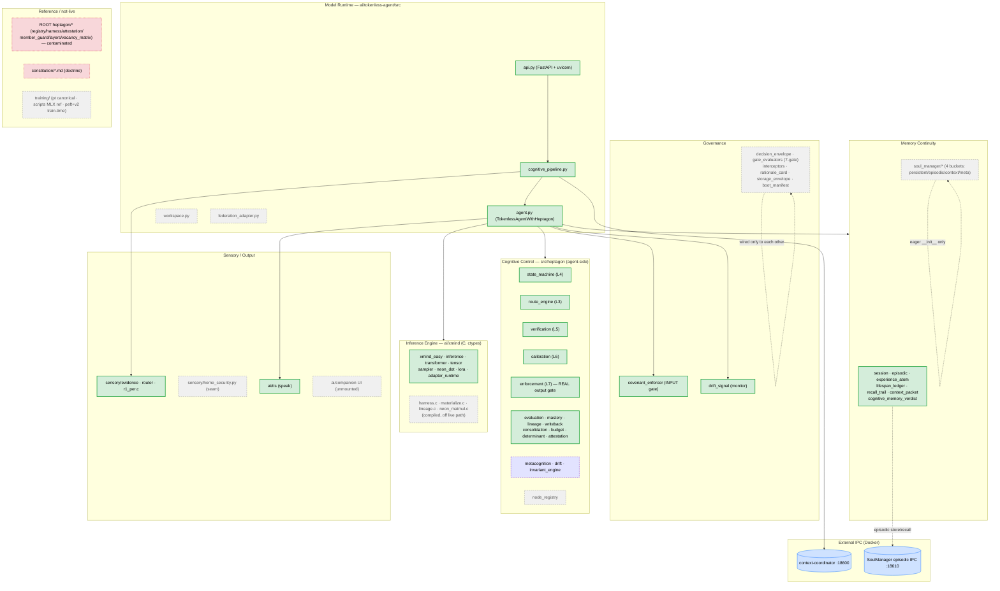
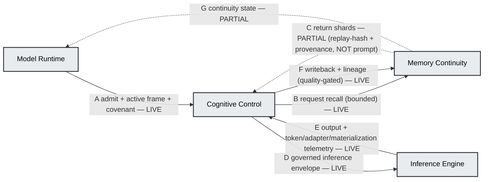
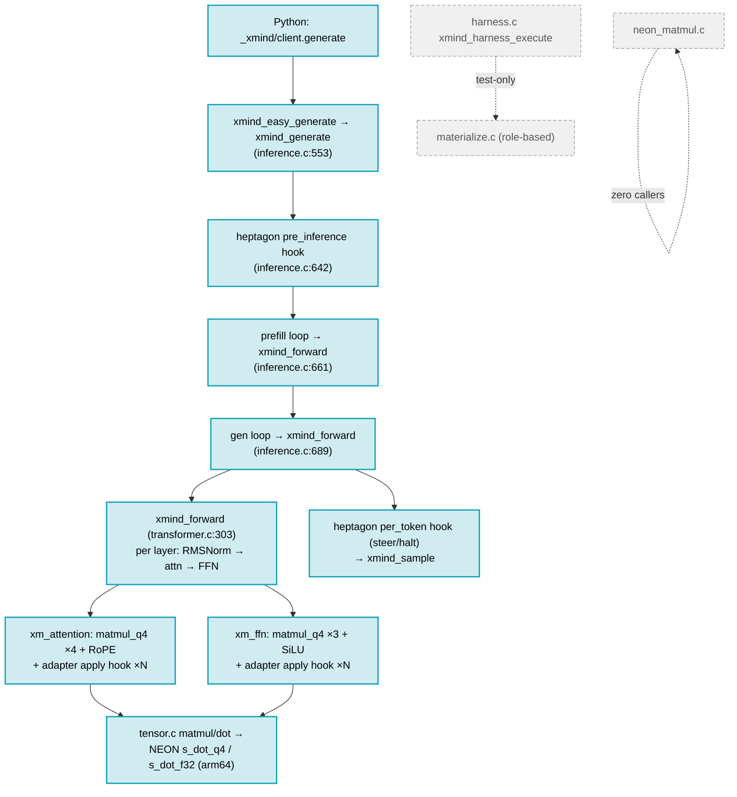
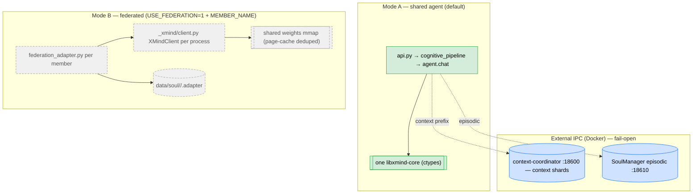

# models v7 — As-Built Wiring Map & Functional Process Flow (2026-06-04)

> **What this is.** An evidence-backed map of how `models v7/` is *actually* wired and how
> a request flows through it, traced from running code (not docs). Every "live" edge has a
> call-site `file:line`. Produced by four disjoint read-only code-tracers sweeping the whole
> tree against current HEAD (commits through `d6bf7ee`, incl. the B5–B9 edge-wiring work that
> post-dates the 2026-06-03 dead-code audit).
>
> **Source-of-truth order:** running code > test evidence > manifests > docs (per AGENTS.md).
> ADR-0001 / ADR-0002 are immutable and were read, not edited.
>
> **Relationship to other docs.** `../WIRING.md` is the *idealized* contract doc (how the
> substrate is *meant* to hang together) and the 2026-06-03 `DEAD_CODE_AUDIT` found it drifts
> /over-claims in places. **This doc is the as-built complement** — what executes on a turn,
> with honest DEFINED / IMPORTED / CALLED status. Where they disagree, this doc cites code.

---

## 0. How to read the diagrams (legend)

The central finding is that **intended wiring ≠ live wiring**. The architecture (ADR-0002 §4
foundation cycle, the 7-layer model, the FSM, the 7-gate "Council") is largely *defined*; a
narrower spine is actually *called on a turn*. Status is encoded in edge/box style:

| Style | Meaning |
|---|---|
| **Solid box / solid edge** (green) | **CALLED on the live chat turn** — has a runtime call-site `file:line` |
| **Dashed box / dashed edge** (grey) | **DEFINED / IMPORTED-ONLY scaffold** — exists, eager-imported or referenced, but no runtime caller on the turn |
| **Red dashed** | **Reference / contaminated** — ROOT `heptagon/`, named-member residue; not on any live path |
| **Blue box** | **External IPC dependency** (Docker daemon); fail-open |
| **`[[double box]]`** | Native C subsystem (detail in Appendix A) |

---

## 1. Disciplines applied ("invoke all skills" accounting)

Per AGENTS.md, the all-skills phrase is reported as **playbook disciplines applied** vs
**runtime tools called**, and project-specific skills are suppressed unless a domain binds them.

- **Router status (honest):** `atlas/infrastructure/scripts/route_intent.py` **could not run** —
  it loads `atlas/platform/systems/37_command_protocol/trigger_router.yaml`, which is **missing**
  (`FileNotFoundError`). The all-skills policy was therefore applied **manually** from the
  authority docs, not auto-routed. (Surfaced, not papered over.)
- **`playbook_applied_disciplines`** (the disciplines that actually governed this work):
  `architecture-honesty` (DEFINED/IMPORTED/CALLED), `wired-not-defined` (runtime trace before
  any "wired" claim), `find-before-create` (complement `WIRING.md`, don't duplicate),
  `spec-literal-verification` (read ADR-0001/0002 first; quoted §4 edges A–G verbatim),
  `source-of-truth-reconciliation` (code > tests > docs), `existing-repo-deep-audit`,
  `frontend-backend-dataflow` / `pipeline-connection-map-authoring`, `architecture-atlas` +
  `docs-architecture-diagram-sync` (this artifact), `cognitive-system-conformance` (intent-vs-live
  lens), `response-accuracy-corrective` + `truth-state-check` (no over-claim), and the
  heptagon **degraded-harness** rule (green pytest ≠ live-loop proof; trust src-first subprocess).
- **`tool_called_skills`** (runtime `Skill` tool invocations): **none** — this is an
  analysis-and-authoring task; the disciplines above are playbooks, not tool-callable skills.
  No destructive/setup/background/config-writing tool was run.

---

## 2. The live chat turn — master flow (the load-bearing diagram)

This is what actually executes for one `POST /v1/chat`. Outer wrapper = `cognitive_pipeline`
(sensory + context-prefix); inner = `agent.chat` (the L4–L7 cognitive loop). The streaming
endpoint `/v1/chat/stream` mirrors it, including the covenant gate (audit-fixed parity).

```mermaid
flowchart TD
    classDef live fill:#d4edda,stroke:#28a745,stroke-width:2px,color:#000;
    classDef gate fill:#fff3cd,stroke:#e0a800,stroke-width:2px,color:#000;
    classDef stub fill:#e2e3ff,stroke:#6610f2,stroke-dasharray:4 3,color:#000;
    classDef ext fill:#cfe2ff,stroke:#0d6efd,color:#000;
    classDef cengine fill:#d1ecf1,stroke:#17a2b8,stroke-width:2px,color:#000;
    classDef stop fill:#f8d7da,stroke:#dc3545,color:#000;

    client(["HTTP client"]) -->|"POST /v1/chat"| auth{"API key verify<br/>FAIL-CLOSED"}
    auth -->|"missing key → 503"| stopA(["refused"]):::stop
    auth -->|"ok"| io["voice-in / vision-in<br/>(fail-open)"]:::live
    io --> cov{"Covenant gate<br/>FAIL-CLOSED"}:::gate
    cov -->|"blocked → 422"| stopB(["withheld"]):::stop

    cov -->|"pass"| P_intero["interoceptive prefix"]:::live
    subgraph PIPE["cognitive_pipeline.execute  (outer wrapper)"]
        P_intero --> P_sens["sensory EvidenceEnvelope<br/>+ SensoryRouter.route"]:::live
        P_sens --> P_ctx[("context-coordinator IPC :18600<br/>context-shard PREFIX")]:::ext
        P_ctx --> P_call["run_in_executor → agent.chat"]:::live
    end
    P_call --> A_in

    subgraph AGENT["agent.chat  (L4..L7 cognitive loop)"]
        A_in["input_received → LISTENING (L4)"]:::live --> A_recall["memory recall (L3 reflex)<br/>jog_my_memory + episodic<br/>NOT injected into prompt"]:::live
        A_recall --> A_route["route classify (L3)<br/>logged, drives nothing"]:::live
        A_route --> A_gen{"exact-fact?"}
        A_gen -->|"yes"| A_ground["retrieval-GROUNDING<br/>LM bypassed"]:::live
        A_gen -->|"no"| A_xmind[["XMIND C engine — generate<br/>(Appendix A)"]]:::cengine
        A_ground --> A_l5
        A_xmind --> A_l5["L5 verify + evaluate<br/>advisory; crash → fail-closed"]:::live
        A_l5 --> A_l6["L6 calibrate — full_l6_cycle<br/>9 stages (mastery/lineage/writeback)"]:::live
        A_l6 --> A_l7{"L7 InvariantEnforcer.check_all<br/>HARD GATE — FAIL-CLOSED"}:::gate
        A_l7 -->|"hard-stop / crash"| stopC(["withheld"]):::stop
        A_l7 -->|"pass"| A_drift["governance DriftDetector signal"]:::live
        A_drift --> A_wb["writeback (quality-gated q≥0.3)<br/>+ record session turn"]:::live
        A_wb --> A_rec["emit records:<br/>Determinant + Materialization + layer"]:::live
        A_rec --> A_meta["metacognition triad<br/>understanding/innerstanding/overstanding"]:::stub
        A_meta --> A_att["continuity attestation — advance chain"]:::live
        A_att --> A_verdict["emit CognitiveMemoryVerdict"]:::live
        A_verdict --> A_reset["reset → IDLE"]:::live
    end

    A_reset --> prov["provenance assembly<br/>(hashes, memory_used, materialization_count)"]:::live
    prov --> resp(["ChatResponse"])
```

### 2.1 Ordered call chain with evidence

| # | Step | Site (`file:line`) | Posture / note |
|---|---|---|---|
| 1 | HTTP entry `/v1/chat` | `api.py:479` | endpoint |
| 2 | API-key verify | `api.py:214,226-235` | **fail-closed** (503 unless `TOKENLESS_DEV_MODE=1`) |
| 3 | voice-in / vision-in | `api.py:503-509` | fail-open |
| 4 | **Covenant gate** | `api.py:525-544` (stream `:591-610`) | **fail-closed**: unavailable→503, exception→422, blocked→422 — runs BEFORE any inference |
| 5 | Pipeline dispatch | `api.py:552` → `cognitive_pipeline.py` | outer wrapper |
| 6 | interoceptive prefix | `cognitive_pipeline.py:528` | live |
| 7 | sensory EvidenceEnvelope + route | `cognitive_pipeline.py:496-498`, perception prefix `:506-509`, D20 risk gate `:512-514` | perception→cognition seam (live) |
| 8 | context-shard PREFIX (IPC) | `cognitive_pipeline.py:323` → `context-coordinator:18600` | **external Docker daemon**; the ONLY memory that reaches the prompt |
| 9 | call into agent | `cognitive_pipeline.py:552` `run_in_executor(agent_chat_fn=_agent.chat)` | live |
| 10 | FSM `input_received` (IDLE→LISTENING) | `agent.py:866` | L4 (decorative — see §5) |
| 11 | memory recall (`_memory_recall`) | `agent.py:871` (ledger `:475`, episodic `:483`) | computed; **NOT prompt-injected** (`agent.py:460-498` docstring) |
| 12 | route classify | `agent.py:876` | L3; logged only |
| 13 | generate — grounding OR XMIND | `agent.py:882`→`:87-92` (ground) / `:162-163`→`_xmind_glue.py:40-52` (LM) | retrieval-grounding bypasses the LM for exact facts |
| 14 | L5 verify + evaluate | `agent.py:893` (verify), `:911` (evaluate) | advisory; a **crash** escalates to L7 as safety-fail |
| 15 | L6 calibrate (`full_l6_cycle`) | `agent.py:922` | 9 stages incl. mastery `:950`, lineage `:970`, writeback `:975` (transitive) |
| 16 | **L7 enforce** (`check_all`) | `agent.py:942`, hard-stop `:957`, exception `:962` | **fail-closed**: hard-stop or crash → response withheld |
| 17 | drift signal | `agent.py:984` (`governance.drift_signal`) | per-turn identity monitor (advisory) |
| 18 | writeback + session record | `agent.py:1004` (`_memory_writeback`), `:1005` | quality-gated (q≥0.3) |
| 19 | emit records | `agent.py:1008` determinant + materialization, `:1009` layer, `:1010` L6 engines | audit-trail (do not alter output bytes) |
| 20 | metacognition triad | `agent.py:1012` → `:638/:641/:649` | **STUB-backed** (real signal shape, placeholder logic) |
| 21 | continuity attestation | `agent.py:427` genesis, `:1018` advance | hash chain |
| 22 | memory verdict | `agent.py:1023` (`CognitiveMemoryVerdict`) | now emitted per turn |
| 23 | reset → IDLE | `agent.py:1030` | FSM forced reset |
| 24 | provenance → response | `api.py:563` `_core_turn_provenance` → `:576` `ChatResponse` | surfaces `memory_used`, `materialization_count` |

**Server entry exists:** `api.py:801-810` `main()` → `uvicorn.run(app, 127.0.0.1, 8091)`
under `__main__` (env-overridable). (The 2026-06-03 audit's "no server entrypoint" finding is
now resolved.)

---

## 3. Component / subsystem map (status-colored)

Neutral roles from ADR-0002 §3, with live status overlaid. Solid green = on the turn;
dashed grey = defined scaffold; red = reference/contaminated; blue = external IPC.

### 3.1 Subsystem inventory (status + evidence)

| Subsystem | Live spine (CALLED) | Scaffold / seam (DEFINED-only) | Key evidence |
|---|---|---|---|
| **Model Runtime** | `api.py`, `cognitive_pipeline.py`, `agent.py` | `workspace.py`, `federation_adapter.py` (no live importer) | `api.py:479,552`; `agent.py:842` |
| **Cognitive Control** | state_machine, route_engine, verification, evaluation, calibration, enforcement, mastery, lineage, writeback, consolidation, budget, determinant_record, attestation, layer_records | metacognition/drift/invariant (**stub-backed**), node_registry (imported-only) | `agent.py:866,876,893,922,942`; stubs `:638,641,649` |
| **Memory Continuity** | session, episodic, experience_atom, lifespan_ledger, recall_trail, memory_context_packet, cognitive_memory_verdict | `soul_manager/*` (Python class not called; consolidation/aes_gcm/framing dead) | `agent.py:871,1004,1023`; `soul_manager.py:44` |
| **Governance** | covenant_enforcer (input), drift_signal (monitor) | decision_envelope, gate_evaluators (7-gate Council), interceptors, rationale_card, storage_envelope, boot_manifest | `api.py:532`; scaffold eager-import via `governance/__init__` |
| **Inference Engine (C)** | xmind_easy, inference, transformer, tensor, sampler, neon_dot, lora, adapter_runtime, adapter_telemetry, weights_loader, gguf_reader, interp_registry/tokenless, heptagon.c, r1_per.c | harness.c, materialize.c, lineage.c (off-path); neon_matmul.c (dead); interp_llama/telemetry/writeback/context_bridge/xmind_http (not compiled) | Appendix A; `Makefile:63-74` |
| **Adapter (C, B9)** | lora.c → adapter_runtime (7 hot-path sites); adapter_ir.c + adapter_cache.c on the **load** path | — | `transformer.c:201-277`; `xmind_easy.c:294-296` |
| **Sensory** | evidence.py, router.py (via pipeline), r1_per.c | home_security.py (sensor-source seam) | `cognitive_pipeline.py:496-498`; `inference.c:601,638` |
| **Output / Accessibility** | tts (`speak`) | companion UI (HTTP client, never mounted) | `api.py:102-108,573` |
| **Training / Plasticity** | — (train-time only; no inference import) | `training/pt` (canonical), `scripts` (MLX ref), `peft` + `peft/v2` | `training/README.md:8-15` |
| **Contract headers** | net/pal/sec/xisc/xstore — compiled-against `-I`, POSIX shims supply impl | freestanding builds exclude shims | `Makefile:42-46,73` |
| **ROOT heptagon** | **none on live turn** | reference/contaminated (Ahki/Esther/Council… in `heptagon/registry.py`) | `heptagon/registry.py:14,48,…` |

---

## 4. ADR-0002 §4 foundation cycle — intent overlaid with live status

The spec defines a closed four-pillar cycle (edges A–G). Live tracing shows **A, B, D, E, F**
are real; **C and G are partial** (memory is computed but not injected into the prompt; only
provenance/replay-hash returns). Drawn honestly:

| Edge | Spec purpose (ADR-0002 §4) | Live status | Evidence |
|---|---|---|---|
| **A** Runtime→Control | admit request, create frame, initial governance | **LIVE** | covenant `api.py:532`; FSM `agent.py:866` |
| **B** Control→Memory | request context / recall expansion | **LIVE** | `agent.py:871` |
| **C** Memory→Control | return shards, anchors, contradictions, confidence | **PARTIAL** | recall computed but feeds replay-hash `agent.py:739` + provenance only, not the prompt |
| **D** Control→Inference | send governed inference envelope + context prefix | **LIVE** | `_xmind_glue.py:40-52`; context prefix from IPC `:18600` |
| **E** Inference→Control | output candidate + telemetry + materialization record | **LIVE** | `inference.c` → `agent.py:893` (L5) ; materialization `agent.py:500-548` |
| **F** Control→Memory | commit/reject writeback, lineage, retention | **LIVE** | `agent.py:1004` (quality-gated) |
| **G** Memory→Runtime | continuity state, recall readiness, health | **PARTIAL** | session continuity `agent.py:1005`; surfaced as provenance, not a full health contract |

---

## 5. Honest divergences (actual ≠ intended)

These are the highest-value findings — places where the *defined* architecture and the *live*
behavior diverge. They are drawn dashed/stub above; spelled out here so nothing reads as more
"live" than it is.

1. **FSM (L4) is decorative.** The docstring (`agent.py:846`) claims
   IDLE→LISTENING→ROUTING→GENERATING→REVIEWING→IDLE. The code fires only two events:
   `input_received` (`:866`) and `review` (`:892`) — and **`"review"` is not a valid transition
   from LISTENING**, so it is a silent no-op (`can_transition` guard `:454`). The turn ends with
   a forced `reset()` (`:1030`). **Real trajectory: IDLE → LISTENING → (reset) → IDLE.**
   ROUTING/GENERATING/**REVIEWING (the spec's correction junction) are never entered.**
2. **Metacognition triad fires but is stub-backed.** `_run_metacognitive_triad` (`:1012`) is
   genuinely called and produces a `lineage_level`, but all three backing modules
   (understanding/innerstanding/overstanding) are explicit local **stubs** — real signal shape,
   placeholder logic.
3. **Two memory systems; the elaborate one does not feed generation.** The Python tiers
   (recall_trail/episodic/experience_atom/lifespan_ledger) are computed and emitted as
   provenance + the deterministic replay hash, but are **deliberately NOT injected into the
   byte-LM prompt** (confabulation guard — see `CONFORMANCE_AUDIT_RESOLUTION` C1; the PSA-105
   hallucination lesson). The **only** memory that reaches the prompt is the **external
   `context-coordinator:18600` IPC** context-shard prefix. Exact facts are served by the
   **retrieval-grounding** path (LM bypassed).
4. **The "Council" governance chain is scaffold; the real output gate is elsewhere.** The
   7-`*GateEvaluator` chain + `decision_envelope`/`interceptors`/`rationale_card`/
   `storage_envelope`/`boot_manifest` are eager-imported and wired *to each other* but have **no
   caller on the turn.** The actual live output gate is `heptagon.enforcement.InvariantEnforcer`
   (agent-side, `agent.py:942`) — **not** a `governance/*` module. Live governance = covenant
   (input) + drift (monitor) + L7 (output).
5. **SoulManager (Python class) is not on the turn.** Superseded by in-agent `_sessions` +
   in-process memory tiers + episodic **IPC `:18610`**. The class defines 4 storage buckets
   (`persistent/episodic/context/meta`), distinct from the tech-pack's conceptual 5-layer
   volatility model (see `CONFORMANCE_AUDIT_RESOLUTION` D2).
6. **ROOT `heptagon/` is app-reference only and carries contamination.** No ROOT module is
   imported on the live turn (post-`a8a5dce` the neutral attestation core was absorbed
   agent-side into `src/heptagon/attestation.py`). The ROOT layer still names members
   (Ahki/Esther/Sarah/…/Council) in `heptagon/registry.py` and `governance/gate_evaluators.py` —
   but only in the non-live reference/scaffold layer. (Owner-sovereignty + neutral-taxonomy
   cleanup remains outstanding there.)
7. **Test-harness collision (degraded harness).** Two `heptagon` packages exist. **Production**
   runs the server from `src/` so the **agent-side** package wins (proven: `CouncilRank` absent,
   `state_machine`/`determinant_record` import). Under **`python3 -m pytest`** from repo root the
   **ROOT** package wins → `_HEPTAGON_AVAILABLE=False`, the whole cognitive layer degrades to
   `None`. **⇒ Green in-process pytest does NOT prove the live cognitive loop.** Verify via a
   src-first subprocess (as `tests/conftest.py` already does for the parity tests).
8. **C cognitive/materialization is mostly off-path.** `harness.c` (`xmind_harness_execute`) and
   `materialize.c` are reached only by a C **test**, not by `xmind_easy_generate`. The live
   cognitive intercept is the C heptagon hooks (`xmind_heptagon_pre_inference` /
   `_per_token`, `inference.c:642,695`). `neon_matmul.c` is **dead** (zero callers) though
   `neon_dot.c` is **live** on arm64.

---

## Appendix A — XMIND C inference engine (native generate path)

`libxmind-core.{dylib,so}` is loaded by Python via ctypes (`_xmind/client.py:102-121`). The
flat API (`xmind_easy.c` / `xmind_easy.h`) exposes init/generate/load_adapter/model_info/
adapter_ir. Forward pass: byte-level, RoPE **rotate-half** (tokenless convention, *not* llama
interleaved — `tensor.c:381-410`), Q4_0 quantized matmul, weight-tied logits; the llama
interpreter is deliberately **not registered** (`interp_registry.c:48-62`). pt-vs-C logit
parity is gated by `tests/test_pt_xmind_parity.py`.

Adapter load path (B9, additive): `xmind_easy_load_adapter` → `xmind_lora_load_safetensors`
→ `xmind_adapter_runtime_activate` (D36 admission governance — can **refuse**, returns -4) →
`adapter_ir.describe` → `cache_put` (`xmind_easy.c:273-296`). Weight materialization (B8) is
recorded at **load time** (`xmind_easy.c:151-158`) and consumed by `agent._emit_model_materialization`
(`agent.py:500-548`) — not per turn.

---

## Appendix B — Train → Stage → Serve pipeline

Canonical backend is PyTorch (`training/pt/`); the MLX `training/scripts/*` are reference
operator-math, not the active path (`training/README.md:8-15`). Both share one artefact
contract. **Note:** `serve_raw_model.py` is a stale BPE/SentencePiece-era server and **cannot**
consume the byte pipeline's `byte_vocab.json` — canonical serve is the XMIND C engine.

```mermaid
flowchart LR
    classDef step fill:#d4edda,stroke:#28a745,color:#000;
    classDef art fill:#fff,stroke:#666,color:#000;
    classDef stale fill:#f8d7da,stroke:#dc3545,stroke-dasharray:3 2,color:#000;

    corpus[("corpus/<id>/corpus.txt")]:::art --> t1["train_byte.py --run-id R"]:::step
    t1 --> r1[("runs/R/ckpt_step_*.safetensors<br/>+ model_config + byte_vocab")]:::art
    r1 --> pr["promote_base_model.py"]:::step
    pr --> b1[("bases/NAME/{weights,config,vocab,card,provenance}")]:::art
    r1 --> wb["wire_base.sh --from-run / --from-promoted"]:::step
    b1 --> wb
    wb --> staged[("training/{weights,model_config,byte_vocab}.*")]:::art
    staged --> tp["train_peft.py --method lora"]:::step
    tp --> stg[("adapters/staging/lora_<m>/")]:::art
    stg --> va["validate_adapter.py (8 gates)"]:::step
    va --> gtd[("adapters/gated/<m>/")]:::art
    gtd --> wa["wire_all.sh (discovers _xmind/personas/*.txt)"]:::step
    wa --> ptr[("data/soul/<m>/.adapter (path pointer)")]:::art
    staged --> serve[["XMIND C engine — xmind_easy_load_adapter"]]:::step
    ptr --> serve

    srm["serve_raw_model.py (BPE/SentencePiece)"]:::stale -. "cannot consume byte_vocab" .-> srm
```

PEFT registry: `omni_training_registry.json` defines **44** methods (**40 implemented** +2
extension +2 planned); `train_peft.py METHOD_REGISTRY` exposes **37 + `omni`**. `peft/v2`
(adapter_ir / adapter_genome_v2 / tournament_v2 / determinism / layer_plasticity /
sensory_plasticity) is **train-time only** — no `peft.v2` import exists under `ai/` or `_xmind/`.

---

## Appendix C — Federation (Mode A vs Mode B) + external IPC

**Hazard:** two `_xmind` packages exist (top-level federation vs `src/_xmind`). `agent.py`
inserts its own `src/` at `sys.path[0]` (`:34-35`) so `from _xmind import get_client` resolves
src-local; a consuming daemon that puts the substrate root ahead of `src/` would shadow one
with the other. Mode B is an **opt-in seam**, not on the default turn.

---

## Provenance

Traced 2026-06-04 by four disjoint read-only agents over the whole tree (≈205 `.py`, 68 `.c/.h`,
10 `.ts`, 9 `.sc`) against HEAD `d6bf7ee` + uncommitted B8/B9 working-tree edits to
`xmind_easy.c`/`agent.py`. Every "LIVE" edge carries a call-site `file:line`. Cross-checked
against `ADR-0001`/`ADR-0002` (§3 role map, §4 cycle), `WIRING.md`, `DEAD_CODE_AUDIT_2026-06-03.md`
(+ its 2026-06-04 correction), and `CONFORMANCE_AUDIT_RESOLUTION_2026-06-02.md`. Where this doc
and `WIRING.md` disagree, **this doc cites running code** per the source-of-truth order.
