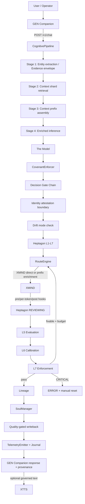
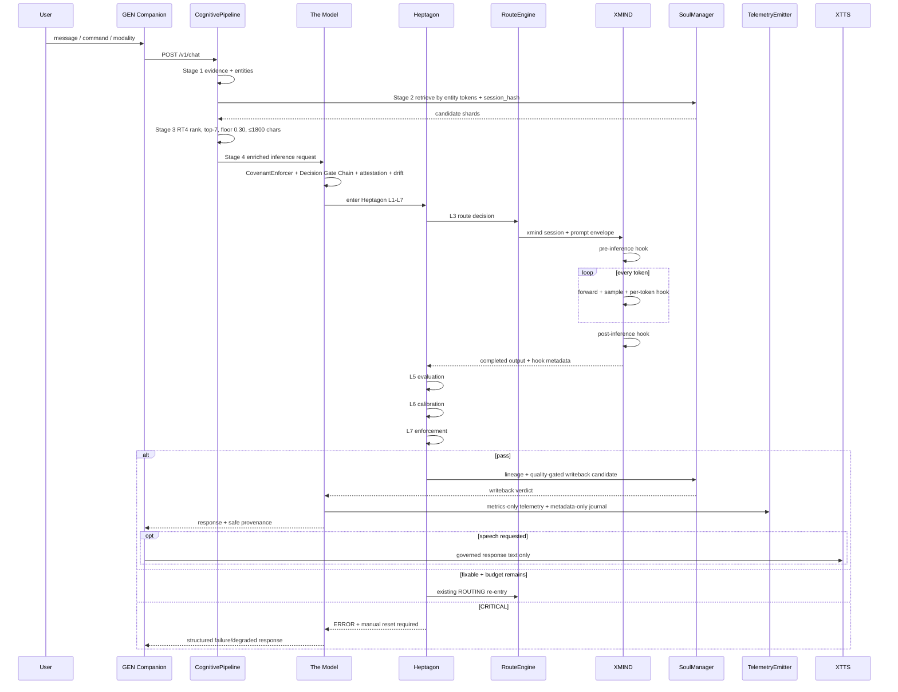

# GEN.OS Sovereignty Architecture — Technical Specification and Wiring Handoff

> GEN.OS · AI Subsystem · Cognitive Architecture Doctrine  
> Document type: coding-agent handoff / implementation spec  
> Target substrate: existing Unified Cognitive Model + Apex Profile  
> Taxonomy lock: **no label changes, no new agents, no new runtime identity**  
> Output date: 2026-05-29  
> Status: implementation-ready architecture spec

---

## 0. Executive Implementation Directive

The **Sovereignty Architecture** is the seven-layer cognitive doctrine placed above the existing **Apex Profile**. It does not replace Apex. It does not rename the build. It does not add a new model process. It does not create a new endpoint. It does not introduce a new agent class.

It turns the existing Apex model into a coding-ready, brain-grade cognitive framework by strengthening seven functions that already map onto the build:

```text
Level 1  Perception / Embodiment
Level 2  Attention / Workspace
Level 3  Memory / Continuity
Level 4  World Model / Simulation
Level 5  Deliberation / Planning
Level 6  Self-Correction / Calibration
Level 7  Sovereignty / Governance
```

These seven levels are **architecture doctrine**, not new runtime taxonomy.

The implementation must preserve the canonical Apex spine:

```text
Connection 1: The Model ⇄ Heptagon
Connection 2: Heptagon ⇄ XMIND
Connection 3: The Model ⇄ SoulManager
```

The existing runtime remains:

```text
GEN Companion
  → POST /v1/chat
    → CognitivePipeline
      → The Model
        → Heptagon
          → RouteEngine
            → XMIND
          → L5 Evaluation
          → L6 Calibration
          → L7 Enforcement
        → SoulManager
        → TelemetryEmitter
  → XTTS when speech output is requested
```

The coding agent should implement Sovereignty as **contract hardening, metadata discipline, routing intelligence, test coverage, and provenance wiring** inside existing modules.

Do **not** create:

```text
SovereigntyAgent
SovereigntyKernel
ApexKernel
LawCore
MindCore
SoulCore
CouncilAgent
ReflectionAgent
SupervisorAgent
MemoryAgent
OracleAgent
/seven-layer/chat
/sovereignty/chat
/apex/chat
fifth pillar
eighth Heptagon layer
sixth memory tier
new model process
new model identity
parallel daemon swarm
```

The seven Sovereignty levels are implemented through existing labels and code paths only.

---

## 1. Source Basis and Non-Negotiables

This handoff is derived from two existing project documents:

1. `UNIFIED_COGNITIVE_MODEL_SPEC.md`
2. `UNIFIED_COGNITIVE_MODEL_APEX_PROFILE.md` / `Pasted markdown(1).md`

The existing specification establishes that the model is a **single nameless neutral process** that owns governance, memory, context retrieval, routing, enforcement, adversarial checking, telemetry, and writeback orchestration. It also establishes the four pillars:

```text
Heptagon     Structure       Python + C       L1-L7 cognitive architecture
SoulManager  Identity        Python + C       Five-layer memory hierarchy
The Model    Law + Routing   Python           Single neutral process
XMIND        Intelligence    C                Forward pass and sampling
```

The Apex Profile establishes:

```text
one model process
four unchanged pillars
three hard connections
three recursion levels
two cascade directions
one endpoint
zero taxonomy drift
```

This document must therefore obey the following constraints:

```text
[LOCK-001] Do not rename The Model, Heptagon, XMIND, SoulManager, GEN Companion, XTTS, CognitivePipeline, RouteEngine, InvariantEnforcer, TelemetryEmitter, or GenesysAgentWithHeptagon.
[LOCK-002] Do not add a new public endpoint.
[LOCK-003] Do not add a new model identity.
[LOCK-004] Do not add a new public FSM state.
[LOCK-005] Do not add an eighth Heptagon layer.
[LOCK-006] Do not add a sixth SoulManager memory tier.
[LOCK-007] Do not move governance, memory, routing, or identity authority into XMIND.
[LOCK-008] Do not bypass Heptagon L1-L7 for any response path.
[LOCK-009] Do not persist raw user content verbatim.
[LOCK-010] Do not log raw session IDs.
[LOCK-011] Do not route around CovenantEnforcer or Decision Gate Chain.
[LOCK-012] Do not weaken privacy posture during recursive re-entry.
```

---

## 2. System Objective

The Sovereignty Architecture objective is:

```text
Maximize:
  governed correctness
  perception integrity
  active-context precision
  memory continuity
  counterfactual prediction
  risk-aware planning
  self-correction quality
  privacy preservation
  post-failure recoverability
  inspectable provenance

Subject to:
  one model process
  one primary endpoint
  four Apex pillars intact
  three Apex connections enforced
  Heptagon L1-L7 unchanged
  SoulManager five tiers unchanged
  XMIND intelligence-only boundary unchanged
  no raw user content in telemetry or journal
  P99 chat latency target < 5,000 ms
  current XMIND concurrency limitations respected
```

The high-level cognitive loop becomes:

```text
PERCEIVE
  → ATTEND
    → REMEMBER
      → SIMULATE
        → DELIBERATE
          → SELF-CORRECT
            → GOVERN
              → ANSWER / ACT / REFUSE / STORE
                → UPDATE MEMORY
                  → RECALIBRATE NEXT CYCLE
```

Mapped to existing build:

```text
GEN Companion / R1_PER
  → CognitivePipeline
    → SoulManager retrieval
      → The Model guardrails
        → Heptagon L1-L7
          → RouteEngine
            → XMIND
              → Heptagon L5/L6/L7
                → lineage
                  → SoulManager writeback
                    → TelemetryEmitter
                      → GEN Companion / XTTS
```

---

## 3. Architectural Summary

### 3.1 Apex Substrate

```text
┌─────────────────────────────────────────────────────────────────────┐
│                              The Model                              │
│  single neutral process; governance, routing, memory, enforcement    │
│                                                                     │
│   Connection 1: The Model ⇄ Heptagon                                │
│   Connection 2: Heptagon ⇄ XMIND                                    │
│   Connection 3: The Model ⇄ SoulManager                             │
│                                                                     │
│  GEN Companion is the interface.                                    │
│  XTTS is accessibility output only.                                  │
└─────────────────────────────────────────────────────────────────────┘
```

### 3.2 Sovereignty Overlay

```text
┌─────────────────────────────────────────────────────────────────────┐
│                    SOVEREIGNTY ARCHITECTURE                         │
│        seven-layer doctrine implemented inside existing build        │
│                                                                     │
│  Level 7  Sovereignty / Governance                                  │
│  Level 6  Self-Correction / Calibration                             │
│  Level 5  Deliberation / Planning                                   │
│  Level 4  World Model / Simulation                                  │
│  Level 3  Memory / Continuity                                       │
│  Level 2  Attention / Workspace                                     │
│  Level 1  Perception / Embodiment                                   │
│                                                                     │
└──────────────────────────────────────┬──────────────────────────────┘
                                       │ implemented through
                                       ▼
┌─────────────────────────────────────────────────────────────────────┐
│                         EXISTING APEX PROFILE                       │
│ The Model ⇄ Heptagon · Heptagon ⇄ XMIND · The Model ⇄ SoulManager   │
└─────────────────────────────────────────────────────────────────────┘
```

The coding agent should treat Sovereignty as **implementation contracts** over the existing files, not as new classes that own authority.

---

## 4. Seven-Level Contract Table

| Sovereignty Level | Brain-like function | Existing implementation surface | Primary output | Hard prohibition |
|---|---|---|---|---|
| **Level 1 — Perception / Embodiment** | Converts input into governed evidence | GEN Companion, R1_PER, `cognitive_pipeline.py` Stage 1, XTTS output boundary | Evidence envelope | Raw input may not bypass integrity, source, or scope checks |
| **Level 2 — Attention / Workspace** | Selects active context | Heptagon L1-L3, RT4, RouteEngine, Budget, register/session memory | Active cognitive frame | Do not flood context or ignore budget |
| **Level 3 — Memory / Continuity** | Retrieves and promotes durable continuity | SoulManager, `memory/session.py`, `memory/episodic.py`, `writeback.py`, `lineage.py` | Shards + writeback verdict | Do not store unearned or contradictory memory |
| **Level 4 — World Model / Simulation** | Predicts consequences and possible futures | XMIND, Heptagon L3-L5, RouteEngine, semantic/archival memory | Outcome map | Do not confuse simulation with fact |
| **Level 5 — Deliberation / Planning** | Chooses route, depth, and plan | RouteEngine, Budget, Verification, Consolidation, XMIND | Plan/path decision | Do not think forever or skip required planning |
| **Level 6 — Self-Correction / Calibration** | Evaluates, revises, redacts, rolls back | L5, L6, L7, CycleEvaluator, ParameterCalibrator, InvariantEnforcer | Correction verdict | Do not change governance authority |
| **Level 7 — Sovereignty / Governance** | Bounds all cognition | The Model, CovenantEnforcer, Decision Gate Chain, Drift Detection, Attestation, InvariantEnforcer | Allow / constrain / refuse / degrade / recover | No capability may outrank governance |

---

## 5. Complete Wiring Diagram

### 5.1 ASCII Wiring Diagram

```text
┌──────────────────────────────────────────────────────────────────────────────┐
│                                USER / OPERATOR                               │
└───────────────────────────────────┬──────────────────────────────────────────┘
                                    │
                                    ▼
┌──────────────────────────────────────────────────────────────────────────────┐
│                              GEN Companion                                   │
│ command-panel.tsx · agent-bridge.ts · action-trace.ts                         │
│                                                                              │
│ Sovereignty Level 1 ingress:                                                  │
│ - capture user message / modality                                             │
│ - attach timestamp                                                            │
│ - preserve source                                                             │
│ - display safe provenance only                                                │
└───────────────────────────────────┬──────────────────────────────────────────┘
                                    │ POST /v1/chat
                                    ▼
┌──────────────────────────────────────────────────────────────────────────────┐
│                            CognitivePipeline                                 │
│ ai/genesys-ai/src/cognitive_pipeline.py                                       │
│                                                                              │
│ Stage 1  Entity extraction                                                    │
│          Sovereignty Level 1: Evidence envelope                               │
│                                                                              │
│ Stage 2  Context shard retrieval                                               │
│          Sovereignty Level 2/3: retrieve candidate memory                      │
│                                                                              │
│ Stage 3  Context prefix assembly                                               │
│          Sovereignty Level 2: active frame, top-7, floor 0.30, ≤1800 chars     │
│                                                                              │
│ Stage 4  Enriched inference                                                    │
│          Sovereignty Level 4/5: RouteEngine → GenesysAgentWithHeptagon → XMIND │
│                                                                              │
│ Stage 5  Telemetry emission                                                    │
│          Sovereignty Level 6/7: metrics only                                  │
│                                                                              │
│ Stage 6  Journal event                                                         │
│          Sovereignty Level 3/7: metadata only                                 │
│                                                                              │
│ Stage 7  Return CognitiveTurn                                                  │
│          Safe response + safe provenance                                      │
└───────────────────────────────────┬──────────────────────────────────────────┘
                                    │
                                    ▼
┌──────────────────────────────────────────────────────────────────────────────┐
│                                  The Model                                    │
│ single nameless neutral process                                               │
│                                                                              │
│ Sovereignty Level 7 guardrail order:                                          │
│ 1. CovenantEnforcer                                                           │
│ 2. Decision Gate Chain                                                        │
│ 3. Identity attestation boundary                                              │
│ 4. Drift mode check                                                           │
│ 5. Heptagon L1-L7                                                             │
│ 6. L7 invariant verdict                                                       │
│ 7. writeback eligibility                                                      │
└───────────────────────────────────┬──────────────────────────────────────────┘
                                    │ Connection 1: The Model ⇄ Heptagon
                                    ▼
┌──────────────────────────────────────────────────────────────────────────────┐
│                                  Heptagon                                     │
│ L1 Ontology → L2 Schema → L3 Kernel → L4 Instrumentation → L5 Evaluation      │
│ → L6 Calibration → L7 Enforcement                                             │
│                                                                              │
│ L3 RouteEngine chooses:                                                       │
│ - XMIND direct                                                                │
│ - XMIND + memory prefix                                                       │
│ - memory-only response, still verified                                        │
│ - refusal / degraded path                                                     │
│                                                                              │
│ REVIEWING remains the recursive junction.                                     │
└───────────────────────────────────┬──────────────────────────────────────────┘
                                    │ Connection 2: Heptagon ⇄ XMIND
                                    ▼
┌──────────────────────────────────────────────────────────────────────────────┐
│                                    XMIND                                      │
│ freestanding C intelligence engine                                            │
│                                                                              │
│ xmind_heptagon_pre_inference()                                                │
│ xmind_forward()                                                               │
│ xmind_sample()                                                                │
│ xmind_heptagon_per_token()                                                    │
│ xmind_heptagon_post_inference()                                               │
│                                                                              │
│ Emits token timing, hook status, safety halt flag, lineage delta.             │
│ Does not own memory, governance, routing, identity, or authority.             │
└───────────────────────────────────┬──────────────────────────────────────────┘
                                    │ output returns to Heptagon L5/L6/L7
                                    ▼
┌──────────────────────────────────────────────────────────────────────────────┐
│                          Heptagon REVIEWING                                   │
│                                                                              │
│ L5 CycleEvaluator.record()                                                    │
│ L6 ParameterCalibrator.calibrate()                                             │
│ L7 InvariantEnforcer.check_all()                                               │
│                                                                              │
│ pass      → lineage + writeback                                               │
│ fixable   → bounded re-entry through existing ROUTING → GENERATING             │
│ violation → redact / rollback / reject                                        │
│ critical  → ERROR + manual reset                                              │
└───────────────────────────────────┬──────────────────────────────────────────┘
                                    │ Connection 3: The Model ⇄ SoulManager
                                    ▼
┌──────────────────────────────────────────────────────────────────────────────┐
│                                SoulManager                                    │
│ register → session → episodic → semantic → archival                           │
│                                                                              │
│ Retrieval: entity tokens + session hash only                                  │
│ Promotion: quality-gated, concept-bearing, contradiction-aware                │
│ Journal: metadata only                                                        │
│                                                                              │
│ lineage: understanding → innerstanding → overstanding                         │
└───────────────────────────────────┬──────────────────────────────────────────┘
                                    │
                                    ▼
┌──────────────────────────────────────────────────────────────────────────────┐
│                         TelemetryEmitter + Journal                            │
│ metrics only · structured metadata only · no raw session ID · no raw user text │
└───────────────────────────────────┬──────────────────────────────────────────┘
                                    │
                                    ▼
┌──────────────────────────────────────────────────────────────────────────────┐
│                              GEN Companion                                    │
│ response + safe provenance                                                    │
│ optional governed response text to XTTS                                        │
└───────────────────────────────────┬──────────────────────────────────────────┘
                                    │ optional governed response text
                                    ▼
┌──────────────────────────────────────────────────────────────────────────────┐
│                                   XTTS                                        │
│ accessibility speech synthesis only                                           │
└──────────────────────────────────────────────────────────────────────────────┘
```

### 5.2 Mermaid Wiring Diagram



### 5.3 Sequence Diagram



---

## 6. Runtime Data Records

The following records are allowed as **typed data records**, not new authorities, not agents, and not separate processes. They may be implemented as dataclasses, TypedDicts, Pydantic models, or plain dictionaries depending on the existing style of the target file.

### 6.1 `EvidenceEnvelope`

Purpose: convert raw input into governed evidence for Level 1.

Recommended location:

```text
ai/genesys-ai/src/cognitive_pipeline.py
```

Optional helper location if existing style supports it:

```text
ai/genesys-ai/src/heptagon/verification.py
```

Schema:

```python
class EvidenceEnvelope(TypedDict):
    turn_id: str
    session_hash: str
    source: Literal["gen_companion", "api", "file", "voice", "system"]
    modality: Literal["text", "voice", "image", "video", "file", "screen", "system"]
    created_at_ms: int
    raw_length: int
    entity_tokens: list[str]          # max existing entity limit unless changed by config
    integrity_hash: str               # hash of normalized input, never logged with raw text
    uncertainty_score: float          # 0.0 certain, 1.0 highly uncertain
    risk_class: Literal["low", "medium", "high", "blocked"]
    permitted_scope: list[str]        # e.g., ["route", "memory_retrieve", "generate"]
    pii_detected: bool
```

Rules:

```text
[EV-001] raw text may be used in-process for inference but may not be emitted in telemetry or journal.
[EV-002] integrity_hash is derived from normalized input and session_hash.
[EV-003] entity_tokens are the only user-message-derived values allowed across memory IPC.
[EV-004] risk_class may only restrict routing, never loosen it.
[EV-005] permitted_scope must be intersected with CovenantEnforcer and Decision Gate results.
```

### 6.2 `ActiveFrame`

Purpose: represent Level 2 attention/workspace without flooding context.

Recommended location:

```text
ai/genesys-ai/src/cognitive_pipeline.py
ai/genesys-ai/src/heptagon/route_engine.py
```

Schema:

```python
class ActiveFrame(TypedDict):
    turn_id: str
    session_hash: str
    user_intent: str                    # safe normalized intent label, not raw user text
    task_type: str
    risk_class: str
    authority_mode: str                 # RECOMMENDATION / CONDITIONAL / FULL
    shard_count: int
    selected_shard_ids: list[str]
    discarded_shard_count: int
    context_prefix_chars: int
    budget_remaining_ms: int
    token_budget_remaining: int
    route_candidates: list[str]
    invariant_pressure: list[str]
    degraded: bool
```

Rules:

```text
[AF-001] ActiveFrame must not include raw user text.
[AF-002] selected_shard_ids are identifiers/hashes, not raw memory content.
[AF-003] context_prefix_chars must be ≤ 1,800 unless existing config explicitly lowers it.
[AF-004] shard_count must be ≤ 7 after RT4 ranking.
[AF-005] route_candidates may include existing route names only.
```

### 6.3 `MemoryVerdict`

Purpose: determine whether retrieved or generated information may influence the turn or be persisted.

Recommended location:

```text
ai/genesys-ai/src/heptagon/writeback.py
ai/genesys-ai/src/heptagon/lineage.py
ai/genesys-ai/src/memory/session.py
ai/genesys-ai/src/memory/episodic.py
```

Schema:

```python
class MemoryVerdict(TypedDict):
    turn_id: str
    quality_score: float
    l7_passed: bool
    contradiction_detected: bool
    pii_safe: bool
    concept_bearing: bool
    write_journal: bool
    write_session: bool
    write_episodic: bool
    write_semantic: bool
    write_archival: bool
    blocked_reason: Optional[str]
```

Rules:

```text
[MV-001] journal metadata may be written if raw content is excluded.
[MV-002] episodic requires quality_score >= 0.30 and L7 pass.
[MV-003] semantic requires quality_score >= 0.30, concept_bearing true, no unresolved contradiction, and L7 pass.
[MV-004] archival requires existing consolidation/pruning path; do not write directly from generation.
[MV-005] unresolved contradiction blocks semantic and archival promotion.
```

### 6.4 `WorldState`

Purpose: support Level 4 simulation without pretending simulated possibilities are facts.

Recommended location:

```text
ai/genesys-ai/src/heptagon/route_engine.py
ai/genesys-ai/src/heptagon/verification.py
ai/genesys-ai/src/heptagon/evaluation.py
```

Schema:

```python
class WorldState(TypedDict):
    turn_id: str
    observed_facts: list[str]           # normalized summaries only
    inferred_facts: list[str]           # explicitly marked inferred
    unknowns: list[str]
    competing_hypotheses: list[str]
    possible_actions: list[str]
    predicted_outcomes: list[dict]
    risk_surface: list[str]
    confidence: float
    recommended_route: str
    simulation_required: bool
```

Rules:

```text
[WS-001] observed_facts must come from current request, verified memory, or explicit system state.
[WS-002] inferred_facts must be marked as inferred.
[WS-003] unknowns must not be suppressed when confidence is low.
[WS-004] predicted_outcomes are not memory facts.
[WS-005] WorldState may influence routing and deliberation depth but may not bypass governance.
```

### 6.5 `DeliberationRecord`

Purpose: support Level 5 planning and route selection without exposing private chain-of-thought.

Recommended location:

```text
ai/genesys-ai/src/heptagon/route_engine.py
ai/genesys-ai/src/heptagon/budget.py
ai/genesys-ai/src/heptagon/verification.py
```

Schema:

```python
class DeliberationRecord(TypedDict):
    turn_id: str
    selected_depth: int                 # 0-3 by default; 4 only if explicitly enabled by config
    route: str
    route_reason_code: str              # safe enum, not hidden chain text
    alternatives_considered_count: int
    budget_ms_before: int
    budget_ms_after: int
    token_budget_before: int
    token_budget_after: int
    reentry_allowed: bool
    reentry_count: int
    reentry_blocked_reason: Optional[str]
```

Rules:

```text
[DR-001] do not expose hidden reasoning text.
[DR-002] expose route_reason_code only.
[DR-003] depth must be risk/budget proportional.
[DR-004] recursive re-entry must use existing ROUTING → GENERATING → REVIEWING states.
[DR-005] reentry_count defaults to max 1 until XMIND singleton mutex and KV/cache constraints are resolved.
```

### 6.6 `CorrectionRecord`

Purpose: track Level 6 self-correction in REVIEWING.

Recommended location:

```text
ai/genesys-ai/src/heptagon/evaluation.py
ai/genesys-ai/src/heptagon/calibration.py
ai/genesys-ai/src/heptagon/enforcement.py
```

Schema:

```python
class CorrectionRecord(TypedDict):
    turn_id: str
    l5_metrics: dict
    l6_delta: dict
    l7_severity: Literal["INFO", "WARNING", "VIOLATION", "CRITICAL"]
    redaction_applied: bool
    rollback_applied: bool
    regeneration_attempted: bool
    regeneration_allowed: bool
    final_action: Literal["commit", "redact_commit", "reject", "manual_reset", "degraded_response"]
```

Rules:

```text
[CR-001] L6 may adjust sampler and routing parameters only inside existing bounded behavior.
[CR-002] L6 may not modify covenant, decision gates, constitutional constraints, identity doctrine, L7 definitions, memory tiers, or XMIND ownership boundary.
[CR-003] L7 CRITICAL is not a wording issue; it is a state issue and requires ERROR + manual reset.
[CR-004] redaction cannot weaken privacy posture.
```

### 6.7 `GovernanceVerdict`

Purpose: unify Level 7 allow/constrain/refuse/degrade/recover output as metadata.

Recommended location:

```text
ai/genesys-ai/src/heptagon/enforcement.py
ai/genesys-ai/src/heptagon/invariant_engine.py
ai/genesys-ai/src/heptagon/drift_detector.py
ai/genesys-ai/src/agent.py
```

Schema:

```python
class GovernanceVerdict(TypedDict):
    turn_id: str
    covenant_action: str
    gate_action: str
    l7_severity: str
    authority_mode: Literal["RECOMMENDATION", "CONDITIONAL", "FULL"]
    degraded: bool
    degraded_reason: Optional[str]
    drift_index: float
    allow_xmind: bool
    allow_memory_retrieval: bool
    allow_writeback: bool
    allow_xtts: bool
    final_decision: Literal["allow", "constrain", "refuse", "degrade", "manual_reset"]
```

Rules:

```text
[GV-001] allow_xmind is false on covenant hard stop, blocking decision gate, identity attestation fail, or L7 CRITICAL.
[GV-002] allow_writeback is false unless L7 passes or redaction produces a safe final output.
[GV-003] allow_xtts is true only for governed response text.
[GV-004] degraded must be visible to GEN Companion when present.
```

---

## 7. Level-by-Level Implementation Spec

## 7.1 Level 1 — Perception / Embodiment

### Purpose

Convert every inbound user/system/modal signal into governed evidence before it enters memory retrieval, routing, inference, or telemetry.

### Existing surfaces

```text
ai/companion/src/command-panel.tsx
ai/companion/src/agent-bridge.ts
ai/genesys-ai/src/cognitive_pipeline.py
ai/xmind/src/r1_per.c
ai/xmind/include/r1_per.h
ai/tts/tts_engine.c
```

### Required behavior

```text
1. GEN Companion sends request metadata with modality/source when available.
2. CognitivePipeline Stage 1 creates EvidenceEnvelope.
3. Entity extraction remains local, bounded, and non-blocking.
4. R1_PER verification must reject malformed/unverified opcode streams before CognitivePipeline.
5. EvidenceEnvelope may influence risk class and permitted scope.
6. Raw input remains in-process only for inference; never telemetry/journal.
7. XTTS remains output-only accessibility and receives only governed response text.
```

### Implementation tasks

#### `ai/genesys-ai/src/cognitive_pipeline.py`

Add or strengthen:

```text
_build_evidence_envelope(request, session_hash, turn_id)
_classify_input_risk(evidence)
_extract_entities(...) hard cap and stable normalization
```

Pseudo-code:

```python
def _build_evidence_envelope(request: ChatRequest, session_hash: str, turn_id: str) -> EvidenceEnvelope:
    normalized = normalize_for_hash(request.message)
    entities = _extract_entities(request.message)
    return {
        "turn_id": turn_id,
        "session_hash": session_hash,
        "source": request.source or "api",
        "modality": request.modality or "text",
        "created_at_ms": now_ms(),
        "raw_length": len(request.message or ""),
        "entity_tokens": entities,
        "integrity_hash": sha256(f"{session_hash}:{normalized}"),
        "uncertainty_score": estimate_uncertainty(request),
        "risk_class": classify_input_risk(request, entities),
        "permitted_scope": ["memory_retrieve", "route", "generate"],
        "pii_detected": pii_precheck(request.message),
    }
```

Do not emit `request.message` to logs, telemetry, journal, or memory IPC.

#### `ai/xmind/src/r1_per.c`

Strengthen:

```text
r1_per_verify must hard-fail malformed XCOG opcode streams.
Verification failure returns an error before CognitivePipeline Stage 1.
```

#### `ai/companion/src/agent-bridge.ts`

Attach safe request metadata only:

```ts
type CompanionRequestMeta = {
  source: "gen_companion";
  modality: "text" | "voice" | "file" | "screen";
  client_timestamp_ms: number;
  speech_requested?: boolean;
};
```

### Tests

```text
test_evidence_envelope_created_for_every_turn
test_evidence_envelope_contains_no_raw_text_in_telemetry
test_entity_tokens_only_cross_memory_boundary
test_r1_per_rejects_malformed_xcog
test_xtts_receives_only_governed_text
```

---

## 7.2 Level 2 — Attention / Workspace

### Purpose

Select the active cognitive frame. This prevents context flooding, memory overreach, and unbounded deliberation.

### Existing surfaces

```text
ai/genesys-ai/src/cognitive_pipeline.py
ai/genesys-ai/src/heptagon/route_engine.py
ai/genesys-ai/src/heptagon/budget.py
ai/genesys-ai/src/memory/session.py
ai/genesys-ai/src/memory/episodic.py
```

### Required behavior

```text
1. Retrieve memory candidates using entity tokens + session_hash only.
2. Score candidates with RT4.
3. Drop shards below 0.30.
4. Retain top 7 only.
5. Assemble context prefix ≤ 1,800 chars.
6. Create ActiveFrame metadata.
7. RouteEngine uses ActiveFrame to choose the shortest valid route.
```

### Implementation tasks

#### `ai/genesys-ai/src/cognitive_pipeline.py`

Strengthen Stage 2 and Stage 3:

```python
def _stage_retrieve_context(evidence: EvidenceEnvelope) -> list[MemoryShard]:
    return memory.retrieve(
        entities=evidence["entity_tokens"],
        session_hash=evidence["session_hash"],
        timeout_ms=200,
    )


def _stage_build_context_prefix(shards: list[MemoryShard]) -> tuple[str, ActiveFrame]:
    ranked = rt4_rank(shards)
    surviving = [s for s in ranked if s.salience >= 0.30]
    selected = surviving[:7]
    prefix = clamp(join_shards(selected), max_chars=1800)
    frame = build_active_frame(selected, len(ranked) - len(selected), len(prefix))
    return prefix, frame
```

### RouteEngine use

`RouteEngine.route(...)` must receive active-frame/budget inputs:

```python
route = RouteEngine.route(
    request=request,
    context_prefix=context_prefix,
    active_frame=active_frame,
    budget=budget.current(),
    degraded=governance_verdict["degraded"],
)
```

Recommended route behavior:

| Condition | RouteEngine outcome |
|---|---|
| CovenantEnforcer blocks | no XMIND route |
| Decision Gate blocking DENY | no XMIND route |
| no memory shards survive RT4 | XMIND direct |
| high-salience shards survive RT4 | XMIND + prefix enrichment |
| trivial query answerable from session memory | memory-only response, still through Heptagon verification |
| budget nearly exhausted | shortest valid governed route |
| degraded memory subsystem | XMIND direct with degraded flag |
| degraded enforcement layer | existing invariants only; no new rule additions |
| L7 CRITICAL | ERROR + manual reset |

### Tests

```text
test_rt4_drops_below_030
test_rt4_retains_top_7_only
test_context_prefix_clamped_to_1800
test_active_frame_contains_no_raw_user_text
test_route_engine_uses_budget_and_degraded_status
```

---

## 7.3 Level 3 — Memory / Continuity

### Purpose

Turn high-quality outputs into durable continuity while preventing memory poisoning.

### Existing surfaces

```text
ai/genesys-ai/src/memory/session.py
ai/genesys-ai/src/memory/episodic.py
ai/genesys-ai/src/heptagon/writeback.py
ai/genesys-ai/src/heptagon/lineage.py
ai/genesys-ai/src/heptagon/consolidation.py
ai/xmind/src/writeback.c
ai/xmind/src/lineage.c
```

### Required behavior

Memory tier rules remain:

```text
register   → per-token working buffer / active state only
session    → within-session continuity
episodic   → cross-session event memory after quality gate
semantic   → durable concept graph after quality + stability + contradiction checks
archival   → long-term compressed store through consolidation/pruning
journal    → structured metadata only
```

Promotion rules:

```text
journal: always allowed if metadata-only
episodic: quality ≥ 0.30 and L7 allows
semantic: quality ≥ 0.30, concept-bearing, non-contradictory, L7 allows
archival: existing consolidation/pruning path only
```

### Implementation tasks

#### `ai/genesys-ai/src/heptagon/writeback.py`

Add/strengthen:

```python
def build_memory_verdict(response, metrics, invariant_result, lineage) -> MemoryVerdict:
    quality = metrics.get("quality_score", min(
        metrics.get("relevance", 0),
        metrics.get("coherence", 0),
        metrics.get("completeness", 0),
    ))
    l7_passed = not invariant_result.critical and not invariant_result.blocking
    concept_bearing = detect_concept_bearing(response.text)
    contradiction = metrics.get("contradiction_detected", False)
    pii_safe = not invariant_result.pii_violation

    return {
        "turn_id": response.turn_id,
        "quality_score": quality,
        "l7_passed": l7_passed,
        "contradiction_detected": contradiction,
        "pii_safe": pii_safe,
        "concept_bearing": concept_bearing,
        "write_journal": True,
        "write_session": l7_passed,
        "write_episodic": quality >= 0.30 and l7_passed and pii_safe,
        "write_semantic": quality >= 0.30 and l7_passed and pii_safe and concept_bearing and not contradiction,
        "write_archival": False,  # consolidation only
        "blocked_reason": derive_memory_block_reason(...),
    }
```

#### `ai/genesys-ai/src/heptagon/lineage.py`

Ensure every completed output records:

```text
understanding  = response content summary / safe representation
innerstanding  = L5 metrics + L6 calibration result
overstanding   = L7 verdict + memory verdict
```

Do not promote `overstanding` unless L7 and memory gates pass.

#### `ai/xmind/src/writeback.c`

Strengthen C-level writeback boundary:

```text
Refuse content writeback below quality floor.
Allow metadata journal path only if raw content is excluded.
Preserve model-governed target bitmask.
Never decide target tier independently of The Model.
```

### Tests

```text
test_journal_metadata_written_without_raw_content
test_episodic_requires_quality_floor
test_semantic_requires_concept_and_no_contradiction
test_archival_not_written_directly_from_generation
test_lineage_records_understanding_innerstanding_overstanding
test_xmind_writeback_refuses_below_floor
```

---

## 7.4 Level 4 — World Model / Simulation

### Purpose

Allow the system to predict outcomes before acting when complexity, uncertainty, or risk rises.

This level does **not** create a new world-model daemon. It creates structured simulation metadata inside existing RouteEngine/Heptagon evaluation flow.

### Existing surfaces

```text
ai/genesys-ai/src/heptagon/route_engine.py
ai/genesys-ai/src/heptagon/verification.py
ai/genesys-ai/src/heptagon/evaluation.py
ai/genesys-ai/src/heptagon/budget.py
ai/genesys-ai/src/memory/episodic.py
ai/genesys-ai/src/heptagon/consolidation.py
```

### Required behavior

Simulation is required when any of the following are true:

```text
risk_class == high
authority_mode != FULL
retrieved memory contradicts current evidence
user request implies external action
uncertainty_score >= 0.60
task_type in {planning, debugging, architecture, safety, legal, medical, financial}
RouteEngine has multiple viable routes with non-trivial tradeoffs
```

Simulation is skipped when:

```text
request is trivial
governance blocks before route selection
budget cannot support simulation
memory-only answer is sufficient and verified
```

### WorldState construction

Pseudo-code:

```python
def maybe_build_world_state(active_frame, evidence, memory_context, budget) -> WorldState:
    required = should_simulate(active_frame, evidence, memory_context, budget)
    if not required:
        return empty_world_state(required=False)

    observed = extract_observed_facts(evidence, memory_context)
    inferred = infer_safe_implications(observed, active_frame)
    unknowns = identify_unknowns(observed, inferred, active_frame)
    actions = enumerate_valid_actions(active_frame, budget)
    outcomes = predict_route_outcomes(actions, active_frame, budget)

    return {
        "turn_id": active_frame["turn_id"],
        "observed_facts": observed,
        "inferred_facts": inferred,
        "unknowns": unknowns,
        "competing_hypotheses": build_hypotheses(observed, unknowns),
        "possible_actions": actions,
        "predicted_outcomes": outcomes,
        "risk_surface": derive_risks(outcomes),
        "confidence": estimate_world_confidence(observed, unknowns),
        "recommended_route": select_lowest_risk_valid_route(outcomes),
        "simulation_required": True,
    }
```

### Rules

```text
[WM-001] simulated outcomes are not facts.
[WM-002] inferred facts must be marked inferred.
[WM-003] unknowns must be preserved into route decision when material.
[WM-004] WorldState may reduce route authority but may not increase it beyond GovernanceVerdict.
[WM-005] WorldState is telemetry-safe only as counts/enums; do not emit raw content.
```

### Tests

```text
test_world_state_required_for_high_risk
test_world_state_skipped_for_trivial_query
test_inferred_facts_not_treated_as_observed
test_unknowns_preserved_when_confidence_low
test_world_state_cannot_override_governance_block
```

---

## 7.5 Level 5 — Deliberation / Planning

### Purpose

Choose the highest-authority valid path that fits risk, complexity, and budget.

### Existing surfaces

```text
ai/genesys-ai/src/heptagon/route_engine.py
ai/genesys-ai/src/heptagon/budget.py
ai/genesys-ai/src/heptagon/verification.py
ai/genesys-ai/src/heptagon/consolidation.py
ai/genesys-ai/src/agent.py
```

### Deliberation depth

Default depth policy:

| Depth | Use case | Behavior |
|---|---|---|
| 0 | trivial / low-risk | direct response or memory-only verified response |
| 1 | normal technical/task query | generate + verify |
| 2 | architecture/debugging/planning | plan summary + generate + review |
| 3 | high-risk or high-uncertainty | alternatives + compare + governed final |
| 4 | disabled by default | only under explicit config and strict budget |

### Required behavior

```text
1. Depth is selected by RouteEngine using risk, uncertainty, task type, memory contradiction, authority mode, and budget.
2. Depth selection must be represented by route_reason_code, not raw hidden reasoning.
3. Depth must not add new FSM states.
4. Re-entry must go through existing ROUTING → GENERATING → REVIEWING.
5. Default maximum re-entry count is 1 until XMIND singleton and cache issues are resolved.
```

### Implementation tasks

#### `ai/genesys-ai/src/heptagon/route_engine.py`

Add/strengthen:

```python
def select_deliberation_depth(active_frame, world_state, budget, governance_verdict) -> int:
    if governance_verdict["final_decision"] in {"refuse", "manual_reset"}:
        return 0
    if budget.ms_remaining < MIN_DELIBERATION_MS:
        return 0
    if active_frame["risk_class"] == "high":
        return min(3, budget.max_depth)
    if world_state.get("simulation_required"):
        return min(2, budget.max_depth)
    if active_frame["task_type"] in {"architecture", "debugging", "planning"}:
        return min(2, budget.max_depth)
    if active_frame["shard_count"] > 0:
        return 1
    return 0
```

Add route reason codes:

```text
ROUTE_DIRECT_LOW_RISK
ROUTE_MEMORY_ONLY_VERIFIED
ROUTE_XMIND_DIRECT
ROUTE_XMIND_PREFIX_ENRICHED
ROUTE_SIMULATION_REQUIRED
ROUTE_HIGH_RISK_DELIBERATION
ROUTE_BUDGET_SHORT_PATH
ROUTE_GOVERNANCE_REFUSAL
ROUTE_DEGRADED_SAFE_MODE
```

### Tests

```text
test_depth_zero_for_trivial_query
test_depth_two_for_architecture_query
test_depth_three_for_high_risk_uncertain_query
test_depth_reduced_when_budget_low
test_route_reason_code_exposes_no_hidden_chain
test_no_new_fsm_state_for_deliberation
```

---

## 7.6 Level 6 — Self-Correction / Calibration

### Purpose

Improve, redact, roll back, or refuse output before it commits to the user, memory, telemetry, or XTTS.

### Existing surfaces

```text
ai/genesys-ai/src/agent.py
ai/genesys-ai/src/heptagon/evaluation.py
ai/genesys-ai/src/heptagon/calibration.py
ai/genesys-ai/src/heptagon/enforcement.py
ai/genesys-ai/src/heptagon/budget.py
```

### Existing recursive junction

Do not add a new state.

Use existing:

```text
REVIEWING
  → L5 evaluates
  → L6 calibrates
  → L7 enforces
  → finalize, re-enter, redact, reject, degrade, or hard-stop
```

### Required behavior

```text
1. L5 records relevance, coherence, completeness, user_satisfaction, latency_ms, tokens_used, contradiction flags.
2. L6 computes bounded sampler/routing deltas.
3. L7 runs all invariants on completed output.
4. CRITICAL always transitions to ERROR + manual reset.
5. VIOLATION may redact, rollback, or reject per existing policy.
6. Re-entry is allowed only if all budget/governance conditions pass.
7. CorrectionRecord is emitted as metadata only.
```

### Implementation tasks

#### `ai/genesys-ai/src/heptagon/evaluation.py`

Add/strengthen:

```text
rolling baseline quality
quality drop > 15% flag
contradiction flag against retrieved shards/session memory
latency risk flag
requires_reentry flag only when issue is fixable and budget remains
```

#### `ai/genesys-ai/src/heptagon/calibration.py`

Keep bounded sampler changes only:

```text
temperature
top_p
max_new_tokens
repetition penalty
routing preference under budget
sampler rollback state
```

Never modify:

```text
Constitutional Constraints
Covenant rules
Decision Gate order
identity doctrine
L7 invariant definitions
memory tier definitions
XMIND ownership boundary
```

#### `ai/genesys-ai/src/heptagon/enforcement.py`

Severity behavior:

```text
INFO       → log only
WARNING    → log + annotate
VIOLATION  → rollback, redact, or reject per policy
CRITICAL   → ERROR + manual reset
```

### Re-entry gate

Pseudo-code:

```python
def can_reenter(metrics, invariant_result, budget, governance_verdict, xmind_status, reentry_count):
    if governance_verdict["covenant_action"] in {"hard_stop", "block"}:
        return False
    if governance_verdict["gate_action"] == "DENY":
        return False
    if invariant_result.critical:
        return False
    if xmind_status.singleton_busy:
        return False
    if reentry_count >= 1:
        return False
    if not budget.can_reenter():
        return False
    if not metrics.requires_reentry:
        return False
    if invariant_result.pii_violation and invariant_result.redaction_sufficient:
        return False
    return True
```

### Tests

```text
test_reviewing_runs_l5_l6_l7_for_every_turn
test_l7_critical_transitions_error_manual_reset
test_reentry_uses_existing_route_generate_reviewing
test_reentry_blocked_on_covenant_block
test_reentry_blocked_when_xmind_busy
test_l6_cannot_modify_doctrine_or_invariants
```

---

## 7.7 Level 7 — Sovereignty / Governance

### Purpose

Bound every act of cognition. No capability outranks governance.

### Existing surfaces

```text
The Model
CovenantEnforcer
Decision Gate Chain
ai/genesys-ai/src/heptagon/drift_detector.py
ai/genesys-ai/src/heptagon/invariant_engine.py
ai/genesys-ai/src/heptagon/enforcement.py
ai/genesys-ai/src/agent.py
```

### Required behavior

Governance order:

```text
1. CovenantEnforcer
2. Decision Gate Chain
3. Identity attestation boundary
4. Drift mode check
5. Heptagon L1-L7
6. L7 invariant result
7. authority/degraded/writeback/XTTS verdict
```

Authority modes remain:

```text
RECOMMENDATION → CONDITIONAL → FULL
```

No new authority labels.

### Governance rules

```text
[SOV-001] Covenant hard-stop prevents XMIND call.
[SOV-002] Decision Gate blocking DENY prevents XMIND call.
[SOV-003] Identity attestation failure quarantines/blocks as existing policy requires.
[SOV-004] DriftIndex >= 0.30 alerts.
[SOV-005] DriftIndex >= 0.60 restricts to CONDITIONAL.
[SOV-006] Failure to recover after observation restricts to RECOMMENDATION and triggers reconstitution.
[SOV-007] CRITICAL L7 result requires ERROR + manual reset.
[SOV-008] Degraded mode must be visible in safe provenance.
[SOV-009] No subsystem inherits another subsystem's authority.
[SOV-010] No recursive pass may weaken privacy posture.
```

### Implementation tasks

#### `ai/genesys-ai/src/agent.py`

Strengthen `GenesysAgentWithHeptagon` lifecycle:

```text
Ensure every chat turn enters FSM.
Ensure governance executes before RouteEngine chooses XMIND path.
Ensure REVIEWING is the only recursive junction.
Ensure CRITICAL forces ERROR and manual reset.
Ensure degraded flag propagates to CognitiveTurn and GEN Companion.
```

#### `ai/genesys-ai/src/heptagon/drift_detector.py`

Strengthen:

```text
DriftIndex rolling calculation.
Alert at 0.30.
Restrict to CONDITIONAL at 0.60.
Demote to RECOMMENDATION after failed observation window.
Record drift observation as metrics only.
```

#### `ai/genesys-ai/src/heptagon/invariant_engine.py` and `enforcement.py`

Strengthen:

```text
All 12 invariants run on completed output.
PII leakage redacts at VIOLATION.
Safety/identity/covenant criticals hard stop.
Writeback blocked when L7 not satisfied.
```

### Tests

```text
test_covenant_block_prevents_xmind_call
test_decision_gate_deny_prevents_xmind_call
test_attestation_failure_quarantines_or_blocks
test_drift_030_alert
test_drift_060_conditional
test_failed_observation_recommendation_reconstitution
test_degraded_flag_visible_to_gen_companion
test_no_subsystem_inherits_authority
```

---

## 8. End-to-End Runtime Algorithm

This is the target algorithm for `/v1/chat`. It uses existing names and existing state labels.

```python
async def chat(request):
    # Existing endpoint: POST /v1/chat
    # Existing process: The Model

    turn_id = new_turn_id()
    session_hash = sha256(request.session_id)

    # Level 1: Perception / Embodiment
    evidence = CognitivePipeline._build_evidence_envelope(
        request=request,
        session_hash=session_hash,
        turn_id=turn_id,
    )

    # Stage 1 remains entity extraction.
    entities = evidence["entity_tokens"]

    # Level 7 pre-inference governance.
    covenant = CovenantEnforcer.enforce(request)
    if covenant.action in {"hard_stop", "block"}:
        return structured_block(turn_id, session_hash, covenant)

    decision = DecisionEnvelope.from_request(request, evidence=evidence)
    gate = GateChainExecutor.evaluate(decision)
    if gate.blocked:
        return structured_rejection(turn_id, session_hash, gate)

    attestation = check_identity_attestation_if_required()
    if attestation.blocked:
        return structured_quarantine(turn_id, session_hash, attestation)

    drift = DriftDetector.current()
    authority_mode = authority_from_drift(drift)

    governance = build_governance_verdict(
        turn_id=turn_id,
        covenant=covenant,
        gate=gate,
        attestation=attestation,
        drift=drift,
        authority_mode=authority_mode,
    )

    # Level 2/3: Attention + Memory retrieval.
    shards = CognitivePipeline._stage_retrieve_context(evidence)
    context_prefix, active_frame = CognitivePipeline._stage_build_context_prefix(shards)
    active_frame["authority_mode"] = governance["authority_mode"]
    active_frame["degraded"] = governance["degraded"]

    # Existing Heptagon lifecycle.
    fsm.transition("LISTENING")
    TraceRecord.emit_safe(turn_id, state="LISTENING")

    fsm.transition("PROCESSING")
    heptagon.L1.validate(evidence)
    heptagon.L2.validate(active_frame)

    # Level 4: World model / simulation if required.
    world_state = maybe_build_world_state(
        active_frame=active_frame,
        evidence=evidence,
        memory_context=shards,
        budget=budget.current(),
    )

    # Level 5: Deliberation / planning through RouteEngine.
    fsm.transition("ROUTING")
    depth = RouteEngine.select_deliberation_depth(
        active_frame=active_frame,
        world_state=world_state,
        budget=budget.current(),
        governance_verdict=governance,
    )
    route = RouteEngine.route(
        request=request,
        context_prefix=context_prefix,
        active_frame=active_frame,
        world_state=world_state,
        depth=depth,
        budget=budget.current(),
        governance_verdict=governance,
    )

    if route.no_xmind:
        response = route.memory_or_refusal_response
    else:
        fsm.transition("GENERATING")
        response = await GenesysAgentWithHeptagon.chat(
            enriched_message=context_prefix + request.message,
            route=route,
            depth=depth,
        )

    # Level 6: Self-correction / calibration.
    fsm.transition("REVIEWING")
    metrics = CycleEvaluator.record(
        latency_ms=response.latency_ms,
        response=response.text,
        query=request.message,
        active_frame=active_frame,
        world_state=world_state,
    )
    sampler_delta = ParameterCalibrator.calibrate(metrics)
    invariant_result = InvariantEnforcer.check_all(response.text)

    correction = build_correction_record(metrics, sampler_delta, invariant_result)

    if invariant_result.critical:
        fsm.transition("ERROR")
        return manual_reset_required(turn_id, session_hash, invariant_result)

    if invariant_result.violation:
        response = InvariantEnforcer.redact_or_rollback(response, sampler_delta)

    reentry_count = 0
    if can_reenter(metrics, invariant_result, budget.current(), governance, xmind_status(), reentry_count):
        reentry_count += 1
        fsm.transition("ROUTING")
        route = RouteEngine.route(request, context_prefix, active_frame, world_state, depth, budget.current(), governance)
        fsm.transition("GENERATING")
        response = await GenesysAgentWithHeptagon.chat(
            enriched_message=context_prefix + request.message,
            route=route,
            depth=depth,
        )
        fsm.transition("REVIEWING")
        metrics = CycleEvaluator.record(...)
        sampler_delta = ParameterCalibrator.calibrate(metrics)
        invariant_result = InvariantEnforcer.check_all(response.text)
        if invariant_result.critical:
            fsm.transition("ERROR")
            return manual_reset_required(turn_id, session_hash, invariant_result)
        if invariant_result.violation:
            response = InvariantEnforcer.redact_or_rollback(response, sampler_delta)

    # Level 3 writeback, after Level 6/7 pass.
    lineage = Lineage.record(
        turn_id=turn_id,
        understanding=safe_understanding(response),
        innerstanding=metrics,
        overstanding=invariant_result,
    )

    memory_verdict = Writeback.build_memory_verdict(
        response=response,
        metrics=metrics,
        invariant_result=invariant_result,
        lineage=lineage,
    )
    Writeback.commit(response=response, lineage=lineage, verdict=memory_verdict)

    # Metrics only.
    TelemetryEmitter.emit_metrics_only(
        turn_id=turn_id,
        latency_ms=response.latency_ms,
        shard_count=active_frame["shard_count"],
        deliberation_depth=depth,
        degraded=governance["degraded"],
        route_reason_code=route.reason_code,
        writeback_mask=safe_writeback_mask(memory_verdict),
    )
    Journal.emit_structured_turn_record(
        turn_id=turn_id,
        latency_ms=response.latency_ms,
        shard_count=active_frame["shard_count"],
        response_length=len(response.text),
        degraded=governance["degraded"],
        flags=safe_pipeline_flags(...),
    )

    fsm.transition("IDLE")
    TraceRecord.emit_safe(turn_id, state="IDLE")

    return CognitiveTurn.from_response(
        response=response,
        session_hash=session_hash,
        turn_id=turn_id,
        provenance=safe_provenance(...),
    )
```

---

## 9. Module-by-Module Coding Handoff

## 9.1 `ai/genesys-ai/src/cognitive_pipeline.py`

### Current role

Seven-stage turn driver.

### Sovereignty changes

```text
[CP-001] Add EvidenceEnvelope creation in Stage 1.
[CP-002] Ensure entity extraction remains bounded, stable, and local.
[CP-003] Stage 2 retrieves memory using entity tokens + session hash only.
[CP-004] Stage 2 hard timeout should observe existing memory retrieval budget.
[CP-005] Stage 3 builds ActiveFrame and clamps prefix ≤ 1,800 chars.
[CP-006] Stage 4 passes ActiveFrame/WorldState/DeliberationRecord metadata to existing agent call where supported.
[CP-007] Stage 5 telemetry emits metrics only.
[CP-008] Stage 6 journal emits metadata only.
[CP-009] Stage 7 returns CognitiveTurn with safe provenance.
```

### Do not

```text
Do not add Stage 8.
Do not persist raw user message.
Do not transmit raw user message over memory IPC.
Do not block response path on telemetry/journal.
```

## 9.2 `ai/genesys-ai/src/agent.py`

### Current role

`GenesysAgentWithHeptagon` wraps base agent lifecycle with Heptagon FSM.

### Sovereignty changes

```text
[AG-001] Ensure every turn drives IDLE → LISTENING → PROCESSING → ROUTING → GENERATING → REVIEWING → IDLE.
[AG-002] Ensure REVIEWING is the only recursive junction.
[AG-003] Carry safe per-turn records through existing call path.
[AG-004] Propagate degraded and authority_mode to CognitiveTurn provenance.
[AG-005] Ensure L7 CRITICAL transitions to ERROR and requires manual reset.
[AG-006] Prevent acceptance of next request while FSM is ERROR.
```

### Do not

```text
Do not add SovereigntyAgent.
Do not add a new public FSM state.
Do not bypass CovenantEnforcer or Decision Gate Chain.
```

## 9.3 `ai/genesys-ai/src/heptagon/route_engine.py`

### Current role

L3 routing decision mechanism.

### Sovereignty changes

```text
[RE-001] Consume ActiveFrame.
[RE-002] Consume WorldState when simulation is required.
[RE-003] Select deliberation depth.
[RE-004] Emit route_reason_code.
[RE-005] Select XMIND direct / XMIND prefix / memory-only / refusal / degraded path.
[RE-006] Reject route if budget insufficient.
[RE-007] Respect authority mode and degraded mode.
[RE-008] Never route around pre-inference governance.
```

### Do not

```text
Do not create a separate router daemon.
Do not route to XMIND when governance denies.
Do not use raw hidden reasoning in route provenance.
```

## 9.4 `ai/genesys-ai/src/heptagon/budget.py`

### Current role

Token + compute budget.

### Sovereignty changes

```text
[BU-001] Add budget helpers for simulation and deliberation depth.
[BU-002] Add can_reenter() gate.
[BU-003] Track reentry_count per turn.
[BU-004] Enforce default max reentry_count = 1.
[BU-005] Decrease depth under latency pressure.
[BU-006] Prefer shorter governed response over longer risky response.
```

### Do not

```text
Do not permit recursion when latency budget is nearly exhausted.
Do not permit parallel recursive inference until XMIND singleton mutex is fixed.
```

## 9.5 `ai/genesys-ai/src/heptagon/evaluation.py`

### Current role

L5 cross-cycle quality tracking.

### Sovereignty changes

```text
[EVL-001] Track relevance, coherence, completeness, user_satisfaction, latency_ms, tokens_used.
[EVL-002] Track quality_score.
[EVL-003] Track contradiction against retrieved memory/session context.
[EVL-004] Flag quality drop > 15% against baseline.
[EVL-005] Emit requires_reentry only when issue is fixable and budget remains.
[EVL-006] Feed L6, but do not mutate parameters directly.
```

## 9.6 `ai/genesys-ai/src/heptagon/calibration.py`

### Current role

L6 calibration.

### Sovereignty changes

```text
[CAL-001] Keep sampler tuning bounded.
[CAL-002] Use existing 8-stage cycle.
[CAL-003] Roll back on VIOLATION when required.
[CAL-004] Prefer next-cycle improvement unless current output cannot be accepted.
[CAL-005] Emit safe l6_delta metadata.
```

### Do not

```text
Do not modify Constitutional Constraints.
Do not modify Covenant rules.
Do not modify Decision Gate order.
Do not modify identity doctrine.
Do not modify L7 invariant definitions.
Do not modify memory tier definitions.
Do not modify XMIND ownership boundary.
```

## 9.7 `ai/genesys-ai/src/heptagon/enforcement.py`

### Current role

L7 invariant runtime.

### Sovereignty changes

```text
[ENF-001] Run all 12 invariants on completed output.
[ENF-002] Redact PII leakage at VIOLATION severity.
[ENF-003] Hard-stop CRITICAL severity.
[ENF-004] Prevent writeback when enforcement is not satisfied.
[ENF-005] Produce GovernanceVerdict and CorrectionRecord inputs.
```

## 9.8 `ai/genesys-ai/src/heptagon/verification.py`

### Current role

L3 per-response gate.

### Sovereignty changes

```text
[VER-001] Verify memory-only responses still pass Heptagon verification.
[VER-002] Validate WorldState observed/inferred/unknown separation.
[VER-003] Validate route reason codes.
[VER-004] Validate evidence scope before routing.
```

## 9.9 `ai/genesys-ai/src/heptagon/drift_detector.py`

### Sovereignty changes

```text
[DRIFT-001] Maintain DriftIndex.
[DRIFT-002] Alert at DriftIndex ≥ 0.30.
[DRIFT-003] Restrict to CONDITIONAL at DriftIndex ≥ 0.60.
[DRIFT-004] Restrict to RECOMMENDATION after failed observation window.
[DRIFT-005] Emit drift metrics only.
```

## 9.10 `ai/genesys-ai/src/heptagon/writeback.py`

### Sovereignty changes

```text
[WB-001] Build MemoryVerdict after L5/L6/L7.
[WB-002] Journal metadata always.
[WB-003] Episodic only if quality ≥ 0.30 and L7 allows.
[WB-004] Semantic only if quality ≥ 0.30, concept-bearing, non-contradictory, and L7 allows.
[WB-005] Archival only through consolidation/pruning.
[WB-006] Never write raw user content verbatim.
```

## 9.11 `ai/genesys-ai/src/heptagon/lineage.py`

### Sovereignty changes

```text
[LIN-001] Record understanding → innerstanding → overstanding every completed output.
[LIN-002] Tie lineage state to MemoryVerdict.
[LIN-003] Do not promote overstanding unless L7 and quality gates pass.
[LIN-004] Use lineage hash chain for continuity checks.
```

## 9.12 `ai/genesys-ai/src/heptagon/consolidation.py`

### Sovereignty changes

```text
[CON-001] Prune low-value semantic noise.
[CON-002] Promote to archival only through existing consolidation path.
[CON-003] Block unresolved contradiction from semantic/archival promotion.
[CON-004] Preserve compressed durable memory.
```

## 9.13 `ai/genesys-ai/src/memory/session.py`

### Sovereignty changes

```text
[MS-001] Session memory must evict on reset/shutdown as existing design requires.
[MS-002] Session memory may support active-frame continuity.
[MS-003] Session memory must not persist raw user content verbatim.
```

## 9.14 `ai/genesys-ai/src/memory/episodic.py`

### Sovereignty changes

```text
[ME-001] Episodic writes require MemoryVerdict.write_episodic.
[ME-002] Episodic TTL must be respected.
[ME-003] Contradiction tags should be preserved for L5/L7 evaluation.
```

## 9.15 `ai/xmind/src/inference.c`

### Sovereignty changes

```text
[XINF-001] Guarantee pre-inference hook fires before token generation.
[XINF-002] Guarantee per-token hook fires for every generated token.
[XINF-003] Guarantee post-inference hook fires before completed output is returned.
[XINF-004] Preserve single-threaded inference until mutex is implemented.
[XINF-005] Return hook failure status to model process.
```

## 9.16 `ai/xmind/src/heptagon.c`

### Sovereignty changes

```text
[XH-001] Validate model identity anchors/schema at pre-inference hook.
[XH-002] Record token-level L3/L4/L5 signals.
[XH-003] Set safety halt flag on L7 CRITICAL.
[XH-004] Never own governance decisions.
```

## 9.17 `ai/xmind/src/writeback.c`

### Sovereignty changes

```text
[XWB-001] Preserve model-governed target bitmask.
[XWB-002] Refuse content writeback below quality floor.
[XWB-003] Allow metadata journal path if raw content excluded.
[XWB-004] Never select persistent tier independently.
```

## 9.18 `ai/xmind/src/lineage.c`

### Sovereignty changes

```text
[XLIN-001] Preserve 256-delta ring discipline.
[XLIN-002] Record domain/mastery deltas.
[XLIN-003] Feed model-level lineage without authority escalation.
```

## 9.19 `ai/companion/src/action-trace.ts`

### Sovereignty changes

```text
[AT-001] Show safe provenance.
[AT-002] Show heptagon_active.
[AT-003] Show shard_count.
[AT-004] Show route_reason_code if developer mode allows.
[AT-005] Show degraded status.
[AT-006] Hide raw internals.
```

## 9.20 `ai/companion/src/command-panel.tsx`

### Sovereignty changes

```text
[CPANEL-001] Display response.
[CPANEL-002] Display safe provenance summary.
[CPANEL-003] Display degraded flag clearly.
[CPANEL-004] Never show raw session ID.
[CPANEL-005] Never show private enforcement internals.
```

## 9.21 `ai/companion/src/agent-bridge.ts`

### Sovereignty changes

```text
[BRIDGE-001] Add safe request metadata: source, modality, client timestamp, speech_requested.
[BRIDGE-002] Preserve retry/backoff.
[BRIDGE-003] Never send memory internals to UI.
```

## 9.22 `ai/tts/tts_engine.c`

### Sovereignty changes

```text
[TTS-001] No governance changes.
[TTS-002] XTTS receives only approved response text.
[TTS-003] Speech output path must not bypass The Model.
```

---

## 10. API Surface

### 10.1 No new endpoint

Keep:

```text
POST /v1/chat
GET  /v1/health
GET  /v1/info
```

### 10.2 Optional response metadata extension

The response may include safe provenance. Do not include hidden reasoning or raw internals.

```json
{
  "turn_id": "...",
  "response": "...",
  "latency_ms": 0,
  "degraded": false,
  "provenance": {
    "heptagon_active": true,
    "shard_count": 0,
    "memory_used": false,
    "route_reason_code": "ROUTE_XMIND_DIRECT",
    "deliberation_depth": 1,
    "l7_severity": "INFO",
    "writeback": {
      "journal": true,
      "session": true,
      "episodic": false,
      "semantic": false,
      "archival": false
    }
  }
}
```

Allowed provenance fields:

```text
turn_id
latency_ms
heptagon_active
shard_count
memory_used
deliberation_depth
route_reason_code
degraded
l7_severity
writeback mask
```

Forbidden provenance fields:

```text
raw session ID
raw user text
raw memory shard content unless intentionally quoted in answer
PII pattern match details
private invariant internals
lineage hash chain internals
memory encryption metadata
sampler parameters unless developer mode explicitly allows
hidden reasoning text
```

---

## 11. Telemetry and Journal Schema

### 11.1 Telemetry event

Metrics only:

```json
{
  "event": "cognitive_turn_metrics",
  "turn_id": "...",
  "session_hash": "...",
  "latency_ms": 0,
  "entity_count": 0,
  "shard_count": 0,
  "discarded_shard_count": 0,
  "context_prefix_chars": 0,
  "heptagon_active": true,
  "route_reason_code": "ROUTE_XMIND_DIRECT",
  "deliberation_depth": 1,
  "reentry_count": 0,
  "l7_severity": "INFO",
  "degraded": false,
  "authority_mode": "FULL",
  "drift_bucket": "low",
  "writeback_mask": "journal|session",
  "pipeline_flags": []
}
```

### 11.2 Journal event

Structured metadata only:

```json
{
  "event": "cognitive_turn_journal",
  "turn_id": "...",
  "session_hash": "...",
  "latency_ms": 0,
  "response_length": 0,
  "shard_count": 0,
  "memory_used": false,
  "degraded": false,
  "authority_mode": "FULL",
  "l7_severity": "INFO",
  "lineage_level": "innerstanding",
  "writeback_targets": ["journal", "session"],
  "created_at_ms": 0
}
```

### 11.3 Forbidden telemetry/journal content

```text
raw user message
raw response text
raw memory content
raw session ID
PII values
private chain-of-thought
memory encryption keys
invariant implementation internals
```

---

## 12. Budget and Performance Rules

Sovereignty must remain inside the existing Apex budget.

```text
P99 chat latency: < 5,000 ms
Memory retrieval: < 200 ms preferred, existing hard timeout respected
Context prefix assembly: < 5 ms
XMIND inference: < 4,500 ms
Telemetry + journal: async/non-blocking
```

### 12.1 Budget priority

Under pressure, choose:

```text
1. covenant / safety compliance
2. privacy / PII protection
3. correctness
4. memory continuity
5. latency target
6. completeness / verbosity
```

### 12.2 Recursive re-entry budget

Default:

```text
max_reentry_count = 1
```

Block re-entry when:

```text
CovenantEnforcer blocks
Decision Gate blocks
L7 CRITICAL
PII redaction is sufficient
XMIND singleton busy
latency budget low
token budget low
session timeout
issue not fixable by regeneration/calibration
```

### 12.3 Known constraints to respect

```text
No mutex on XMIND singleton model instance → no parallel recursive inference.
No KV cache eviction/context compression → avoid long recursive chains.
Streaming token callback API not implemented → token intervention remains hook-level/internal.
Multi-model concurrent loading unsupported → do not design multi-model orchestration.
native_channel local spinlock risk → avoid concurrent writer assumptions.
```

---

## 13. Security and Privacy Requirements

```text
[SEC-001] Raw user messages are never written to persistent storage verbatim.
[SEC-002] Session identifiers are SHA-256 hashed before logs, metrics, or persisted records.
[SEC-003] Outgoing responses are screened by L7 PII_LEAKAGE.
[SEC-004] No user message content is transmitted over external IPC.
[SEC-005] Telemetry and journal carry metrics/metadata only.
[SEC-006] Memory persistence uses AES-256-GCM keyed per session where existing storage requires it.
[SEC-007] Recursive passes may not broaden memory scope, lower PII thresholds, weaken redaction, or expand telemetry.
[SEC-008] Degraded mode must be explicit.
[SEC-009] Identity-changing action requires attestation.
[SEC-010] A model process being alive does not prove authority.
```

---

## 14. Degraded Mode Behavior

### 14.1 Memory subsystem degraded

```text
Freeze archival writeback.
Freeze semantic promotion if contradiction resolution unavailable.
Allow session-only or XMIND-direct route.
Set degraded: true.
Expose safe degraded provenance to GEN Companion.
```

### 14.2 Enforcement layer degraded

```text
Freeze invariant modifications.
Continue enforcing existing invariants as-is.
Block high-risk actions.
Set degraded: true.
```

### 14.3 Governance layer degraded

```text
Block high-risk actions requiring governance authority.
Standard inference may continue with heightened caution.
No subsystem inherits governance authority.
```

### 14.4 Security subsystem degraded

```text
External action strictness increases.
Internal operations continue with elevated scrutiny.
No identity-changing action proceeds.
```

### 14.5 Attestation failure

```text
Block identity-changing actions and migrations.
Quarantine suspicious or unauthorized restart.
Static operations may continue only in restricted mode if existing doctrine allows.
```

---

## 15. Research Anchors for Coding Direction

This section is for architectural alignment, not external dependency introduction.

| Research / framework | Implementation lesson |
|---|---|
| Retrieval-Augmented Generation | Explicit non-parametric memory improves factuality/provenance when carefully retrieved and scoped. |
| Tree of Thoughts | Complex tasks benefit from exploring alternatives, but depth must be budgeted and governed. |
| Self-Refine | Outputs can improve through generate/evaluate/refine loops without retraining. |
| Reflexion | Experience summaries can improve future behavior when stored in episodic memory, but memory must be quality-gated. |
| JEPA / predictive representation learning | World modeling should predict representations/outcomes, not blindly reconstruct raw input. |
| NIST AI RMF / GenAI Profile | Advanced AI systems need explicit risk mapping, measuring, managing, and governance. |
| Frontier preparedness frameworks | Severe-risk capabilities need gating, measurement, stop conditions, and deployment discipline. |

Do not import external frameworks. Use these as design principles inside the existing build.

---

## 16. Test Plan

## 16.1 Smoke

```text
[ ] model process starts
[ ] /v1/health responds
[ ] /v1/info responds
[ ] XMIND loads
[ ] Heptagon active flag true
[ ] GEN Companion can call /v1/chat
```

## 16.2 Level 1 tests

```text
[ ] EvidenceEnvelope created for every turn
[ ] EvidenceEnvelope contains no raw user text in telemetry/journal
[ ] entity tokens only cross memory boundary
[ ] malformed R1_PER/XCOG input rejected before CognitivePipeline
[ ] XTTS receives only governed response text
```

## 16.3 Level 2 tests

```text
[ ] RT4 drops shards below 0.30
[ ] top-7 retention enforced
[ ] context prefix clamped to 1,800 chars
[ ] ActiveFrame contains no raw user text
[ ] RouteEngine consumes ActiveFrame
```

## 16.4 Level 3 tests

```text
[ ] journal metadata written without raw content
[ ] episodic write requires quality >= 0.30
[ ] semantic write requires quality >= 0.30, concept-bearing, non-contradictory
[ ] archival not written directly from generation
[ ] lineage records understanding → innerstanding → overstanding
[ ] unresolved contradiction blocks semantic/archival promotion
```

## 16.5 Level 4 tests

```text
[ ] WorldState required for high-risk/high-uncertainty tasks
[ ] WorldState skipped for trivial tasks
[ ] inferred facts marked as inferred
[ ] unknowns preserved when confidence low
[ ] WorldState cannot override governance block
```

## 16.6 Level 5 tests

```text
[ ] depth 0 for trivial queries
[ ] depth 1 for normal memory-enriched query
[ ] depth 2 for architecture/debugging/planning
[ ] depth 3 for high-risk/uncertain task
[ ] depth reduced under low budget
[ ] route_reason_code exposes no hidden chain text
[ ] no new FSM state introduced
```

## 16.7 Level 6 tests

```text
[ ] REVIEWING runs L5/L6/L7 every turn
[ ] L7 CRITICAL transitions ERROR + manual reset
[ ] VIOLATION redacts/rolls back/rejects per policy
[ ] re-entry uses existing ROUTING → GENERATING → REVIEWING
[ ] re-entry blocked on covenant block
[ ] re-entry blocked on L7 CRITICAL
[ ] re-entry blocked when XMIND singleton busy
[ ] L6 cannot modify doctrine/invariant definitions
```

## 16.8 Level 7 tests

```text
[ ] Covenant hard-stop prevents XMIND call
[ ] Decision Gate DENY prevents XMIND call
[ ] attestation failure quarantines/blocks
[ ] DriftIndex >= 0.30 alerts
[ ] DriftIndex >= 0.60 restricts to CONDITIONAL
[ ] failed observation demotes to RECOMMENDATION + reconstitution
[ ] degraded flag visible to GEN Companion
[ ] no subsystem inherits another subsystem's authority
```

## 16.9 Integration

```text
[ ] GEN Companion → CognitivePipeline → The Model → Heptagon → RouteEngine → XMIND → Heptagon → SoulManager → TelemetryEmitter → GEN Companion
[ ] memory-only response still passes Heptagon verification
[ ] XTTS receives only governed text
[ ] telemetry/journal async behavior does not block response
```

## 16.10 Regression

```text
[ ] no taxonomy labels changed
[ ] no endpoint changes
[ ] no FSM state changes
[ ] no memory tier changes
[ ] no Heptagon layer changes
[ ] XMIND remains intelligence-only
```

## 16.11 Load / Stress / Reliability

```text
[ ] 50 concurrent sessions scheduled safely
[ ] P99 latency target < 5,000 ms where hardware allows
[ ] single-threaded XMIND protected by scheduling discipline
[ ] memory tier fills to capacity without corruption
[ ] episodic TTL respected
[ ] semantic consolidation works
[ ] archival fallback works
[ ] degraded mode honest under subsystem failure
[ ] 24-hour operation survives without uncontrolled state drift
```

## 16.12 Security / Privacy / Fuzz

```text
[ ] L7 PII_LEAKAGE catches SSN, credit card, email, phone
[ ] COV-001/COV-002/COV-007 absolute blocks cannot be overridden
[ ] raw user content never appears in telemetry/journal
[ ] raw session ID never appears in logs
[ ] R1_PER dual-SHA verification passes
[ ] malformed opcode stream never enters CognitivePipeline
[ ] recursive pass does not weaken privacy posture
```

---

## 17. Acceptance Criteria

The Sovereignty Architecture is accepted only when all boxes below pass:

```text
[ ] No taxonomy labels changed.
[ ] No new model identity introduced.
[ ] No new agent daemon introduced.
[ ] No new endpoint introduced.
[ ] The four Apex pillars remain intact.
[ ] The three Apex connections remain enforced.
[ ] CognitivePipeline still has seven stages.
[ ] Heptagon still has L1-L7 only.
[ ] SoulManager still has five tiers only.
[ ] FSM remains IDLE → LISTENING → PROCESSING → ROUTING → GENERATING → REVIEWING → IDLE.
[ ] REVIEWING handles bounded recursive correction.
[ ] XMIND remains intelligence-only.
[ ] EvidenceEnvelope exists for every turn.
[ ] ActiveFrame enforces top-7, floor 0.30, and prefix clamp.
[ ] WorldState is generated only when risk/uncertainty/complexity requires it.
[ ] Deliberation depth is budget/risk proportional.
[ ] CorrectionRecord emitted without hidden reasoning.
[ ] GovernanceVerdict blocks unsafe routes.
[ ] RT4 keeps top 7 shards and drops < 0.30.
[ ] Prefix remains clamped to 1,800 characters.
[ ] Writeback remains quality-gated.
[ ] Journal remains metadata-only.
[ ] Telemetry remains metrics-only.
[ ] Raw user content is never persisted verbatim.
[ ] Raw session ID is never logged.
[ ] P99 latency target remains < 5,000 ms where hardware permits.
[ ] Known XMIND concurrency limitations are respected.
[ ] GEN Companion displays safe provenance without leaking internals.
[ ] XTTS receives only governed response text.
[ ] Degraded mode is explicit.
[ ] Attestation failure cannot silently continue with full authority.
```

If any box fails, the implementation is not Sovereignty. It is drift.

---

## 18. Suggested Commit Plan

```text
commit 1: feat(pipeline): add EvidenceEnvelope and safe Stage 1 metadata
commit 2: feat(attention): add ActiveFrame and enforce RT4/top-7/prefix clamp metadata
commit 3: feat(route): add deliberation depth and route_reason_code to RouteEngine
commit 4: feat(simulation): add WorldState construction for high-risk/high-uncertainty routes
commit 5: feat(reviewing): add CorrectionRecord and bounded re-entry gates
commit 6: feat(memory): add MemoryVerdict and stronger writeback tier gates
commit 7: feat(governance): add GovernanceVerdict propagation and degraded provenance
commit 8: feat(companion): show safe provenance and degraded status in action trace
commit 9: test(sovereignty): add full acceptance harness
```

Each commit must pass existing tests and not break Apex §22 acceptance.

---

## 19. Suggested Validation Commands

Use project-specific commands where they exist. Minimum validation target:

```bash
# Python runtime
cd ai/genesys-ai
pytest
ruff check src tests
pylint src || true  # if current baseline is not clean, report rather than hide

# XMIND C engine
make -C ai/xmind all
make -C ai/xmind test || true
cppcheck ai/xmind/src ai/xmind/include || true

# Companion
cd ai/companion
npm install
npm run lint
npm run build

# Apex/Sovereignty acceptance harness
python tests/validate_apex.py
python tests/validate_sovereignty.py
```

If `tests/validate_sovereignty.py` does not exist yet, create it as the umbrella acceptance harness for this spec.

---

## 20. `tests/validate_sovereignty.py` Harness Outline

```python
"""Sovereignty Architecture acceptance harness.

This test suite asserts that the seven-layer doctrine is wired into the existing
Apex build without taxonomy drift.
"""


def test_no_taxonomy_drift(repo):
    assert no_new_endpoint(repo, "/sovereignty/chat")
    assert no_new_endpoint(repo, "/apex/chat")
    assert no_class_named(repo, "SovereigntyAgent")
    assert no_class_named(repo, "ApexKernel")
    assert no_class_named(repo, "LawCore")
    assert no_class_named(repo, "MindCore")
    assert no_class_named(repo, "SoulCore")


def test_evidence_envelope_every_turn(client):
    turn = client.chat("hello")
    assert turn.provenance["turn_id"]
    assert "raw_user_text" not in turn.telemetry


def test_attention_limits(client, memory_seed):
    turn = client.chat("use my stored project details")
    assert turn.provenance["shard_count"] <= 7
    assert turn.provenance["context_prefix_chars"] <= 1800


def test_memory_quality_gate(client):
    low_quality = make_low_quality_response()
    verdict = build_memory_verdict(low_quality)
    assert verdict["write_journal"] is True
    assert verdict["write_episodic"] is False
    assert verdict["write_semantic"] is False


def test_world_state_high_risk(client):
    turn = client.chat("plan a high risk action", expect_refusal_or_constraint=True)
    assert turn.provenance["deliberation_depth"] >= 1
    assert turn.provenance["route_reason_code"] in {
        "ROUTE_HIGH_RISK_DELIBERATION",
        "ROUTE_GOVERNANCE_REFUSAL",
        "ROUTE_DEGRADED_SAFE_MODE",
    }


def test_reviewing_reentry_bounded(client):
    turn = client.chat("produce something that requires correction")
    assert turn.provenance["reentry_count"] <= 1


def test_governance_blocks_xmind(client, xmind_spy):
    client.chat(blocked_request_fixture())
    assert xmind_spy.calls == 0


def test_privacy_no_raw_content(logs):
    assert not logs.contain_raw_user_message()
    assert not logs.contain_raw_session_id()
```

---

## 21. Final Coding-Agent Instruction

Build this as a disciplined upgrade to the existing Apex Profile.

Do not make the architecture more impressive by adding labels. Make it stronger by closing leaks, tightening contracts, improving routing judgment, increasing provenance, and refusing unsafe persistence.

The target implementation sentence is:

> **The Sovereignty Architecture is the seven-layer doctrine of governed cognition implemented inside the existing Apex Profile, strengthening perception, attention, memory, world modeling, deliberation, self-correction, and governance without changing the Unified Cognitive Model taxonomy.**

The model to build is not bigger.

It is sharper.

```text
more aware
more selective
more memory-grounded
more predictive
more strategic
more self-correcting
more governed
```

That is Sovereignty.
