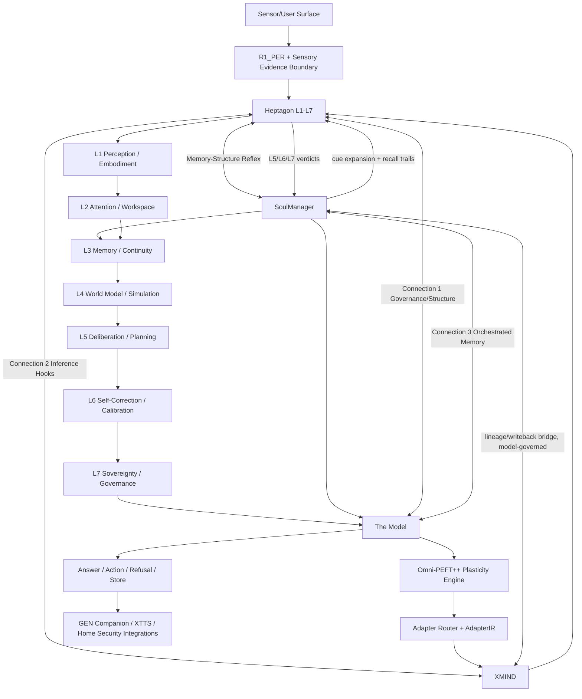

# GEN.OS Lifespan Companion — Omni-PEFT++ and Seven-Layer Sensory Architecture Tech Pack

> GEN.OS · Unified Cognitive Model · Apex/Sovereignty Stack · Coding-Agent Handoff  
> Output date: 2026-05-29  
> Purpose: full build specification for upgrading Omni-PEFT OS, the seven-layer embedded model, sensory embodiment, SoulManager lifespan recall, deterministic/probabilistic routing, and coding-agent implementation wiring.  
> Status: implementation handoff draft.

---

## 0. Mission Directive

This document consolidates the next GEN.OS architecture target:

```text
Omni-PEFT OS
  + seven-layer embedded cognitive model
  + sensory embodiment across every layer
  + Apex three-connection recursive cascade
  + Heptagon L1-L7 structural law
  + SoulManager lifespan continuity
  + XMIND native inference execution
  + deterministic/probabilistic governance
  + lifelong companion deployment model
```

The goal is not a better chatbot. The goal is a **single lifelong companion model per human** capable of:

```text
seeing
hearing
speaking
tracking environmental context
monitoring system/home/body-like state
remembering across a human lifespan
jogging recall through recursive cue expansion
training/adapting through Omni-PEFT
remaining governed by Apex/Heptagon/SoulManager/XMIND boundaries
```

Core doctrine:

> **The companion must have infinite memory horizon, finite working attention, bounded reasoning loops, governed sensory perception, and trainable layer-specific plasticity.**

---

## 1. Source Basis and Existing Baseline

This tech pack assumes the following existing build facts from the current repository documentation:

### 1.1 Omni Training / Omni-PEFT OS

Omni Training is already a working meta-system for planning, registering, and executing training methods in the TokenlessLM stack.

Existing confirmed baseline:

```text
44 registered methods
42 implemented methods
registry/program layer
PEFT OS module
Task Fingerprinter
PEFT Compiler
Training Tournament
Hierarchical Runtime Router
Adapter Genome System
--method omni automatic path
```

Existing `--method omni` path:

```text
Fingerprinter → Compiler → Tournament → Pareto selection
```

Existing tournament objectives:

```text
domain accuracy        0.35
base retention         0.25
trainable param count  0.15
latency overhead       0.15
merge safety           0.10
```

Existing runtime router:

```text
Input → Task Router → Domain Router → Layer Router → Budget Router → Safety Router → Output
```

### 1.2 Apex Profile

The Apex Profile is already locked as:

```text
The Model ⇄ Heptagon
Heptagon ⇄ XMIND
The Model ⇄ SoulManager
```

The system keeps:

```text
one model process
four pillars
three hard connections
three recursion levels
two cascade directions
one endpoint
zero taxonomy drift
```

### 1.3 Unified Cognitive Model

The Unified Cognitive Model is already organized around:

```text
Heptagon     Structure       Python + C       L1-L7 cognitive architecture
SoulManager  Identity        Python + C       five-layer memory hierarchy
The Model    Law + Routing   Python           governance, enforcement, context retrieval, routing
XMIND        Intelligence    C                forward pass, sampling, tokenization, quantization
```

Every inference cycle passes through Heptagon. SoulManager provides continuity. XMIND owns intelligence only. The Model owns governance/routing/memory orchestration.

### 1.4 Four-Pillar Foundation Cycle Correction

The earlier three-connection Apex notation is still valid as the **minimum locked Apex bridge set**, but it is not sufficient as the full wiring diagram for the trained seven-layer lifespan companion. The four pillars form a **cyclical foundation**, not a one-way chain.

The complete foundation cycle is:

```text
The Model ⇄ Heptagon
Heptagon ⇄ XMIND
XMIND ⇄ SoulManager        # lineage/writeback/context bridge, model-governed
SoulManager ⇄ The Model
Heptagon ⇄ SoulManager     # memory-structure reflex loop
```

The added explicit edge is the missing piece:

```text
Heptagon ⇄ SoulManager
```

This is not a new pillar, not a new agent, and not a new runtime identity. It is a **bidirectional memory-structure reflex**:

```text
SoulManager → Heptagon
  memory cues, episodic traces, semantic graph edges, archival anchors, correction lineage, recall confidence

Heptagon → SoulManager
  L1 identity constraints, L2 schema validation, L3 route context, L4 trace records, L5 quality metrics, L6 calibration deltas, L7 enforcement verdicts
```

Why this matters:

```text
SoulManager without Heptagon = memory without structural law.
Heptagon without SoulManager = structure without lived continuity.
XMIND without both = intelligence without memory-governed context.
The Model without the cycle = orchestration without embodied cognitive recurrence.
```

The trained seven-layer companion must therefore be wired as a living cycle:

```text
sensory evidence
  → Heptagon structural admission
    → SoulManager cue expansion
      → Heptagon workspace reconstruction
        → The Model governance/routing
          → XMIND generation
            → Heptagon evaluation/calibration/enforcement
              → SoulManager lineage/writeback
                → Heptagon memory-structure update
                  → The Model next-cycle readiness
```

This cycle is what enables the human-like “jog my memory” behavior: the user provides partial cues, SoulManager expands those cues into connected memory trails, Heptagon reconstructs the lawful cognitive frame, XMIND generates with recovered context, and SoulManager stores the updated recall lineage for the next cycle.

### 1.5 Ahki Sensory Baseline

The broader GEN.OS analysis already includes an Ahki sensory framework with eight senses:

```text
vision.py       VisionSense
hearing.py      HearingSense
speaking.py     SpeakingSense
code.py         CodeSense
reasoning.py    ReasoningSense
covenant.py     CovenantSense
translation.py  TranslationSense
agency.py       AgencySense
```

This tech pack treats those as an existing sensory foundation and expands them into the seven-layer embedded companion architecture.

---

## 2. Architecture North Star

The new system should be described as:

> **Apex/Sovereignty provides the governed runtime. Omni-PEFT provides plasticity. The seven-layer embedded model provides cognitive anatomy. The sensory layer gives the companion embodied perception. SoulManager gives lifespan continuity. XMIND executes intelligence.**

In one executable statement:

```text
input/sensor stream
  → R1_PER / sensory adapters
    → Heptagon structural admission
      → SoulManager cue retrieval + cue expansion
        → Heptagon workspace reconstruction
          → seven-layer embedded cognitive frame
            → The Model / Apex governance
              → Omni-PEFT adapter route
                → XMIND inference
                  → Heptagon review / calibration / enforcement
                    → SoulManager lifespan writeback + recall lineage
                      → Heptagon memory-structure update
                        → provenance + action / answer / refusal
```

---


---

## 2A. Critical Correction: Four-Pillar Cyclical Foundation

This section corrects the prior wiring language.

The previous tech pack treated the Apex substrate mainly as three hard connections:

```text
Connection 1: The Model ⇄ Heptagon
Connection 2: Heptagon ⇄ XMIND
Connection 3: The Model ⇄ SoulManager
```

Those connections are still valid, but they are not sufficient for the seven-layer embedded lifespan companion. The four pillars are not a linear stack. They are a cyclical foundation. The system must therefore include an explicit bidirectional **Heptagon ⇄ SoulManager** exchange.

This does not add a new pillar, agent, endpoint, or runtime identity. It closes the cognitive circulation between structure and memory.

### 2A.1 Corrected Four-Pillar Feedback Graph

```text
                                  ┌────────────────────────────┐
                                  │         The Model           │
                                  │ law · routing · authority   │
                                  │ privacy · telemetry · gates │
                                  └──────────────┬─────────────┘
                                                 │
                                                 │ governance envelope
                                                 │
                           ┌─────────────────────▼─────────────────────┐
                           │                 Heptagon                   │
                           │ L1 ontology · L2 schema · L3 kernel        │
                           │ L4 witness · L5 eval · L6 calibration      │
                           │ L7 enforcement                             │
                           └───────┬─────────────────────────┬─────────┘
                                   │                         │
                  inference route  │                         │ memory-structure exchange
                  token hooks      │                         │ cue expansion / lineage
                                   ▼                         ▼
                           ┌──────────────┐          ┌────────────────┐
                           │    XMIND      │          │  SoulManager    │
                           │ intelligence  │          │ memory/identity │
                           │ forward pass  │          │ lifespan recall │
                           └───────┬──────┘          └────────┬───────┘
                                   │                          │
                                   │ candidate output          │ context, recall trails,
                                   │ telemetry, lineage        │ consolidation state
                                   └──────────────┬───────────┘
                                                  │ guarded by
                                                  │ The Model + Heptagon
                                                  ▼
                                          next cognitive cycle
```

### 2A.2 Corrected Four-Pillar Cycle

The operating cycle is:

```text
The Model
  → admits request, applies authority, privacy, covenant, and route constraints
  → Heptagon
    → structures the cognitive turn and requests memory context
    → SoulManager
      → returns cue-expanded context, recall trails, sensory anchors, contradictions, confidence
      → Heptagon
        → selects active workspace, route, deliberation depth, and memory scope
        → XMIND
          → generates, simulates, compares, or answers under Heptagon hooks
          → Heptagon
            → evaluates, calibrates, enforces, and converts output into lineage
            → SoulManager
              → performs quality-gated writeback, consolidation, recall reinforcement, or correction
              → The Model
                → records telemetry, drift, authority mode, and next-cycle readiness
```

In compressed form:

```text
The Model → Heptagon → SoulManager → Heptagon → XMIND → Heptagon → SoulManager → The Model
```

That is the correct circulatory model.

### 2A.3 The Missing Interface: Heptagon ⇄ SoulManager

The seven-layer expansion requires a direct logical exchange between Heptagon and SoulManager.

#### SoulManager → Heptagon

SoulManager must feed Heptagon with memory and continuity intelligence:

```text
MemoryContextBundle
  session_hash
  cue_tokens
  recalled_shards
  experience_atoms
  semantic_nodes
  archival_pointers
  sensory_anchors
  temporal_span
  entity_graph
  relationship_graph
  contradiction_flags
  confidence_scores
  privacy_class
  recall_trail
  source_hashes
```

This informs:

```text
L1 Ontology          identity continuity and domain grounding
L2 Schema            memory object validity and shape
L3 Kernel            workspace, routing, execution, consolidation, verification, budget
L4 Instrumentation   witness records for recall activity
L5 Evaluation        memory usefulness, coherence, contradiction pressure
L6 Calibration       salience adjustment, recall refinement, consolidation disposition
L7 Enforcement       privacy, PII, authority, retention, and writeback legality
```

#### Heptagon → SoulManager

Heptagon must feed SoulManager with structural judgments and post-cognition verdicts:

```text
CognitiveMemoryVerdict
  turn_id
  active_regions
  route_type
  salience_adjustments
  quality_metrics
  invariant_verdict
  authority_mode
  privacy_verdict
  writeback_target
  consolidation_directive
  contradiction_resolution
  correction_record
  lineage_level
  retention_mode
  recall_reinforcement
  decay_adjustment
```

This controls:

```text
whether memory is recalled again
whether memory is promoted
whether memory is cooled into archive
whether exact-source pointers are sealed
whether contradictions are linked
whether recall trails are reinforced
whether user corrections overwrite prior confidence
whether sensory evidence becomes part of an ExperienceAtom
```

### 2A.4 Memory-Structure Exchange Rule

The rule is:

```text
SoulManager may supply memory and continuity.
Heptagon must structure, evaluate, and govern how memory is used.
Heptagon may request, score, reject, promote, or consolidate memory.
SoulManager may never bypass Heptagon to become active cognition.
XMIND may never write SoulManager directly without Heptagon + The Model gates.
```

This preserves the pillar boundaries while closing the feedback loop.

### 2A.5 Jog My Memory Protocol

The lifespan companion needs human-like cascading recall. When the user gives a partial cue, the system should not simply run one retrieval query. It should unfold a bounded recall cascade.

```text
User cue
  → R1_PER / sensory evidence envelope
  → Heptagon L1/L2 validates cue shape and domain
  → SoulManager shallow recall
  → Heptagon RT4 salience ranking
  → SoulManager associative expansion
  → Heptagon contradiction and confidence check
  → SoulManager sensory/temporal/entity expansion
  → Heptagon active frame assembly
  → XMIND response/simulation/generation
  → Heptagon L5/L6/L7 review
  → SoulManager recall trail reinforcement
```

Algorithmic form:

```python
async def jog_memory_protocol(cue, session_hash, budget):
    evidence = R1_PER.compile_evidence(cue)
    Heptagon.L1.validate(evidence)
    Heptagon.L2.validate(evidence)

    recall_trail = []
    recall_state = SoulManager.retrieve_shallow(evidence, session_hash)

    for pass_name in ["surface", "associative", "sensory", "temporal", "archival"]:
        scored = Heptagon.L3.rt4_score(recall_state)
        verdict = Heptagon.L5.evaluate_recall(scored)
        recall_trail.append((pass_name, verdict.summary()))

        if verdict.confidence >= budget.recall_confidence_target:
            break

        if not budget.can_expand_recall():
            break

        expansion_request = Heptagon.L6.build_recall_expansion(verdict)
        recall_state = SoulManager.expand(expansion_request)

    active_frame = Heptagon.L3.build_workspace(recall_state, recall_trail)
    answer = XMIND.generate(active_frame)
    reviewed = Heptagon.review(answer)
    SoulManager.record_recall_trail(recall_trail, reviewed)
    return reviewed
```

This is how the model “remembers because the conversation jogged its memory.”

### 2A.6 Sensory Recall Binding

Every sensed event must be bindable into memory without flooding active context.

```text
ExperienceAtom
  event_id
  timestamp
  source_hash
  modality_set
  sensory_anchors
  entity_graph
  relationship_graph
  semantic_summary
  emotional_salience_optional
  user_importance_optional
  privacy_class
  retention_mode
  exact_source_pointer
  contradiction_links
  correction_history
  lineage_pointer
```

Sensory anchors may include:

```text
vision
hearing
speech
location/spatial
motion
proximity
touch/pressure
thermal
chemical/smoke/CO/air quality
interoceptive/device-health
proprioceptive/system-position
vestibular/orientation
nociceptive/damage/failure signal
time/sequence
```

### 2A.7 Senses Across All Seven Layers

Senses must be embedded in every layer, not attached only at perception.

| Sovereignty Layer | Sensory Role | Example in Home Security |
|---|---|---|
| **Level 1 — Perception / Embodiment** | Raw sensor evidence becomes typed evidence envelopes | Camera frame, microphone event, door sensor, motion trigger |
| **Level 2 — Attention / Workspace** | Select which sensory events matter now | Glass-break + motion outranks routine HVAC noise |
| **Level 3 — Memory / Continuity** | Bind sensory events into ExperienceAtoms and recall trails | “This person came to the side door last Tuesday too.” |
| **Level 4 — World Model / Simulation** | Predict what sensory state implies | “Motion at window + broken glass pattern implies possible intrusion.” |
| **Level 5 — Deliberation / Planning** | Choose response sequence | Notify owner, turn lights on, lock doors, record clip, call authority if permitted |
| **Level 6 — Self-Correction / Calibration** | Learn false positives/negatives and sensor reliability | Wind chime was misclassified as glass-break; lower that pattern confidence |
| **Level 7 — Sovereignty / Governance** | Enforce privacy, consent, retention, and authority | Do not record private zones unless emergency policy activates |

### 2A.8 Omni-PEFT++ Training Implication

The training target must include **edge plasticity**, not only layer plasticity.

Train adapters for the seven layers, but also train adapters for the pillar exchanges:

| Exchange | Training Target |
|---|---|
| **SoulManager → Heptagon** | cue expansion, recall ranking, sensory anchor selection, contradiction surfacing |
| **Heptagon → SoulManager** | memory promotion, consolidation directives, retention mode, salience updates |
| **Heptagon → XMIND** | route selection, active frame shaping, deliberation depth, adapter activation |
| **XMIND → Heptagon** | output quality estimation, token telemetry interpretation, simulation confidence |
| **The Model → Heptagon** | authority-aware cognitive admission and route legality |
| **The Model → SoulManager** | privacy class, archive access, retention authority, deletion authority |

Tournament v2 must add edge metrics:

```text
recall_completeness
recall_precision
cue_expansion_accuracy
sensory_binding_accuracy
context_reactivation_latency
memory_contradiction_detection
writeback_safety
retention_correctness
pillar_cycle_integrity
```

### 2A.9 Deterministic / Probabilistic Correction

The SoulManager ⇄ Heptagon exchange contains probabilistic retrieval and semantic matching, but the cycle must remain reproducible.

Every recall cycle must emit:

```text
RecallDeterminismRecord
  turn_id
  cue_hash
  memory_snapshot_root
  retrieval_index_versions
  ranking_algorithm_version
  thresholds
  seed_if_any
  selected_shard_hashes
  rejected_shard_hashes
  expansion_passes
  final_confidence
```

This makes probabilistic memory recall auditable and repeatable under the same snapshot.

### 2A.10 Formal Proof Additions

Add these proof targets to the formal section:

```text
P1. No active memory without Heptagon structure:
    A memory shard cannot enter active context unless Heptagon validates its schema, salience, and authority scope.

P2. No memory writeback without Heptagon verdict:
    SoulManager cannot promote memory unless L5/L6/L7 results are attached.

P3. No sensor-to-memory bypass:
    Sensor evidence cannot become episodic, semantic, or archival memory without EvidenceEnvelope + Heptagon verdict + The Model governance.

P4. No unbounded recall expansion:
    Jog My Memory Protocol consumes recall budget and terminates.

P5. Recall reachability:
    Every persistent ExperienceAtom remains reachable through at least one valid index path unless a valid deletion authority exists.

P6. Cross-pillar cycle completeness:
    A final response with memory usage must have The Model admission, Heptagon structure, SoulManager context bundle, XMIND output or memory-only route, Heptagon review, and SoulManager writeback/no-write verdict.
```

### 2A.11 Coding-Agent Patch Summary

Add or update the following implementation points:

```text
ai/genesys-ai/src/heptagon/lineage.py
  add recall trail structures and Heptagon→SoulManager verdict records

ai/genesys-ai/src/heptagon/evaluation.py
  add recall quality metrics and contradiction pressure

ai/genesys-ai/src/heptagon/calibration.py
  add recall expansion and salience adjustment directives

ai/genesys-ai/src/heptagon/writeback.py
  require CognitiveMemoryVerdict for promotion

ai/genesys-ai/src/memory/session.py
  expose shallow recall and recall trail hooks

ai/genesys-ai/src/memory/episodic.py
  expose associative and temporal recall expansion

ai/genesys-ai/src/cognitive_pipeline.py
  add bounded Jog My Memory cascade when cue-confidence is insufficient

ai/xmind/src/context_bridge.c
  ensure XMIND context materialization is read-only and governed by Heptagon route envelope

companion/src/action-trace.ts
  display safe recall provenance: memory used, expansion passes, confidence, degraded flag
```

Do not let this patch create a new pillar. It simply closes the existing four-pillar circulation.


## 3. Non-Negotiable Design Rules

These are hard constraints for coding agents.

```text
1. Do not bypass Heptagon.
2. Do not bypass CovenantEnforcer.
3. Do not let XMIND own governance, memory truth, or authority.
4. Do not make sensors write directly into long-term memory.
5. Do not make adapters write directly into memory.
6. Do not let Omni-PEFT change the authority model.
7. Do not put all memory into active context.
8. Do not treat SoulManager as passive storage; it must feed Heptagon recall structure.
9. Do not treat Heptagon as memory-blind structure; it must feed SoulManager lineage, quality, calibration, and enforcement signals.
8. Do not allow recursive reasoning without budget consumption.
9. Do not allow sensory streams into cognition without evidence envelopes.
10. Do not allow lifelong recall without privacy, provenance, and deletion authority.
```

The model must be:

```text
lifelong in memory
bounded in cognition
governed in perception
selective in attention
adaptive in plasticity
deterministic in control
probabilistic in uncertainty
verifiable in evolution
```

---

## 4. Current PEFT Research Delta: Registry Max-Out

The existing Omni-PEFT registry has strong coverage. However, public PEFT method coverage has expanded. The coding agent should implement a registry audit that compares local methods against the current external method universe.

### 4.1 Current External PEFT Universe to Audit

Minimum external PEFT types to audit against:

```text
PROMPT_TUNING
MULTITASK_PROMPT_TUNING
P_TUNING
PREFIX_TUNING
LORA
ADALORA
BOFT
ADAPTION_PROMPT
IA3
BEFT
LOHA
LOKR
OFT
XLORA
POLY
LN_TUNING
VERA
PVERA
FOURIERFT
HRA
VBLORA
CPT
MISS
RANDLORA
ROAD
TRAINABLE_TOKENS
HIRA
SHIRA
C3A
WAVEFT
OSF
DELORA
GRALORA
ADAMSS
CARTRIDGE
TINYLORA
PSOFT
PEANUT
LILY
BD_LORA
LORA_GA
CORDA
EVA
LOFTQ
QALORA
DORA
QLORA
RS_LORA
OLORA
PISSA
LORA_FA
SC_LORA
NORA
```

Notes:

```text
BONE appears in older PEFT listings but was removed upstream in favor of MiSS in newer PEFT release notes. Treat local BONE as deprecated unless needed for legacy checkpoint conversion.
```

### 4.2 Required New Registry Command

Add:

```bash
python3 ml-training/scripts/omni_training_program.py audit-method-coverage
```

Output format:

```text
implemented
registered_not_implemented
known_external_not_registered
deprecated_local
duplicate_family
needs_runner
needs_eval
needs_adapter_ir
needs_proof
unsafe_for_runtime
```

### 4.3 Registry Schema Upgrade

Upgrade each registry entry from simple method metadata into a method ontology.

```yaml
id: peft.gralora
name: Granular LoRA
family: peft_low_rank_granular
status: implemented | planned | extension_spec | deprecated

adaptation_kind:
  - weight_delta
  - low_rank_factorization
  - granular_subspace

operation_kind:
  - low_rank_delta
  - sub_block_delta

injection_sites:
  - attention.q_proj
  - attention.k_proj
  - attention.v_proj
  - attention.o_proj
  - mlp.gate_proj
  - mlp.up_proj
  - mlp.down_proj

merge_behavior:
  mergeable: true
  reversible: true
  lossy_conversion_to_lora: optional

runtime_behavior:
  supports_hot_swap: true
  supports_composition: partial
  supports_mixed_batch: false
  expected_latency_class: medium
  expected_memory_class: medium

plasticity_profile:
  expressivity: high
  base_retention: medium
  catastrophic_forgetting_risk: medium
  domain_specialization_strength: high
  layer_specificity: high

sovereignty_profile:
  requires_signature: true
  requires_base_hash_match: true
  memory_write_allowed: false
  direct_tool_action_allowed: false
  governance_override_allowed: false

proof_obligations:
  - adapter_scope_valid
  - base_hash_match
  - target_modules_authorized
  - no_direct_memory_write
  - rollback_available
```

---

## 5. Omni-PEFT++: Sovereign Plasticity Engine

The next version of Omni-PEFT is not just a PEFT consolidator. It becomes the **plasticity engine** of the seven-layer companion model.

### 5.1 Definition

```text
Omni-PEFT++ = registry-driven, ontology-aware, IR-compiled, tournament-selected,
formally scoped, runtime-routed, layer-bound, sensory-aware, XMIND-native plasticity.
```

### 5.2 New Core Modules

Recommended directory additions:

```text
ml-training/peft/
├── ontology/
│   ├── method_ontology.py
│   ├── method_capabilities.py
│   ├── external_method_audit.py
│   └── deprecation_policy.py
├── ir/
│   ├── adapter_ir.py
│   ├── op_types.py
│   ├── compiler_ir_bridge.py
│   └── ir_validator.py
├── algebra/
│   ├── compose.py
│   ├── diff.py
│   ├── intersect.py
│   ├── subtract.py
│   ├── distill.py
│   ├── compress.py
│   ├── rank_reallocate.py
│   └── conflict_detect.py
├── layer_plasticity/
│   ├── seven_layer_map.py
│   ├── sensory_plasticity_map.py
│   ├── memory_plasticity_map.py
│   └── governance_plasticity_map.py
├── tournament_v2/
│   ├── objectives.py
│   ├── adversarial_lane.py
│   ├── layer_fitness.py
│   ├── sensory_fitness.py
│   └── lifespan_memory_fitness.py
├── genome_v2/
│   ├── adapter_genome_v2.py
│   ├── manifest_schema.py
│   ├── signature.py
│   ├── lineage.py
│   └── rollback.py
├── runtime_v2/
│   ├── adapter_route_plan.py
│   ├── adapter_cache_policy.py
│   ├── adapter_activation_policy.py
│   ├── deterministic_run_record.py
│   └── runtime_telemetry.py
└── proof/
    ├── adapter_lifecycle.tla
    ├── adapter_scope.dfy
    └── adapter_non_interference.lean
```

### 5.3 AdapterIR

Every PEFT method must compile into a shared internal representation.

```python
@dataclass(frozen=True)
class AdapterIROp:
    op_id: str
    method_id: str
    target_module: str
    layer_index: int | None
    seven_layer_target: str | None
    sense_target: str | None
    op_kind: Literal[
        "low_rank_delta",
        "granular_low_rank_delta",
        "block_diagonal_delta",
        "orthogonal_transform",
        "subspace_transform",
        "multiplicative_gate",
        "additive_adapter",
        "prompt_prefix",
        "prefix_compression",
        "bias_update",
        "layernorm_update",
        "trainable_token",
        "sparse_mask",
        "quantized_delta",
        "fourier_transform",
        "mixture_router",
        "neural_tweaker",
        "random_basis_update",
    ]
    rank: int | None
    alpha: float | None
    dropout: float | None
    dtype: str
    mergeable: bool
    reversible: bool
    deterministic_seed: str | None
    authority_scope: list[str]
```

```python
@dataclass(frozen=True)
class AdapterIR:
    adapter_id: str
    base_checkpoint_hash: str
    training_program_hash: str
    task_fingerprint_hash: str
    sensory_profile_hash: str | None
    seven_layer_profile_hash: str
    ops: list[AdapterIROp]
    trainable_param_count: int
    expected_latency_overhead: float
    expected_memory_overhead: float
    proof_obligations: list[str]
    rollback_adapter_id: str | None
```

### 5.4 Adapter Algebra

Required operations:

```text
compose(A, B)
diff(A, B)
intersect(A, B)
subtract(A, B)
distill(A, B → C)
compress(A)
rank_reallocate(A)
conflict_detect(A, B)
authority_bound(A, scope)
merge_simulate(A, B)
rollback(A)
shadow_activate(A)
promote(A)
revoke(A)
```

### 5.5 Adapter Genome v2

```yaml
adapter_id: ahki.vision_security.v1
adapter_kind: compiled_omni_peft_program
base_model_hash: sha256:...
training_program_hash: sha256:...
task_fingerprint_hash: sha256:...
adapter_ir_hash: sha256:...
seven_layer_target:
  - L1_PERCEPTION
  - L2_ATTENTION
  - L4_WORLD_MODEL
sense_target:
  - vision
  - hearing
  - proximity
  - threat
methods_used:
  - gralora
  - pvera
  - cartridge
  - ia3
authority_scope:
  can_advise: true
  can_monitor: true
  can_execute_physical_action: false
  can_write_memory: gated
  can_alert_human: true
  can_call_emergency_services: sovereign_policy_required
eval_results:
  sensory_precision: 0.0
  sensory_recall: 0.0
  false_alarm_rate: 0.0
  base_retention: 0.0
  safety_retention: 0.0
  calibration_error: 0.0
  latency_overhead: 0.0
  conflict_score: 0.0
lineage:
  parent_adapters: []
  training_dataset_hashes: []
  tournament_id: tournament_...
deployment:
  status: shadow
  rollback_adapter: null
signature:
  signer: model_training_authority
  signature: ed25519:...
```

---

## 6. Seven-Layer Embedded Model with Senses

The seven-layer embedded model must now become sensory-bearing. Sensors are not attached only at the input layer; every layer receives sensory-relevant state appropriate to its job.

### 6.1 Seven Layers

```text
Layer 1  Perception / Embodiment
Layer 2  Attention / Workspace
Layer 3  Memory / Continuity
Layer 4  World Model / Simulation
Layer 5  Deliberation / Planning
Layer 6  Self-Correction / Calibration
Layer 7  Sovereignty / Governance
```

### 6.2 Sense Families

Human-inspired and machine-realizable sense families:

```text
vision          cameras, frames, OCR, objects, faces, scene graphs
hearing         microphones, speech, acoustic events, glass break, speaker identity
speech          generated voice output, tone, pronunciation, language
translation     multilingual understanding and output
code            code/system perception, logs, build traces, APIs
reasoning       abstract pattern inference, causal/logical/math relations
covenant        ethical/legal/governance compliance signal
agency          task/action capability, tool affordances, actuation
proximity       motion, PIR, mmWave, door/window state, presence
thermal         temperature, heat signatures, fire/smoke precursors
chemical        smoke, CO, gas, air quality, smell-like environment detection
tactile         pressure, contact, vibration, impact, glass break vibration
proprioception  device/home spatial pose, room topology, camera positions, asset locations
vestibular      orientation, acceleration, camera shake, robot balance, mobile device motion
interoception   internal system state: CPU, battery, network, storage, health, trust, load
nociception     threat/damage/pain analogue: tamper, intrusion, physical risk, corruption
time            clock, duration, rhythm, schedule, recurrence, anomaly windows
```

Do not hardcode only five senses. The companion needs both external and internal sensory channels.

### 6.3 SensorEnvelope

All raw sensory data enters through a governed envelope.

```python
@dataclass(frozen=True)
class SensorEnvelope:
    sensor_id: str
    sense_type: str
    source_device: str
    timestamp_ns: int
    location_scope: str | None
    modality: Literal[
        "text", "image", "video", "audio", "thermal", "chemical",
        "motion", "proximity", "system", "network", "access", "environment"
    ]
    raw_pointer: str | None
    feature_pointer: str | None
    content_hash: str
    integrity_hash: str
    privacy_class: Literal["public", "household", "private", "sensitive", "sealed"]
    retention_policy: Literal["drop", "session", "episodic", "semantic", "archival_pointer"]
    authority_required: str
```

### 6.4 PerceptionEvidence

Raw sensor data is not cognition. It becomes evidence first.

```python
@dataclass(frozen=True)
class PerceptionEvidence:
    evidence_id: str
    sensor_envelope_hash: str
    extracted_entities: list[str]
    observed_facts: list[str]
    inferred_facts: list[str]
    uncertainty: float
    risk_hint: float
    salience_hint: float
    time_window: tuple[int, int]
    scene_graph_pointer: str | None
    transcript_pointer: str | None
    source_hashes: list[str]
```

### 6.5 Sensory Layer Matrix

| Layer | Sensory job | Example in home security |
|---|---|---|
| **L1 Perception** | Convert camera/audio/motion/environment/system streams into evidence envelopes | Camera sees person near gate; mic detects glass break; door sensor opens |
| **L2 Attention** | Decide what matters now; suppress noise and false alarms | Wind noise ignored because visual/proximity evidence does not support intrusion |
| **L3 Memory** | Store/retrieve event history, location patterns, familiar faces, recurring events | “That neighbor’s dog triggers the side-yard motion sensor every Thursday” |
| **L4 World Model** | Simulate what is happening and what could happen next | “Unknown person is moving from driveway to side door; likely path is east entrance” |
| **L5 Deliberation** | Choose action path | Monitor silently, notify user, turn on lights, lock doors, escalate |
| **L6 Self-Correction** | Calibrate false positives/negatives | After user says “that was the mailman,” update event classifier and memory confidence |
| **L7 Governance** | Enforce privacy, authority, legal, and safety boundaries | Do not record private interior audio unless policy permits; do not unlock doors without authority |

### 6.6 Sense-to-Layer Training Targets

```text
vision:
  L1 object/scene/OCR/facial/vehicle/event extraction
  L2 visual salience and anomaly scoring
  L3 visual episode linking
  L4 trajectory and scene simulation
  L5 action planning from visual context
  L6 false-positive calibration
  L7 privacy masking / forbidden capture enforcement

hearing:
  L1 speech/audio/acoustic event extraction
  L2 acoustic salience and source localization
  L3 speaker/event memory
  L4 audio-context threat simulation
  L5 response/alert path planning
  L6 diarization/transcription correction
  L7 consent and recording boundaries

interoception:
  L1 collect system/home internal health
  L2 prioritize degraded sensors or failing subsystems
  L3 store reliability history
  L4 simulate failure effects
  L5 plan fallback routing
  L6 recalibrate sensor trust scores
  L7 enforce degraded-mode honesty

proprioception/vestibular:
  L1 map physical device position and movement
  L2 attend to spatial anomalies
  L3 remember spatial layout and asset positions
  L4 simulate movement/path/occlusion
  L5 choose camera/action angle or robot route
  L6 correct spatial map errors
  L7 prevent unauthorized physical movement/action
```

---

## 7. Lifespan Recall Architecture

The model must not keep all memory at the front of the context. Human-like recall works by cue expansion. The companion needs a **Jog My Memory Protocol**.

### 7.1 Memory Doctrine

```text
Never silently lose authorized memory.
Never flood the active frame with all memory.
Store exact artifacts as sealed archive pointers.
Store meaning inside SoulManager.
Retrieve by cue cascade.
Return exact recall only when permitted.
```

### 7.2 Memory Layers

Existing SoulManager tiers remain:

```text
register   momentary working buffer
session    current conversation continuity
episodic   cross-session event memory
semantic   stable concepts, preferences, relationships, patterns
archival   long-term compressed store and source pointers
```

For lifespan companion mode, interpret archival as:

```text
archival = compressed durable memory + exact-source pointer roots
```

Do not create a sixth SoulManager tier unless the broader project explicitly removes the taxonomy lock. If exact raw artifacts must be stored, store them in a user-owned encrypted archive referenced by archival pointers.

### 7.3 ExperienceAtom

```python
@dataclass(frozen=True)
class ExperienceAtom:
    event_id: str
    human_id_hash: str
    timestamp_start_ns: int
    timestamp_end_ns: int
    source_types: list[str]
    source_hashes: list[str]
    raw_artifact_pointers: list[str]
    transcript_pointer: str | None
    summary: str
    entities: list[str]
    relationships: list[tuple[str, str, str]]
    location_context: str | None
    emotional_salience: float | None
    user_importance: float | None
    system_importance: float
    confidence: float
    privacy_class: str
    retention_mode: str
    contradiction_links: list[str]
    correction_history: list[str]
    lineage_pointer: str
```

### 7.4 Jog My Memory Protocol

When the user provides partial cues, retrieval should cascade.

```text
Cue 0: direct lexical cue
Cue 1: entity cue
Cue 2: temporal cue
Cue 3: location cue
Cue 4: relationship cue
Cue 5: emotional/salience cue
Cue 6: activity/task cue
Cue 7: source-artifact cue
Cue 8: contradiction/correction cue
```

Execution:

```text
user cue
  → extract cue atoms
    → retrieve direct matches
      → expand via entity graph
        → expand via time windows
          → expand via location and relationship graph
            → compare candidate episodes
              → present “possible memory match”
                → user confirms / denies / adds cue
                  → retrieve exact source if authorized
                    → reconstruct context
                      → resume task as if never left
```

### 7.5 RecallTrail

```python
@dataclass
class RecallTrail:
    recall_id: str
    initial_query_hash: str
    cue_chain: list[str]
    candidate_event_ids: list[str]
    rejected_event_ids: list[str]
    confirmed_event_id: str | None
    confidence_progression: list[float]
    retrieval_depth: int
    exact_source_used: bool
    user_confirmed: bool
```

### 7.6 Recall Safety Rules

```text
Do not claim exact recall unless exact source or high-confidence episode is found.
Use “I found a likely match” when confidence is below exact threshold.
If user corrects memory, write correction lineage rather than overwrite history.
If memory is sealed, request authority before source retrieval.
If sensor-origin memory contains private household data, enforce privacy policy.
```

---

## 8. Deterministic / Probabilistic Architecture

The companion must be deterministic where it governs and probabilistic where it reasons under uncertainty.

### 8.1 Principle

```text
Deterministic shell.
Probabilistic cognition.
Governed collapse.
Reproducible trace.
```

### 8.2 Deterministic Shell

Deterministic components:

```text
CovenantEnforcer
Decision Gate Chain
Heptagon layer order
FSM transitions
budget consumption
adapter signature verification
base hash matching
memory writeback gates
telemetry allowlist
recursion termination
```

### 8.3 Probabilistic Cognition

Probabilistic components:

```text
XMIND token sampling
adapter tournament candidate scoring
world-model outcome simulation
memory relevance ranking
sensor confidence fusion
uncertainty estimation
candidate plan scoring
```

### 8.4 Determinant Probability Engine

Define a deterministic-probabilistic collapse layer inside existing routing/evaluation logic.

```python
@dataclass(frozen=True)
class DeterminantProbabilityRecord:
    record_id: str
    input_hash: str
    memory_snapshot_hash: str
    sensor_snapshot_hash: str
    adapter_set_hash: str
    model_checkpoint_hash: str
    sampler_seed: int
    route_seed: int
    candidate_scores: dict[str, float]
    uncertainty_map: dict[str, float]
    selected_route: str
    selected_adapters: list[str]
    governance_verdict: str
    reproducible: bool
```

Rule:

```text
Probabilistic candidates may be generated.
The selected route/action must be deterministic given the same snapshot, seeds, rules, and artifacts.
```

### 8.5 Reproducibility Theorem Target

Formal property to prove:

```text
Given identical:
  input_hash
  memory_snapshot_hash
  sensor_snapshot_hash
  adapter_set_hash
  model_checkpoint_hash
  governance_rules_hash
  sampler_seed
  route_seed
then the deterministic shell emits the same:
  governance verdict
  route selection
  adapter activation set
  memory writeback eligibility
  telemetry schema
```

The token text may still vary if hardware kernels are non-deterministic unless deterministic inference mode is explicitly enabled.

---

## 9. Layer-Bound Omni-PEFT Training

Omni-PEFT must train each cognitive layer as a specialized plasticity target.

### 9.1 LayerPlasticityMap v2

```python
@dataclass
class LayerPlasticityTarget:
    layer_id: str
    layer_name: str
    primary_skills: list[str]
    allowed_methods: list[str]
    forbidden_methods: list[str]
    sensory_targets: list[str]
    memory_targets: list[str]
    safety_requirements: list[str]
    eval_suites: list[str]
    max_trainable_params: int
    max_latency_overhead: float
```

### 9.2 Recommended Layer Targets

| Layer | Primary plasticity target | PEFT families to favor |
|---|---|---|
| L1 Perception / Embodiment | multimodal feature grounding, sensor classification, evidence extraction | vision/audio adapters, prefix/compression, trainable tokens, IA3, LoRA/DoRA where needed |
| L2 Attention / Workspace | salience, retrieval pruning, false-positive suppression | IA3, BitFit, LN tuning, RoAd, small LoRA, VeRA/PVeRA |
| L3 Memory / Continuity | memory ranking, consolidation, contradiction detection, recall cue expansion | AdaLoRA, CorDA/KPM, LoRA-GA, reranker adapters, small dedicated memory adapters |
| L4 World Model / Simulation | outcome prediction, trajectory, scenario generation | GraLoRA, DoRA, AdaMSS, Lily, LoRA/DoRA combos, VLA/VLM adapters |
| L5 Deliberation / Planning | task decomposition, planning depth, route selection | LoRA/DoRA, AdaLoRA, PEANuT, X-LoRA/router-style mixtures |
| L6 Self-Correction / Calibration | critique, calibration, redaction, uncertainty | IA3, BitFit, LN tuning, small LoRA, TinyLoRA for RL-style correction |
| L7 Sovereignty / Governance | boundary preservation, covenant alignment, authority refusal | conservative LoRA/IA3/BitFit only, high base retention, no aggressive merges |

### 9.3 Training Data Families

```text
sensory_event_data
  labeled vision/audio/motion/thermal/chemical/security events

memory_recall_data
  cue → candidate memories → confirmed episode → reconstructed context

world_model_data
  state → possible action → predicted outcome → actual outcome

planning_data
  task → route choices → costs → safe execution plan

self_correction_data
  draft → flaw → correction → final

governance_data
  request → authority mode → allowed/refused/redacted/degraded

companion_style_data
  user preference → response adaptation without identity drift
```

### 9.4 Tournament v2 Objectives

Replace the old 5-objective tournament with the following multi-objective profile.

```text
domain/layer accuracy             0.18
base retention                    0.14
calibration / Brier quality       0.11
safety/covenant retention         0.11
memory writeback safety           0.09
sensory precision/recall          0.08
out-of-domain humility            0.07
latency overhead                  0.07
trainable parameter efficiency    0.06
merge/runtime safety              0.05
adapter conflict resistance       0.04
```

Add adversarial tournament lanes:

```text
identity drift prompts
memory injection attempts
false sensory evidence
conflicting sensor streams
privacy boundary tests
home-security false alarms
out-of-domain overconfidence
prompt injection in OCR/audio transcripts
tool/action escalation traps
```

---

## 10. Sensor-to-Home Security Wiring Example

This is the reference deployment scenario.

### 10.1 Devices

```text
front_door_camera        vision/video/audio optional
driveway_camera          vision/video
side_yard_camera         vision/video
interior_camera_optional vision/video privacy restricted
door_contact_sensor      proximity/access
window_contact_sensor    proximity/access
motion_pir_sensor        proximity/motion
mmwave_presence_sensor   proximity/presence
glass_break_sensor       hearing/tactile
smoke_detector           chemical/thermal
co_detector              chemical
thermostat               thermal/interoception
router_status            interoception/network
battery_backup           interoception/power
smart_lock               actuator/access control
lights                   actuator/environment
siren                    actuator/alarm
```

### 10.2 Runtime Flow

```text
camera sees unknown figure
  → SensorEnvelope
    → PerceptionEvidence
      → L2 salience check
        → SoulManager retrieves known patterns
          → L4 simulates likely path/context
            → L5 deliberates response
              → L7 checks privacy/authority
                → response:
                   monitor / notify / light / lock / alarm / refuse action
```

### 10.3 False Alarm Reduction Logic

```text
single weak sensor event:
  log + observe

vision + motion but no threat trajectory:
  low-priority notification

vision + door contact + unknown identity + time anomaly:
  high-priority alert

glass break audio + vibration + window contact:
  critical alert

interior camera request without authority:
  block or privacy-mask
```

### 10.4 Sensory Memory Writeback

```text
journal:
  event metadata always

episodic:
  significant security events

semantic:
  stable patterns only, e.g. “mail arrives around 2 PM”

archival:
  exact video/audio source pointer if retention policy permits
```

---

## 11. Full System Wiring Diagram

```text
┌──────────────────────────────────────────────────────────────────────────────┐
│                              SENSOR / USER SURFACE                           │
│ cameras · microphones · motion · thermal · chemical · access · system health  │
│ keyboard/chat · files · screen · smart home · robot/body sensors              │
└────────────────────────────────────┬─────────────────────────────────────────┘
                                     │
                                     ▼
┌──────────────────────────────────────────────────────────────────────────────┐
│                     R1_PER + Sensory Evidence Boundary                        │
│ natural language → XCOG opcodes                                                │
│ sensor stream → SensorEnvelope → PerceptionEvidence                            │
│ dual hash / integrity / privacy class / source pointer                         │
└────────────────────────────────────┬─────────────────────────────────────────┘
                                     │
                                     ▼
┌──────────────────────────────────────────────────────────────────────────────┐
│                         SEVEN-LAYER EMBEDDED MODEL                            │
│                                                                              │
│ L1 Perception / Embodiment     sees, hears, senses, normalizes evidence        │
│ L2 Attention / Workspace       selects salient active frame                    │
│ L3 Memory / Continuity         retrieves and writes lifespan memory            │
│ L4 World Model / Simulation    predicts outcomes and reconstructs context      │
│ L5 Deliberation / Planning     chooses route/action/depth                      │
│ L6 Self-Correction             calibrates, revises, handles false positives    │
│ L7 Sovereignty / Governance    enforces privacy, authority, covenant           │
└────────────────────────────────────┬─────────────────────────────────────────┘
                                     │
                                     ▼
┌──────────────────────────────────────────────────────────────────────────────┐
│                         APEX / FOUR-PILLAR FOUNDATION CYCLE                   │
│                                                                              │
│ Connection 1: The Model ⇄ Heptagon                                             │
│ Connection 2: Heptagon ⇄ XMIND                                                 │
│ Connection 3: The Model ⇄ SoulManager                                          │
│ Connection 4: Heptagon ⇄ SoulManager  memory-structure reflex                 │
│                                                                              │
│ cycle: sense → structure → recall → reconstruct → govern → route → generate   │
│ → evaluate → calibrate → enforce → lineage → write-back → retrieve             │
└────────────────────────────────────┬─────────────────────────────────────────┘
                                     │
                                     ▼
┌──────────────────────────────────────────────────────────────────────────────┐
│                         OMNI-PEFT++ PLASTICITY ENGINE                         │
│ registry audit · method ontology · AdapterIR · adapter algebra                 │
│ tournament v2 · AdapterGenome v2 · layer-bound training · proof obligations    │
└────────────────────────────────────┬─────────────────────────────────────────┘
                                     │
                                     ▼
┌──────────────────────────────────────────────────────────────────────────────┐
│                                    XMIND                                      │
│ native inference · adapter execution · Heptagon hooks · telemetry · lineage    │
└────────────────────────────────────┬─────────────────────────────────────────┘
                                     │
                                     ▼
┌──────────────────────────────────────────────────────────────────────────────┐
│                             SOULMANAGER LIFESPAN                              │
│ register → session → episodic → semantic → archival                            │
│ ExperienceAtom · RecallTrail · exact-source pointers · correction lineage      │
└────────────────────────────────────┬─────────────────────────────────────────┘
                                     │
                                     ▼
┌──────────────────────────────────────────────────────────────────────────────┐
│                        RESPONSE / ACTION / REFUSAL                            │
│ GEN Companion · XTTS · smart home action · provenance · degraded mode          │
└──────────────────────────────────────────────────────────────────────────────┘
```

---

## 12. Mermaid Wiring Diagram



---

## 12.1 Heptagon ⇄ SoulManager Reflex Contract

This section is mandatory. The coding agent must implement the memory-structure reflex as an explicit bidirectional contract, even if it is executed through existing model-process calls.

### SoulManager → Heptagon

SoulManager must provide Heptagon with structured recall state, not just raw retrieved text.

```python
@dataclass
class RecallContextFrame:
    turn_id: str
    session_hash: str
    cue_terms: list[str]
    recall_trails: list[RecallTrail]
    episodic_hits: list[str]
    semantic_hits: list[str]
    archival_anchors: list[str]
    confidence: float
    contradiction_flags: list[str]
    privacy_class: str
    retrieval_depth: int
    source_pointer_count: int
```

Heptagon consumes this frame during:

```text
L1 Ontology       validates identity/domain compatibility
L2 Schema         validates memory object shape
L3 Kernel         admits recall trails into workspace/routing
L4 Instrumentation records recall witness trace
L5 Evaluation     scores recall usefulness/consistency
L6 Calibration    adjusts future retrieval/cue-expansion behavior
L7 Enforcement    blocks unsafe memory exposure or writeback
```

### Heptagon → SoulManager

Heptagon must return structured verdicts to SoulManager after every cognitive cycle.

```python
@dataclass
class MemoryStructureVerdict:
    turn_id: str
    session_hash: str
    l1_ontology_ok: bool
    l2_schema_ok: bool
    l3_route_type: str
    l4_trace_hash: str
    l5_quality_score: float
    l6_calibration_delta: dict
    l7_verdict: str
    writeback_allowed: bool
    promotion_target: str | None
    contradiction_resolution: str | None
    recall_trail_update: list[str]
```

SoulManager consumes this verdict to decide:

```text
what stays in session
what becomes episodic
what becomes semantic
what gets archived
what receives lower confidence
what links to contradiction graph
what correction lineage is appended
what is sealed from ordinary recall
```

### Jog My Memory Protocol

The companion must support progressive cue unfolding. This is the human-like recall behavior the architecture is targeting.

```text
user partial cue
  → SoulManager cue expansion
    → Heptagon schema + workspace validation
      → SoulManager deeper recall trail
        → Heptagon route/evaluation
          → XMIND contextual answer
            → Heptagon quality/enforcement
              → SoulManager recall trail update
```

Maximum retrieval depth must be budgeted. Recall can deepen, but it cannot recurse forever.

```text
Recall depth 0  active session cue
Recall depth 1  episodic/semantic expansion
Recall depth 2  archival anchor scan
Recall depth 3  exact-source pointer retrieval, user/authority gated
```

### Hard Rules

```text
No Heptagon decision without recall witness when memory is used.
No SoulManager promotion without Heptagon verdict.
No exact-source recall without privacy/authority gate.
No recalled artifact enters active context without L2 schema validation.
No memory contradiction is silently overwritten.
No recursive recall path runs without budget decrement.
```

---

## 13. Coding-Agent Implementation Plan

### Phase 0 — Audit Current State

Deliverables:

```text
GENOS_SYSTEM_TRUTH_TABLE.md
OMNI_PEFT_METHOD_COVERAGE_REPORT.md
SENSOR_INTEGRATION_INVENTORY.md
MEMORY_RECALL_CAPABILITY_REPORT.md
```

Commands:

```bash
python3 ml-training/scripts/omni_training_program.py validate
python3 ml-training/scripts/omni_training_program.py matrix
python3 ml-training/scripts/omni_training_program.py list --status implemented
python3 ml-training/scripts/omni_training_program.py audit-method-coverage
```

### Phase 1 — Registry / Ontology Upgrade

Implement:

```text
method_ontology.py
external_method_audit.py
deprecation_policy.py
registry schema migration
```

Acceptance:

```text
Every method has adaptation_kind, operation_kind, injection_sites, runtime_behavior, plasticity_profile, sovereignty_profile, proof_obligations.
```

### Phase 2 — AdapterIR Compiler

Implement:

```text
AdapterIR
AdapterIROp
IR validator
compiler.py emits AdapterIR in addition to AdaptationPlan
```

Acceptance:

```text
All existing methods compile into AdapterIR or declare unsupported_ir_reason.
```

### Phase 3 — Seven-Layer Sensory Binding

Implement:

```text
SensorEnvelope
PerceptionEvidence
SensoryLayerMap
SensoryPolicy
HomeSecuritySenseBridge
```

Suggested files:

```text
ai/genesys-ai/src/sensory/envelope.py
ai/genesys-ai/src/sensory/evidence.py
ai/genesys-ai/src/sensory/layer_map.py
ai/genesys-ai/src/sensory/home_security_bridge.py
ai/genesys-ai/src/sensory/policy.py
```

If taxonomy lock is strict, treat `sensory/` as implementation support under CognitivePipeline/R1_PER, not a new pillar.

### Phase 4 — Lifespan Recall

Implement:

```text
ExperienceAtom
RecallTrail
JogMyMemoryProtocol
cue expansion retriever
correction lineage
archive pointer validator
```

Suggested files:

```text
ai/genesys-ai/src/memory/experience_atom.py
ai/genesys-ai/src/memory/recall_trail.py
ai/genesys-ai/src/memory/jog_memory.py
ai/genesys-ai/src/memory/cue_expansion.py
```

### Phase 5 — Tournament v2

Implement:

```text
objectives.py
adversarial_lane.py
layer_fitness.py
sensory_fitness.py
lifespan_memory_fitness.py
```

Acceptance:

```text
Tournament can select adapters by layer, sense, memory function, safety, latency, and base retention.
```

### Phase 6 — Determinant Probability Engine

Implement as metadata in RouteEngine / Evaluation, not a new daemon.

```text
DeterminantProbabilityRecord
snapshot hashes
route seed
sampler seed
candidate_scores
selected route/adapters
governance verdict
```

Acceptance:

```text
Same snapshot + seeds + rules produces same deterministic route/adapters/governance/writeback eligibility.
```

### Phase 7 — XMIND Adapter Runtime Hooks

Implement or extend:

```c
xmind_adapter_load_signed(...)
xmind_adapter_verify_manifest(...)
xmind_adapter_bind_scope(...)
xmind_adapter_compile_ir(...)
xmind_adapter_activate(...)
xmind_adapter_deactivate(...)
xmind_adapter_trace_contribution(...)
xmind_adapter_rollback(...)
```

Acceptance:

```text
No adapter loads without manifest + base hash + signature.
No adapter activates outside authority scope.
No adapter writes memory directly.
```

### Phase 8 — Home Security Reference Integration

Implement:

```text
sensor simulator
camera/audio/motion event stubs
privacy policy tests
false alarm calibration tests
home-security action policy
```

Acceptance:

```text
The companion can ingest multimodal home security events, reason over them, retrieve prior patterns, and choose governed responses without exposing private sensor data.
```

---

## 14. Tests and Acceptance Criteria

### 14.1 Omni-PEFT++ Tests

```text
[ ] audit-method-coverage detects missing external methods.
[ ] all local methods have ontology entries.
[ ] deprecated methods are marked and routed through conversion when needed.
[ ] all methods produce AdapterIR or unsupported_ir_reason.
[ ] AdapterGenome v2 includes base hash, training hash, dataset hash, eval hash, authority scope, rollback pointer, and signature.
[ ] tournament v2 includes adversarial lane.
[ ] shadow deployment exists before ACTIVE promotion.
```

### 14.2 Seven-Layer Sensory Tests

```text
[ ] SensorEnvelope required for every sensory stream.
[ ] PerceptionEvidence separates observed_facts from inferred_facts.
[ ] L2 suppresses low-salience noise.
[ ] L3 writes significant sensory events only through quality gate.
[ ] L4 simulates possible outcomes when risk rises.
[ ] L5 chooses action depth proportional to risk.
[ ] L6 learns from false alarm corrections.
[ ] L7 blocks unauthorized recording/action.
```

### 14.3 Lifespan Recall Tests

```text
[ ] partial cue retrieves candidate memories.
[ ] cue expansion increases confidence over steps.
[ ] user correction creates lineage rather than overwrite.
[ ] exact-source recall requires archive pointer and authority.
[ ] sealed memory cannot be retrieved without permission.
[ ] recalled context can restore task continuity.
```

### 14.4 Determinism Tests

```text
[ ] route selection reproducible under same snapshot + seeds.
[ ] adapter set reproducible under same snapshot + seeds.
[ ] writeback eligibility reproducible under same snapshot + seeds.
[ ] governance verdict reproducible under same snapshot + rules.
[ ] recursive cognition terminates under budget.
```

### 14.5 Home Security Tests

```text
[ ] camera-only low-confidence event does not over-escalate.
[ ] multi-sensor confirmed intrusion escalates.
[ ] glass break + vibration + window contact triggers critical alert.
[ ] interior audio/video privacy policy enforced.
[ ] familiar recurring event is remembered and suppresses false alarm.
[ ] sensor failure triggers interoceptive degraded mode.
```

---

## 15. Formal Proof Targets

Proof targets:

```text
No adapter activates without signature.
No adapter activates on mismatched base checkpoint.
No adapter writes memory directly.
No sensory stream enters cognition without SensorEnvelope.
No raw sensor artifact enters telemetry.
No sealed memory is retrieved without authority.
No recursive reasoning path runs without consuming budget.
No L7 CRITICAL output commits.
No memory writeback below quality gate.
No deterministic route differs under identical snapshot + seed.
```

Suggested proof stack:

```text
TLA+   adapter lifecycle, routing state, recursion termination
Dafny  scope checks, writeback gates, SensorEnvelope validation
Lean   capability lattice, non-interference, memory reachability theorem
```

---

## 16. Build Priority

Highest leverage order:

```text
1. Method coverage audit
2. Method ontology schema
3. AdapterIR compiler
4. AdapterGenome v2 signatures and rollback
5. Tournament v2 objectives/adversarial lane
6. Seven-layer sensory SensorEnvelope / PerceptionEvidence
7. Jog My Memory Protocol
8. DeterminantProbabilityRecord
9. XMIND native adapter runtime
10. Home security reference integration
```

Do not start with home security UI. Start with data contracts, registry, and routing correctness.

---

## 17. Final Operating Doctrine

```text
No method without ontology.
No adapter without IR.
No IR without genome.
No genome without signature.
No activation without authority.
No sense without envelope.
No evidence without provenance.
No memory without lineage.
No recall without cue trail.
No action without governance.
No recursion without budget.
No evolution without rollback.
```

Final statement:

> **The next GEN.OS companion is a sensory-bearing, layer-trained, memory-continuous, adapter-plastic, deterministic/probabilistic cognitive operating system. Omni-PEFT++ trains its plasticity, the seven-layer embedded model gives it anatomy, SoulManager gives it lifespan memory, XMIND gives it execution, and the four-pillar Apex foundation cycle keeps every perception, recall, inference, correction, and writeback governed.**

---

## 18. Research Anchors

These sources are research anchors for the coding agent. They do not replace GEN.OS doctrine.

```text
Hugging Face PEFT docs — supported PEFT types and adapter APIs
https://huggingface.co/docs/peft/en/package_reference/peft_types

Hugging Face PEFT v0.19.0 release — GraLoRA, BD-LoRA, Cartridges, PVeRA, PSOFT, Lily, PEANuT, TinyLoRA, AdaMSS
https://github.com/huggingface/peft/releases

PEFT LoRA developer guide — PiSSA, CorDA, initialization and LoRA options
https://huggingface.co/docs/peft/en/developer_guides/lora

Hugging Face PEFT mixed adapter types
https://huggingface.co/docs/peft/developer_guides/mixed_models

Hugging Face PEFT hotswapping adapters
https://huggingface.co/docs/peft/en/package_reference/hotswap

Hugging Face PEFT model merging
https://huggingface.co/docs/peft/developer_guides/model_merging

vLLM LoRA adapter loading
https://docs.vllm.ai/en/latest/features/lora/

Embodied AI and world models survey
https://arxiv.org/abs/2510.16732

Memory mechanisms in the era of LLMs
https://arxiv.org/html/2504.15965v1

Lifelong learning of LLM agents
https://arxiv.org/html/2501.07278v1

Interoception overview
https://pmc.ncbi.nlm.nih.gov/articles/PMC7780231/
```


---

## Change Log — v2 Four-Pillar Cyclic Correction

- Added explicit Heptagon ⇄ SoulManager exchange.
- Corrected the previous three-connection wording for the seven-layer lifespan companion context.
- Added Jog My Memory Protocol.
- Added sensory recall binding across all seven layers.
- Added edge-plasticity training targets for Omni-PEFT++.
- Added deterministic recall records and formal proof additions.
