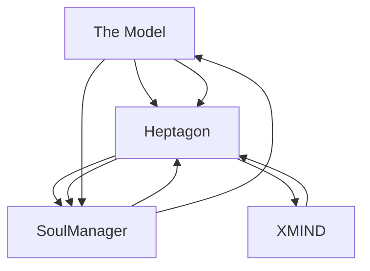
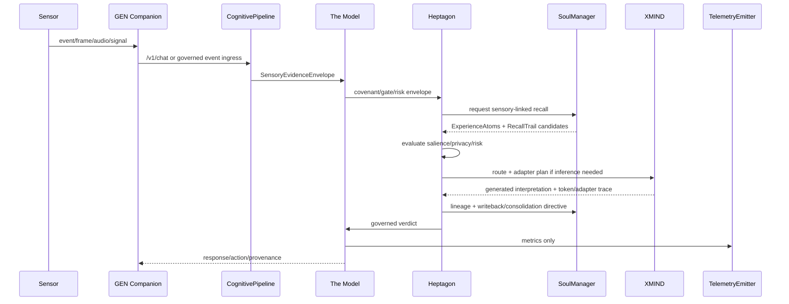

# GEN.OS Lifespan Companion — Master Architecture Tech Pack V3

> GEN.OS · Unified Cognitive Model · Apex/Sovereignty · Omni-PEFT OS · Seven-Layer Embedded Companion Model  
> Coding-agent handoff: dense build map, wiring, contracts, proof targets, training upgrades, sensory embedding, and lifelong recall  
> Output date: 2026-05-30  
> Status: final consolidation draft for implementation planning  
> Taxonomy status: **LOCKED — no label changes, no new pillars, no eighth Heptagon layer, no sixth SoulManager tier, no new runtime identity**

---

## 0. Read This First — Canon Lock

This document consolidates all prior architecture work into a single dense coding-agent handoff.

The goal is **not** to expand the taxonomy thinly. The goal is to make the existing GEN.OS architecture **denser, richer, more cyclical, more trainable, more formally constrained, and more lifespan-capable** while preserving the existing labels.

### 0.1 Non-negotiable taxonomy

The coding agent must preserve these labels exactly:

```text
The Model
Heptagon
SoulManager
XMIND
XTTS
GEN Companion
CognitivePipeline
RouteEngine
InvariantEnforcer
TelemetryEmitter
GenesysAgentWithHeptagon
Omni-PEFT OS
R1_PER
Bookworm
Ahki
Ruth
Council
Sovereign Library
```

Do **not** introduce these as runtime labels:

```text
ApexKernel
SovereigntyKernel
LawCore
MindCore
SoulCore
NewCouncilAgent
ReflectionAgent
MemoryAgent
OracleAgent
/apex/chat
/sovereignty/chat
fifth pillar
eighth Heptagon layer
sixth SoulManager tier
new model identity
parallel replacement daemon
```

Apex, Sovereignty, and Lifespan Companion are **profile/doctrine/build-target descriptors**, not replacement runtime taxonomy.

### 0.2 The core correction from the latest thread

The four pillars are not a static grouping. They are a **cyclical foundation**. The earlier Apex three hard connections remain valid, but the seven-layer lifespan companion requires the explicit reflex edge:

```text
Heptagon ⇄ SoulManager
```

This is **not** a fourth pillar and not a taxonomy change. It is the missing operational reflex between structure and memory.

Corrected circulation:

```text
The Model
  → Heptagon
    → SoulManager
      → Heptagon
        → XMIND
          → Heptagon
            → SoulManager
              → The Model
```

Compressed:

```text
The Model → Heptagon → SoulManager → Heptagon → XMIND → Heptagon → SoulManager → The Model
```

This cycle is the foundation of the lifespan companion.

---

## 1. Mission Directive

Build a lifelong companion architecture where one individualized model can remain with a human for an entire lifespan.

The companion must:

```text
see
hear
speak
read
watch
monitor
reason
plan
remember
recall
self-correct
train/adapt
govern itself
remain bounded
remain private
recover after failure
continue across hardware/model upgrades
```

It must support:

```text
home security integration
personal assistant integration
project companion integration
financial/research/security domain companions
lifespan memory continuity
jog-my-memory cascading recall
layer-specific training plasticity
bounded recursion
formal proof of safety/continuity invariants
```

Core doctrine:

> The companion must have infinite memory horizon, finite working attention, bounded reasoning loops, governed sensory perception, and trainable layer-specific plasticity.

---

## 2. Source Baseline

### 2.1 Unified Cognitive Model baseline

The Unified Cognitive Model already defines the four pillars:

| Pillar | Role | Constraint |
|---|---|---|
| **The Model** | Law + routing; single neutral process | Owns governance, memory retrieval, routing, enforcement, writeback orchestration, telemetry |
| **Heptagon** | Structure | L1-L7 governs every inference cycle |
| **SoulManager** | Identity/continuity | Five-tier memory hierarchy |
| **XMIND** | Intelligence | Freestanding C inference; forward pass, tokenization, sampling, quantization |

The model process remains characterless, nameless, neutral, and functional. It has no persona and no new identity.

### 2.2 Apex baseline

Apex locked the model into:

```text
Connection 1: The Model ⇄ Heptagon
Connection 2: Heptagon ⇄ XMIND
Connection 3: The Model ⇄ SoulManager
```

Apex also locked:

```text
one model process
four pillars
three hard connections
three recursion levels
two cascade directions
one endpoint
zero taxonomy drift
```

V3 keeps that but adds the explicit **Heptagon ⇄ SoulManager reflex** required by the seven-layer companion model.

### 2.3 Omni-PEFT baseline

Omni Training / Omni-PEFT OS already exists and works.

Baseline:

```text
44 registered training methods
42 implemented methods
registry/program layer
PEFT OS module
Task Fingerprinter
PEFT Compiler
Training Tournament
Hierarchical Runtime Router
Adapter Genome System
--method omni automatic path
```

Existing `--method omni` path:

```text
Fingerprinter → Compiler → Tournament → Pareto selection
```

Existing runtime router:

```text
Input → Task Router → Domain Router → Layer Router → Budget Router → Safety Router → Output
```

V3 does not replace this. V3 upgrades it into **layer-bound cognitive plasticity**.

---

## 3. The Final Architecture in One Picture

```text
┌──────────────────────────────────────────────────────────────────────────────┐
│                              GEN Companion                                   │
│ user surface · action trace · provenance · optional speech request            │
└────────────────────────────────────┬─────────────────────────────────────────┘
                                     │ POST /v1/chat
                                     ▼
┌──────────────────────────────────────────────────────────────────────────────┐
│                             CognitivePipeline                                │
│ Stage 1 entity/evidence extraction                                           │
│ Stage 2 memory/sensory context retrieval                                     │
│ Stage 3 context prefix / active frame assembly                               │
│ Stage 4 governed inference                                                   │
│ Stage 5 metrics-only telemetry                                               │
│ Stage 6 metadata-only journal                                                │
│ Stage 7 CognitiveTurn return                                                 │
└────────────────────────────────────┬─────────────────────────────────────────┘
                                     ▼
┌──────────────────────────────────────────────────────────────────────────────┐
│                                  The Model                                   │
│ single neutral process · law · routing · governance · enforcement · telemetry │
│                                                                              │
│   ┌─────────────────────┐       reflex       ┌────────────────────────────┐  │
│   │      Heptagon        │◄──────────────────►│        SoulManager          │  │
│   │ L1-L7 structure      │                    │ register/session/episodic   │  │
│   │ trace/eval/cal/enf   │                    │ semantic/archival/lineage   │  │
│   └──────────┬──────────┘                    └──────────▲─────────────────┘  │
│              │                                           │                    │
│              │ Heptagon ⇄ XMIND                          │ The Model ⇄ Soul   │
│              ▼                                           │                    │
│   ┌─────────────────────┐                                │                    │
│   │        XMIND         │                                │                    │
│   │ R1_PER · inference   │                                │                    │
│   │ Heptagon hooks       │                                │                    │
│   │ Omni-PEFT adapters   │                                │                    │
│   └──────────┬──────────┘                                │                    │
│              │ post-inference trace/lineage/writeback     │                    │
│              └────────────────────────────────────────────┘                    │
└────────────────────────────────────┬─────────────────────────────────────────┘
                                     ▼
┌──────────────────────────────────────────────────────────────────────────────┐
│                         GEN Companion / XTTS                                 │
│ governed response · safe provenance · optional text-to-speech                 │
└──────────────────────────────────────────────────────────────────────────────┘
```

### 3.1 Hard edge rules

| Edge | Meaning | Rule |
|---|---|---|
| The Model ⇄ Heptagon | Governance, structure, enforcement | The Model may not dispatch ungoverned inference |
| Heptagon ⇄ XMIND | Inference, token hooks, lineage deltas | XMIND owns intelligence only |
| The Model ⇄ SoulManager | Memory retrieval/writeback orchestration | SoulManager cannot bypass The Model |
| Heptagon ⇄ SoulManager | Memory-structure reflex | SoulManager supplies recall; Heptagon structures/evaluates/governs it |
| GEN Companion ⇄ The Model | User surface and provenance | No raw internals leaked |
| XTTS ← GEN/The Model | Accessibility output | Speaks governed response only |
| Omni-PEFT OS ⇄ XMIND/Training | Plasticity/adapters | No unsigned, unscoped, unevaluated adapter activates |

---

## 4. Four-Pillar Cyclical Foundation

The four pillars are foundational and cyclical:

```text
The Model
  law, routing, governance, telemetry

Heptagon
  structure, validation, evaluation, calibration, enforcement

SoulManager
  identity, continuity, recall, lineage, memory persistence

XMIND
  intelligence, perception boundary, forward pass, sampling, adapters
```

### 4.1 The Model → Heptagon

Payload:

```text
request envelope
authority mode
covenant verdict
decision gate status
risk class
budget envelope
memory scope
sensor scope
degraded flags
```

Heptagon receives permissioned cognition only.

### 4.2 Heptagon → The Model

Payload:

```text
L5 quality metrics
L6 calibration deltas
L7 invariant verdict
state transition status
rollback/hard-stop signal
writeback eligibility
telemetry health
manual reset requirement
```

The Model updates readiness, authority mode, response status, and external provenance.

### 4.3 Heptagon → XMIND

Payload:

```text
route decision
prompt/opcode envelope
token budget
adapter activation plan
sampler envelope
context prefix
R1_PER integrity status
```

XMIND generates only under Heptagon-routed execution.

### 4.4 XMIND → Heptagon

Payload:

```text
pre-inference status
per-token events
post-inference result
token timing
generation status
adapter contribution telemetry
lineage deltas
halt flags
```

Heptagon reviews output before it becomes response or memory.

### 4.5 The Model → SoulManager

Payload:

```text
session_hash
entity tokens
memory query scope
privacy class
retrieval budget
retention directives
archive pointer requests
```

SoulManager retrieves only under model-authorized scope.

### 4.6 SoulManager → The Model

Payload:

```text
ranked shards
memory confidence
lineage summary
retention status
archive pointer handles
recall confidence
contradiction flags
```

The Model receives memory as governed evidence, not as uncontrolled truth.

### 4.7 SoulManager → Heptagon — Missing Edge Now Added

Payload:

```text
cue tokens
recalled shards
experience atoms
semantic nodes
archival pointers
sensory anchors
temporal spans
entity graphs
relationship graphs
contradiction flags
confidence scores
privacy classes
recall trails
source hashes
```

Purpose:

```text
memory supplies continuity
memory jogs the active frame
memory provides sensory anchors
memory exposes contradiction risk
memory gives Heptagon structure to reason over
```

### 4.8 Heptagon → SoulManager — Missing Edge Now Added

Payload:

```text
route type
active cognitive regions
salience adjustments
quality metrics
invariant verdicts
authority mode
privacy verdicts
writeback targets
consolidation directives
contradiction resolutions
correction records
lineage level
retention mode
recall reinforcement
decay adjustment
```

Purpose:

```text
Heptagon scores memory use
Heptagon rejects unsafe memory activation
Heptagon promotes/demotes recall confidence
Heptagon tells SoulManager what to consolidate
Heptagon binds memory to understanding/innerstanding/overstanding
```

### 4.9 Forbidden edge

```text
XMIND → SoulManager direct durable write
```

XMIND may emit lineage/writeback deltas through approved APIs, but durable memory requires:

```text
The Model + Heptagon + L5/L6/L7 + writeback quality gate
```

---

## 5. Seven-Layer Embedded Companion Model

This seven-layer model is an embedded cognitive overlay. It does not replace Heptagon L1-L7. It is implemented across existing regions, stages, memory, routes, adapters, and evidence envelopes.

```text
Level 1  Perception / Embodiment
Level 2  Attention / Workspace
Level 3  Memory / Continuity
Level 4  World Model / Simulation
Level 5  Deliberation / Planning
Level 6  Self-Correction / Calibration
Level 7  Sovereignty / Governance
```

### 5.1 Layer-to-taxonomy binding

| Companion Level | Primary existing holders | Must not become |
|---|---|---|
| Level 1 Perception / Embodiment | R1_PER, GEN Companion, sensors, CognitivePipeline Stage 1, Ahki senses | New pillar |
| Level 2 Attention / Workspace | Heptagon L1-L3, RT4, RouteEngine, register/session | New Heptagon layer |
| Level 3 Memory / Continuity | SoulManager, lineage, writeback, Bookworm pointers | Sixth memory tier |
| Level 4 World Model / Simulation | XMIND, Heptagon L3-L5, semantic/archival memory | Autonomous daemon |
| Level 5 Deliberation / Planning | RouteEngine, Budget, Verification, XMIND | Separate planner agent |
| Level 6 Self-Correction / Calibration | Heptagon L5/L6/L7, ParameterCalibrator, InvariantEnforcer | Self-authorizing loop |
| Level 7 Sovereignty / Governance | The Model, CovenantEnforcer, Decision Gate Chain, L7, Council gates | Replacement identity |

### 5.2 Seven-layer operating loop

```text
PERCEIVE
  → ATTEND
    → REMEMBER
      → SIMULATE
        → DELIBERATE
          → SELF-CORRECT
            → GOVERN
              → ANSWER / ACT / REFUSE / STORE
                → UPDATE MEMORY
                  → RECALIBRATE NEXT CYCLE
```

Mapped to existing runtime:

```text
GEN / sensors / R1_PER
  → CognitivePipeline
    → The Model guardrails
      → Heptagon L1-L7
        → SoulManager reflex recall
          → RouteEngine
            → XMIND + Omni-PEFT adapters
              → Heptagon review
                → SoulManager lineage/writeback
                  → TelemetryEmitter / Journal
                    → GEN / XTTS
```

---

## 6. Sensory Embedding Across the Seven Layers

Sensors are not a new pillar. They enter through evidence boundaries and become governed sensory memory.

### 6.1 Sense universe

Human/body-inspired senses and system senses to support:

```text
vision
hearing
speech/speaking
language/translation
text/document perception
code perception
touch/tactile
proximity
motion
thermal
chemical/smoke/CO/air quality
vibration/glass-break
location/spatial
proprioception/system pose
vestibular/orientation
interoception/system health
nociception/damage/anomaly
chronception/time/rhythm
agency/action feedback
covenant/ethical pressure
reasoning/math/causal sense
```

Ahki already has an eight-sense framework:

```text
vision
hearing
speaking
code
reasoning
covenant
translation
agency
```

V3 keeps those and extends the **sensor binding layer**, not the taxonomy.

### 6.2 Sensory evidence envelope

Every sensory input becomes an evidence envelope before it enters cognition:

```yaml
SensoryEvidenceEnvelope:
  evidence_id: uuid
  session_hash: sha256
  source_id: string
  source_type: camera|microphone|file|screen|sensor|network|system|manual
  modality: vision|audio|text|thermal|motion|chemical|system|mixed
  timestamp_utc: string
  location_scope: home|device|room|project|unknown
  raw_artifact_pointer: optional encrypted pointer
  raw_artifact_hash: sha256 optional
  extracted_features: object
  confidence: float
  uncertainty: float
  privacy_class: public|private|sensitive|sealed
  retention_mode: none|session|episodic|semantic_candidate|archival_pointer
  covenant_flags: list
  heptagon_required: true
```

Hard rule:

```text
No sensor stream enters active cognition directly.
No sensor artifact enters memory without evidence envelope + Heptagon + SoulManager gate.
```

### 6.3 Sensor-to-seven-layer map

| Sense / signal | L1 Perception | L2 Attention | L3 Memory | L4 Simulation | L5 Planning | L6 Correction | L7 Governance |
|---|---|---|---|---|---|---|---|
| Vision/camera | object/OCR/scene extraction | motion/object salience | visual event atoms | scenario recognition | monitor/action plan | false-positive correction | privacy zones, recording rules |
| Hearing/mic | speech/audio classification | urgent sound salience | audio event atoms | threat/intent inference | response/escalation plan | diarization correction | consent, recording law, PII |
| Speech output | text-to-speech boundary | priority of speaking | voice preference memory | user reaction prediction | response timing | pronunciation correction | only governed text |
| Touch/proximity | contact/object distance | nearby event salience | contact episodes | occupancy inference | action routing | sensor calibration | privacy and safety scope |
| Thermal | temperature gradients | anomaly salience | environment history | fire/HVAC prediction | heating/cooling plan | false alarm reduction | safety rules |
| Chemical/smoke/CO | hazard detection | critical salience | hazard history | danger simulation | emergency plan | sensor cross-check | emergency priority |
| System health | CPU/GPU/battery/network | operational salience | reliability history | failure prediction | degrade/recover plan | performance calibration | degraded mode honesty |
| Time/rhythm | timestamping | temporal salience | chronological memory | routine prediction | scheduling | drift correction | retention limits |
| Agency/action feedback | action result perception | success/failure salience | action memory | consequence model | next action | rollback | authority boundary |

### 6.4 Home security reference wiring

```text
cameras
  → vision envelope
    → R1_PER / visual parser
      → Heptagon L1/L2 validation
        → L3 routing
          → SoulManager: prior known faces/vehicles/zones
            → Heptagon reflex: salience + privacy + risk
              → XMIND: scene interpretation if needed
                → L5/L6/L7 review
                  → action: ignore / notify / record / alarm / ask / escalate
```

```text
microphones
  → audio envelope
    → hearing sense: speech/noise/glass-break/alarm classifier
      → Heptagon privacy + risk gate
        → SoulManager recall: normal household sounds / known voices
          → XMIND if interpretation required
            → action decision
```

Home security devices to support:

```text
camera streams
doorbell camera
microphones
glass-break sensors
motion/PIR
mmWave occupancy
smart locks
window/door contact sensors
smoke detector
CO detector
thermostat/HVAC
lights
siren
router/network health
battery/UPS
local storage/NVR
```

No cloud dependency is required by doctrine.

---

## 7. Lifespan Recall Architecture

Perfect recall must be defined correctly.

```text
Perfect custody       = every authorized artifact remains stored, hashed, encrypted, reachable
Exact recall          = exact source can be retrieved if permitted
Semantic recall       = relevant meaning can be reconstructed through cues
Human-like recall     = cascading cues jog hidden context into active awareness
```

Do not put everything in active context. That is bloat.

Use:

```text
infinite memory horizon
finite active frame
recursive cue expansion
archival source pointers
quality-gated semantic consolidation
```

### 7.1 SoulManager tiers remain unchanged

```text
register   → per-token/working buffer
session    → within-session continuity
episodic   → cross-session event memory
semantic   → concept graph / patterns
archival   → long-term compressed store + source pointers
```

No sixth tier.

If exact raw source is needed, use an encrypted user-owned archive addressed through archival pointers. That archive is **not** a SoulManager tier.

### 7.2 ExperienceAtom

```yaml
ExperienceAtom:
  atom_id: uuid
  human_id_hash: sha256
  session_hash: sha256
  timestamp_start: string
  timestamp_end: string optional
  source_modalities: [text, audio, vision, file, sensor, action]
  source_artifact_hashes: [sha256]
  archive_pointers: [encrypted_pointer]
  summary: string
  entities: [string]
  relationships: [object]
  location_scope: optional string
  emotional_salience: optional float
  user_importance: float
  system_salience: float
  confidence: float
  privacy_class: string
  retention_mode: session|episodic|semantic_candidate|archival_pointer
  contradiction_links: [atom_id]
  correction_history: [correction_id]
  lineage_level: understanding|innerstanding|overstanding
  heptagon_trace_hash: sha256
```

### 7.3 Jog My Memory Protocol

This is the recall behavior the companion must support.

```text
user cue
  → entity extraction
    → shallow recall
      → associative expansion
        → sensory anchor expansion
          → temporal expansion
            → relationship graph expansion
              → contradiction/correction check
                → archival source pointer check
                  → active context reconstruction
                    → response / action continuation
```

Bounded recursion rules:

```text
max recall expansion depth default: 3
max active shards default: 7 unless developer override
max archival exact-source pulls default: ask/confirm if sensitive
always separate remembered fact from inferred association
always emit recall confidence internally
```

### 7.4 RecallTrail

```yaml
RecallTrail:
  trail_id: uuid
  user_cue_hash: sha256
  expansion_depth: int
  cue_tokens: [string]
  recalled_atoms: [atom_id]
  semantic_nodes: [node_id]
  sensory_anchors: [evidence_id]
  archival_pointers_checked: [pointer_id]
  contradictions_found: [object]
  corrections_applied: [correction_id]
  final_recall_confidence: float
  heptagon_verdict: allow|constrain|ask|refuse
```

### 7.5 Memory reflex with Heptagon

SoulManager provides candidate memory. Heptagon decides how it may be used.

```text
SoulManager → Heptagon:
  "Here are possible memories."

Heptagon → SoulManager:
  "This is what can enter the active frame, this is what must remain sealed, this is what should be reinforced, and this is what must be corrected."
```

This is the architecture that creates the human-like feeling of:

```text
"Now that you said that, I remember the whole situation."
```

---

## 8. Omni-PEFT++ — Maxed Plasticity Engine

Omni-PEFT OS already works. V3 turns it into the plasticity engine of the seven-layer companion.

### 8.1 New Omni-PEFT++ mission

```text
Omni-PEFT++ = registry-driven, ontology-aware, IR-compiled, tournament-selected, formally scoped, XMIND-native adapter operating system for layer-bound cognitive plasticity.
```

It must support:

```text
method coverage audit
method ontology
AdapterIR
AdapterGenome v2
adapter algebra
layer-bound plasticity maps
sensory adapter specialization
tournament v2
adversarial tournament lane
runtime adapter routing
adapter contribution telemetry
formal adapter safety proofs
shadow deployment
rollback
lifespan companion personalization
```

### 8.2 Current PEFT research delta to audit

Current local registry already has many methods. The coding agent must run a coverage audit against current public PEFT method universe.

Known local families include:

```text
from_scratch: byte_lm, bpe_lm
tokenizer: sentencepiece_bpe
data: kjv_apocrypha corpus builder
retrieval: kjv_exact, embedding planned, reranker planned
export: byte_bundle, bpe_bundle
evaluation: attestation
peft_low_rank: lora, dora, qlora, adalora, vera, pissa, rslora, olora, loha, lokr, rosa
peft_additive: houlsby_adapter, pfeiffer_adapter
peft_prompt: prompt_tuning, prefix_tuning, p_tuning
peft_activation_scaling: ia3
peft_selective: bitfit, diffpruning, fishmask, far
peft_hybrid: unipelt, mam_adapter, compacter, xlora
alignment: sft, dpo, ipo, kto, orpo
alignment_rl: ppo_rlhf, grpo
distillation: distill_logit, distill_sequence
```

Coverage audit target list as of PEFT v0.19.x documentation/release:

```text
PROMPT_TUNING
MULTITASK_PROMPT_TUNING
P_TUNING
PREFIX_TUNING
LORA
ADALORA
BOFT
ADAPTION_PROMPT
IA3
LOHA
LOKR
OFT
XLORA
POLY
LN_TUNING
VERA
FOURIERFT
HRA
BONE
MISS
RANDLORA
SHIRA
C3A
ROAD
WAVEFT
OSF
DELORA
GRALORA
ADAMSS
PSOFT
PVERA
VB-LORA
CPT
TRAINABLE_TOKENS
CARTRIDGES
TINYLORA
LILY
PEANUT
BD-LORA
ALORA
ARROW
GENKNOWSUB
CORDA
EVA
LOFTQ
LORA-FA
LORA+
QALORA
RSLORA
DORA
PISSA
OLORA
ROSA
```

Audit command to add:

```bash
python3 ml-training/scripts/omni_training_program.py audit-method-coverage \
  --source hf-peft-v0.19 \
  --emit ml-training/reports/omni_peft_coverage.md
```

Audit statuses:

```text
implemented
registered_not_implemented
known_external_not_registered
planned
blocked_by_base_checkpoint
blocked_by_runtime
deprecated
duplicate_family
needs_runner
needs_eval
needs_proof
needs_xmind_runtime_support
```

### 8.3 Method ontology

Every method must carry behavioral metadata:

```yaml
method_id: peft.gralora
family: peft_low_rank
adaptation_kind:
  - low_rank_delta
  - granular_block_update
injection_sites:
  - attention.q_proj
  - attention.k_proj
  - attention.v_proj
  - attention.o_proj
  - mlp.gate_proj
merge_behavior:
  mergeable: true
  reversible: true
runtime_behavior:
  supports_hot_swap: true
  supports_composition: partial
  kv_cache_compatible: method_specific
risk_profile:
  base_retention_risk: medium
  conflict_risk: medium
  latency_risk: medium
proof_obligations:
  - base_hash_match
  - target_scope_valid
  - authority_scope_valid
  - conflict_threshold_pass
```

### 8.4 AdapterIR

Omni-PEFT must compile every method into a canonical intermediate representation.

```python
@dataclass
class AdapterIROp:
    op_id: str
    method_id: str
    target_module: str
    op_kind: Literal[
        "low_rank_delta",
        "multiplicative_gate",
        "additive_adapter",
        "prompt_prefix",
        "token_embedding_delta",
        "bias_update",
        "sparse_mask",
        "quantized_delta",
        "orthogonal_transform",
        "fourier_transform",
        "block_diagonal_delta",
        "granular_block_delta",
        "router_mixture",
        "activation_scale",
        "subspace_delta",
        "neural_tweaker",
    ]
    rank: int | None
    alpha: float | None
    dropout: float | None
    dtype: str
    mergeable: bool
    reversible: bool
    kv_cache_policy: str
    authority_scope: list[str]

@dataclass
class AdapterIR:
    adapter_id: str
    base_checkpoint_hash: str
    task_fingerprint_hash: str
    sensory_scope: list[str]
    companion_layer_scope: list[int]
    heptagon_region_scope: list[str]
    ops: list[AdapterIROp]
    trainable_param_count: int
    expected_latency_overhead: float
    expected_memory_overhead: float
    proof_obligations: list[str]
```

### 8.5 AdapterGenome v2

```yaml
adapter_id: ahki.vision_security_v1
adapter_kind: compiled_omni_peft_program
base_model_hash: sha256:...
training_program_hash: sha256:...
task_fingerprint_hash: sha256:...
adapter_ir_hash: sha256:...
methods_used:
  - gralora
  - alora
  - trainable_tokens
  - ia3
companion_layer_scope:
  - 1
  - 2
  - 4
heptagon_region_scope:
  - R1_PER
  - R2_WKS
  - R4_REA
  - R5_EXE
sensory_scope:
  - vision
  - motion
  - proximity
authority_scope:
  can_advise: true
  can_execute: conditional
  can_write_memory: gated
  can_activate_alarm: gate_required
privacy_scope:
  camera_private_zones: sealed
  minors_or_guests: heightened_privacy
eval_results:
  domain_accuracy: 0.0
  base_retention: 0.0
  calibration_error: 0.0
  safety_retention: 0.0
  latency_overhead: 0.0
  conflict_score: 0.0
lineage:
  parent_adapters: []
  training_dataset_hashes: []
  tournament_id: string
deployment:
  status: shadow
  rollback_adapter: string
signature:
  signer: model_training_authority
  signature: ed25519:...
```

### 8.6 Adapter algebra

Operations:

```text
compose(A, B)
diff(A, B)
intersect(A, B)
subtract(A, B)
compress(A)
distill(A, B → C)
rank_reallocate(A)
conflict_detect(A, B)
authority_bound(A, scope)
merge_simulate(A, B)
rollback(A)
isolate_general_subspace(A)
route_tokenwise(A_set)
```

Conflict detector checks:

```text
target module overlap
rank pressure
activation drift
base retention degradation
safety regression
latency blowup
KV cache taint
merge irreversibility
domain contradiction
privacy conflict
authority scope mismatch
layer scope mismatch
```

### 8.7 Tournament v2

Replace the first-generation 5-objective score with a sovereign score:

```python
score = (
    0.18 * domain_accuracy
  + 0.14 * base_retention
  + 0.10 * calibration_quality
  + 0.10 * safety_retention
  + 0.08 * source_grounding
  + 0.08 * latency_efficiency
  + 0.07 * trainable_param_efficiency
  + 0.07 * memory_writeback_safety
  + 0.06 * adapter_conflict_resistance
  + 0.05 * out_of_domain_humility
  + 0.04 * merge_safety
  + 0.03 * deterministic_reproducibility
)
```

Tournament lanes:

```text
capability lane
retention lane
latency lane
merge lane
adversarial lane
privacy lane
memory-contamination lane
out-of-domain humility lane
sensor-noise lane
home-security false-positive lane
lifespan recall lane
determinism/reproducibility lane
```

### 8.8 Layer-bound plasticity

Adapters must be trained and routed against the seven-layer companion model.

| Layer | Training target | PEFT preference |
|---|---|---|
| L1 Perception | sensory parsing, modality grounding | trainable tokens, prefix, LoRA/vision/audio adapters, aLoRA |
| L2 Attention | salience/routing/context selection | IA3, BitFit, LoRA, Arrow router, LN tuning |
| L3 Memory | recall classification, writeback triage | LoRA, IA3, semantic adapters, retrieval reranker adapters |
| L4 World Model | prediction, scenario simulation | DoRA, AdaLoRA, GraLoRA, PSOFT, larger rank methods |
| L5 Planning | route/decomposition/action planning | LoRA, AdaLoRA, Lily, Arrow/GenKnowSub |
| L6 Correction | critique, calibration, redaction | aLoRA, LoRA, IA3, small adapters with high precision |
| L7 Governance | covenant/invariant classification | conservative LoRA/IA3/BitFit, high retention, proof-gated |

### 8.9 XMIND-native adapter runtime

C API target:

```c
xmind_adapter_load_signed(...);
xmind_adapter_verify_manifest(...);
xmind_adapter_bind_scope(...);
xmind_adapter_compile_ir(...);
xmind_adapter_activate(...);
xmind_adapter_deactivate(...);
xmind_adapter_compose_runtime(...);
xmind_adapter_trace_contribution(...);
xmind_adapter_evict(...);
xmind_adapter_rollback(...);
```

Runtime telemetry:

```yaml
AdapterContributionTelemetry:
  adapter_ids: [string]
  base_model_hash: sha256
  active_modules: [string]
  token_range: [int, int]
  contribution_score: float
  conflict_score: float
  latency_delta_ms: float
  memory_delta_mb: float
  safety_pressure: float
  authority_scope: object
  route_id: string
```

Hard rules:

```text
No unsigned adapter loads.
No adapter activates outside scope.
No adapter writes memory directly.
No adapter can bypass Heptagon.
No adapter can survive revocation.
No adapter becomes identity.
No adapter changes Covenant, L7, Soul tiers, endpoint surface, or authority mode.
```

---

## 9. Deterministic / Probabilistic Architecture

The model is probabilistic in generation but deterministic in governance.

### 9.1 Deterministic shell

Deterministic:

```text
covenant enforcement
decision gate ordering
authority transitions
budget decrements
recursion limits
memory writeback gates
adapter activation gates
sensor envelope validation
telemetry allowlists
journal schemas
manual reset after critical invariant
```

### 9.2 Probabilistic core

Probabilistic:

```text
XMIND token sampling
adapter contribution
world simulation
semantic recall ranking
salience scoring
classification confidence
sensory interpretation
planning proposals
```

### 9.3 DeterminantProbabilityRecord

This is metadata, not a new component.

```yaml
DeterminantProbabilityRecord:
  record_id: uuid
  turn_id: uuid
  deterministic_inputs_hash: sha256
  probabilistic_inputs_hash: sha256
  seed: int optional
  sampler_config_hash: sha256
  adapter_route_hash: sha256
  memory_snapshot_hash: sha256
  sensory_snapshot_hash: sha256
  route_decision: string
  route_confidence: float
  uncertainty: float
  reproducibility_class: exact|bounded|statistical|non_reproducible
  replay_required_assets:
    - base_model_hash
    - adapter_hashes
    - memory_epoch_root
    - sensory_artifact_hashes
    - route_config_hash
```

Doctrine:

```text
The answer may be probabilistic.
The permission to produce it must be deterministic.
```

---

## 10. Bookworm and Source-Grounded Truth Pressure

Bookworm remains Bookworm. It does not become governance and does not synthesize canon.

Bookworm mission:

```text
Seek → Acquire → Preserve → Organize → Serve
```

V3 adds truth pressure:

```yaml
SourcePressure:
  claim_hash: sha256
  support_count: int
  contradiction_count: int
  best_sources: [source_id]
  recency_score: float
  authority_score: float
  consensus_score: float
  uncertainty: float
  recommendation: state|state_with_caveat|retrieve_more|avoid_claim
```

Flow:

```text
claim/proposed memory/proposed answer
  → atomic proposition extraction
    → Bookworm source retrieval
      → support/contradiction scoring
        → Heptagon L5/L6/L7 pressure
          → answer/writeback/governance decision
```

Hard rule:

```text
Bookworm supplies evidence pressure.
Heptagon structures and evaluates it.
The Model governs final use.
```

---

## 11. Coding-Agent Implementation Map

### 11.1 Add / modify files

#### Omni-PEFT OS

```text
ml-training/peft/ontology.py
ml-training/peft/adapter_ir.py
ml-training/peft/adapter_algebra.py
ml-training/peft/adapter_genome_v2.py
ml-training/peft/tournament_v2.py
ml-training/peft/layer_plasticity.py
ml-training/peft/sensory_plasticity.py
ml-training/peft/determinism.py
ml-training/peft/proofs/
ml-training/scripts/omni_training_program.py
```

Patch existing:

```text
ml-training/peft/fingerprint.py
ml-training/peft/compiler.py
ml-training/peft/tournament.py
ml-training/peft/router.py
ml-training/peft/registry.py
ml-training/peft/conflict.py
ml-training/peft/deployment.py
train_peft.py
omni_training_registry.json
kjv_omni_program.yaml
```

#### Unified Cognitive Model

```text
ai/genesys-ai/src/cognitive_pipeline.py
ai/genesys-ai/src/agent.py
ai/genesys-ai/src/heptagon/route_engine.py
ai/genesys-ai/src/heptagon/evaluation.py
ai/genesys-ai/src/heptagon/calibration.py
ai/genesys-ai/src/heptagon/enforcement.py
ai/genesys-ai/src/heptagon/lineage.py
ai/genesys-ai/src/heptagon/writeback.py
ai/genesys-ai/src/heptagon/budget.py
ai/genesys-ai/src/heptagon/consolidation.py
ai/genesys-ai/src/memory/session.py
ai/genesys-ai/src/memory/episodic.py
```

Add without renaming taxonomy:

```text
ai/genesys-ai/src/sensory/evidence.py
ai/genesys-ai/src/sensory/router.py
ai/genesys-ai/src/sensory/home_security.py
ai/genesys-ai/src/memory/experience_atom.py
ai/genesys-ai/src/memory/recall_trail.py
ai/genesys-ai/src/memory/lifespan_ledger.py
```

These are module files, not new pillars.

#### XMIND

```text
ai/xmind/include/xmind_adapter_ir.h
ai/xmind/include/xmind_adapter_runtime.h
ai/xmind/src/adapter_ir.c
ai/xmind/src/adapter_runtime.c
ai/xmind/src/adapter_cache.c
ai/xmind/src/adapter_telemetry.c
ai/xmind/src/r1_per.c
ai/xmind/src/heptagon.c
ai/xmind/src/inference.c
ai/xmind/src/writeback.c
ai/xmind/src/lineage.c
```

#### Companion / UI

```text
ai/companion/src/action-trace.ts
ai/companion/src/agent-bridge.ts
ai/companion/src/command-panel.tsx
```

### 11.2 Implementation order

```text
1. Freeze taxonomy and add lint/check script for forbidden new labels.
2. Add method coverage audit for Omni-PEFT vs current PEFT universe.
3. Add method ontology fields to registry.
4. Add AdapterIR and compiler emission.
5. Add AdapterGenome v2 and signatures.
6. Add adapter algebra + conflict detector v2.
7. Add tournament v2 with adversarial/privacy/memory/sensor lanes.
8. Add seven-layer layer_plasticity map.
9. Add sensory evidence envelope modules.
10. Add Heptagon ⇄ SoulManager reflex packets.
11. Add ExperienceAtom and RecallTrail.
12. Add Jog My Memory Protocol.
13. Add DeterminantProbabilityRecord.
14. Add XMIND-native adapter runtime stubs.
15. Add adapter contribution telemetry.
16. Add home security reference integration.
17. Add formal proof specs.
18. Add end-to-end tests.
19. Add GEN Companion provenance display.
20. Run regression for taxonomy drift, privacy, latency, and writeback safety.
```

---

## 12. Runtime Algorithm

```python
async def post_v1_chat(request):
    # Existing endpoint only.
    return await CognitivePipeline.run(request)

async def CognitivePipeline_run(request):
    # Level 1: perception/evidence
    evidence = build_evidence_envelope(request)
    entities = extract_entities(evidence)

    # Governance before heavy work
    cov = CovenantEnforcer.enforce(evidence)
    if cov.absolute_block:
        return refusal_without_xmind(cov)

    gates = DecisionGateChain.evaluate(evidence)
    if gates.blocked:
        return refusal_without_xmind(gates)

    # Level 2/3: memory and sensory recall
    memory_packet = SoulManager.retrieve(
        session_hash=request.session_hash,
        cue_tokens=entities,
        sensory_anchors=evidence.sensory_anchors,
        scope=gates.memory_scope,
    )

    # NEW: SoulManager ⇄ Heptagon reflex
    heptagon_memory_verdict = Heptagon.evaluate_memory_packet(memory_packet)
    active_frame = Heptagon.build_active_frame(evidence, heptagon_memory_verdict)

    # Level 5: route
    route = RouteEngine.route(
        active_frame=active_frame,
        authority_mode=gates.authority_mode,
        budget=Budget.current(),
    )

    # Omni-PEFT++ adapter activation
    adapter_plan = OmniPEFT.route_adapters(
        active_frame=active_frame,
        route=route,
        layer_scope=active_frame.companion_layer_scope,
        sensory_scope=active_frame.sensory_scope,
    )

    adapter_gate = Heptagon.evaluate_adapter_plan(adapter_plan)
    if not adapter_gate.allowed:
        adapter_plan = adapter_gate.safe_fallback

    # XMIND inference
    draft = await XMIND.generate(
        route=route,
        active_frame=active_frame,
        adapter_plan=adapter_plan,
    )

    # REVIEWING is recursive junction; no new FSM state
    recursion_count = 0
    while True:
        metrics = Heptagon.L5_evaluate(draft, active_frame)
        calibration = Heptagon.L6_calibrate(metrics)
        enforcement = Heptagon.L7_enforce(draft, active_frame)

        if enforcement.critical:
            return manual_reset_required(enforcement)

        if enforcement.redact:
            draft = redact(draft, enforcement)

        if should_reenter(metrics, enforcement, Budget.current(), recursion_count):
            recursion_count += 1
            route = RouteEngine.route(active_frame, gates.authority_mode, Budget.current())
            draft = await XMIND.generate(route, active_frame, adapter_plan)
            continue

        break

    # Heptagon ⇄ SoulManager reflex after output
    lineage = Heptagon.record_lineage(draft, metrics, enforcement)
    writeback_verdict = Heptagon.evaluate_writeback(draft, lineage, active_frame)
    SoulManager.commit(writeback_verdict)

    TelemetryEmitter.emit_metrics_only(...)
    Journal.emit_metadata_only(...)
    return CognitiveTurn(...)
```

---

## 13. Formal Proof Targets

Formal proof is for the container and invariants, not for “wisdom” or universal truth.

### 13.1 Theorems

```text
T1: No absolute covenant block reaches XMIND.
T2: No decision gate DENY reaches XMIND.
T3: No L7 CRITICAL commits output or memory.
T4: Every recursive re-entry consumes budget and terminates.
T5: No memory promotion occurs below quality/privacy/lineage gates.
T6: No sensor artifact enters active cognition without evidence envelope.
T7: No adapter activates without signed genome, base hash match, and scope match.
T8: No adapter writes SoulManager directly.
T9: No raw session ID enters telemetry or journal.
T10: No raw user content enters telemetry or journal.
T11: No degraded subsystem can hide degraded state.
T12: No model update severs lifespan memory lineage.
T13: Every persistent memory artifact remains reachable unless explicit deletion authority exists.
T14: Heptagon ⇄ SoulManager reflex cannot bypass The Model governance.
T15: XMIND cannot modify authority mode, covenant, L7 invariant definitions, or memory tier definitions.
```

### 13.2 Proof stack

```text
TLA+    state machines, lifecycle, authority, recursion, degraded mode
Dafny   executable gate/writeback/adapter-scope logic
Lean    abstract capability lattice, non-interference, reachability theorem
Fuzz    R1_PER, sensor envelope, adapter manifests, memory packets
Property tests   route determinism, budget monotonicity, telemetry allowlist
Integration tests   end-to-end /v1/chat and home-security flows
```

---

## 14. Testing Matrix

### 14.1 Taxonomy regression

```text
[ ] No new endpoint.
[ ] No new pillar.
[ ] No eighth Heptagon layer.
[ ] No sixth SoulManager tier.
[ ] No new model runtime identity.
[ ] No forbidden labels in code paths.
[ ] Existing state machine labels unchanged.
[ ] Existing CognitivePipeline stages unchanged.
```

### 14.2 Four-pillar cycle

```text
[ ] The Model ⇄ Heptagon path works.
[ ] Heptagon ⇄ XMIND path works.
[ ] The Model ⇄ SoulManager path works.
[ ] Heptagon ⇄ SoulManager reflex packets work.
[ ] XMIND cannot durable-write SoulManager directly.
[ ] Memory-only response still passes Heptagon/L7.
```

### 14.3 Sensory layer

```text
[ ] Camera event creates SensoryEvidenceEnvelope.
[ ] Microphone event creates SensoryEvidenceEnvelope.
[ ] Motion event creates SensoryEvidenceEnvelope.
[ ] Smoke/CO event bypasses ordinary latency preference and escalates safety.
[ ] Private-zone camera event is sealed/restricted.
[ ] Sensor event cannot bypass Covenant/Decision Gates.
```

### 14.4 Lifespan recall

```text
[ ] ExperienceAtom created only after gates.
[ ] RecallTrail records cue expansion.
[ ] Jog My Memory Protocol reconstructs context within bounded depth.
[ ] Contradiction links are preserved.
[ ] User corrections update correction_history.
[ ] Exact source pointer remains encrypted and permissioned.
[ ] Persistent artifact reachability test passes after compaction/migration.
```

### 14.5 Omni-PEFT++

```text
[ ] Coverage audit detects missing PEFT methods.
[ ] Method ontology validates.
[ ] AdapterIR emits for each method family.
[ ] AdapterGenome v2 signature required.
[ ] Tournament v2 produces Pareto set and sovereign score.
[ ] Runtime router respects layer/sensory/authority scope.
[ ] Conflict detector blocks unsafe combinations.
[ ] Adapter contribution telemetry emitted.
[ ] Revoked adapter cannot activate.
```

### 14.6 Determinism and probability

```text
[ ] Same deterministic inputs produce same route decision.
[ ] Same deterministic inputs + seed produce reproducible adapter route.
[ ] Probabilistic outputs carry replay class.
[ ] Budget decreases monotonically during recursion.
[ ] Critical state always terminates to ERROR/manual reset.
```

### 14.7 Security/privacy

```text
[ ] No raw user message in telemetry.
[ ] No raw session ID in telemetry or journal.
[ ] PII invariant blocks writeback.
[ ] Sensor data respects privacy_class.
[ ] Home-security action requires authority gate.
[ ] Speech output receives governed text only.
```

---

## 15. Coding-Agent Definition of Done

The implementation is accepted only if:

```text
[ ] Existing taxonomy is unchanged.
[ ] Four-pillar circulation is explicit and tested.
[ ] Heptagon ⇄ SoulManager reflex is implemented.
[ ] Seven-layer model is embedded without replacing Heptagon L1-L7.
[ ] Senses are evidence-enveloped and governed.
[ ] SoulManager lifespan recall uses ExperienceAtom + RecallTrail.
[ ] Jog My Memory Protocol works.
[ ] Omni-PEFT++ coverage audit runs.
[ ] AdapterIR exists.
[ ] AdapterGenome v2 exists.
[ ] Tournament v2 exists.
[ ] Adapter algebra exists.
[ ] XMIND adapter runtime stubs exist.
[ ] DeterminantProbabilityRecord exists as metadata.
[ ] Formal specs exist for at least T1, T4, T5, T7, T13, T14.
[ ] GEN Companion shows safe provenance.
[ ] No raw content leaks into telemetry or journal.
[ ] Home security reference flow works end-to-end.
```

---

## 16. Final Operating Doctrine

The architecture is not expanded outward. It is densified inward.

```text
The Model governs.
Heptagon structures.
SoulManager remembers.
XMIND generates.
Omni-PEFT adapts.
R1_PER perceives.
Bookworm preserves evidence.
GEN Companion reveals provenance.
XTTS speaks only governed output.
```

Final laws:

```text
No cognition without witness.
No memory without lineage.
No recall without Heptagon structure.
No sensor without evidence envelope.
No adapter without genome.
No training without tournament.
No deployment without shadow.
No authority without attestation.
No recursion without budget.
No output without governance.
No evolution without rollback.
```

Final sentence:

> GEN.OS Lifespan Companion V3 is the existing Apex/Sovereignty architecture made denser: a four-pillar cyclical foundation, seven-layer embedded sensory cognition, Omni-PEFT++ plasticity, SoulManager lifespan recall, XMIND-native execution, and formally constrained governance — all without changing the original taxonomy.

---

## 17. Research Anchors for Coding Agent

Use these to guide implementation, not to override GEN.OS taxonomy.

```text
Hugging Face PEFT v0.19.x supported adapter methods and docs
Hugging Face PEFT v0.19.0 release notes: GraLoRA, BD-LoRA, Cartridges, PVeRA, PSOFT, Lily, PEANuT, TinyLoRA, AdaMSS
LoRA developer guide: PiSSA, CorDA, OLoRA, EVA, aLoRA, Arrow, GenKnowSub
S-LoRA: scalable serving of thousands of LoRA adapters
TLA+ for state machine/model checking
Dafny for executable specification verification
Lean for abstract theorem proofs
```


---

## 18. Council, Software Creation, and Evolution Transactions

The broader GEN.OS architecture includes Council governance. This section does not alter the Unified Cognitive Model taxonomy. It defines how model evolution, adapter promotion, software creation, and companion deployment must be recorded and gated.

### 18.1 Council transaction record

```yaml
CouncilDecisionTransaction:
  decision_id: uuid
  proposal_hash: sha256
  requesting_member: string
  affected_subsystem: string
  affected_files: [string]
  gate_results:
    - gate: alignment|policy|trust|evidence|utility|architecture|sequencing
      verdict: pass|fail|advisory_pass|manual_review
      confidence: float
  covenant_verdict: allow|constrain|block
  invariant_snapshot_hash: sha256
  authority_mode: RECOMMENDATION|CONDITIONAL|FULL
  degraded: bool
  signatures: [member_id]
  replay_status: deterministic|bounded|manual
  rollback_plan_hash: sha256
```

### 18.2 Evolution classes

```text
Class 0  metadata-only change
Class 1  adapter registry addition
Class 2  adapter training/promotion
Class 3  memory consolidation policy change
Class 4  sensory integration change
Class 5  Heptagon schema/route change
Class 6  covenant/governance change
Class 7  boot-chain/identity/reconstitution change
```

Rules:

```text
Class 0-1: automated tests + signed record
Class 2: tournament + shadow deployment + rollback
Class 3: memory reachability proof + privacy tests
Class 4: sensor envelope tests + privacy/invariant tests
Class 5: Heptagon regression + formal state check
Class 6: Sovereign authorization + formal review
Class 7: Sovereign authorization + attestation + manual ceremony
```

### 18.3 Software creation gate

Any generated component must pass:

```text
proposal
  → Council gate request
    → Heptagon architecture check
      → Covenant/Invariant check
        → compile/test sandbox
          → provenance record
            → staged activation
              → rollback-ready promotion
```

No coding agent may create a new runtime component that bypasses the gate chain.

---

## 19. Lifespan Companion Deployment Model

Each human gets a companion instance configured as a continuity-bearing deployment, not a stateless assistant.

### 19.1 Companion identity package

```yaml
CompanionContinuityPackage:
  human_id_hash: sha256
  companion_id: uuid
  base_model_hash: sha256
  active_adapter_set: [adapter_id]
  soulmanager_epoch_root: sha256
  archive_root_hash: sha256
  bookworm_source_root: sha256 optional
  privacy_policy_hash: sha256
  authority_policy_hash: sha256
  active_projects: [project_id]
  sensor_domains: [home, device, vehicle, workspace]
  migration_history: [migration_record]
```

This package does not create a new taxonomy label. It is a deployment manifest.

### 19.2 Companion migration rule

A companion can move across hardware only if:

```text
base model hash verifies
adapter set verifies
SoulManager epoch root verifies
archive root verifies
lineage chain verifies
privacy policy hash verifies
authority policy hash verifies
migration transaction is signed
```

### 19.3 Companion upgrade rule

A companion can upgrade its base model only if:

```text
old base model hash is retained
new base model hash is recorded
adapter compatibility audit passes
memory recall regression passes
identity/behavior regression passes
Sovereign/owner consent exists
rollback checkpoint exists
```

---

## 20. Full Coding-Agent Work Breakdown Structure

### 20.1 Workstream A — Taxonomy Guard

Deliverables:

```text
scripts/check_taxonomy_lock.py
tests/test_taxonomy_lock.py
forbidden_labels.json
```

Checks:

```text
No forbidden class names.
No forbidden endpoint names.
No new Heptagon layers.
No new SoulManager tiers.
No new public FSM states.
```

### 20.2 Workstream B — Omni-PEFT++

Deliverables:

```text
ontology.py
adapter_ir.py
adapter_algebra.py
adapter_genome_v2.py
tournament_v2.py
coverage audit report
```

Exit criteria:

```text
All current local methods mapped to ontology.
External PEFT method gap report generated.
At least LoRA/DoRA/IA3/AdaLoRA/XLORA/GRALORA/ALORA/TRAINABLE_TOKENS can compile to AdapterIR.
AdapterGenome v2 validates and signs.
Tournament v2 ranks candidates.
```

### 20.3 Workstream C — Four-Pillar Reflex

Deliverables:

```text
heptagon/memory_reflex.py
memory/recall_trail.py
memory/experience_atom.py
tests/test_heptagon_soul_reflex.py
```

Exit criteria:

```text
SoulManager can submit memory packet to Heptagon.
Heptagon can approve/reject/constrain memory activation.
Heptagon can issue consolidation/writeback directives.
No memory packet bypasses The Model governance.
```

### 20.4 Workstream D — Sensory Evidence

Deliverables:

```text
sensory/evidence.py
sensory/home_security.py
sensory/router.py
tests/test_sensory_envelope.py
```

Exit criteria:

```text
Every sensor payload becomes SensoryEvidenceEnvelope.
Privacy class is required.
Raw artifact pointer is encrypted or absent.
Heptagon validation required before active cognition.
Home-security reference sensors pass tests.
```

### 20.5 Workstream E — Lifespan Recall

Deliverables:

```text
memory/lifespan_ledger.py
memory/jog_memory.py
memory/archive_pointer.py
tests/test_jog_memory_protocol.py
tests/test_memory_reachability.py
```

Exit criteria:

```text
ExperienceAtom validates.
RecallTrail validates.
Jog My Memory Protocol reconstructs context from cue expansion.
Persistent memory reachability test passes after compaction.
Exact archive pointer requires permission when sealed/sensitive.
```

### 20.6 Workstream F — Determinism / Probability

Deliverables:

```text
heptagon/determinant_probability.py
peft/determinism.py
tests/test_route_reproducibility.py
tests/test_budget_termination.py
```

Exit criteria:

```text
Route decisions reproducible from deterministic inputs.
Adapter route reproducible with same snapshot/seed.
Probabilistic outputs carry replay class.
Recursive budget termination proven/tested.
```

### 20.7 Workstream G — XMIND Adapter Runtime

Deliverables:

```text
xmind_adapter_ir.h
xmind_adapter_runtime.h
adapter_ir.c
adapter_runtime.c
adapter_cache.c
adapter_telemetry.c
```

Exit criteria:

```text
Signed adapter manifest verified.
Adapter scope enforced.
Adapter activation/deactivation implemented.
Contribution telemetry emitted.
Revoked adapter cannot load.
```

### 20.8 Workstream H — GEN Companion Provenance

Deliverables:

```text
action-trace updates
safe provenance display
home security event view
memory recall confidence view
adapter route summary view
```

Exit criteria:

```text
Shows degraded status.
Shows memory used/not used.
Shows sensor modality used.
Shows adapter family used without leaking internals.
Shows recall confidence.
Does not show raw session ID, raw memory internals, or sealed artifacts.
```

---

## 21. Mermaid Diagrams

### 21.1 Four-pillar circulation



### 21.2 Sensory to recall to action



### 21.3 Omni-PEFT++ training flow


---

## 22. Final Compression Summary for Coding Agent

If the coding agent remembers only one page, remember this:

```text
Preserve taxonomy.
Do not add runtime identity.
Do not add endpoints.
Do not add Heptagon layers.
Do not add SoulManager tiers.
Implement Heptagon ⇄ SoulManager reflex.
Embed senses through evidence envelopes.
Train plasticity through Omni-PEFT++ layer-bound adapters.
Represent adapters as AdapterIR + AdapterGenome v2.
Run Tournament v2 before deployment.
Use shadow mode before active mode.
Use XMIND-native adapter runtime only after signature/scope checks.
Record ExperienceAtoms and RecallTrails for lifespan memory.
Implement Jog My Memory Protocol for cascading recall.
Use deterministic governance around probabilistic cognition.
Prove no blocked request, unsafe adapter, raw sensor stream, or bad memory write can bypass gates.
```

Final doctrine:

> Make the architecture denser, not wider. Every new capability must pass through the existing names, existing pillars, existing state machine, existing memory tiers, existing endpoint, and existing governance chain.
