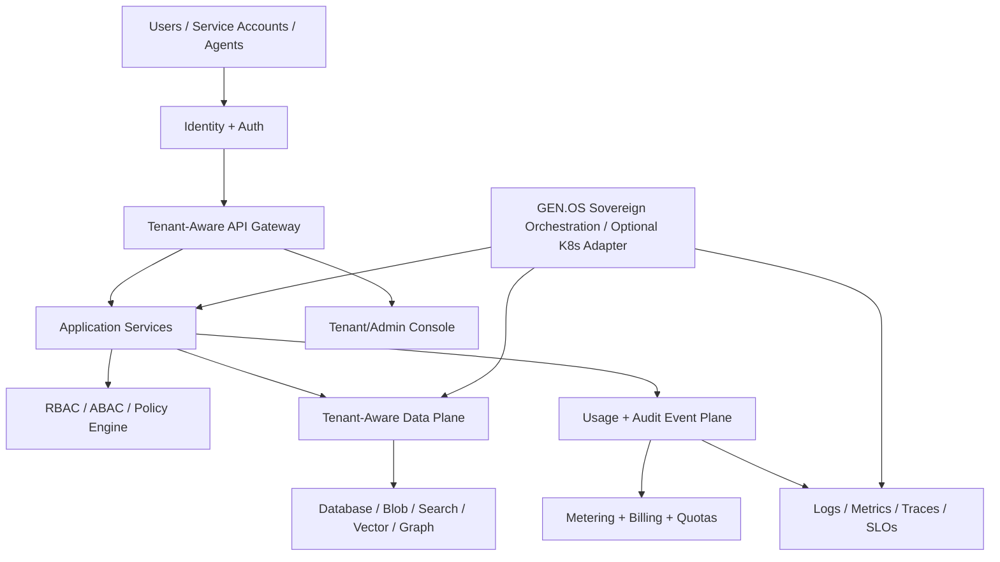

# SKILL_MULTI_TENANT_PLATFORM_ARCHITECT_001 Playbook

## Purpose

Use this skill when the user wants to design, build, audit, or extend a multi-tenant platform from top to bottom.  This skill is the master routing skill. It coordinates all subskills needed to produce a complete SaaS or sovereign platform architecture, including tenancy model, identity, authorization, data isolation, runtime orchestration, billing, observability, lifecycle operations, resilience, testing, compliance, and deployment.

## Core Doctrine

A multi-tenant platform is not just a login system with a tenant_id column. A real multi-tenant platform requires: 1. Tenant identity and lifecycle management. 2. Tenant isolation at the application, data, network, runtime, and governance layers. 3. Authentication and authorization designed for organizations, teams, roles, policies, and service accounts. 4. Tenant-scoped data storage, encryption, backup, export, offboarding, and audit. 5. Quotas, metering, billing, plan limits, and usage governa

## Required Outputs

- Security-aware implementation plan
- Proof gates

## Trigger Phrases

- build a multi-tenant platform
- build enterprise SaaS
- tenant isolation
- multi-tenant architecture
- SaaS infrastructure
- platform from top to bottom
- tenant-aware database
- tenant management
- admin console
- usage metering
- quotas
- billing
- SSO/SAML/OIDC
- RBAC/ABAC
- enterprise platform
- sovereign SaaS
- GEN.OS platform deployment
- Storbits multi-tenant buildout

## Source Skill

Canonical imported source: `16_knowledge/external_collateral/security_updates_2026-05-20/multi_tenant_platform_skills-2/00_multi_tenant_platform_architect/SKILL.md`.

## Full Imported Instructions

# Skill: Multi-Tenant Platform Architect

## Purpose

Use this skill when the user wants to design, build, audit, or extend a multi-tenant platform from top to bottom.

This skill is the master routing skill. It coordinates all subskills needed to produce a complete SaaS or sovereign platform architecture, including tenancy model, identity, authorization, data isolation, runtime orchestration, billing, observability, lifecycle operations, resilience, testing, compliance, and deployment.

## Trigger Phrases

Invoke this skill when the user says or implies:

- build a multi-tenant platform
- build enterprise SaaS
- tenant isolation
- multi-tenant architecture
- SaaS infrastructure
- platform from top to bottom
- tenant-aware database
- tenant management
- admin console
- usage metering
- quotas
- billing
- SSO/SAML/OIDC
- RBAC/ABAC
- enterprise platform
- sovereign SaaS
- GEN.OS platform deployment
- Storbits multi-tenant buildout
- SCX/GEN.X/Atlas multi-tenant system

## Core Doctrine

A multi-tenant platform is not just a login system with a tenant_id column.

A real multi-tenant platform requires:

1. Tenant identity and lifecycle management.
2. Tenant isolation at the application, data, network, runtime, and governance layers.
3. Authentication and authorization designed for organizations, teams, roles, policies, and service accounts.
4. Tenant-scoped data storage, encryption, backup, export, offboarding, and audit.
5. Quotas, metering, billing, plan limits, and usage governance.
6. Observability by tenant, service, workload, region, and cost center.
7. Deployment architecture that supports local, sovereign GEN.OS, optional Kubernetes, and cloud environments.
8. Disaster recovery, replication, failover, incident response, and proof gates.
9. Admin tooling for platform operators and tenant administrators.
10. A claim hygiene system that prevents false production-readiness claims.

## Required Subskill Routing

When invoked, route the work through these subskills:

| Subskill | Purpose |
|---|---|
| 01 Tenant Model and Boundary Design | Defines tenancy model, tenant hierarchy, boundaries, domains, lifecycle |
| 02 Identity Auth RBAC ABAC | Designs auth, SSO, users, roles, policies, service accounts |
| 03 Data Isolation and Storage | Designs tenant-aware databases, keys, backups, exports, data retention |
| 04 Runtime Orchestration | Designs local, GEN.OS sovereign, optional Kubernetes deployment modes |
| 05 API Gateway and Service Mesh | Designs API boundaries, routing, rate limits, service discovery |
| 06 Billing Metering and Quotas | Designs plans, usage events, metering, invoices, quotas |
| 07 Security Compliance Governance | Designs security baseline, audit, compliance, governance controls |
| 08 Observability SRE Incident Response | Designs logs, metrics, traces, SLOs, runbooks, incidents |
| 09 Provisioning Onboarding Lifecycle | Designs tenant creation, onboarding, suspension, export, offboarding |
| 10 DevEx CI CD IaC | Designs developer workflow, pipelines, environments, infrastructure as code |
| 11 Scalability Resilience DR | Designs scaling, redundancy, backup, recovery, chaos testing |
| 12 Multi-Region Consensus Replication | Designs geo deployment, consensus, replication, failover |
| 13 Testing Gates Red Team | Designs proof gates, security tests, tenancy leak tests, claim hygiene |
| 14 Admin Console Tenant Ops | Designs operator console and tenant admin experience |
| 15 AI-Native Tenant Automation | Designs AI assistants, optimization, policy checks, support automation |
| 16 Public Release Auth Rate Audit Gate | Enforces production auth provider, tenant/session claims, rate limits, audit logging, and launch blockers |
| 17 xOrchestra Sovereign Orchestration | Defines xOrchestra as the GEN.OS-native replacement for Kubernetes-class orchestration |
| 99 Continuous Skill Improvement | Updates the skill stack when gaps or failures are found |


## Public Release Non-Negotiables

Before any multi-tenant platform is exposed publicly, the design and implementation must pass the **Public Release Auth Rate Audit Gate**.

Required before public release:

1. Production auth provider selected or explicitly justified.
2. Auth provider adapter contract implemented or documented.
3. Tenant claims present in session/JWT/server session.
4. Session claims validated server-side on every protected request.
5. Tenant membership checked before tenant-scoped access.
6. Rate limits enforced by IP, actor, tenant, token, endpoint, and plan where applicable.
7. Audit logging emits immutable events for auth, admin, tenant, billing, data, AI, and security actions.
8. Cross-tenant access denial tests pass.
9. Public endpoints are inventoried and intentionally exposed.
10. Launch blocker checklist is complete.

Auth provider candidates to evaluate:

- Clerk
- Auth.js
- Auth0
- Descope
- custom custom/self-hosted auth
- hybrid provider plus GEN.OS identity bridge

Provider choice must be recorded in the decision log with tradeoffs for sovereignty, enterprise SSO, tenant/org support, cost, data control, lock-in, developer speed, and migration path.

## Standalone-First Orchestration Doctrine

Storbits is a standalone omni-database being built independently. GEN.OS is not required for the current Storbits buildout.

Current priority:

1. Local single-node mode.
2. Docker Compose development/lab mode.
3. Standalone production deployment path.
4. Optional Kubernetes compatibility later if useful.
5. Future xOrchestra/GEN.OS adapter only after xOrchestra exists and Storbits has a stable standalone foundation.

Required phrasing:

```text
Storbits must run standalone first. GEN.OS and xOrchestra are future optional integration paths, not current dependencies.
```

Do not require GEN.OS-native auth, GEN.OS identity bridge, xOrchestra, or XMesh for current Storbits milestones.

## Required Output

Every use of this skill must produce:

1. Assumptions and clarification log.
2. Architecture blueprint.
3. Tenant model.
4. Identity and authorization model.
5. Data isolation model.
6. Deployment/orchestration model.
7. Billing/metering/quotas model.
8. Observability and SRE model.
9. Security/compliance model.
10. Lifecycle operations model.
11. Resilience and disaster recovery model.
12. Admin console requirements.
13. Testing and proof gates.
14. Implementation roadmap.
15. Decision log and trade-off analysis.
16. Edge-case and failure matrix.
17. Claim hygiene section.
18. Next implementation queue.

## Required Architecture Blueprint

Include at least one Mermaid diagram:



## Preferred Platform Doctrine

For sovereign systems such as Storbits, GEN.OS, SCX, Atlas, or GEN.X:

- GEN.OS Sovereign Orchestration is the preferred production control plane.
- Kubernetes compatibility may exist as an adapter.
- Kubernetes must not become the canonical dependency if sovereignty is a core project goal.
- Correctness belongs to the platform components themselves: database, WAL, consensus, identity, audit, backups, and recovery.
- Orchestration manages deployment and runtime operations; it does not create correctness by itself.

## Mandatory Design Questions

Ask or infer:

1. What is the tenant?
   - company
   - department
   - workspace
   - user
   - project
   - region
   - customer account
   - legal entity

2. What tenancy model is required?
   - single-tenant
   - pooled multi-tenant
   - siloed multi-tenant
   - hybrid
   - bring-your-own-cloud
   - sovereign/private deployment

3. What data isolation level is required?
   - shared schema
   - separate schema
   - separate database
   - separate cluster
   - separate region
   - separate key hierarchy

4. What customer class?
   - consumer
   - SMB
   - mid-market
   - enterprise
   - regulated enterprise
   - government/public-sector
   - internal platform

5. What compliance posture?
   - none/minimal
   - SOC 2 style
   - HIPAA style
   - PCI style
   - CJIS style
   - FedRAMP style
   - GDPR/CCPA style
   - custom contractual

6. What deployment model?
   - local
   - Docker Compose
   - GEN.OS sovereign
   - optional Kubernetes
   - public cloud
   - hybrid cloud
   - on-prem
   - edge/NAS

## Required Decision Matrix

Always include:

| Decision Area | Options | Recommended Choice | Reason | Speed-to-Value | Risk |
|---|---|---|---|---:|---:|
| Tenant model | pooled/siloed/hybrid | TBD | TBD | TBD | TBD |
| Identity | managed/self-hosted/federated | TBD | TBD | TBD | TBD |
| Data isolation | row/schema/db/cluster | TBD | TBD | TBD | TBD |
| Runtime | GEN.OS/K8s/cloud/local | TBD | TBD | TBD | TBD |
| Billing | none/basic/usage/hybrid | TBD | TBD | TBD | TBD |
| Observability | app/system/tenant/SLO | TBD | TBD | TBD | TBD |

## Required Gates

Every multi-tenant platform plan must define gates for:

1. Tenant creation.
2. Tenant isolation.
3. Cross-tenant denial.
4. Tenant-scoped backup.
5. Tenant-scoped restore.
6. Tenant-scoped export.
7. Tenant offboarding.
8. RBAC denial.
9. ABAC denial.
10. Quota enforcement.
11. Billing usage event generation.
12. Audit event immutability.
13. Secret/key separation.
14. Admin privilege boundaries.
15. Observability by tenant.
16. Disaster recovery.
17. Load/scaling.
18. Claim hygiene.

## Claim Hygiene

Forbidden unless proven:

- enterprise ready
- secure by default
- zero trust complete
- production ready
- no single point of failure
- tenant isolation complete
- compliant
- SOC 2 ready
- HIPAA ready
- multi-region ready
- disaster recovery complete

Allowed with proof:

- tenant creation works
- tenant-scoped auth works
- tenant data isolation gate passes
- tenant audit event emitted
- tenant quota enforcement tested
- tenant backup/restore tested
- tenant offboarding workflow implemented

## Final Response Format

When responding to a build request, use:

1. Executive direction.
2. Architecture blueprint.
3. Subsystem breakdown.
4. Implementation phases.
5. Required artifacts.
6. Proof gates.
7. Risk matrix.
8. Next implementation queue.

