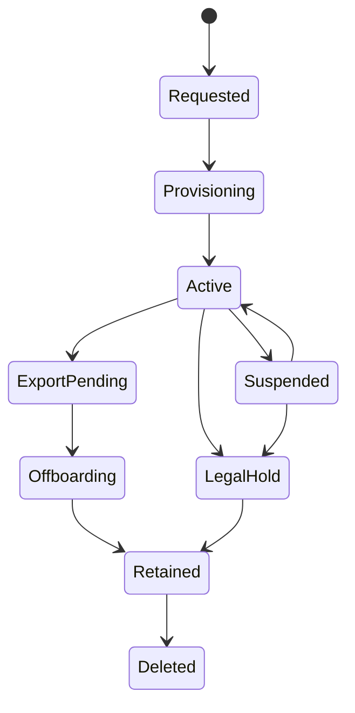

# SKILL_PROVISIONING_ONBOARDING_LIFECYCLE_001 Playbook

## Purpose

Use this skill to design tenant provisioning, onboarding, invitations, setup flows, suspension, upgrade/downgrade, export, deletion, and offboarding.

## Core Doctrine

Tenant lifecycle must be deterministic, auditable, idempotent, and reversible where possible. Provisioning must not be a pile of manual admin steps.

## Required Outputs

- Provisioning workflow
- Tenant lifecycle state machine
- Invite/user onboarding flow
- Initial admin setup
- Environment/resource creation
- Suspension behavior
- Upgrade/downgrade behavior
- Export/offboarding flow
- Idempotency design
- Proof gates

## Trigger Phrases

- onboarding
- tenant provisioning
- create tenant
- invite users
- tenant lifecycle
- suspension
- offboarding
- delete tenant
- export tenant
- trial setup
- workspace creation

## Source Skill

Canonical imported source: `16_knowledge/external_collateral/security_updates_2026-05-20/multi_tenant_platform_skills-2/09_provisioning_onboarding_lifecycle/SKILL.md`.

## Full Imported Instructions

# Skill: Provisioning, Onboarding, and Tenant Lifecycle

## Purpose

Use this skill to design tenant provisioning, onboarding, invitations, setup flows, suspension, upgrade/downgrade, export, deletion, and offboarding.

## Trigger Phrases

- onboarding
- tenant provisioning
- create tenant
- invite users
- tenant lifecycle
- suspension
- offboarding
- delete tenant
- export tenant
- trial setup
- workspace creation

## Core Doctrine

Tenant lifecycle must be deterministic, auditable, idempotent, and reversible where possible. Provisioning must not be a pile of manual admin steps.

## Required Outputs

1. Provisioning workflow.
2. Tenant lifecycle state machine.
3. Invite/user onboarding flow.
4. Initial admin setup.
5. Environment/resource creation.
6. Suspension behavior.
7. Upgrade/downgrade behavior.
8. Export/offboarding flow.
9. Idempotency design.
10. Proof gates.

## Lifecycle State Machine

## Provisioning Steps

Minimum:

1. Create tenant record.
2. Create owner membership.
3. Assign plan.
4. Assign region/data residency.
5. Create tenant key reference.
6. Create default workspace/project.
7. Create default roles.
8. Create quota ledger.
9. Create audit stream.
10. Emit tenant_created event.

## Required Gates

1. Provision tenant once.
2. Repeat provisioning request with same idempotency key does not duplicate tenant.
3. Owner is assigned correctly.
4. Default roles created.
5. Tenant key reference exists.
6. Quotas initialized.
7. Audit event emitted.
8. Suspended tenant cannot write.
9. Reactivated tenant can write.
10. Offboarding export generated.

## Anti-Patterns

Avoid:

- manual database changes to create tenants
- no idempotency key on provisioning
- creating tenant without owner
- deleting tenant instantly with no retention/export/legal-hold logic
- no audit trail for lifecycle changes

