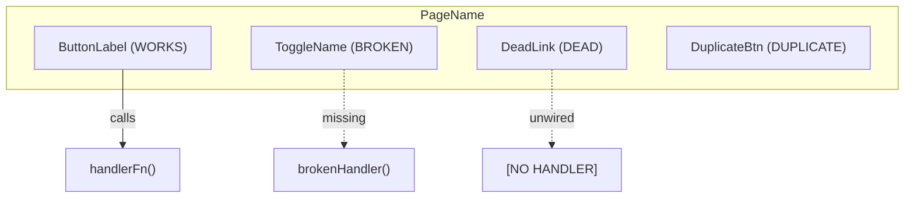

# Playbook: UI Feature Audit

## Skill ID
SKILL_UI_FEATURE_AUDIT_001

## Purpose
Produce per-page feature maps and runtime control guarantees for any UI-bearing repo (web_app, mobile_app, desktop_app, dashboard). For each page/screen: map every element, its wiring, its expected outcome, its persistence requirement, its validation proof, and its status (WORKS/BROKEN/DEAD/DUPLICATE/UNKNOWN). Output feeds into T1 diagrams (page_feature_map, feature_map, system_map), T3 slice planning, CI feature-map staleness checks, and E2E regression coverage.

## Inputs
- `target` — absolute path to the UI repo. Required.
- `pages` — optional list of page names to audit (default: all discovered pages).
- `output_dir` — where to write .mmd and .yaml outputs. Default: `development_skills/04_architecture/diagrams/source/feature/`.

## Preconditions
- Target is a UI repo (web_app, mobile_app, desktop_app, or dashboard).
- T1 has been run on the target (current.truth.yaml exists).
- Source code is readable (no encrypted files).

## Discovery protocol (run before writing any output)

Execute every step; record findings in memory:

### Step 1: Page/screen discovery

Find all route definitions based on framework:

- **Next.js / React Router**: read `pages/`, `app/`, `src/pages/`, `src/routes/`, router config files (`router.tsx`, `App.tsx`, `routes.ts`).
- **React Native / Expo**: read `navigation/`, `screens/`, `src/screens/`, navigator files.
- **Desktop (Electron/Tauri)**: read window definitions, navigation state.
- **Dashboard (Grafana/Retool)**: read panel definitions, page configs.

Output: list of all pages/screens with their file paths.

### Step 2: Element discovery per page

For each page file:

- Read the component file(s) for that page.
- Extract all interactive elements: buttons, links, toggles, dropdowns, inputs, modals, sidebars, navigation items, tabs.
- Extract display elements: tables, charts, cards, lists.
- Extract data-bound elements: API calls, state subscriptions, websocket connections.
- For each element: name/label, type, location in file (line number), connected function/handler (if any).
- For each interactive element: expected outcome type:
  - `navigate` — route changes to a valid page.
  - `mutate_dom` — visible UI state changes.
  - `persist_state` — value survives tab switch/reload.
  - `call_api` — endpoint is called and handled.
  - `copy_export` — clipboard/file/export payload is produced.
  - `blocked_with_reason` — unavailable action explains why and what runtime is required.

### Step 3: Wiring check per element

For each element with a handler:

- Check if the handler function exists in the codebase:
  ```
  grep -r "function handlerName\|const handlerName\|handlerName ="
  ```
- Check if any API endpoints called exist (look for fetch/axios/useQuery calls; verify endpoint routes exist in API layer).
- Derive status:
  - **WORKS**: handler exists + expected outcome is proven by automated test or direct runtime verification
  - **BROKEN**: handler exists but has error markers (TODO, FIXME, throws, console.error, commented out)
  - **DEAD**: element renders but no handler, no state change, no navigation, no API call, no copy/export, and no explicit blocked-with-reason response
  - **DUPLICATE**: identical functionality found on two or more other elements on same page
  - **UNKNOWN**: cannot determine from static analysis

### Step 3b: Runtime outcome audit

For each interactive control, execute the control in a browser/runtime harness when feasible.

Required checks:

- Buttons must produce one of the expected outcome types above.
- Toggles must visibly change state and persist if they represent settings/profile/account preferences.
- Selects and inputs must save on change and reload with the saved value unless explicitly session-only.
- Update/restart controls must change visible pending/applied state or clearly state the required external action.
- Profile/session/token/connector controls must mutate the relevant row or provide an explicit local-mode reason.
- Search/filter inputs must filter visible content or be removed.
- Walkthrough skip/finish/escape must work on every page and must not auto-open on hard refresh unless launched by an explicit one-shot parameter.

Non-negotiable rule:

```text
No silent control is allowed.
```

If a control cannot perform the live action in the current runtime, it must return an explicit visible status such as:

```text
Remote connector requires authenticated setup outside this local package.
```

That counts as WORKS only if the message is specific, accurate, and tested.

### Step 4: Duplicate detection

Across all pages:

- Find elements with identical labels + handlers on different pages.
- Find copy-pasted component blocks (same JSX tree in two or more files).
- Flag each with both locations.

### Step 5: Cross-page navigation audit

Verify every link/navigate() call:

- Destination route exists.
- Target page is implemented (not a stub/TODO).

## Authoring steps

For each discovered page, write:

### a. Page feature map diagram

Path: `<output_dir>/page_feature_map_<page>.mmd`



Color conventions (use style directives):

| Status    | Color     | Hex     |
|-----------|-----------|---------|
| WORKS     | green     | #90EE90 |
| BROKEN    | red       | #FFB6C1 |
| DEAD      | gray      | #D3D3D3 |
| DUPLICATE | yellow    | #FFD700 |
| UNKNOWN   | blue      | #ADD8E6 |

Example style directives:
```
style E1 fill:#90EE90
style E2 fill:#FFB6C1
style E3 fill:#D3D3D3
style E4 fill:#FFD700
```

### b. Page feature map YAML

Path: `<output_dir>/page_feature_map_<page>.yaml`

Must validate against `26_schemas/feature_map/feature_map.schema.json`.

Required fields per element: `name`, `type`, `status`. Optional: `wiring`, `notes`.
Recommended fields per interactive element: `expected_outcome`, `persistence`, `proof`.

Example structure:
```yaml
id: "fm_<repo>_<page>_001"
page: "<page_name>"
repo: "<repo_name>"
elements:
  - name: "Submit Button"
    type: button
    status: WORKS
    wiring: "handleSubmit()"
    expected_outcome: call_api
    persistence: none
    proof: "tests/e2e/app.spec.ts::submits form"
  - name: "Reset Link"
    type: link
    status: DEAD
    wiring: null
    notes: "onClick handler missing"
duplicates_flagged: []
last_audited: "2026-05-07"
```

### c. Full system feature map

After all pages: write `<output_dir>/feature_map_<repo>.mmd` showing all pages as subgraphs with navigation edges between them.

### d. System map YAML

`<output_dir>/system_map_<repo>.yaml` — all pages, element counts per page, overall health score (% WORKS).

Must validate against `26_schemas/system_map/system_map.schema.json`.

Example structure:
```yaml
id: "sm_<repo>_001"
repo: "<repo_name>"
pages:
  - name: "Home"
    element_count: 12
    health_score: 91.7
    status: healthy
  - name: "Settings"
    element_count: 8
    health_score: 62.5
    status: degraded
overall_health_score: 80.0
last_audited: "2026-05-07"
```

## Output summary

After writing all files, print:

```
Feature audit complete for <repo>:
  Pages discovered: N
  Total elements: N
    WORKS: N (N%)
    BROKEN: N (N%)
    DEAD: N (N%)
    DUPLICATE: N (N%)
    UNKNOWN: N (N%)
  Diagrams written: N
  Health score: N%
  Critical findings:
    - <list of BROKEN/DEAD items that are on primary user paths>
```

## Runtime Refinement Output

For platform-quality UI work, also produce a control-map report:

```text
Page:
  Control:
  Expected behavior:
  Runtime result:
  Persistence:
  Validation:
  Status:
  Follow-up:
```

Store durable evidence under the project evidence tree, for example:

```text
23_evidence/<product>/control_maps/<date>_control_map.md
```

## Regression Requirement

Every repaired control defect must add at least one regression assertion.

Minimum acceptable assertions:

- Route loads and title is correct.
- Control click changes visible state.
- State survives reload where expected.
- Unavailable local-mode action explains why.
- API-backed action handles success and failure.
- Walkthrough skip/escape does not re-open on hard refresh.

## Failure modes

| Failure | Detection | Remediation |
|---|---|---|
| Page discovery returns 0 pages | No route files found | Check framework detection; try alternative paths; if SPA without router, treat root as single page |
| Element extraction fails | Parse error in component file | Skip file, log warning, mark page status as PARTIAL |
| Handler not found | grep returns 0 | Mark element DEAD or BROKEN based on context |
| Control only toasts but should persist | Reload loses value | Add local/server state and E2E reload assertion |
| Local-mode action cannot call cloud service | Button appears to do nothing | Replace no-op with explicit blocked-with-reason behavior |
| Update badge never clears | Pending state is static | Persist applied state and test badge removal |
| Profile/session/token row mutates only temporarily | Reload restores revoked/generated item incorrectly | Persist row state and test reload |
| Output dir doesn't exist | mkdir -p before writing | Create dir tree |
| Schema validation fails | ajv or equivalent returns error | Check required fields; fix YAML before committing |
| Duplicate false positives | Same component used intentionally | Check if components share a single source; if yes, not a true duplicate — mark WORKS |

## Validation

See `08_verification/skill_tests/TEST_SKILL_UI_FEATURE_AUDIT_001_001.yaml`.

## See also

- `/apex:feature_map` — invokes this playbook
- `DIAGRAM_TAXONOMY.md` Layer 2 — Feature layer diagram kinds
- `SKILL_REPO_ONBOARDING_001.playbook.md` T1 step 2 — where page_feature_maps are first produced
- `26_schemas/feature_map/feature_map.schema.json` — per-page element schema
- `26_schemas/system_map/system_map.schema.json` — cross-page system map schema
